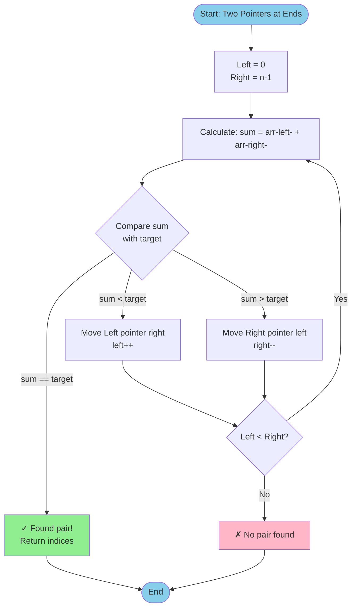
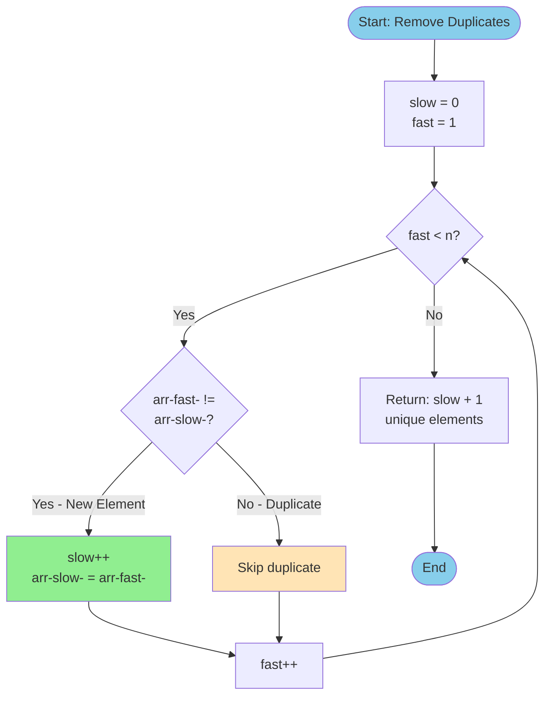
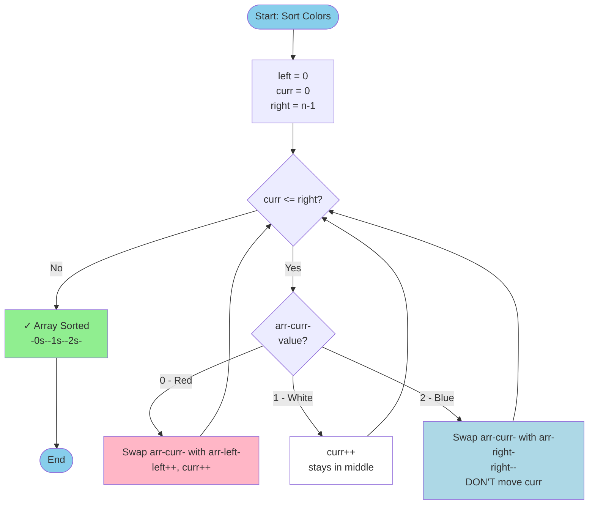

# 1.2 Two Pointers Pattern

## Pattern Overview

### What is Two Pointers?
Two Pointers is a technique that uses two references (pointers) to traverse a data structure, usually an array or linked list. The pointers can move toward each other, away from each other, or in the same direction at different speeds, depending on the problem.

### When to Use It?
- When dealing with sorted arrays or linked lists
- When searching for pairs or triplets with specific properties
- When you need to compare elements from both ends of an array
- When partitioning or rearranging arrays in-place
- When removing duplicates or elements from arrays

### Time/Space Complexity Benefits
- **Time**: O(n) instead of O(n²) for nested loops
- **Space**: O(1) - no extra data structures needed (in-place operations)
- Eliminates need for nested loops in many cases

### Visual Diagram

#### Technique 1: Opposite Direction (Converging Pointers)

**Concept**: Two pointers start at opposite ends and move toward each other

```
┌─────────────────────────────────────────────────────────────┐
│  OPPOSITE DIRECTION - Finding a Pair That Sums to Target    │
└─────────────────────────────────────────────────────────────┘

Array: [1, 3, 5, 7, 9, 11, 13, 15]  Target = 16

Step 1: Initialize pointers at both ends
┌───┬───┬───┬───┬───┬────┬────┬────┐
│ 1 │ 3 │ 5 │ 7 │ 9 │ 11 │ 13 │ 15 │
└───┴───┴───┴───┴───┴────┴────┴────┘
  ↑                               ↑
 LEFT                           RIGHT

Sum = 1 + 15 = 16 ✓ FOUND!

Step 2: If sum too small, move left pointer right →
┌───┬───┬───┬───┬───┬────┬────┬────┐
│ 1 │ 3 │ 5 │ 7 │ 9 │ 11 │ 13 │ 15 │
└───┴───┴───┴───┴───┴────┴────┴────┘
      ↑                       ↑
     LEFT                   RIGHT

Sum = 3 + 13 = 16 ✓ Another solution!

Step 3: If sum too large, move right pointer left ←
┌───┬───┬───┬───┬───┬────┬────┬────┐
│ 1 │ 3 │ 5 │ 7 │ 9 │ 11 │ 13 │ 15 │
└───┴───┴───┴───┴───┴────┴────┴────┘
          ↑           ↑
         LEFT       RIGHT

Sum = 5 + 11 = 16 ✓ Found again!

╔════════════════════════════════════════════════╗
║  Why this works:                               ║
║  • Array is SORTED                             ║
║  • If sum too small: need larger value (→)     ║
║  • If sum too large: need smaller value (←)    ║
║  • Time: O(n), Space: O(1)                     ║
╚════════════════════════════════════════════════╝
```

**Mermaid Flow Diagram**:


#### Technique 2: Same Direction (Fast & Slow Pointers)

**Concept**: Both pointers move in same direction, but at different speeds

```
┌─────────────────────────────────────────────────────────────┐
│  SAME DIRECTION - Remove Duplicates from Sorted Array       │
└─────────────────────────────────────────────────────────────┘

Initial Array: [1, 1, 2, 2, 2, 3, 4, 4, 5]

Step 1: Both pointers start at beginning
┌───┬───┬───┬───┬───┬───┬───┬───┬───┐
│ 1 │ 1 │ 2 │ 2 │ 2 │ 3 │ 4 │ 4 │ 5 │
└───┴───┴───┴───┴───┴───┴───┴───┴───┘
  ↑   ↑
 SLOW FAST

Step 2: FAST finds different element, copy it to SLOW+1
┌───┬───┬───┬───┬───┬───┬───┬───┬───┐
│ 1 │ 2 │ 2 │ 2 │ 2 │ 3 │ 4 │ 4 │ 5 │  ← Copied 2 to index 1
└───┴───┴───┴───┴───┴───┴───┴───┴───┘
      ↑   ↑
     SLOW FAST

Step 3: FAST continues, skip duplicates
┌───┬───┬───┬───┬───┬───┬───┬───┬───┐
│ 1 │ 2 │ 3 │ 2 │ 2 │ 3 │ 4 │ 4 │ 5 │  ← Copied 3 to index 2
└───┴───┴───┴───┴───┴───┴───┴───┴───┘
          ↑           ↑
         SLOW        FAST

Step 4: Continue process
┌───┬───┬───┬───┬───┬───┬───┬───┬───┐
│ 1 │ 2 │ 3 │ 4 │ 2 │ 3 │ 4 │ 4 │ 5 │  ← Copied 4 to index 3
└───┴───┴───┴───┴───┴───┴───┴───┴───┘
              ↑           ↑
             SLOW        FAST

Step 5: Final state
┌───┬───┬───┬───┬───┬───┬───┬───┬───┐
│ 1 │ 2 │ 3 │ 4 │ 5 │ 3 │ 4 │ 4 │ 5 │  ← Copied 5 to index 4
└───┴───┴───┴───┴───┴───┴───┴───┴───┘
                  ↑               ↑
                 SLOW           FAST (end)

Result: First 5 elements are unique [1, 2, 3, 4, 5]
New Length = SLOW + 1 = 5

╔════════════════════════════════════════════════╗
║  How it works:                                 ║
║  • SLOW: marks position of last unique element ║
║  • FAST: explores array to find new elements   ║
║  • When FAST finds new: copy to SLOW+1         ║
║  • Time: O(n), Space: O(1)                     ║
╚════════════════════════════════════════════════╝
```

**Mermaid Flow Diagram**:


#### Technique 3: Partitioning (Dutch National Flag)

**Concept**: Use multiple pointers to partition array into sections

```
┌─────────────────────────────────────────────────────────────┐
│  PARTITIONING - Sort Colors (0s, 1s, 2s)                    │
└─────────────────────────────────────────────────────────────┘

Goal: Sort array with values [0, 1, 2] in one pass

Initial: [2, 0, 2, 1, 1, 0, 1, 2, 0]

Pointer Setup:
• LEFT (red boundary): Everything before is 0
• CURR (current): Element being examined
• RIGHT (blue boundary): Everything after is 2

Step 1: Initialize
┌───┬───┬───┬───┬───┬───┬───┬───┬───┐
│ 2 │ 0 │ 2 │ 1 │ 1 │ 0 │ 1 │ 2 │ 0 │
└───┴───┴───┴───┴───┴───┴───┴───┴───┘
  ↑                               ↑
L,C                               R

CURR=2: Swap with RIGHT, move RIGHT ←
┌───┬───┬───┬───┬───┬───┬───┬───┬───┐
│ 0 │ 0 │ 2 │ 1 │ 1 │ 0 │ 1 │ 2 │ 2 │
└───┴───┴───┴───┴───┴───┴───┴───┴───┘
  ↑                           ↑
L,C                           R

Step 2: CURR=0: Swap with LEFT, move both →
┌───┬───┬───┬───┬───┬───┬───┬───┬───┐
│ 0 │ 0 │ 2 │ 1 │ 1 │ 0 │ 1 │ 2 │ 2 │
└───┴───┴───┴───┴───┴───┴───┴───┴───┘
      ↑                       ↑
     L,C                      R

Step 3: CURR=2: Swap with RIGHT, move RIGHT ←
┌───┬───┬───┬───┬───┬───┬───┬───┬───┐
│ 0 │ 0 │ 1 │ 1 │ 1 │ 0 │ 1 │ 2 │ 2 │
└───┴───┴───┴───┴───┴───┴───┴───┴───┘
      ↑                   ↑
     L,C                  R

Step 4: CURR=1: Just move CURR →
┌───┬───┬───┬───┬───┬───┬───┬───┬───┐
│ 0 │ 0 │ 1 │ 1 │ 1 │ 0 │ 1 │ 2 │ 2 │
└───┴───┴───┴───┴───┴───┴───┴───┴───┘
      ↑       ↑           ↑
      L       C           R

... Continue until CURR passes RIGHT ...

Final Result:
┌───┬───┬───┬───┬───┬───┬───┬───┬───┐
│ 0 │ 0 │ 0 │ 1 │ 1 │ 1 │ 1 │ 2 │ 2 │
└───┴───┴───┴───┴───┴───┴───┴───┴───┘
  ← 0s →  ←   1s    →  ← 2s →

╔════════════════════════════════════════════════╗
║  Three-way partitioning:                       ║
║  • LEFT boundary: [0...LEFT) contains 0s       ║
║  • MIDDLE section: [LEFT...CURR) contains 1s   ║
║  • RIGHT boundary: (RIGHT...n) contains 2s     ║
║  • Time: O(n), Space: O(1)                     ║
╚════════════════════════════════════════════════╝
```

**Mermaid Flow Diagram**:


#### Technique 4: Container Problem (Greedy Movement)

**Concept**: Move the pointer that limits the result

```
┌─────────────────────────────────────────────────────────────┐
│  CONTAINER - Most Water Between Two Lines                   │
└─────────────────────────────────────────────────────────────┘

Heights: [1, 8, 6, 2, 5, 4, 8, 3, 7]

Visual Representation (rotated 90°):

 8 │   █           █
 7 │   █           █       █
 6 │   █   █       █       █
 5 │   █   █   █   █       █
 4 │   █   █   █ █ █       █
 3 │   █   █   █ █ █   █   █
 2 │   █   █ █ █ █ █   █   █
 1 │ █ █   █ █ █ █ █   █   █
   └─┴─┴───┴─┴─┴─┴─┴───┴───┴─
     0 1   2 3 4 5 6   7   8

Step 1: Start with maximum width
        L                       R
┌───┬───┬───┬───┬───┬───┬───┬───┬───┐
│ 1 │ 8 │ 6 │ 2 │ 5 │ 4 │ 8 │ 3 │ 7 │
└───┴───┴───┴───┴───┴───┴───┴───┴───┘

Width = 8, Height = min(1, 7) = 1
Area = 8 × 1 = 8 water units
Move LEFT (shorter line) →

Step 2:
            L                   R
┌───┬───┬───┬───┬───┬───┬───┬───┬───┐
│ 1 │ 8 │ 6 │ 2 │ 5 │ 4 │ 8 │ 3 │ 7 │
└───┴───┴───┴───┴───┴───┴───┴───┴───┘

Width = 7, Height = min(8, 7) = 7
Area = 7 × 7 = 49 water units ★ BEST SO FAR!
Move RIGHT (shorter line) ←

Step 3:
            L               R
┌───┬───┬───┬───┬───┬───┬───┬───┬───┐
│ 1 │ 8 │ 6 │ 2 │ 5 │ 4 │ 8 │ 3 │ 7 │
└───┴───┴───┴───┴───┴───┴───┴───┴───┘

Width = 6, Height = min(8, 3) = 3
Area = 6 × 3 = 18 water units
Move RIGHT (shorter line) ←

Step 4:
            L           R
┌───┬───┬───┬───┬───┬───┬───┬───┬───┐
│ 1 │ 8 │ 6 │ 2 │ 5 │ 4 │ 8 │ 3 │ 7 │
└───┴───┴───┴───┴───┴───┴───┴───┴───┘

Width = 5, Height = min(8, 8) = 8
Area = 5 × 8 = 40 water units
Can move either pointer (tie)

╔════════════════════════════════════════════════╗
║  Strategy:                                     ║
║  • Always move the pointer with SHORTER height ║
║  • Why? Taller line isn't the bottleneck       ║
║  • Moving shorter line might find taller one   ║
║  • Maximum possible area = 49 units            ║
╚════════════════════════════════════════════════╝
```

#### Technique 5: Trapping Water (Peak Detection)

**Concept**: Track maximum heights from both sides

```
┌─────────────────────────────────────────────────────────────┐
│  TRAPPING RAIN WATER - Calculate Trapped Water              │
└─────────────────────────────────────────────────────────────┘

Heights: [0, 1, 0, 2, 1, 0, 1, 3, 2, 1, 2, 1]

Visual Representation:
 3 │               █
 2 │       █       █       █
 1 │   █   █   █   █   █   █   █
 0 │ █ █ █ █ █ █ █ █ █ █ █ █ █
   └─┴─┴─┴─┴─┴─┴─┴─┴─┴─┴─┴─┴─
     0 1 2 3 4 5 6 7 8 9 10 11

Water trapped (shown with ≈):
 3 │               █
 2 │       █ ≈ ≈ ≈ █ ≈ ≈ ≈ █
 1 │   █ ≈ █ ≈ █ ≈ █ █ ≈ █ ≈ █
 0 │ 0 1 0 2 1 0 1 3 2 1 2 1

Step-by-step with two pointers:

Step 1: L=0, R=11
        L                       R
┌───┬───┬───┬───┬───┬───┬───┬───┬───┬───┬───┬───┐
│ 0 │ 1 │ 0 │ 2 │ 1 │ 0 │ 1 │ 3 │ 2 │ 1 │ 2 │ 1 │
└───┴───┴───┴───┴───┴───┴───┴───┴───┴───┴───┴───┘

left_max=0, right_max=0
height[L]=0 < height[R]=1, process left
Water at L = max(0, 0-0) = 0
Move L→, left_max=0

Step 2: L=1, R=11
            L                   R
┌───┬───┬───┬───┬───┬───┬───┬───┬───┬───┬───┬───┐
│ 0 │ 1 │ 0 │ 2 │ 1 │ 0 │ 1 │ 3 │ 2 │ 1 │ 2 │ 1 │
└───┴───┴───┴───┴───┴───┴───┴───┴───┴───┴───┴───┘

height[L]=1 < height[R]=1
Update left_max=1, water=0
Move L→

Step 3: L=2, R=11
                L               R
┌───┬───┬───┬───┬───┬───┬───┬───┬───┬───┬───┬───┐
│ 0 │ 1 │ 0 │ 2 │ 1 │ 0 │ 1 │ 3 │ 2 │ 1 │ 2 │ 1 │
└───┴───┴───┴───┴───┴───┴───┴───┴───┴───┴───┴───┘

height[L]=0 < height[R]=1
Water at L = left_max - height[L] = 1-0 = 1 ★
Total water = 1
Move L→

... Continue this process ...

Final Total: 6 units of trapped water

╔════════════════════════════════════════════════╗
║  Key Insight:                                  ║
║  • Water level = min(left_max, right_max)      ║
║  • Process from side with smaller max          ║
║  • Track maximum heights seen so far           ║
║  • Time: O(n), Space: O(1)                     ║
╚════════════════════════════════════════════════╝
```

## Recognition Guidelines

### How to Identify This Pattern
Look for these keywords and scenarios:
- "Sorted array" or "sorted list"
- "Find pair/triplet that sums to X"
- "Remove duplicates in-place"
- "Partition array"
- "Reverse array/string"
- "Container with most water"
- "Valid palindrome"

### Key Indicators
1. Input is sorted (or can be sorted)
2. Need to find pairs or compare elements
3. Need to process array from both ends
4. In-place modification required
5. Linear time solution is possible but nested loops seem necessary

## Template/Pseudocode

### Opposite Direction (Converging Pointers)
```
function twoPointersOpposite(arr):
    left = 0
    right = length(arr) - 1

    while left < right:
        // Process current pair
        if condition_met(arr[left], arr[right]):
            return result

        // Move pointers based on condition
        if need_larger_value:
            left++
        else:
            right--

    return default_result
```

### Same Direction (Fast & Slow Pointers)
```
function twoPointersSameDirection(arr):
    slow = 0

    for fast = 0 to length(arr) - 1:
        if condition_met(arr[fast]):
            swap(arr[slow], arr[fast])
            slow++

    return slow  // Usually returns new length or slow pointer position
```

---

## Problems

### Problem 1: Two Sum II - Input Array Is Sorted
**Difficulty**: Easy
**LeetCode Link**: [https://leetcode.com/problems/two-sum-ii-input-array-is-sorted/](https://leetcode.com/problems/two-sum-ii-input-array-is-sorted/)

**Description**: Find two numbers in a sorted array that add up to a target. Return indices (1-indexed).

#### Python Solution
```python
def twoSum(numbers: List[int], target: int) -> List[int]:
    # Step 1: Initialize two pointers at start and end
    left = 0
    right = len(numbers) - 1

    # Step 2: Move pointers toward each other
    while left < right:
        # Step 3: Calculate current sum
        current_sum = numbers[left] + numbers[right]

        # Step 4: Check if we found the target
        if current_sum == target:
            # Return 1-indexed positions
            return [left + 1, right + 1]

        # Step 5: If sum too small, move left pointer right (increase sum)
        elif current_sum < target:
            left += 1

        # Step 6: If sum too large, move right pointer left (decrease sum)
        else:
            right -= 1

    # No solution found (problem guarantees exactly one solution)
    return []
```

#### TypeScript Solution
```typescript
function twoSum(numbers: number[], target: number): number[] {
    // Step 1: Initialize pointers
    let left = 0;
    let right = numbers.length - 1;

    // Step 2: Search for target sum
    while (left < right) {
        // Step 3: Calculate current sum
        const currentSum = numbers[left] + numbers[right];

        // Step 4: Check if found
        if (currentSum === target) {
            return [left + 1, right + 1];
        }

        // Step 5: Adjust pointers
        if (currentSum < target) {
            left++;
        } else {
            right--;
        }
    }

    return [];
}
```

**Time Complexity**: O(n) - single pass with two pointers
**Space Complexity**: O(1) - only using two pointer variables

---

### Problem 2: Valid Palindrome
**Difficulty**: Easy
**LeetCode Link**: [https://leetcode.com/problems/valid-palindrome/](https://leetcode.com/problems/valid-palindrome/)

**Description**: Check if a string is a palindrome, considering only alphanumeric characters and ignoring cases.

#### Python Solution
```python
def isPalindrome(s: str) -> bool:
    # Step 1: Initialize two pointers
    left = 0
    right = len(s) - 1

    # Step 2: Move pointers toward each other
    while left < right:
        # Step 3: Skip non-alphanumeric characters from left
        while left < right and not s[left].isalnum():
            left += 1

        # Step 4: Skip non-alphanumeric characters from right
        while left < right and not s[right].isalnum():
            right -= 1

        # Step 5: Compare characters (case-insensitive)
        if s[left].lower() != s[right].lower():
            return False

        # Step 6: Move both pointers
        left += 1
        right -= 1

    # Step 7: All characters matched
    return True

# Example: "A man, a plan, a canal: Panama"
# After removing non-alphanumeric: "amanaplanacanalpanama"
# Palindrome check: a==a, m==m, a==a, ... -> True
```

#### TypeScript Solution
```typescript
function isPalindrome(s: string): boolean {
    // Step 1: Initialize pointers
    let left = 0;
    let right = s.length - 1;

    // Helper to check if alphanumeric
    const isAlphanumeric = (char: string): boolean => {
        const code = char.charCodeAt(0);
        return (code >= 48 && code <= 57) ||  // 0-9
               (code >= 65 && code <= 90) ||   // A-Z
               (code >= 97 && code <= 122);    // a-z
    };

    // Step 2: Check palindrome
    while (left < right) {
        // Step 3: Skip non-alphanumeric from left
        while (left < right && !isAlphanumeric(s[left])) {
            left++;
        }

        // Step 4: Skip non-alphanumeric from right
        while (left < right && !isAlphanumeric(s[right])) {
            right--;
        }

        // Step 5: Compare characters
        if (s[left].toLowerCase() !== s[right].toLowerCase()) {
            return false;
        }

        // Step 6: Move pointers
        left++;
        right--;
    }

    return true;
}
```

**Time Complexity**: O(n) - single pass through string
**Space Complexity**: O(1) - only using pointer variables

---

### Problem 3: Remove Duplicates from Sorted Array
**Difficulty**: Easy
**LeetCode Link**: [https://leetcode.com/problems/remove-duplicates-from-sorted-array/](https://leetcode.com/problems/remove-duplicates-from-sorted-array/)

**Description**: Remove duplicates from sorted array in-place. Return the new length.

#### Python Solution
```python
def removeDuplicates(nums: List[int]) -> int:
    # Step 1: Handle edge case
    if not nums:
        return 0

    # Step 2: Initialize slow pointer
    # slow pointer tracks position of last unique element
    slow = 0

    # Step 3: Fast pointer scans through array
    for fast in range(1, len(nums)):
        # Step 4: If current element different from last unique element
        if nums[fast] != nums[slow]:
            # Step 5: Move slow pointer and copy unique element
            slow += 1
            nums[slow] = nums[fast]

    # Step 6: Return new length (slow + 1)
    return slow + 1

# Visualization for [1, 1, 2, 2, 3]:
# Initial: [1, 1, 2, 2, 3], slow=0
#           ↑  ↑
#         slow fast
#
# fast=1: nums[1]=1 == nums[0]=1, no change
# fast=2: nums[2]=2 != nums[0]=1, slow=1, nums[1]=2 -> [1, 2, 2, 2, 3]
# fast=3: nums[3]=2 == nums[1]=2, no change
# fast=4: nums[4]=3 != nums[1]=2, slow=2, nums[2]=3 -> [1, 2, 3, 2, 3]
# Return: 3
```

#### TypeScript Solution
```typescript
function removeDuplicates(nums: number[]): number {
    // Step 1: Handle edge case
    if (nums.length === 0) return 0;

    // Step 2: Initialize slow pointer
    let slow = 0;

    // Step 3: Scan with fast pointer
    for (let fast = 1; fast < nums.length; fast++) {
        // Step 4: Found new unique element
        if (nums[fast] !== nums[slow]) {
            // Step 5: Move slow and update
            slow++;
            nums[slow] = nums[fast];
        }
    }

    // Step 6: Return new length
    return slow + 1;
}
```

**Time Complexity**: O(n) - single pass through array
**Space Complexity**: O(1) - in-place modification

---

### Problem 4: Container With Most Water
**Difficulty**: Medium
**LeetCode Link**: [https://leetcode.com/problems/container-with-most-water/](https://leetcode.com/problems/container-with-most-water/)

**Description**: Find two lines that together with x-axis form a container that holds the most water.

#### Python Solution
```python
def maxArea(height: List[int]) -> int:
    # Step 1: Initialize two pointers at both ends
    left = 0
    right = len(height) - 1
    max_area = 0

    # Step 2: Move pointers toward each other
    while left < right:
        # Step 3: Calculate current area
        # Width is distance between pointers
        # Height is limited by shorter line
        width = right - left
        current_height = min(height[left], height[right])
        current_area = width * current_height

        # Step 4: Update max area
        max_area = max(max_area, current_area)

        # Step 5: Move pointer pointing to shorter line
        # Why? Moving taller line can only decrease area
        # Moving shorter line might find a taller line
        if height[left] < height[right]:
            left += 1
        else:
            right -= 1

    return max_area

# Visualization for [1,8,6,2,5,4,8,3,7]:
#                    ↑                 ↑
#                   left             right
# Area = min(1,7) * 8 = 8
# Move left (shorter line)
#
#                      ↑               ↑
#                     left           right
# Area = min(8,7) * 7 = 49
# Move right (shorter line)
# ... continue until left meets right
```

#### TypeScript Solution
```typescript
function maxArea(height: number[]): number {
    // Step 1: Initialize pointers
    let left = 0;
    let right = height.length - 1;
    let maxArea = 0;

    // Step 2: Find maximum area
    while (left < right) {
        // Step 3: Calculate current area
        const width = right - left;
        const currentHeight = Math.min(height[left], height[right]);
        const currentArea = width * currentHeight;

        // Step 4: Update maximum
        maxArea = Math.max(maxArea, currentArea);

        // Step 5: Move pointer with shorter line
        if (height[left] < height[right]) {
            left++;
        } else {
            right--;
        }
    }

    return maxArea;
}
```

**Time Complexity**: O(n) - single pass with two pointers
**Space Complexity**: O(1) - only using constant extra space

---

### Problem 5: 3Sum
**Difficulty**: Medium
**LeetCode Link**: [https://leetcode.com/problems/3sum/](https://leetcode.com/problems/3sum/)

**Description**: Find all unique triplets in array that sum to zero.

#### Python Solution
```python
def threeSum(nums: List[int]) -> List[List[int]]:
    # Step 1: Sort the array (required for two pointers)
    nums.sort()
    result = []

    # Step 2: Iterate through array, fix one number at a time
    for i in range(len(nums) - 2):
        # Step 3: Skip duplicates for first number
        if i > 0 and nums[i] == nums[i - 1]:
            continue

        # Step 4: Two pointers for remaining two numbers
        left = i + 1
        right = len(nums) - 1
        target = -nums[i]  # We want nums[left] + nums[right] = -nums[i]

        # Step 5: Find pairs that sum to target
        while left < right:
            current_sum = nums[left] + nums[right]

            # Step 6: Found a triplet
            if current_sum == target:
                result.append([nums[i], nums[left], nums[right]])

                # Step 7: Skip duplicates for second number
                while left < right and nums[left] == nums[left + 1]:
                    left += 1

                # Step 8: Skip duplicates for third number
                while left < right and nums[right] == nums[right - 1]:
                    right -= 1

                # Step 9: Move both pointers
                left += 1
                right -= 1

            # Step 10: Sum too small, need larger value
            elif current_sum < target:
                left += 1

            # Step 11: Sum too large, need smaller value
            else:
                right -= 1

    return result

# Example: [-1, 0, 1, 2, -1, -4]
# After sort: [-4, -1, -1, 0, 1, 2]
# i=0: nums[i]=-4, target=4, no pairs sum to 4
# i=1: nums[i]=-1, target=1, found [-1, 0, 1] and [-1, -1, 2]
# i=2: skip (duplicate of i=1)
# i=3: nums[i]=0, target=0, no pairs sum to 0
```

#### TypeScript Solution
```typescript
function threeSum(nums: number[]): number[][] {
    // Step 1: Sort array
    nums.sort((a, b) => a - b);
    const result: number[][] = [];

    // Step 2: Fix first number
    for (let i = 0; i < nums.length - 2; i++) {
        // Step 3: Skip duplicates
        if (i > 0 && nums[i] === nums[i - 1]) {
            continue;
        }

        // Step 4: Two pointers for remaining numbers
        let left = i + 1;
        let right = nums.length - 1;
        const target = -nums[i];

        // Step 5: Find pairs
        while (left < right) {
            const currentSum = nums[left] + nums[right];

            // Step 6: Found triplet
            if (currentSum === target) {
                result.push([nums[i], nums[left], nums[right]]);

                // Step 7-8: Skip duplicates
                while (left < right && nums[left] === nums[left + 1]) left++;
                while (left < right && nums[right] === nums[right - 1]) right--;

                // Step 9: Move pointers
                left++;
                right--;
            } else if (currentSum < target) {
                left++;
            } else {
                right--;
            }
        }
    }

    return result;
}
```

**Time Complexity**: O(n²) - O(n log n) for sort + O(n²) for finding triplets
**Space Complexity**: O(1) - not counting output array

---

### Problem 6: Sort Colors
**Difficulty**: Medium
**LeetCode Link**: [https://leetcode.com/problems/sort-colors/](https://leetcode.com/problems/sort-colors/)

**Description**: Sort array with values 0, 1, 2 in-place (Dutch National Flag problem).

#### Python Solution
```python
def sortColors(nums: List[int]) -> None:
    # Step 1: Initialize three pointers
    # left: boundary of 0s (everything before left is 0)
    # right: boundary of 2s (everything after right is 2)
    # curr: current element being examined
    left = 0
    right = len(nums) - 1
    curr = 0

    # Step 2: Process array until curr passes right
    while curr <= right:
        # Step 3: Current element is 0, swap with left
        if nums[curr] == 0:
            nums[left], nums[curr] = nums[curr], nums[left]
            left += 1
            curr += 1  # Safe to move curr because we know left area is processed

        # Step 4: Current element is 2, swap with right
        elif nums[curr] == 2:
            nums[curr], nums[right] = nums[right], nums[curr]
            right -= 1
            # Don't move curr! We need to examine the swapped element

        # Step 5: Current element is 1, just move curr
        else:
            curr += 1

# Visualization for [2, 0, 2, 1, 1, 0]:
# Initial: [2, 0, 2, 1, 1, 0]
#           ↑              ↑
#        l,c              r
#
# curr=0, nums[curr]=2, swap with right: [0, 0, 2, 1, 1, 2]
#           ↑           ↑
#          l,c         r
#
# curr=0, nums[curr]=0, swap with left: [0, 0, 2, 1, 1, 2]
#              ↑        ↑
#             l,c      r
# ... continue until curr > right
# Final: [0, 0, 1, 1, 2, 2]
```

#### TypeScript Solution
```typescript
function sortColors(nums: number[]): void {
    // Step 1: Initialize three pointers
    let left = 0;
    let right = nums.length - 1;
    let curr = 0;

    // Step 2: Process array
    while (curr <= right) {
        // Step 3: Handle 0
        if (nums[curr] === 0) {
            [nums[left], nums[curr]] = [nums[curr], nums[left]];
            left++;
            curr++;
        }
        // Step 4: Handle 2
        else if (nums[curr] === 2) {
            [nums[curr], nums[right]] = [nums[right], nums[curr]];
            right--;
        }
        // Step 5: Handle 1
        else {
            curr++;
        }
    }
}
```

**Time Complexity**: O(n) - single pass through array
**Space Complexity**: O(1) - in-place sorting

---

### Problem 7: Move Zeroes
**Difficulty**: Easy
**LeetCode Link**: [https://leetcode.com/problems/move-zeroes/](https://leetcode.com/problems/move-zeroes/)

**Description**: Move all zeros to end of array while maintaining relative order of non-zero elements.

#### Python Solution
```python
def moveZeroes(nums: List[int]) -> None:
    # Step 1: Initialize slow pointer
    # slow tracks position where next non-zero should go
    slow = 0

    # Step 2: Fast pointer scans entire array
    for fast in range(len(nums)):
        # Step 3: If current element is non-zero
        if nums[fast] != 0:
            # Step 4: Swap with slow pointer position
            # This moves non-zero forward and zero backward
            nums[slow], nums[fast] = nums[fast], nums[slow]
            slow += 1

    # Result: All non-zeros before slow, all zeros after slow

# Visualization for [0, 1, 0, 3, 12]:
# Initial: [0, 1, 0, 3, 12], slow=0
#           ↑  ↑
#          slow fast
#
# fast=1: nums[1]=1 != 0, swap: [1, 0, 0, 3, 12], slow=1
#              ↑  ↑
#            slow fast
#
# fast=2: nums[2]=0, no swap
# fast=3: nums[3]=3 != 0, swap: [1, 3, 0, 0, 12], slow=2
#                 ↑     ↑
#               slow  fast
#
# fast=4: nums[4]=12 != 0, swap: [1, 3, 12, 0, 0], slow=3
# Final: [1, 3, 12, 0, 0]
```

#### TypeScript Solution
```typescript
function moveZeroes(nums: number[]): void {
    // Step 1: Initialize slow pointer
    let slow = 0;

    // Step 2: Scan with fast pointer
    for (let fast = 0; fast < nums.length; fast++) {
        // Step 3: Found non-zero element
        if (nums[fast] !== 0) {
            // Step 4: Swap elements
            [nums[slow], nums[fast]] = [nums[fast], nums[slow]];
            slow++;
        }
    }
}
```

**Time Complexity**: O(n) - single pass through array
**Space Complexity**: O(1) - in-place modification

---

### Problem 8: Trapping Rain Water
**Difficulty**: Hard
**LeetCode Link**: [https://leetcode.com/problems/trapping-rain-water/](https://leetcode.com/problems/trapping-rain-water/)

**Description**: Calculate how much water can be trapped after raining given elevation map.

#### Python Solution
```python
def trap(height: List[int]) -> int:
    # Step 1: Handle edge cases
    if not height:
        return 0

    # Step 2: Initialize two pointers and variables
    left = 0
    right = len(height) - 1
    left_max = 0   # Maximum height seen from left
    right_max = 0  # Maximum height seen from right
    water = 0

    # Step 3: Process array from both ends
    while left < right:
        # Step 4: Process side with smaller max height
        # Key insight: Water level is determined by minimum of left_max and right_max
        if height[left] < height[right]:
            # Step 5: Update left_max or add water
            if height[left] >= left_max:
                left_max = height[left]
            else:
                # Water trapped = left_max - current height
                water += left_max - height[left]
            left += 1
        else:
            # Step 6: Process from right side
            if height[right] >= right_max:
                right_max = height[right]
            else:
                water += right_max - height[right]
            right -= 1

    return water

# Visualization for [0,1,0,2,1,0,1,3,2,1,2,1]:
#     3|       █
#     2|   █   █ █   █
#     1| █ █ █ █ █ █ █ █
#     0|0 1 0 2 1 0 1 3 2 1 2 1
#
# Water (marked with ~):
#     3|       █
#     2|   █~~~█~█~~~█
#     1| █~█~█~█~█~█~█~█
#
# Water trapped = 6 units
```

#### TypeScript Solution
```typescript
function trap(height: number[]): number {
    // Step 1: Handle edge cases
    if (height.length === 0) return 0;

    // Step 2: Initialize pointers and variables
    let left = 0;
    let right = height.length - 1;
    let leftMax = 0;
    let rightMax = 0;
    let water = 0;

    // Step 3: Two pointer approach
    while (left < right) {
        // Step 4: Process shorter side
        if (height[left] < height[right]) {
            // Step 5: Update or add water (left side)
            if (height[left] >= leftMax) {
                leftMax = height[left];
            } else {
                water += leftMax - height[left];
            }
            left++;
        } else {
            // Step 6: Process right side
            if (height[right] >= rightMax) {
                rightMax = height[right];
            } else {
                water += rightMax - height[right];
            }
            right--;
        }
    }

    return water;
}
```

**Time Complexity**: O(n) - single pass through array
**Space Complexity**: O(1) - only using constant extra space

---

### Problem 9: 4Sum
**Difficulty**: Medium
**LeetCode Link**: [https://leetcode.com/problems/4sum/](https://leetcode.com/problems/4sum/)

**Description**: Find all unique quadruplets that sum to target.

#### Python Solution
```python
def fourSum(nums: List[int], target: int) -> List[List[int]]:
    # Step 1: Sort array
    nums.sort()
    result = []
    n = len(nums)

    # Step 2: Fix first number
    for i in range(n - 3):
        # Step 3: Skip duplicates for first number
        if i > 0 and nums[i] == nums[i - 1]:
            continue

        # Step 4: Fix second number
        for j in range(i + 1, n - 2):
            # Step 5: Skip duplicates for second number
            if j > i + 1 and nums[j] == nums[j - 1]:
                continue

            # Step 6: Two pointers for last two numbers
            left = j + 1
            right = n - 1

            while left < right:
                # Step 7: Calculate current sum
                current_sum = nums[i] + nums[j] + nums[left] + nums[right]

                # Step 8: Found quadruplet
                if current_sum == target:
                    result.append([nums[i], nums[j], nums[left], nums[right]])

                    # Step 9: Skip duplicates for third number
                    while left < right and nums[left] == nums[left + 1]:
                        left += 1

                    # Step 10: Skip duplicates for fourth number
                    while left < right and nums[right] == nums[right - 1]:
                        right -= 1

                    # Step 11: Move both pointers
                    left += 1
                    right -= 1

                # Step 12: Adjust pointers based on sum
                elif current_sum < target:
                    left += 1
                else:
                    right -= 1

    return result

# Example: nums = [1,0,-1,0,-2,2], target = 0
# After sort: [-2,-1,0,0,1,2]
# Quadruplets: [-2,-1,1,2], [-2,0,0,2], [-1,0,0,1]
```

#### TypeScript Solution
```typescript
function fourSum(nums: number[], target: number): number[][] {
    // Step 1: Sort array
    nums.sort((a, b) => a - b);
    const result: number[][] = [];
    const n = nums.length;

    // Step 2: Fix first number
    for (let i = 0; i < n - 3; i++) {
        // Step 3: Skip duplicates
        if (i > 0 && nums[i] === nums[i - 1]) continue;

        // Step 4: Fix second number
        for (let j = i + 1; j < n - 2; j++) {
            // Step 5: Skip duplicates
            if (j > i + 1 && nums[j] === nums[j - 1]) continue;

            // Step 6: Two pointers
            let left = j + 1;
            let right = n - 1;

            while (left < right) {
                // Step 7: Calculate sum
                const currentSum = nums[i] + nums[j] + nums[left] + nums[right];

                // Step 8: Found quadruplet
                if (currentSum === target) {
                    result.push([nums[i], nums[j], nums[left], nums[right]]);

                    // Step 9-10: Skip duplicates
                    while (left < right && nums[left] === nums[left + 1]) left++;
                    while (left < right && nums[right] === nums[right - 1]) right--;

                    // Step 11: Move pointers
                    left++;
                    right--;
                } else if (currentSum < target) {
                    left++;
                } else {
                    right--;
                }
            }
        }
    }

    return result;
}
```

**Time Complexity**: O(n³) - two nested loops + two pointers
**Space Complexity**: O(1) - not counting output array

---

### Problem 10: Remove Element
**Difficulty**: Easy
**LeetCode Link**: [https://leetcode.com/problems/remove-element/](https://leetcode.com/problems/remove-element/)

**Description**: Remove all occurrences of val in-place and return new length.

#### Python Solution
```python
def removeElement(nums: List[int], val: int) -> int:
    # Step 1: Initialize slow pointer
    # slow tracks where next non-val element should go
    slow = 0

    # Step 2: Fast pointer scans array
    for fast in range(len(nums)):
        # Step 3: If current element is not val
        if nums[fast] != val:
            # Step 4: Copy to slow position
            nums[slow] = nums[fast]
            slow += 1

    # Step 5: Return new length
    return slow

# Visualization for [3,2,2,3], val=3:
# Initial: [3,2,2,3], slow=0
#           ↑
#        slow,fast
#
# fast=0: nums[0]=3 == val, skip
# fast=1: nums[1]=2 != val, nums[0]=2, slow=1 -> [2,2,2,3]
# fast=2: nums[2]=2 != val, nums[1]=2, slow=2 -> [2,2,2,3]
# fast=3: nums[3]=3 == val, skip
# Return: 2, array: [2,2,_,_]
```

#### TypeScript Solution
```typescript
function removeElement(nums: number[], val: number): number {
    // Step 1: Initialize slow pointer
    let slow = 0;

    // Step 2: Scan with fast pointer
    for (let fast = 0; fast < nums.length; fast++) {
        // Step 3: Keep non-val elements
        if (nums[fast] !== val) {
            nums[slow] = nums[fast];
            slow++;
        }
    }

    return slow;
}
```

**Time Complexity**: O(n) - single pass through array
**Space Complexity**: O(1) - in-place modification

---

### Problem 11: 3Sum Closest
**Difficulty**: Medium
**LeetCode Link**: [https://leetcode.com/problems/3sum-closest/](https://leetcode.com/problems/3sum-closest/)

**Description**: Find three integers whose sum is closest to target.

#### Python Solution
```python
def threeSumClosest(nums: List[int], target: int) -> int:
    # Step 1: Sort array
    nums.sort()
    closest_sum = float('inf')
    min_diff = float('inf')

    # Step 2: Fix first number
    for i in range(len(nums) - 2):
        # Step 3: Two pointers for remaining numbers
        left = i + 1
        right = len(nums) - 1

        while left < right:
            # Step 4: Calculate current sum
            current_sum = nums[i] + nums[left] + nums[right]

            # Step 5: Calculate difference from target
            diff = abs(current_sum - target)

            # Step 6: Update closest sum if needed
            if diff < min_diff:
                min_diff = diff
                closest_sum = current_sum

            # Step 7: If exact match, return immediately
            if current_sum == target:
                return current_sum

            # Step 8: Adjust pointers to get closer to target
            elif current_sum < target:
                left += 1
            else:
                right -= 1

    return closest_sum

# Example: nums = [-1,2,1,-4], target = 1
# After sort: [-4,-1,1,2]
# i=0: nums[i]=-4
#   left=1, right=3: sum=-4+(-1)+2=-3, diff=4
#   left=2, right=3: sum=-4+1+2=-1, diff=2
# i=1: nums[i]=-1
#   left=2, right=3: sum=-1+1+2=2, diff=1 (closest)
# Return: 2
```

#### TypeScript Solution
```typescript
function threeSumClosest(nums: number[], target: number): number {
    // Step 1: Sort array
    nums.sort((a, b) => a - b);
    let closestSum = Infinity;
    let minDiff = Infinity;

    // Step 2: Fix first number
    for (let i = 0; i < nums.length - 2; i++) {
        // Step 3: Two pointers
        let left = i + 1;
        let right = nums.length - 1;

        while (left < right) {
            // Step 4: Calculate current sum
            const currentSum = nums[i] + nums[left] + nums[right];

            // Step 5: Calculate difference
            const diff = Math.abs(currentSum - target);

            // Step 6: Update closest
            if (diff < minDiff) {
                minDiff = diff;
                closestSum = currentSum;
            }

            // Step 7: Found exact match
            if (currentSum === target) {
                return currentSum;
            }

            // Step 8: Adjust pointers
            if (currentSum < target) {
                left++;
            } else {
                right--;
            }
        }
    }

    return closestSum;
}
```

**Time Complexity**: O(n²) - O(n log n) for sort + O(n²) for finding triplets
**Space Complexity**: O(1) - not counting space for sorting

---

### Problem 12: Squares of a Sorted Array
**Difficulty**: Easy
**LeetCode Link**: [https://leetcode.com/problems/squares-of-a-sorted-array/](https://leetcode.com/problems/squares-of-a-sorted-array/)

**Description**: Return array of squares of sorted array, also in sorted order.

#### Python Solution
```python
def sortedSquares(nums: List[int]) -> List[int]:
    # Step 1: Initialize result array and two pointers
    n = len(nums)
    result = [0] * n
    left = 0
    right = n - 1

    # Step 2: Fill result from end to start (largest to smallest)
    # Key insight: Largest square comes from either end
    pos = n - 1

    # Step 3: Compare absolute values from both ends
    while left <= right:
        # Step 4: Calculate squares
        left_square = nums[left] * nums[left]
        right_square = nums[right] * nums[right]

        # Step 5: Place larger square at current position
        if left_square > right_square:
            result[pos] = left_square
            left += 1
        else:
            result[pos] = right_square
            right -= 1

        # Step 6: Move to next position (going backwards)
        pos -= 1

    return result

# Visualization for [-4,-1,0,3,10]:
# Squares: [16,1,0,9,100]
#
# Initial: left=-4, right=10
# 16 vs 100 -> place 100 at end: [_,_,_,_,100]
#
# left=-4, right=3
# 16 vs 9 -> place 16: [_,_,_,16,100]
#
# left=-1, right=3
# 1 vs 9 -> place 9: [_,_,9,16,100]
#
# left=-1, right=0
# 1 vs 0 -> place 1: [_,1,9,16,100]
#
# left=0, right=0
# 0 vs 0 -> place 0: [0,1,9,16,100]
```

#### TypeScript Solution
```typescript
function sortedSquares(nums: number[]): number[] {
    // Step 1: Initialize
    const n = nums.length;
    const result: number[] = new Array(n);
    let left = 0;
    let right = n - 1;
    let pos = n - 1;

    // Step 2: Fill from end to start
    while (left <= right) {
        // Step 3: Calculate squares
        const leftSquare = nums[left] * nums[left];
        const rightSquare = nums[right] * nums[right];

        // Step 4: Place larger square
        if (leftSquare > rightSquare) {
            result[pos] = leftSquare;
            left++;
        } else {
            result[pos] = rightSquare;
            right--;
        }

        pos--;
    }

    return result;
}
```

**Time Complexity**: O(n) - single pass through array
**Space Complexity**: O(n) - output array (O(1) if not counting output)

---

### Problem 13: Partition Labels
**Difficulty**: Medium
**LeetCode Link**: [https://leetcode.com/problems/partition-labels/](https://leetcode.com/problems/partition-labels/)

**Description**: Partition string into as many parts as possible so each letter appears in at most one part.

#### Python Solution
```python
def partitionLabels(s: str) -> List[int]:
    # Step 1: Record last occurrence of each character
    last_occurrence = {}
    for i in range(len(s)):
        last_occurrence[s[i]] = i

    # Step 2: Initialize variables for partitioning
    result = []
    start = 0  # Start of current partition
    end = 0    # End of current partition (must reach this before splitting)

    # Step 3: Iterate through string
    for i in range(len(s)):
        # Step 4: Extend partition end if needed
        # We must include all characters up to last occurrence
        end = max(end, last_occurrence[s[i]])

        # Step 5: Reached end of partition
        if i == end:
            # Add partition length to result
            result.append(end - start + 1)
            start = i + 1  # Start new partition

    return result

# Example: "ababcbacadefegdehijhklij"
# Last occurrences: {a:8, b:5, c:7, d:14, e:15, f:11, g:13, h:19, i:22, j:23, k:20, l:21}
#
# i=0: s[0]='a', end=max(0,8)=8
# i=1: s[1]='b', end=max(8,5)=8
# ...
# i=8: s[8]='a', end=max(8,8)=8, i==end -> partition [0,8], length=9
# i=9: s[9]='d', end=max(9,14)=14
# ...
# Partitions: "ababcbaca" (9), "defegde" (7), "hijhklij" (8)
```

#### TypeScript Solution
```typescript
function partitionLabels(s: string): number[] {
    // Step 1: Record last occurrences
    const lastOccurrence = new Map<string, number>();
    for (let i = 0; i < s.length; i++) {
        lastOccurrence.set(s[i], i);
    }

    // Step 2: Initialize variables
    const result: number[] = [];
    let start = 0;
    let end = 0;

    // Step 3: Partition string
    for (let i = 0; i < s.length; i++) {
        // Step 4: Extend partition end
        end = Math.max(end, lastOccurrence.get(s[i])!);

        // Step 5: Complete partition
        if (i === end) {
            result.push(end - start + 1);
            start = i + 1;
        }
    }

    return result;
}
```

**Time Complexity**: O(n) - two passes through string
**Space Complexity**: O(1) - at most 26 characters in map

---

### Problem 14: Reverse String
**Difficulty**: Easy
**LeetCode Link**: [https://leetcode.com/problems/reverse-string/](https://leetcode.com/problems/reverse-string/)

**Description**: Reverse a string in-place (represented as array of characters).

#### Python Solution
```python
def reverseString(s: List[str]) -> None:
    # Step 1: Initialize two pointers at both ends
    left = 0
    right = len(s) - 1

    # Step 2: Swap characters moving toward center
    while left < right:
        # Step 3: Swap characters
        s[left], s[right] = s[right], s[left]

        # Step 4: Move pointers toward center
        left += 1
        right -= 1

# Visualization for ['h','e','l','l','o']:
# Initial: ['h','e','l','l','o']
#            ↑           ↑
#          left        right
# Swap: ['o','e','l','l','h']
#               ↑  ↑
#             left right
# Swap: ['o','l','l','e','h']
#                 ↑
#              left,right (stop)
# Final: ['o','l','l','e','h']
```

#### TypeScript Solution
```typescript
function reverseString(s: string[]): void {
    // Step 1: Initialize pointers
    let left = 0;
    let right = s.length - 1;

    // Step 2: Swap characters
    while (left < right) {
        // Step 3: Swap
        [s[left], s[right]] = [s[right], s[left]];

        // Step 4: Move pointers
        left++;
        right--;
    }
}
```

**Time Complexity**: O(n) - single pass through half the array
**Space Complexity**: O(1) - in-place reversal

---

### Problem 15: Backspace String Compare
**Difficulty**: Easy
**LeetCode Link**: [https://leetcode.com/problems/backspace-string-compare/](https://leetcode.com/problems/backspace-string-compare/)

**Description**: Compare two strings where '#' means backspace. Return true if they're equal after processing.

#### Python Solution
```python
def backspaceCompare(s: str, t: str) -> bool:
    # Helper function to get next valid character index
    def next_valid_char(string: str, index: int) -> int:
        # Step 1: Start from given index, move left
        backspace_count = 0

        while index >= 0:
            # Step 2: If backspace, increment count
            if string[index] == '#':
                backspace_count += 1
            # Step 3: If regular char and no pending backspaces, found it
            elif backspace_count == 0:
                return index
            # Step 4: Regular char but need to skip due to backspace
            else:
                backspace_count -= 1

            # Step 5: Move to previous character
            index -= 1

        return -1

    # Step 6: Use two pointers from end of both strings
    i = len(s) - 1
    j = len(t) - 1

    # Step 7: Compare characters from end to start
    while i >= 0 or j >= 0:
        # Step 8: Find next valid characters
        i = next_valid_char(s, i)
        j = next_valid_char(t, j)

        # Step 9: Both reached end
        if i < 0 and j < 0:
            return True

        # Step 10: One reached end but not other
        if i < 0 or j < 0:
            return False

        # Step 11: Characters don't match
        if s[i] != t[j]:
            return False

        # Step 12: Move to previous characters
        i -= 1
        j -= 1

    return True

# Example: s = "ab#c", t = "ad#c"
# Process s from right: c, skip b (backspace), a -> "ac"
# Process t from right: c, skip d (backspace), a -> "ac"
# Equal -> return True
```

#### TypeScript Solution
```typescript
function backspaceCompare(s: string, t: string): boolean {
    // Helper to find next valid character
    const nextValidChar = (str: string, index: number): number => {
        let backspaceCount = 0;

        while (index >= 0) {
            if (str[index] === '#') {
                backspaceCount++;
            } else if (backspaceCount === 0) {
                return index;
            } else {
                backspaceCount--;
            }
            index--;
        }

        return -1;
    };

    // Compare from end to start
    let i = s.length - 1;
    let j = t.length - 1;

    while (i >= 0 || j >= 0) {
        i = nextValidChar(s, i);
        j = nextValidChar(t, j);

        if (i < 0 && j < 0) return true;
        if (i < 0 || j < 0) return false;
        if (s[i] !== t[j]) return false;

        i--;
        j--;
    }

    return true;
}
```

**Time Complexity**: O(n + m) - process both strings once
**Space Complexity**: O(1) - only using pointers

---

### Problem 16: Intersection of Two Arrays II
**Difficulty**: Easy
**LeetCode Link**: [https://leetcode.com/problems/intersection-of-two-arrays-ii/](https://leetcode.com/problems/intersection-of-two-arrays-ii/)

**Description**: Find the intersection of two arrays, including duplicates. Each element should appear as many times as it shows in both arrays.

#### Python Solution
```python
def intersect(nums1: List[int], nums2: List[int]) -> List[int]:
    # Step 1: Sort both arrays to enable two-pointer approach
    nums1.sort()
    nums2.sort()

    # Step 2: Initialize two pointers and result list
    i = 0  # pointer for nums1
    j = 0  # pointer for nums2
    result = []

    # Step 3: Traverse both arrays simultaneously
    while i < len(nums1) and j < len(nums2):
        # Step 4: If elements match, add to result
        if nums1[i] == nums2[j]:
            result.append(nums1[i])
            i += 1
            j += 1
        # Step 5: Move pointer pointing to smaller element
        elif nums1[i] < nums2[j]:
            i += 1
        else:
            j += 1

    return result

# Visualization for nums1 = [1,2,2,1], nums2 = [2,2]
# After sort: nums1 = [1,1,2,2], nums2 = [2,2]
#
# Step 1: i=0, j=0
# [1, 1, 2, 2]    nums1[0]=1
#  ↑
# [2, 2]          nums2[0]=2
#  ↑
# 1 < 2, move i→
#
# Step 2: i=1, j=0
# [1, 1, 2, 2]    nums1[1]=1
#     ↑
# [2, 2]          nums2[0]=2
#  ↑
# 1 < 2, move i→
#
# Step 3: i=2, j=0
# [1, 1, 2, 2]    nums1[2]=2
#        ↑
# [2, 2]          nums2[0]=2
#  ↑
# 2 == 2, add 2 to result, move both→
#
# Step 4: i=3, j=1
# [1, 1, 2, 2]    nums1[3]=2
#           ↑
# [2, 2]          nums2[1]=2
#     ↑
# 2 == 2, add 2 to result, move both→
#
# Result: [2, 2]
```

#### TypeScript Solution
```typescript
function intersect(nums1: number[], nums2: number[]): number[] {
    // Step 1: Sort both arrays
    nums1.sort((a, b) => a - b);
    nums2.sort((a, b) => a - b);

    // Step 2: Initialize pointers
    let i = 0;
    let j = 0;
    const result: number[] = [];

    // Step 3: Two pointer traversal
    while (i < nums1.length && j < nums2.length) {
        // Step 4: Elements match
        if (nums1[i] === nums2[j]) {
            result.push(nums1[i]);
            i++;
            j++;
        }
        // Step 5: Move smaller element's pointer
        else if (nums1[i] < nums2[j]) {
            i++;
        } else {
            j++;
        }
    }

    return result;
}
```

**Time Complexity**: O(n log n + m log m) - dominated by sorting
**Space Complexity**: O(1) - not counting output array (or O(log n + log m) for sorting)

---

### Problem 17: Long Pressed Name
**Difficulty**: Easy
**LeetCode Link**: [https://leetcode.com/problems/long-pressed-name/](https://leetcode.com/problems/long-pressed-name/)

**Description**: Your friend types their name, but some keys were long pressed. Check if typed string could have been their name with some keys long pressed.

#### Python Solution
```python
def isLongPressedName(name: str, typed: str) -> bool:
    # Step 1: Initialize two pointers
    i = 0  # pointer for name
    j = 0  # pointer for typed

    # Step 2: Traverse typed string
    while j < len(typed):
        # Step 3: Characters match, move both pointers
        if i < len(name) and name[i] == typed[j]:
            i += 1
            j += 1
        # Step 4: Long press - typed char matches previous name char
        elif j > 0 and typed[j] == typed[j - 1]:
            j += 1
        # Step 5: Mismatch - not valid
        else:
            return False

    # Step 6: Check if we consumed entire name
    return i == len(name)

# Visualization for name = "alex", typed = "aaleex"
#
# Step 1: i=0, j=0
# name:  a l e x
#        ↑
# typed: a a l e e x
#        ↑
# Match! i=1, j=1
#
# Step 2: i=1, j=1
# name:  a l e x
#          ↑
# typed: a a l e e x
#          ↑
# Mismatch, but typed[1]='a' == typed[0]='a' (long press)
# Only j moves: j=2
#
# Step 3: i=1, j=2
# name:  a l e x
#          ↑
# typed: a a l e e x
#            ↑
# Match! i=2, j=3
#
# Step 4: i=2, j=3
# name:  a l e x
#            ↑
# typed: a a l e e x
#              ↑
# Match! i=3, j=4
#
# Step 5: i=3, j=4
# name:  a l e x
#              ↑
# typed: a a l e e x
#                ↑
# Mismatch, but typed[4]='e' == typed[3]='e' (long press)
# j=5
#
# Step 6: i=3, j=5
# name:  a l e x
#              ↑
# typed: a a l e e x
#                  ↑
# Match! i=4, j=6 (both at end)
# i == len(name) ✓
```

#### TypeScript Solution
```typescript
function isLongPressedName(name: string, typed: string): boolean {
    // Step 1: Initialize pointers
    let i = 0;
    let j = 0;

    // Step 2: Process typed string
    while (j < typed.length) {
        // Step 3: Characters match
        if (i < name.length && name[i] === typed[j]) {
            i++;
            j++;
        }
        // Step 4: Long press detected
        else if (j > 0 && typed[j] === typed[j - 1]) {
            j++;
        }
        // Step 5: Invalid character
        else {
            return false;
        }
    }

    // Step 6: Verify entire name was typed
    return i === name.length;
}
```

**Time Complexity**: O(n + m) - single pass through both strings
**Space Complexity**: O(1) - only using pointer variables

---

### Problem 18: Minimum Size Subarray Sum
**Difficulty**: Medium
**LeetCode Link**: [https://leetcode.com/problems/minimum-size-subarray-sum/](https://leetcode.com/problems/minimum-size-subarray-sum/)

**Description**: Find the minimal length of a subarray whose sum is greater than or equal to target.

#### Python Solution
```python
def minSubArrayLen(target: int, nums: List[int]) -> int:
    # Step 1: Initialize variables
    left = 0
    current_sum = 0
    min_length = float('inf')

    # Step 2: Expand window with right pointer
    for right in range(len(nums)):
        # Step 3: Add current element to sum
        current_sum += nums[right]

        # Step 4: Shrink window while sum >= target
        while current_sum >= target:
            # Step 5: Update minimum length
            min_length = min(min_length, right - left + 1)

            # Step 6: Shrink from left
            current_sum -= nums[left]
            left += 1

    # Step 7: Return result (0 if no valid subarray found)
    return 0 if min_length == float('inf') else min_length

# Visualization for target = 7, nums = [2,3,1,2,4,3]
#
# Initial: left=0, right=0, sum=0, min_len=∞
#
# Step 1: right=0
# [2, 3, 1, 2, 4, 3]
#  ↑
# L,R
# sum = 2 (< 7), continue
#
# Step 2: right=1
# [2, 3, 1, 2, 4, 3]
#  ↑  ↑
#  L  R
# sum = 5 (< 7), continue
#
# Step 3: right=2
# [2, 3, 1, 2, 4, 3]
#  ↑     ↑
#  L     R
# sum = 6 (< 7), continue
#
# Step 4: right=3
# [2, 3, 1, 2, 4, 3]
#  ↑        ↑
#  L        R
# sum = 8 (>= 7) ✓
# min_len = 4
# Shrink: sum -= 2, left=1, sum=6 (< 7), stop shrinking
#
# Step 5: right=4
# [2, 3, 1, 2, 4, 3]
#     ↑        ↑
#     L        R
# sum = 10 (>= 7) ✓
# min_len = 4
# Shrink: sum -= 3, left=2, sum=7 (>= 7) ✓
# min_len = 3
# Shrink: sum -= 1, left=3, sum=6 (< 7), stop
#
# Step 6: right=5
# [2, 3, 1, 2, 4, 3]
#           ↑     ↑
#           L     R
# sum = 9 (>= 7) ✓
# min_len = 3
# Shrink: sum -= 2, left=4, sum=7 (>= 7) ✓
# min_len = 2
# Shrink: sum -= 4, left=5, sum=3 (< 7), stop
#
# Final: min_len = 2, subarray [4,3]
```

#### TypeScript Solution
```typescript
function minSubArrayLen(target: number, nums: number[]): number {
    // Step 1: Initialize variables
    let left = 0;
    let currentSum = 0;
    let minLength = Infinity;

    // Step 2: Expand window
    for (let right = 0; right < nums.length; right++) {
        // Step 3: Add to sum
        currentSum += nums[right];

        // Step 4: Shrink window while valid
        while (currentSum >= target) {
            // Step 5: Update minimum
            minLength = Math.min(minLength, right - left + 1);

            // Step 6: Shrink from left
            currentSum -= nums[left];
            left++;
        }
    }

    // Step 7: Return result
    return minLength === Infinity ? 0 : minLength;
}
```

**Time Complexity**: O(n) - each element visited at most twice
**Space Complexity**: O(1) - only using constant extra space

---

### Problem 19: Merge Sorted Array
**Difficulty**: Easy
**LeetCode Link**: [https://leetcode.com/problems/merge-sorted-array/](https://leetcode.com/problems/merge-sorted-array/)

**Description**: Merge nums2 into nums1 as one sorted array. nums1 has size m+n with m elements followed by n zeros.

#### Python Solution
```python
def merge(nums1: List[int], m: int, nums2: List[int], n: int) -> None:
    # Step 1: Initialize three pointers (work backwards!)
    # Key insight: Fill from the end to avoid overwriting
    p1 = m - 1      # Last element of nums1's valid portion
    p2 = n - 1      # Last element of nums2
    p = m + n - 1   # Last position in nums1

    # Step 2: Merge from back to front
    while p1 >= 0 and p2 >= 0:
        # Step 3: Compare and place larger element at end
        if nums1[p1] > nums2[p2]:
            nums1[p] = nums1[p1]
            p1 -= 1
        else:
            nums1[p] = nums2[p2]
            p2 -= 1
        p -= 1

    # Step 4: Copy remaining elements from nums2 (if any)
    # Note: If nums1 has remaining elements, they're already in place
    while p2 >= 0:
        nums1[p] = nums2[p2]
        p2 -= 1
        p -= 1

# Visualization for nums1 = [1,2,3,0,0,0], m = 3, nums2 = [2,5,6], n = 3
#
# Initial state:
# nums1: [1, 2, 3, 0, 0, 0]
#              ↑           ↑
#             p1           p
# nums2: [2, 5, 6]
#              ↑
#             p2
#
# Step 1: Compare 3 vs 6
# nums1: [1, 2, 3, 0, 0, 6]  ← Place 6
#           ↑        ↑
#          p1        p
# nums2: [2, 5, 6]
#           ↑
#          p2
#
# Step 2: Compare 3 vs 5
# nums1: [1, 2, 3, 0, 5, 6]  ← Place 5
#           ↑     ↑
#          p1     p
# nums2: [2, 5, 6]
#        ↑
#       p2
#
# Step 3: Compare 3 vs 2
# nums1: [1, 2, 3, 3, 5, 6]  ← Place 3
#        ↑     ↑
#       p1     p
# nums2: [2, 5, 6]
#        ↑
#       p2
#
# Step 4: Compare 2 vs 2
# nums1: [1, 2, 2, 3, 5, 6]  ← Place 2 (from nums2)
#        ↑  ↑
#       p1  p
# nums2: [2, 5, 6]
#     (done)
#
# Step 5: p1 still has elements but they're in correct position
# Final: [1, 2, 2, 3, 5, 6]
```

#### TypeScript Solution
```typescript
function merge(nums1: number[], m: number, nums2: number[], n: number): void {
    // Step 1: Initialize pointers (work backwards)
    let p1 = m - 1;
    let p2 = n - 1;
    let p = m + n - 1;

    // Step 2: Merge from back to front
    while (p1 >= 0 && p2 >= 0) {
        // Step 3: Place larger element
        if (nums1[p1] > nums2[p2]) {
            nums1[p] = nums1[p1];
            p1--;
        } else {
            nums1[p] = nums2[p2];
            p2--;
        }
        p--;
    }

    // Step 4: Copy remaining from nums2
    while (p2 >= 0) {
        nums1[p] = nums2[p2];
        p2--;
        p--;
    }
}
```

**Time Complexity**: O(m + n) - single pass through both arrays
**Space Complexity**: O(1) - in-place merge

---

### Problem 20: Boats to Save People
**Difficulty**: Medium
**LeetCode Link**: [https://leetcode.com/problems/boats-to-save-people/](https://leetcode.com/problems/boats-to-save-people/)

**Description**: Each boat carries at most 2 people and has weight limit. Return minimum number of boats needed.

#### Python Solution
```python
def numRescueBoats(people: List[int], limit: int) -> int:
    # Step 1: Sort people by weight
    people.sort()

    # Step 2: Initialize two pointers
    left = 0              # Lightest person
    right = len(people) - 1  # Heaviest person
    boats = 0

    # Step 3: Pair people greedily
    while left <= right:
        # Step 4: Try to pair lightest with heaviest
        if people[left] + people[right] <= limit:
            # Both can fit in one boat
            left += 1
            right -= 1
        else:
            # Heaviest person needs their own boat
            right -= 1

        # Step 5: Either way, we used one boat
        boats += 1

    return boats

# Visualization for people = [3,2,2,1], limit = 3
# After sort: [1, 2, 2, 3]
#
# Step 1: left=0, right=3
# [1, 2, 2, 3]
#  ↑        ↑
#  L        R
# 1 + 3 = 4 > 3, person with weight 3 goes alone
# boats = 1, right = 2
#
# Step 2: left=0, right=2
# [1, 2, 2, 3]
#  ↑     ↑
#  L     R
# 1 + 2 = 3 <= 3, both fit together
# boats = 2, left = 1, right = 1
#
# Step 3: left=1, right=1
# [1, 2, 2, 3]
#     ↑
#    L,R
# Same person, goes in boat alone
# boats = 3, left = 2, right = 0 (done)
#
# Final: 3 boats
# Boat 1: [3]
# Boat 2: [1, 2]
# Boat 3: [2]
```

#### TypeScript Solution
```typescript
function numRescueBoats(people: number[], limit: number): number {
    // Step 1: Sort by weight
    people.sort((a, b) => a - b);

    // Step 2: Initialize pointers
    let left = 0;
    let right = people.length - 1;
    let boats = 0;

    // Step 3: Greedy pairing
    while (left <= right) {
        // Step 4: Try to pair lightest with heaviest
        if (people[left] + people[right] <= limit) {
            left++;
            right--;
        } else {
            // Heaviest goes alone
            right--;
        }

        // Step 5: Count boat
        boats++;
    }

    return boats;
}
```

**Time Complexity**: O(n log n) - dominated by sorting
**Space Complexity**: O(1) - not counting space for sorting

---

### Problem 21: Compare Version Numbers
**Difficulty**: Medium
**LeetCode Link**: [https://leetcode.com/problems/compare-version-numbers/](https://leetcode.com/problems/compare-version-numbers/)

**Description**: Compare two version numbers version1 and version2. Return -1 if version1 < version2, 1 if version1 > version2, else 0.

#### Python Solution
```python
def compareVersion(version1: str, version2: str) -> int:
    # Step 1: Split versions by '.'
    v1_parts = version1.split('.')
    v2_parts = version2.split('.')

    # Step 2: Get lengths for iteration
    n1 = len(v1_parts)
    n2 = len(v2_parts)

    # Step 3: Use two pointers to compare each revision
    i = 0
    j = 0

    # Step 4: Compare while either version has parts
    while i < n1 or j < n2:
        # Step 5: Get revision numbers (0 if out of bounds)
        # This handles cases like "1.0" vs "1.0.0"
        num1 = int(v1_parts[i]) if i < n1 else 0
        num2 = int(v2_parts[j]) if j < n2 else 0

        # Step 6: Compare current revisions
        if num1 < num2:
            return -1
        elif num1 > num2:
            return 1

        # Step 7: Move to next revision
        i += 1
        j += 1

    # Step 8: All revisions equal
    return 0

# Visualization for version1 = "1.01", version2 = "1.001.0"
#
# After split:
# v1_parts = ["1", "01"]
# v2_parts = ["1", "001", "0"]
#
# Step 1: i=0, j=0
# v1: ["1", "01"]
#       ↑
# v2: ["1", "001", "0"]
#       ↑
# Compare: 1 vs 1 → Equal, continue
#
# Step 2: i=1, j=1
# v1: ["1", "01"]
#            ↑
# v2: ["1", "001", "0"]
#            ↑
# Compare: 1 vs 1 → Equal (leading zeros ignored), continue
#
# Step 3: i=2, j=2
# v1: ["1", "01"]  (out of bounds)
#              ↑
# v2: ["1", "001", "0"]
#                   ↑
# Compare: 0 vs 0 → Equal (v1 treated as 0), continue
#
# Step 4: i=3, j=3 (both out of bounds)
# Result: 0 (versions are equal)
```

#### TypeScript Solution
```typescript
function compareVersion(version1: string, version2: string): number {
    // Step 1: Split versions
    const v1Parts = version1.split('.');
    const v2Parts = version2.split('.');

    // Step 2: Get lengths
    const n1 = v1Parts.length;
    const n2 = v2Parts.length;

    // Step 3: Initialize pointers
    let i = 0;
    let j = 0;

    // Step 4: Compare revisions
    while (i < n1 || j < n2) {
        // Step 5: Get revision numbers
        const num1 = i < n1 ? parseInt(v1Parts[i]) : 0;
        const num2 = j < n2 ? parseInt(v2Parts[j]) : 0;

        // Step 6: Compare
        if (num1 < num2) {
            return -1;
        } else if (num1 > num2) {
            return 1;
        }

        // Step 7: Move pointers
        i++;
        j++;
    }

    // Step 8: Equal
    return 0;
}
```

**Time Complexity**: O(max(n, m)) - where n and m are number of revisions
**Space Complexity**: O(n + m) - for split arrays

---

### Problem 22: Reverse Words in a String II
**Difficulty**: Medium
**LeetCode Link**: [https://leetcode.com/problems/reverse-words-in-a-string-ii/](https://leetcode.com/problems/reverse-words-in-a-string-ii/)

**Description**: Reverse the order of words in a string (given as array of characters). A word is sequence of non-space characters.

#### Python Solution
```python
def reverseWords(s: List[str]) -> None:
    # Step 1: Helper function to reverse a portion of array
    def reverse(left: int, right: int) -> None:
        while left < right:
            s[left], s[right] = s[right], s[left]
            left += 1
            right -= 1

    # Step 2: Reverse entire string
    # "the sky is blue" → "eulb si yks eht"
    reverse(0, len(s) - 1)

    # Step 3: Reverse each word individually
    # "eulb si yks eht" → "blue is sky the"
    start = 0
    for i in range(len(s) + 1):
        # Step 4: Found end of word (space or end of string)
        if i == len(s) or s[i] == ' ':
            # Reverse the word
            reverse(start, i - 1)
            # Move start to beginning of next word
            start = i + 1

# Visualization for s = ["t","h","e"," ","s","k","y"]
#
# Step 1: Reverse entire array
# Original: [t, h, e,  , s, k, y]
#
# After:    [y, k, s,  , e, h, t]
#            ↑                 ↑
#          start              end
#
# Step 2: Reverse each word
# Word 1: "yks" → "sky"
# [s, k, y,  , e, h, t]
#  ↑     ↑
# start end
#
# Word 2: "eht" → "the"
# [s, k, y,  , t, h, e]
#             ↑     ↑
#           start  end
#
# Final: "sky the"
# [s, k, y,  , t, h, e]
#
# Another example: ["a","b"," ","c","d"]
#
# Step 1: Reverse entire
# [d, c,  , b, a]
#
# Step 2: Reverse each word
# "dc" → "cd", "ba" → "ab"
# [c, d,  , a, b]
#
# Result: "cd ab"
```

#### TypeScript Solution
```typescript
function reverseWords(s: string[]): void {
    // Step 1: Helper to reverse portion
    const reverse = (left: number, right: number): void => {
        while (left < right) {
            [s[left], s[right]] = [s[right], s[left]];
            left++;
            right--;
        }
    };

    // Step 2: Reverse entire string
    reverse(0, s.length - 1);

    // Step 3: Reverse each word
    let start = 0;
    for (let i = 0; i <= s.length; i++) {
        // Step 4: End of word found
        if (i === s.length || s[i] === ' ') {
            reverse(start, i - 1);
            start = i + 1;
        }
    }
}
```

**Time Complexity**: O(n) - two passes through array
**Space Complexity**: O(1) - in-place reversal

---

### Problem 23: Find K Closest Elements
**Difficulty**: Medium
**LeetCode Link**: [https://leetcode.com/problems/find-k-closest-elements/](https://leetcode.com/problems/find-k-closest-elements/)

**Description**: Find k closest integers to x in sorted array arr. Result should be sorted in ascending order.

#### Python Solution
```python
def findClosestElements(arr: List[int], k: int, x: int) -> List[int]:
    # Step 1: Initialize two pointers at both ends
    left = 0
    right = len(arr) - 1

    # Step 2: Remove elements until k elements remain
    # Strategy: Remove the element furthest from x
    while right - left + 1 > k:
        # Step 3: Calculate distances from x
        left_dist = abs(arr[left] - x)
        right_dist = abs(arr[right] - x)

        # Step 4: Remove element with greater distance
        # If equal distance, remove the larger number (from right)
        if left_dist > right_dist:
            left += 1
        else:
            right -= 1

    # Step 5: Return the k elements
    return arr[left:right + 1]

# Visualization for arr = [1,2,3,4,5], k = 4, x = 3
#
# Initial: Need to remove 1 element to get k=4
# [1, 2, 3, 4, 5]
#  ↑           ↑
#  L           R
#
# Step 1: Compare distances
# |1-3| = 2 (left distance)
# |5-3| = 2 (right distance)
# Equal! Remove larger number (5)
# right = 3
#
# Step 2: Now have 4 elements
# [1, 2, 3, 4, 5]
#  ↑        ↑
#  L        R
# right - left + 1 = 4 = k, done!
#
# Result: [1, 2, 3, 4]
#
# Another example: arr = [1,2,3,4,5], k = 4, x = -1
#
# Initial:
# [1, 2, 3, 4, 5]
#  ↑           ↑
#  L           R
#
# Step 1: Compare distances
# |1-(-1)| = 2 (left distance)
# |5-(-1)| = 6 (right distance)
# Remove 5 (greater distance)
# right = 3
#
# Step 2:
# [1, 2, 3, 4, 5]
#  ↑        ↑
#  L        R
# Have 4 elements, done!
#
# Result: [1, 2, 3, 4]
```

#### TypeScript Solution
```typescript
function findClosestElements(arr: number[], k: number, x: number): number[] {
    // Step 1: Initialize pointers
    let left = 0;
    let right = arr.length - 1;

    // Step 2: Shrink window to k elements
    while (right - left + 1 > k) {
        // Step 3: Calculate distances
        const leftDist = Math.abs(arr[left] - x);
        const rightDist = Math.abs(arr[right] - x);

        // Step 4: Remove furthest element
        if (leftDist > rightDist) {
            left++;
        } else {
            right--;
        }
    }

    // Step 5: Return k closest elements
    return arr.slice(left, right + 1);
}
```

**Time Complexity**: O(n) - at most n iterations to shrink window
**Space Complexity**: O(1) - not counting output array

---

### Problem 24: Subarray Product Less Than K
**Difficulty**: Medium
**LeetCode Link**: [https://leetcode.com/problems/subarray-product-less-than-k/](https://leetcode.com/problems/subarray-product-less-than-k/)

**Description**: Count number of contiguous subarrays where product of all elements is less than k.

#### Python Solution
```python
def numSubarrayProductLessThanK(nums: List[int], k: int) -> int:
    # Step 1: Handle edge case
    if k <= 1:
        return 0

    # Step 2: Initialize variables
    left = 0
    product = 1
    count = 0

    # Step 3: Expand window with right pointer
    for right in range(len(nums)):
        # Step 4: Multiply current element into product
        product *= nums[right]

        # Step 5: Shrink window while product >= k
        while product >= k:
            product //= nums[left]
            left += 1

        # Step 6: Count all subarrays ending at right
        # Key insight: window [left...right] has (right - left + 1) subarrays
        # All subarrays ending at 'right' within this window are valid
        count += right - left + 1

    return count

# Visualization for nums = [10, 5, 2, 6], k = 100
#
# Step 1: right=0, nums[0]=10
# [10, 5, 2, 6]
#  ↑
# L,R
# product = 10 (< 100)
# Window: [10]
# Subarrays: [10]
# count += 1 = 1
#
# Step 2: right=1, nums[1]=5
# [10, 5, 2, 6]
#  ↑   ↑
#  L   R
# product = 50 (< 100)
# Window: [10, 5]
# Subarrays ending at R: [5], [10,5]
# count += 2 = 3
#
# Step 3: right=2, nums[2]=2
# [10, 5, 2, 6]
#  ↑      ↑
#  L      R
# product = 100 (>= 100)
# Shrink: product /= 10, left=1, product=10
# Window: [5, 2]
# Subarrays ending at R: [2], [5,2]
# count += 2 = 5
#
# Step 4: right=3, nums[3]=6
# [10, 5, 2, 6]
#      ↑     ↑
#      L     R
# product = 60 (< 100)
# Window: [5, 2, 6]
# Subarrays ending at R: [6], [2,6], [5,2,6]
# count += 3 = 8
#
# Final count: 8
# All subarrays: [10], [5], [10,5], [2], [5,2], [6], [2,6], [5,2,6]
```

#### TypeScript Solution
```typescript
function numSubarrayProductLessThanK(nums: number[], k: number): number {
    // Step 1: Edge case
    if (k <= 1) return 0;

    // Step 2: Initialize
    let left = 0;
    let product = 1;
    let count = 0;

    // Step 3: Expand window
    for (let right = 0; right < nums.length; right++) {
        // Step 4: Update product
        product *= nums[right];

        // Step 5: Shrink if needed
        while (product >= k) {
            product = Math.floor(product / nums[left]);
            left++;
        }

        // Step 6: Count subarrays
        count += right - left + 1;
    }

    return count;
}
```

**Time Complexity**: O(n) - each element visited at most twice
**Space Complexity**: O(1) - only using constant extra space

---

### Problem 25: Sentence Similarity III
**Difficulty**: Medium
**LeetCode Link**: [https://leetcode.com/problems/sentence-similarity-iii/](https://leetcode.com/problems/sentence-similarity-iii/)

**Description**: Two sentences are similar if you can insert an arbitrary sentence (possibly empty) into one to make it equal to the other.

#### Python Solution
```python
def areSentencesSimilar(sentence1: str, sentence2: str) -> bool:
    # Step 1: Split sentences into words
    words1 = sentence1.split()
    words2 = sentence2.split()

    # Step 2: Ensure words1 is the shorter sentence
    if len(words1) > len(words2):
        words1, words2 = words2, words1

    # Step 3: Initialize pointers
    left = 0
    right1 = len(words1) - 1
    right2 = len(words2) - 1

    # Step 4: Match prefix (from left)
    while left <= right1 and words1[left] == words2[left]:
        left += 1

    # Step 5: Match suffix (from right)
    while right1 >= 0 and words1[right1] == words2[right2]:
        right1 -= 1
        right2 -= 1

    # Step 6: Check if all words in shorter sentence are matched
    # If right1 < left, all words are matched (entire sentence consumed)
    return right1 < left

# Visualization for sentence1 = "My name is Haley", sentence2 = "My Haley"
#
# words1 = ["My", "name", "is", "Haley"]
# words2 = ["My", "Haley"]
#
# Step 1: Match prefix from left
# words1: [My, name, is, Haley]
#          ↑
# words2: [My, Haley]
#          ↑
# "My" == "My", left = 1
#
# words1: [My, name, is, Haley]
#              ↑
# words2: [My, Haley]
#              ↑
# "name" != "Haley", stop matching prefix
#
# Step 2: Match suffix from right
# words1: [My, name, is, Haley]
#                          ↑
#                        right1=3
# words2: [My, Haley]
#                ↑
#              right2=1
# "Haley" == "Haley", right1 = 2, right2 = 0
#
# words1: [My, name, is, Haley]
#                   ↑
#                 right1=2
# words2: [My, Haley]
#          ↑
#        right2=0
# "is" != "My", stop matching suffix
#
# Step 3: Check if consumed all of shorter sentence
# left = 1, right1 = 2
# right1 < left? NO (2 < 1 is False)
# Result: False
#
# Example 2: sentence1 = "A B C D B B", sentence2 = "A B B"
# words1 = ["A", "B", "B"]
# words2 = ["A", "B", "C", "D", "B", "B"]
#
# Prefix: "A", "B" match → left = 2
# Suffix: "B" matches → right1 = 1, right2 = 4
# right1 < left? YES (1 < 2)
# Result: True
# We can insert "C D B" in middle to get sentence2
```

#### TypeScript Solution
```typescript
function areSentencesSimilar(sentence1: string, sentence2: string): boolean {
    // Step 1: Split into words
    let words1 = sentence1.split(' ');
    let words2 = sentence2.split(' ');

    // Step 2: Make words1 shorter
    if (words1.length > words2.length) {
        [words1, words2] = [words2, words1];
    }

    // Step 3: Initialize pointers
    let left = 0;
    let right1 = words1.length - 1;
    let right2 = words2.length - 1;

    // Step 4: Match prefix
    while (left <= right1 && words1[left] === words2[left]) {
        left++;
    }

    // Step 5: Match suffix
    while (right1 >= 0 && words1[right1] === words2[right2]) {
        right1--;
        right2--;
    }

    // Step 6: Check if all matched
    return right1 < left;
}
```

**Time Complexity**: O(n + m) - where n and m are number of words in sentences
**Space Complexity**: O(n + m) - for split word arrays

---

## Summary

The **Two Pointers** pattern is extremely versatile and efficient for array/string problems. Key takeaways:

1. **Opposite Direction**: Great for sorted arrays, finding pairs, palindromes
2. **Same Direction**: Perfect for in-place modifications, removing duplicates
3. **Partitioning**: Dutch National Flag for categorizing elements
4. **Sorting Required**: Many two-pointer problems benefit from sorted input
5. **Space Efficiency**: Usually O(1) space complexity

Master this pattern - it appears in countless interview questions and real-world scenarios!
