# Pattern 1.9: Modified Binary Search

## Pattern Overview

### What is Modified Binary Search?
Modified Binary Search extends the classic binary search algorithm to solve problems beyond simple element lookup in sorted arrays. It's a powerful technique that exploits the property of ordered data to achieve logarithmic time complexity even in complex scenarios.

### When to Use It?
- Searching in rotated sorted arrays
- Finding peak elements
- Searching in 2D sorted matrices
- Finding minimum/maximum in sorted or partially sorted data
- Finding the kth smallest/largest element
- Problems involving "search space" reduction
- Optimization problems where you can verify a solution quickly

### Time/Space Complexity Benefits
- **Time Complexity**: O(log n) - eliminates half of search space in each iteration
- **Space Complexity**: O(1) for iterative, O(log n) for recursive (call stack)
- Massive improvement over linear O(n) search

### Visual Diagram

#### 🎯 Metaphor 1: Cutting a Rope in Half (Search Space Elimination)

Think of binary search like cutting a rope to find a marked point:

```
Initial Rope (Array):
════════════════════════════════════════
[1][2][3][4][5][6][7][8][9]  Target: 6
 ↑                          ↑
 L                          R

Cut 1: Check Middle (Eliminate half the rope!)
════════════════════════════════════════
[1][2][3][4]│[5][6][7][8][9]
            ↑
            M=5
5 < 6? → Discard left half! ✂️

Remaining Rope:
════════════════════
    [5][6][7][8][9]
     ↑          ↑
     L          R

Cut 2: Check Middle Again
════════════════════
    [5][6]│[7][8][9]
          ↑
          M=7
7 > 6? → Discard right half! ✂️

Remaining Rope:
════════
    [5][6]
     ↑  ↑
     L  R

Cut 3: Check Middle
════════
    [5]│[6]
        ↑
        M=6
Found! 🎉
```

#### 🎮 Metaphor 2: The Elimination Game (Pointer Movement)

Imagine two players (L and R) moving toward each other to find treasure (target):

```
Round 1:
Position:  0   1   2   3   4   5   6   7   8
Array:    [1] [3] [5] [7] [9] [11][13][15][17]  Target: 11
Player L:  🔵                                    Player R: 🔴
                           ⭐ (Treasure at 5)

Step 1: Calculate Middle = (0 + 8) / 2 = 4
         [1] [3] [5] [7] [9] [11][13][15][17]
                          🎯
                         M=4
         Value at M = 9
         9 < 11? → Treasure is RIGHT! Move L!

Round 2:
         [1] [3] [5] [7] [9] [11][13][15][17]
                          🔵              🔴
                          L=5             R=8

Step 2: Calculate Middle = (5 + 8) / 2 = 6
         [1] [3] [5] [7] [9] [11][13][15][17]
                                  🎯
                                 M=6
         Value at M = 13
         13 > 11? → Treasure is LEFT! Move R!

Round 3:
         [1] [3] [5] [7] [9] [11][13][15][17]
                          🔵  ⭐  🔴
                          L=5 M=5 R=6

Step 3: Calculate Middle = (5 + 6) / 2 = 5
         Value at M = 11
         11 == 11? → FOUND! 🏆
```

**Mermaid Flow Diagram - Standard Binary Search**:

```mermaid
flowchart TD
    Start([Start: Binary Search]) --> Init[left = 0<br/>right = n-1]
    Init --> Loop{left <= right?}
    Loop -->|No| NotFound[Return -1<br/>Not Found]
    Loop -->|Yes| CalcMid[mid = left + right / 2]
    CalcMid --> Compare{arr-mid-<br/>vs target?}
    Compare -->|arr-mid- == target| Found[✓ Return mid<br/>Found!]
    Compare -->|arr-mid- < target| MoveLeft[left = mid + 1<br/>Search right half]
    Compare -->|arr-mid- > target| MoveRight[right = mid - 1<br/>Search left half]
    MoveLeft --> Loop
    MoveRight --> Loop
    Found --> End([End])
    NotFound --> End

    style Start fill:#87CEEB
    style End fill:#87CEEB
    style Found fill:#90EE90
    style NotFound fill:#FFB6C6
```


#### 🌪️ Metaphor 3: Rotated Array Search (Broken Circle)

Imagine a sorted circular track that's been "broken" and rotated:

```
Original Sorted Array (Before Rotation):
╔═══╗╔═══╗╔═══╗╔═══╗╔═══╗╔═══╗╔═══╗
║ 0 ║║ 1 ║║ 2 ║║ 4 ║║ 5 ║║ 6 ║║ 7 ║
╚═══╝╚═══╝╚═══╝╚═══╝╚═══╝╚═══╝╚═══╝

After Rotation (Pivot at index 4):
╔═══╗╔═══╗╔═══╗╔═══╗╔═══╗╔═══╗╔═══╗
║ 4 ║║ 5 ║║ 6 ║║ 7 ║║ 0 ║║ 1 ║║ 2 ║
╚═══╝╚═══╝╚═══╝╚═══╝╚═══╝╚═══╝╚═══╝
 ↑                       ↑
 High Part              Low Part (Rotation Point)

Searching for Target = 0:

Step 1: Find Middle
Array:    [4] [5] [6] [7] [0] [1] [2]
Index:     0   1   2   3   4   5   6
           L           M           R

Mid = 3, Value = 7

Step 2: Identify Sorted Half
Left Half:  [4,5,6,7] ← Sorted! (4 ≤ 7)
Right Half: [0,1,2]   ← Must contain rotation

Step 3: Check if Target in Sorted Half
Is 0 in range [4,7]? NO!
Therefore, target MUST be in right half!

Step 4: Search Right Half
Array:    [4] [5] [6] [7] [0] [1] [2]
                               L   M  R
New boundaries: L=4, R=6, M=5

Step 5: Identify Sorted Half Again
Right Half: [1,2] ← Sorted! (1 ≤ 2)
Is 0 in range [0,2]? YES!

Step 6: Search Left of M
Array:    [4] [5] [6] [7] [0] [1] [2]
                               L=M=R
Found at index 4! ✅
```

**Mermaid Flow Diagram - Rotated Array Search**:


#### 🎯 Metaphor 4: Peak Finding (Mountain Climbing)

Finding a peak is like a hiker checking slopes to find mountain tops:

```
Mountain Range:
                    ╱╲
                   ╱  ╲
        ╱╲        ╱    ╲      ╱╲
       ╱  ╲      ╱      ╲    ╱  ╲
      ╱    ╲    ╱        ╲  ╱    ╲
  ___╱      ╲__╱          ╲╱      ╲___

Array: [1, 3, 5, 7, 9, 8, 6, 4, 7, 9, 8]
Index:  0  1  2  3  4  5  6  7  8  9 10

Step 1: Check Middle
        L=0                         R=10
                      M=5 (value=8)

Is slope going up? Check M vs M+1
8 > 6? → Downward slope ↘️ → Peak must be LEFT or AT M!

Step 2: Search Left Half (Including M)
        L=0          R=5
            M=2 (value=5)

Is slope going up? Check M vs M+1
5 < 7? → Upward slope ↗️ → Peak must be RIGHT!

Step 3: Search Right Half
               L=3     R=5
                  M=4 (value=9)

Is slope going up? Check M vs M+1
9 > 8? → Downward slope ↘️ → Peak is AT M or LEFT!

Step 4: Converge
                  L=3  R=4
                    M=3 (value=7)

7 < 9? → Upward slope ↗️ → Peak is RIGHT!
L=4, R=4 → Converged! Peak at index 4 (value=9) 🏔️
```

#### 📊 Metaphor 5: Binary Search Variations Comparison

```
╔══════════════════════════════════════════════════════════════╗
║                BINARY SEARCH VARIATIONS                       ║
╠══════════════════════════════════════════════════════════════╣
║                                                               ║
║  1. EXACT MATCH: Find Target = 5                             ║
║     [1, 3, 5, 7, 9]                                          ║
║      L     M     R                                           ║
║           ✓ Found at index 2                                 ║
║                                                               ║
║  2. FIND FIRST OCCURRENCE: Find First 5 in [3,5,5,5,7]       ║
║     [3] [5] [5] [5] [7]                                      ║
║      L           M   R                                       ║
║         ⬅        Keep searching left even after finding!     ║
║         ✓ First occurrence at index 1                        ║
║                                                               ║
║  3. FIND LAST OCCURRENCE: Find Last 5 in [3,5,5,5,7]         ║
║     [3] [5] [5] [5] [7]                                      ║
║      L   M           R                                       ║
║              ➡       Keep searching right after finding!     ║
║                 ✓ Last occurrence at index 3                 ║
║                                                               ║
║  4. FIND INSERTION POSITION: Insert 6 in [1,3,5,7,9]         ║
║     [1] [3] [5] [7] [9]                                      ║
║                  ↑                                           ║
║                  Insert here (index 3)                       ║
║     After binary search: L points to insertion position!     ║
║                                                               ║
║  5. FIND BOUNDARY: Find first element ≥ 5 in [1,3,5,7,9]    ║
║     [1] [3] │ [5] [7] [9]                                    ║
║      False │     True                                        ║
║            ↑                                                 ║
║         Boundary at index 2                                  ║
║                                                               ║
╚══════════════════════════════════════════════════════════════╝
```

#### 🔄 Step-by-Step: Rotated Array Search in Detail

```
Problem: Find 0 in [4,5,6,7,0,1,2]

══════════════════════════════════════════════════════════════
ITERATION 1:
══════════════════════════════════════════════════════════════

Current Search Space: [4, 5, 6, 7, 0, 1, 2]
                       ↑           ↑        ↑
                       L           M        R
                      i=0         i=3      i=6

Step 1a: Calculate Middle
   mid = L + (R - L) / 2 = 0 + (6 - 0) / 2 = 3
   nums[mid] = nums[3] = 7

Step 1b: Target found? 7 ≟ 0? NO

Step 1c: Which half is sorted?
   Compare nums[L] vs nums[M]: 4 ≤ 7? YES!
   → LEFT HALF [4,5,6,7] is SORTED! ✓

Step 1d: Is target in sorted left half?
   Is 0 in range [nums[L], nums[M]]?
   Is 0 in range [4, 7]? NO!
   → Target must be in RIGHT HALF!

Step 1e: Eliminate left half
   New L = mid + 1 = 4

══════════════════════════════════════════════════════════════
ITERATION 2:
══════════════════════════════════════════════════════════════

Current Search Space: [0, 1, 2]
                       ↑  ↑  ↑
                       L  M  R
                      i=4 i=5 i=6

Step 2a: Calculate Middle
   mid = L + (R - L) / 2 = 4 + (6 - 4) / 2 = 5
   nums[mid] = nums[5] = 1

Step 2b: Target found? 1 ≟ 0? NO

Step 2c: Which half is sorted?
   Compare nums[L] vs nums[M]: 0 ≤ 1? YES!
   → LEFT HALF [0,1] is SORTED! ✓

Step 2d: Is target in sorted left half?
   Is 0 in range [nums[L], nums[M]]?
   Is 0 in range [0, 1]? YES! ✓
   → Target is in LEFT HALF!

Step 2e: Eliminate right half
   New R = mid - 1 = 4

══════════════════════════════════════════════════════════════
ITERATION 3:
══════════════════════════════════════════════════════════════

Current Search Space: [0]
                       ↑
                      L=M=R
                      i=4

Step 3a: Calculate Middle
   mid = L + (R - L) / 2 = 4 + (4 - 4) / 2 = 4
   nums[mid] = nums[4] = 0

Step 3b: Target found? 0 ≟ 0? YES! ✅

FOUND AT INDEX 4! 🎉

══════════════════════════════════════════════════════════════
SUMMARY: 3 iterations to find target (vs 7 with linear search)
         O(log n) vs O(n) - Massive improvement! 🚀
══════════════════════════════════════════════════════════════
```

## Recognition Guidelines

### How to Identify This Pattern

Look for these **key indicators**:
1. Array/list is **sorted** or **partially sorted**
2. Need to find an element in **O(log n)** time
3. Problem mentions:
   - "Find target in rotated sorted array"
   - "Find peak element"
   - "Search in 2D matrix"
   - "Find minimum/maximum"
   - "Find first/last occurrence"
4. Input size is large (binary search efficiency matters)
5. Can eliminate half of search space based on some condition

### Key Phrases/Indicators
- "sorted array"
- "rotated"
- "find peak"
- "search in matrix"
- "minimum" / "maximum"
- "first occurrence" / "last occurrence"
- "O(log n) time"

## Template/Pseudocode

### Basic Template

```python
def binary_search_template(arr, target):
    # Step 1: Initialize boundaries
    left, right = 0, len(arr) - 1

    # Step 2: Search while valid search space exists
    while left <= right:
        # Step 3: Calculate middle (avoid overflow)
        mid = left + (right - left) // 2

        # Step 4: Check if found
        if arr[mid] == target:
            return mid

        # Step 5: Decide which half to search
        if condition_to_go_left:
            right = mid - 1
        else:
            left = mid + 1

    # Step 6: Target not found
    return -1
```

### Modified Template (For Finding Boundaries)

```python
def find_boundary(arr):
    left, right = 0, len(arr) - 1
    result = -1

    while left <= right:
        mid = left + (right - left) // 2

        # Check condition and save potential answer
        if meets_condition(arr[mid]):
            result = mid  # Save this as potential answer
            # Continue searching for better answer
            right = mid - 1  # or left = mid + 1
        else:
            left = mid + 1   # or right = mid - 1

    return result
```

---

## Problems

### Problem 1: Binary Search (Easy)
**LeetCode Link**: [704. Binary Search](https://leetcode.com/problems/binary-search/)

**Description**: Given a sorted array of integers `nums` and an integer `target`, write a function to search `target` in `nums`. If `target` exists, return its index. Otherwise, return -1.

#### Python Solution
```python
def search(nums: list[int], target: int) -> int:
    # Step 1: Initialize left and right pointers at array boundaries
    left, right = 0, len(nums) - 1

    # Step 2: Continue searching while search space exists
    while left <= right:
        # Step 3: Calculate middle index (prevents integer overflow)
        mid = left + (right - left) // 2

        # Step 4: Check if we found the target
        if nums[mid] == target:
            return mid

        # Step 5: Target is in right half
        elif nums[mid] < target:
            left = mid + 1

        # Step 6: Target is in left half
        else:
            right = mid - 1

    # Step 7: Target not found in array
    return -1
```

#### TypeScript Solution
```typescript
function search(nums: number[], target: number): number {
    // Step 1: Initialize left and right pointers at array boundaries
    let left = 0;
    let right = nums.length - 1;

    // Step 2: Continue searching while search space exists
    while (left <= right) {
        // Step 3: Calculate middle index (prevents integer overflow)
        const mid = left + Math.floor((right - left) / 2);

        // Step 4: Check if we found the target
        if (nums[mid] === target) {
            return mid;
        }

        // Step 5: Target is in right half
        else if (nums[mid] < target) {
            left = mid + 1;
        }

        // Step 6: Target is in left half
        else {
            right = mid - 1;
        }
    }

    // Step 7: Target not found in array
    return -1;
}
```

**Complexity Analysis**:
- Time: O(log n) - halve search space each iteration
- Space: O(1) - only use constant extra space

---

### Problem 2: First Bad Version (Easy)
**LeetCode Link**: [278. First Bad Version](https://leetcode.com/problems/first-bad-version/)

**Description**: You are a product manager and have `n` versions. Each version is based on the previous one. All versions after a bad version are also bad. Find the first bad version using minimum API calls to `isBadVersion(version)`.

#### Python Solution
```python
def firstBadVersion(n: int) -> int:
    # Step 1: Initialize search boundaries
    left, right = 1, n

    # Step 2: Binary search for first bad version
    while left < right:
        # Step 3: Calculate middle version
        mid = left + (right - left) // 2

        # Step 4: Check if current version is bad
        if isBadVersion(mid):
            # Current is bad, first bad might be earlier or is current
            right = mid
        else:
            # Current is good, first bad must be after
            left = mid + 1

    # Step 5: Left and right converge to first bad version
    return left
```

#### TypeScript Solution
```typescript
function firstBadVersion(n: number): number {
    // Step 1: Initialize search boundaries
    let left = 1;
    let right = n;

    // Step 2: Binary search for first bad version
    while (left < right) {
        // Step 3: Calculate middle version
        const mid = left + Math.floor((right - left) / 2);

        // Step 4: Check if current version is bad
        if (isBadVersion(mid)) {
            // Current is bad, first bad might be earlier or is current
            right = mid;
        } else {
            // Current is good, first bad must be after
            left = mid + 1;
        }
    }

    // Step 5: Left and right converge to first bad version
    return left;
}
```

**Complexity Analysis**:
- Time: O(log n) - binary search through versions
- Space: O(1) - constant extra space

---

### Problem 3: Search Insert Position (Easy)
**LeetCode Link**: [35. Search Insert Position](https://leetcode.com/problems/search-insert-position/)

**Description**: Given a sorted array and a target value, return the index if the target is found. If not, return the index where it would be if it were inserted in order.

#### Python Solution
```python
def searchInsert(nums: list[int], target: int) -> int:
    # Step 1: Initialize search boundaries
    left, right = 0, len(nums) - 1

    # Step 2: Binary search for target or insertion position
    while left <= right:
        # Step 3: Calculate middle index
        mid = left + (right - left) // 2

        # Step 4: Found exact match
        if nums[mid] == target:
            return mid

        # Step 5: Target is larger, search right half
        elif nums[mid] < target:
            left = mid + 1

        # Step 6: Target is smaller, search left half
        else:
            right = mid - 1

    # Step 7: Left pointer is at insertion position
    # After loop: left > right, left is where target should be inserted
    return left
```

#### TypeScript Solution
```typescript
function searchInsert(nums: number[], target: number): number {
    // Step 1: Initialize search boundaries
    let left = 0;
    let right = nums.length - 1;

    // Step 2: Binary search for target or insertion position
    while (left <= right) {
        // Step 3: Calculate middle index
        const mid = left + Math.floor((right - left) / 2);

        // Step 4: Found exact match
        if (nums[mid] === target) {
            return mid;
        }

        // Step 5: Target is larger, search right half
        else if (nums[mid] < target) {
            left = mid + 1;
        }

        // Step 6: Target is smaller, search left half
        else {
            right = mid - 1;
        }
    }

    // Step 7: Left pointer is at insertion position
    return left;
}
```

**Complexity Analysis**:
- Time: O(log n) - binary search
- Space: O(1) - constant space

---

### Problem 4: Find Peak Element (Medium)
**LeetCode Link**: [162. Find Peak Element](https://leetcode.com/problems/find-peak-element/)

**Description**: A peak element is an element that is strictly greater than its neighbors. Given an integer array `nums`, find a peak element and return its index. You may assume `nums[-1] = nums[n] = -∞`.

#### Python Solution
```python
def findPeakElement(nums: list[int]) -> int:
    # Step 1: Initialize search boundaries
    left, right = 0, len(nums) - 1

    # Step 2: Binary search for peak
    while left < right:
        # Step 3: Calculate middle index
        mid = left + (right - left) // 2

        # Step 4: Compare middle with next element
        if nums[mid] < nums[mid + 1]:
            # Ascending slope, peak must be on right
            left = mid + 1
        else:
            # Descending slope or peak, search left (including mid)
            right = mid

    # Step 5: Left and right converge to peak
    return left

# Visualization:
#     /\
#    /  \
#   /    \  /\
#  /      \/  \
# If mid is on ascending slope (/), peak is to the right
# If mid is on descending slope (\), peak is to the left or at mid
```

#### TypeScript Solution
```typescript
function findPeakElement(nums: number[]): number {
    // Step 1: Initialize search boundaries
    let left = 0;
    let right = nums.length - 1;

    // Step 2: Binary search for peak
    while (left < right) {
        // Step 3: Calculate middle index
        const mid = left + Math.floor((right - left) / 2);

        // Step 4: Compare middle with next element
        if (nums[mid] < nums[mid + 1]) {
            // Ascending slope, peak must be on right
            left = mid + 1;
        } else {
            // Descending slope or peak, search left (including mid)
            right = mid;
        }
    }

    // Step 5: Left and right converge to peak
    return left;
}
```

**Complexity Analysis**:
- Time: O(log n) - binary search
- Space: O(1) - constant space

---

### Problem 5: Search in Rotated Sorted Array (Medium)
**LeetCode Link**: [33. Search in Rotated Sorted Array](https://leetcode.com/problems/search-in-rotated-sorted-array/)

**Description**: Given a rotated sorted array (rotated at some unknown pivot), search for a target value. Return its index or -1.

#### Python Solution
```python
def search(nums: list[int], target: int) -> int:
    # Step 1: Initialize search boundaries
    left, right = 0, len(nums) - 1

    # Step 2: Binary search in rotated array
    while left <= right:
        # Step 3: Calculate middle index
        mid = left + (right - left) // 2

        # Step 4: Found target
        if nums[mid] == target:
            return mid

        # Step 5: Determine which half is properly sorted
        # Left half is sorted
        if nums[left] <= nums[mid]:
            # Step 6: Check if target is in sorted left half
            if nums[left] <= target < nums[mid]:
                right = mid - 1  # Search left
            else:
                left = mid + 1   # Search right

        # Right half is sorted
        else:
            # Step 7: Check if target is in sorted right half
            if nums[mid] < target <= nums[right]:
                left = mid + 1   # Search right
            else:
                right = mid - 1  # Search left

    # Step 8: Target not found
    return -1

# Example: [4,5,6,7,0,1,2], target = 0
# mid=7, left half [4,5,6,7] sorted, target not in [4,7], search right
# Now [0,1,2], mid=1, right half sorted, target in range, search left
# Found at index 4
```

#### TypeScript Solution
```typescript
function search(nums: number[], target: number): number {
    // Step 1: Initialize search boundaries
    let left = 0;
    let right = nums.length - 1;

    // Step 2: Binary search in rotated array
    while (left <= right) {
        // Step 3: Calculate middle index
        const mid = left + Math.floor((right - left) / 2);

        // Step 4: Found target
        if (nums[mid] === target) {
            return mid;
        }

        // Step 5: Determine which half is properly sorted
        if (nums[left] <= nums[mid]) {
            // Left half is sorted
            // Step 6: Check if target is in sorted left half
            if (nums[left] <= target && target < nums[mid]) {
                right = mid - 1;
            } else {
                left = mid + 1;
            }
        } else {
            // Right half is sorted
            // Step 7: Check if target is in sorted right half
            if (nums[mid] < target && target <= nums[right]) {
                left = mid + 1;
            } else {
                right = mid - 1;
            }
        }
    }

    // Step 8: Target not found
    return -1;
}
```

**Complexity Analysis**:
- Time: O(log n) - binary search
- Space: O(1) - constant space

---

### Problem 6: Find Minimum in Rotated Sorted Array (Medium)
**LeetCode Link**: [153. Find Minimum in Rotated Sorted Array](https://leetcode.com/problems/find-minimum-in-rotated-sorted-array/)

**Description**: Given a rotated sorted array of unique elements, find the minimum element.

#### Python Solution
```python
def findMin(nums: list[int]) -> int:
    # Step 1: Initialize search boundaries
    left, right = 0, len(nums) - 1

    # Step 2: Binary search for minimum
    while left < right:
        # Step 3: Calculate middle index
        mid = left + (right - left) // 2

        # Step 4: Compare middle with right boundary
        if nums[mid] > nums[right]:
            # Minimum is in right half (mid is in higher part of rotation)
            left = mid + 1
        else:
            # Minimum is in left half or is mid (mid is in lower part)
            right = mid

    # Step 5: Left points to minimum
    return nums[left]

# Visualization:
# [4,5,6,7,0,1,2]
#          ^
#     minimum at rotation point
#
# If nums[mid] > nums[right]: [4,5,6,7] vs 2
#   Mid is in higher portion, min is right
# If nums[mid] <= nums[right]: [0,1,2] vs 2
#   Mid is in lower portion or min, search left
```

#### TypeScript Solution
```typescript
function findMin(nums: number[]): number {
    // Step 1: Initialize search boundaries
    let left = 0;
    let right = nums.length - 1;

    // Step 2: Binary search for minimum
    while (left < right) {
        // Step 3: Calculate middle index
        const mid = left + Math.floor((right - left) / 2);

        // Step 4: Compare middle with right boundary
        if (nums[mid] > nums[right]) {
            // Minimum is in right half
            left = mid + 1;
        } else {
            // Minimum is in left half or is mid
            right = mid;
        }
    }

    // Step 5: Left points to minimum
    return nums[left];
}
```

**Complexity Analysis**:
- Time: O(log n) - binary search
- Space: O(1) - constant space

---

### Problem 7: Find First and Last Position of Element (Medium)
**LeetCode Link**: [34. Find First and Last Position of Element in Sorted Array](https://leetcode.com/problems/find-first-and-last-position-of-element-in-sorted-array/)

**Description**: Given a sorted array of integers, find the starting and ending position of a given target value. Return `[-1, -1]` if target is not found.

#### Python Solution
```python
def searchRange(nums: list[int], target: int) -> list[int]:
    def findBoundary(nums: list[int], target: int, findLeft: bool) -> int:
        # Helper function to find left or right boundary
        left, right = 0, len(nums) - 1
        boundary = -1

        while left <= right:
            mid = left + (right - left) // 2

            if nums[mid] == target:
                boundary = mid  # Found target, but keep searching for boundary
                if findLeft:
                    right = mid - 1  # Search left for first occurrence
                else:
                    left = mid + 1   # Search right for last occurrence
            elif nums[mid] < target:
                left = mid + 1
            else:
                right = mid - 1

        return boundary

    # Step 1: Find leftmost (first) position
    leftBound = findBoundary(nums, target, True)

    # Step 2: If not found, return [-1, -1]
    if leftBound == -1:
        return [-1, -1]

    # Step 3: Find rightmost (last) position
    rightBound = findBoundary(nums, target, False)

    # Step 4: Return both boundaries
    return [leftBound, rightBound]

# Example: [5,7,7,8,8,10], target = 8
# Finding left: mid=8, save it, search left → finds index 3
# Finding right: mid=8, save it, search right → finds index 4
# Result: [3, 4]
```

#### TypeScript Solution
```typescript
function searchRange(nums: number[], target: number): number[] {
    function findBoundary(nums: number[], target: number, findLeft: boolean): number {
        // Helper function to find left or right boundary
        let left = 0;
        let right = nums.length - 1;
        let boundary = -1;

        while (left <= right) {
            const mid = left + Math.floor((right - left) / 2);

            if (nums[mid] === target) {
                boundary = mid;
                if (findLeft) {
                    right = mid - 1;  // Search left for first occurrence
                } else {
                    left = mid + 1;   // Search right for last occurrence
                }
            } else if (nums[mid] < target) {
                left = mid + 1;
            } else {
                right = mid - 1;
            }
        }

        return boundary;
    }

    // Step 1: Find leftmost (first) position
    const leftBound = findBoundary(nums, target, true);

    // Step 2: If not found, return [-1, -1]
    if (leftBound === -1) {
        return [-1, -1];
    }

    // Step 3: Find rightmost (last) position
    const rightBound = findBoundary(nums, target, false);

    // Step 4: Return both boundaries
    return [leftBound, rightBound];
}
```

**Complexity Analysis**:
- Time: O(log n) - two binary searches
- Space: O(1) - constant space

---

### Problem 8: Search a 2D Matrix (Medium)
**LeetCode Link**: [74. Search a 2D Matrix](https://leetcode.com/problems/search-a-2d-matrix/)

**Description**: Write an efficient algorithm that searches for a value in an m x n matrix. The matrix has the following properties:
- Integers in each row are sorted from left to right
- The first integer of each row is greater than the last integer of the previous row

#### Python Solution
```python
def searchMatrix(matrix: list[list[int]], target: int) -> bool:
    # Step 1: Handle empty matrix
    if not matrix or not matrix[0]:
        return False

    # Step 2: Get matrix dimensions
    rows, cols = len(matrix), len(matrix[0])

    # Step 3: Treat 2D matrix as 1D sorted array
    # Total elements = rows * cols
    left, right = 0, rows * cols - 1

    # Step 4: Binary search on "virtual" 1D array
    while left <= right:
        # Step 5: Calculate middle index
        mid = left + (right - left) // 2

        # Step 6: Convert 1D index to 2D coordinates
        # row = mid // cols, col = mid % cols
        mid_value = matrix[mid // cols][mid % cols]

        # Step 7: Check if found
        if mid_value == target:
            return True

        # Step 8: Search right half
        elif mid_value < target:
            left = mid + 1

        # Step 9: Search left half
        else:
            right = mid - 1

    # Step 10: Target not found
    return False

# Visualization for 3x4 matrix:
# Index mapping: 1D index → 2D coordinate
# 0→(0,0), 1→(0,1), 2→(0,2), 3→(0,3)
# 4→(1,0), 5→(1,1), 6→(1,2), 7→(1,3)
# 8→(2,0), 9→(2,1), 10→(2,2), 11→(2,3)
# Formula: row = index // cols, col = index % cols
```

#### TypeScript Solution
```typescript
function searchMatrix(matrix: number[][], target: number): boolean {
    // Step 1: Handle empty matrix
    if (!matrix || !matrix[0]) {
        return false;
    }

    // Step 2: Get matrix dimensions
    const rows = matrix.length;
    const cols = matrix[0].length;

    // Step 3: Treat 2D matrix as 1D sorted array
    let left = 0;
    let right = rows * cols - 1;

    // Step 4: Binary search on "virtual" 1D array
    while (left <= right) {
        // Step 5: Calculate middle index
        const mid = left + Math.floor((right - left) / 2);

        // Step 6: Convert 1D index to 2D coordinates
        const midValue = matrix[Math.floor(mid / cols)][mid % cols];

        // Step 7: Check if found
        if (midValue === target) {
            return true;
        }

        // Step 8: Search right half
        else if (midValue < target) {
            left = mid + 1;
        }

        // Step 9: Search left half
        else {
            right = mid - 1;
        }
    }

    // Step 10: Target not found
    return false;
}
```

**Complexity Analysis**:
- Time: O(log(m*n)) = O(log m + log n) - binary search on m*n elements
- Space: O(1) - constant space

---

### Problem 9: Find Smallest Letter Greater Than Target (Easy)
**LeetCode Link**: [744. Find Smallest Letter Greater Than Target](https://leetcode.com/problems/find-smallest-letter-greater-than-target/)

**Description**: Given a sorted array of characters `letters` and a character `target`, find the smallest character in the array that is larger than `target`. Letters wrap around (if no such character exists, return the first character).

#### Python Solution
```python
def nextGreatestLetter(letters: list[str], target: str) -> str:
    # Step 1: Initialize search boundaries
    left, right = 0, len(letters) - 1

    # Step 2: Binary search for smallest letter > target
    while left <= right:
        # Step 3: Calculate middle index
        mid = left + (right - left) // 2

        # Step 4: Current letter is not greater, search right
        if letters[mid] <= target:
            left = mid + 1
        # Step 5: Current letter is greater, might be answer, search left
        else:
            right = mid - 1

    # Step 6: Left is at first element > target, or wraps to 0
    # If left == len(letters), wrap around to first element
    return letters[left % len(letters)]

# Example: letters = ['c','f','j'], target = 'c'
# Need smallest > 'c' → 'f'
# mid='f', 'f' > 'c', search left (save this position)
# Result: letters[1] = 'f'
```

#### TypeScript Solution
```typescript
function nextGreatestLetter(letters: string[], target: string): string {
    // Step 1: Initialize search boundaries
    let left = 0;
    let right = letters.length - 1;

    // Step 2: Binary search for smallest letter > target
    while (left <= right) {
        // Step 3: Calculate middle index
        const mid = left + Math.floor((right - left) / 2);

        // Step 4: Current letter is not greater, search right
        if (letters[mid] <= target) {
            left = mid + 1;
        }
        // Step 5: Current letter is greater, might be answer, search left
        else {
            right = mid - 1;
        }
    }

    // Step 6: Left is at first element > target, or wraps to 0
    return letters[left % letters.length];
}
```

**Complexity Analysis**:
- Time: O(log n) - binary search
- Space: O(1) - constant space

---

### Problem 10: Sqrt(x) (Easy)
**LeetCode Link**: [69. Sqrt(x)](https://leetcode.com/problems/sqrtx/)

**Description**: Given a non-negative integer `x`, compute and return the square root of `x` rounded down to the nearest integer.

#### Python Solution
```python
def mySqrt(x: int) -> int:
    # Step 1: Handle base cases
    if x < 2:
        return x

    # Step 2: Initialize search boundaries
    # Square root of x is between 1 and x/2 for x >= 2
    left, right = 1, x // 2

    # Step 3: Binary search for square root
    while left <= right:
        # Step 4: Calculate middle value
        mid = left + (right - left) // 2

        # Step 5: Calculate square of middle
        square = mid * mid

        # Step 6: Found exact square root
        if square == x:
            return mid

        # Step 7: Square too small, search right
        elif square < x:
            left = mid + 1

        # Step 8: Square too large, search left
        else:
            right = mid - 1

    # Step 9: Right is the floor of square root
    # After loop: right * right <= x < left * left
    return right

# Example: x = 8
# sqrt(8) ≈ 2.828, return 2
# Binary search: left=1, right=4
# mid=2: 2*2=4 < 8, search right
# mid=3: 3*3=9 > 8, search left
# Result: right=2
```

#### TypeScript Solution
```typescript
function mySqrt(x: number): number {
    // Step 1: Handle base cases
    if (x < 2) {
        return x;
    }

    // Step 2: Initialize search boundaries
    let left = 1;
    let right = Math.floor(x / 2);

    // Step 3: Binary search for square root
    while (left <= right) {
        // Step 4: Calculate middle value
        const mid = left + Math.floor((right - left) / 2);

        // Step 5: Calculate square of middle
        const square = mid * mid;

        // Step 6: Found exact square root
        if (square === x) {
            return mid;
        }

        // Step 7: Square too small, search right
        else if (square < x) {
            left = mid + 1;
        }

        // Step 8: Square too large, search left
        else {
            right = mid - 1;
        }
    }

    // Step 9: Right is the floor of square root
    return right;
}
```

**Complexity Analysis**:
- Time: O(log n) - binary search
- Space: O(1) - constant space

---

### Problem 11: Valid Perfect Square (Easy)
**LeetCode Link**: [367. Valid Perfect Square](https://leetcode.com/problems/valid-perfect-square/)

**Description**: Given a positive integer `num`, return true if `num` is a perfect square or false otherwise. A perfect square is an integer that is the square of an integer.

#### Python Solution
```python
def isPerfectSquare(num: int) -> bool:
    # Step 1: Handle base case
    if num < 2:
        return True

    # Step 2: Initialize search boundaries
    left, right = 2, num // 2

    # Step 3: Binary search for perfect square
    while left <= right:
        # Step 4: Calculate middle value
        mid = left + (right - left) // 2

        # Step 5: Calculate square
        square = mid * mid

        # Step 6: Found perfect square
        if square == num:
            return True

        # Step 7: Square too small, search right
        elif square < num:
            left = mid + 1

        # Step 8: Square too large, search left
        else:
            right = mid - 1

    # Step 9: No perfect square found
    return False
```

#### TypeScript Solution
```typescript
function isPerfectSquare(num: number): boolean {
    // Step 1: Handle base case
    if (num < 2) {
        return true;
    }

    // Step 2: Initialize search boundaries
    let left = 2;
    let right = Math.floor(num / 2);

    // Step 3: Binary search for perfect square
    while (left <= right) {
        // Step 4: Calculate middle value
        const mid = left + Math.floor((right - left) / 2);

        // Step 5: Calculate square
        const square = mid * mid;

        // Step 6: Found perfect square
        if (square === num) {
            return true;
        }

        // Step 7: Square too small, search right
        else if (square < num) {
            left = mid + 1;
        }

        // Step 8: Square too large, search left
        else {
            right = mid - 1;
        }
    }

    // Step 9: No perfect square found
    return false;
}
```

**Complexity Analysis**:
- Time: O(log n) - binary search
- Space: O(1) - constant space

---

### Problem 12: Koko Eating Bananas (Medium)
**LeetCode Link**: [875. Koko Eating Bananas](https://leetcode.com/problems/koko-eating-bananas/)

**Description**: Koko loves to eat bananas. There are `n` piles of bananas, the `i`th pile has `piles[i]` bananas. Koko can decide her bananas-per-hour eating speed `k`. Each hour, she chooses a pile and eats `k` bananas. If the pile has less than `k` bananas, she eats all of them and won't eat more during that hour. Return the minimum integer `k` such that she can eat all bananas within `h` hours.

#### Python Solution
```python
def minEatingSpeed(piles: list[int], h: int) -> int:
    def canFinish(piles: list[int], speed: int, h: int) -> bool:
        # Helper: Check if can finish all piles at given speed within h hours
        hours_needed = 0
        for pile in piles:
            # Ceiling division: (pile + speed - 1) // speed
            hours_needed += (pile + speed - 1) // speed
            if hours_needed > h:  # Early termination
                return False
        return hours_needed <= h

    # Step 1: Initialize search boundaries
    # Minimum speed: 1 banana/hour
    # Maximum speed: max pile size (eat any pile in 1 hour)
    left, right = 1, max(piles)

    # Step 2: Binary search for minimum valid speed
    while left < right:
        # Step 3: Calculate middle speed
        mid = left + (right - left) // 2

        # Step 4: Check if this speed works
        if canFinish(piles, mid, h):
            # This speed works, try slower speed
            right = mid
        else:
            # This speed too slow, need faster speed
            left = mid + 1

    # Step 5: Left is minimum valid speed
    return left

# Example: piles = [3,6,7,11], h = 8
# Binary search speeds from 1 to 11
# Try speed=6: 1+1+2+2=6 hours ✓
# Try speed=3: 1+2+3+4=10 hours ✗
# Try speed=4: 1+2+2+3=8 hours ✓
# Answer: 4
```

#### TypeScript Solution
```typescript
function minEatingSpeed(piles: number[], h: number): number {
    function canFinish(piles: number[], speed: number, h: number): boolean {
        // Helper: Check if can finish all piles at given speed within h hours
        let hoursNeeded = 0;
        for (const pile of piles) {
            hoursNeeded += Math.ceil(pile / speed);
            if (hoursNeeded > h) {
                return false;
            }
        }
        return hoursNeeded <= h;
    }

    // Step 1: Initialize search boundaries
    let left = 1;
    let right = Math.max(...piles);

    // Step 2: Binary search for minimum valid speed
    while (left < right) {
        // Step 3: Calculate middle speed
        const mid = left + Math.floor((right - left) / 2);

        // Step 4: Check if this speed works
        if (canFinish(piles, mid, h)) {
            // This speed works, try slower speed
            right = mid;
        } else {
            // This speed too slow, need faster speed
            left = mid + 1;
        }
    }

    // Step 5: Left is minimum valid speed
    return left;
}
```

**Complexity Analysis**:
- Time: O(n log m) - n is number of piles, m is max pile size, binary search on m with O(n) validation
- Space: O(1) - constant space

---

### Problem 13: Capacity To Ship Packages Within D Days (Medium)
**LeetCode Link**: [1011. Capacity To Ship Packages Within D Days](https://leetcode.com/problems/capacity-to-ship-packages-within-d-days/)

**Description**: A conveyor belt has packages that must be shipped within `days` days. The `i`th package has a weight of `weights[i]`. Packages must be shipped in the order given. Find the minimum ship capacity that can ship all packages within `days` days.

#### Python Solution
```python
def shipWithinDays(weights: list[int], days: int) -> int:
    def canShip(weights: list[int], capacity: int, days: int) -> bool:
        # Helper: Check if can ship all packages with given capacity
        days_needed = 1
        current_load = 0

        for weight in weights:
            # Try to add package to current day
            if current_load + weight > capacity:
                # Need new day
                days_needed += 1
                current_load = weight
                if days_needed > days:  # Early termination
                    return False
            else:
                current_load += weight

        return days_needed <= days

    # Step 1: Initialize search boundaries
    # Minimum capacity: max weight (must carry heaviest package)
    # Maximum capacity: sum of all weights (carry everything in 1 day)
    left, right = max(weights), sum(weights)

    # Step 2: Binary search for minimum capacity
    while left < right:
        # Step 3: Calculate middle capacity
        mid = left + (right - left) // 2

        # Step 4: Check if this capacity works
        if canShip(weights, mid, days):
            # This capacity works, try smaller
            right = mid
        else:
            # This capacity too small, need larger
            left = mid + 1

    # Step 5: Left is minimum valid capacity
    return left

# Example: weights = [1,2,3,4,5,6,7,8,9,10], days = 5
# Binary search capacity from 10 to 55
# Try capacity=15: Day1:[1..5]=15, Day2:[6,7,8]=21✗
# Try capacity=20: Can ship in 5 days ✓
# Answer: minimum capacity that works
```

#### TypeScript Solution
```typescript
function shipWithinDays(weights: number[], days: number): number {
    function canShip(weights: number[], capacity: number, days: number): boolean {
        let daysNeeded = 1;
        let currentLoad = 0;

        for (const weight of weights) {
            if (currentLoad + weight > capacity) {
                daysNeeded++;
                currentLoad = weight;
                if (daysNeeded > days) {
                    return false;
                }
            } else {
                currentLoad += weight;
            }
        }

        return daysNeeded <= days;
    }

    // Step 1: Initialize search boundaries
    let left = Math.max(...weights);
    let right = weights.reduce((sum, w) => sum + w, 0);

    // Step 2: Binary search for minimum capacity
    while (left < right) {
        // Step 3: Calculate middle capacity
        const mid = left + Math.floor((right - left) / 2);

        // Step 4: Check if this capacity works
        if (canShip(weights, mid, days)) {
            right = mid;
        } else {
            left = mid + 1;
        }
    }

    // Step 5: Left is minimum valid capacity
    return left;
}
```

**Complexity Analysis**:
- Time: O(n log S) - n is number of packages, S is sum of weights, binary search on S with O(n) validation
- Space: O(1) - constant space

---

### Problem 14: Split Array Largest Sum (Hard)
**LeetCode Link**: [410. Split Array Largest Sum](https://leetcode.com/problems/split-array-largest-sum/)

**Description**: Given an integer array `nums` and an integer `k`, split `nums` into `k` non-empty continuous subarrays. Minimize the largest sum among these `k` subarrays. Return the minimized largest sum.

#### Python Solution
```python
def splitArray(nums: list[int], k: int) -> int:
    def canSplit(nums: list[int], k: int, max_sum: int) -> bool:
        # Helper: Check if can split array into k subarrays with max sum <= max_sum
        subarrays = 1
        current_sum = 0

        for num in nums:
            # Try to add number to current subarray
            if current_sum + num > max_sum:
                # Need new subarray
                subarrays += 1
                current_sum = num
                if subarrays > k:  # Early termination
                    return False
            else:
                current_sum += num

        return subarrays <= k

    # Step 1: Initialize search boundaries
    # Minimum possible max sum: largest element (each in separate subarray)
    # Maximum possible max sum: sum of all elements (everything in 1 subarray)
    left, right = max(nums), sum(nums)

    # Step 2: Binary search for minimum largest sum
    while left < right:
        # Step 3: Calculate middle sum
        mid = left + (right - left) // 2

        # Step 4: Check if can split with this max sum
        if canSplit(nums, k, mid):
            # Can split with this max, try smaller
            right = mid
        else:
            # Cannot split with this max, need larger
            left = mid + 1

    # Step 5: Left is minimum largest sum
    return left

# Example: nums = [7,2,5,10,8], k = 2
# Binary search max_sum from 10 to 32
# Try max_sum=18: [7,2,5] (14), [10,8] (18) → 2 subarrays ✓
# Try max_sum=14: Cannot split into 2 subarrays ✗
# Answer: 18
#
# Visualization:
# [7, 2, 5, | 10, 8]
#  sum=14      sum=18
# Largest sum = 18 (minimized)
```

#### TypeScript Solution
```typescript
function splitArray(nums: number[], k: number): number {
    function canSplit(nums: number[], k: number, maxSum: number): boolean {
        let subarrays = 1;
        let currentSum = 0;

        for (const num of nums) {
            if (currentSum + num > maxSum) {
                subarrays++;
                currentSum = num;
                if (subarrays > k) {
                    return false;
                }
            } else {
                currentSum += num;
            }
        }

        return subarrays <= k;
    }

    // Step 1: Initialize search boundaries
    let left = Math.max(...nums);
    let right = nums.reduce((sum, num) => sum + num, 0);

    // Step 2: Binary search for minimum largest sum
    while (left < right) {
        // Step 3: Calculate middle sum
        const mid = left + Math.floor((right - left) / 2);

        // Step 4: Check if can split with this max sum
        if (canSplit(nums, k, mid)) {
            right = mid;
        } else {
            left = mid + 1;
        }
    }

    // Step 5: Left is minimum largest sum
    return left;
}
```

**Complexity Analysis**:
- Time: O(n log S) - n is array length, S is sum of array, binary search on S with O(n) validation
- Space: O(1) - constant space

---

### Problem 15: Find K-th Smallest Pair Distance (Hard)
**LeetCode Link**: [719. Find K-th Smallest Pair Distance](https://leetcode.com/problems/find-k-th-smallest-pair-distance/)

**Description**: Given an integer array `nums` and an integer `k`, return the k-th smallest distance among all pairs. The distance of a pair `(a, b)` is defined as `|a - b|`.

#### Python Solution
```python
def smallestDistancePair(nums: list[int], k: int) -> int:
    def countPairsWithDistanceLTE(nums: list[int], distance: int) -> int:
        # Helper: Count pairs with distance <= given distance
        count = 0
        left = 0

        # Use sliding window on sorted array
        for right in range(len(nums)):
            # Shrink window while distance exceeds limit
            while nums[right] - nums[left] > distance:
                left += 1
            # All pairs (left, right), (left+1, right), ..., (right-1, right)
            # have distance <= distance
            count += right - left

        return count

    # Step 1: Sort array to use two pointers
    nums.sort()

    # Step 2: Initialize search boundaries
    # Minimum distance: 0 (duplicate elements)
    # Maximum distance: max(nums) - min(nums)
    left, right = 0, nums[-1] - nums[0]

    # Step 3: Binary search for k-th smallest distance
    while left < right:
        # Step 4: Calculate middle distance
        mid = left + (right - left) // 2

        # Step 5: Count pairs with distance <= mid
        pairs_count = countPairsWithDistanceLTE(nums, mid)

        # Step 6: Check if we have at least k pairs
        if pairs_count >= k:
            # Too many pairs, k-th distance is <= mid
            right = mid
        else:
            # Not enough pairs, k-th distance is > mid
            left = mid + 1

    # Step 7: Left is k-th smallest distance
    return left

# Example: nums = [1,3,1], k = 1
# Sorted: [1,1,3]
# Pairs: (1,1)=0, (1,3)=2, (1,3)=2
# 1st smallest distance = 0
#
# Binary search on distance [0, 2]
# mid=1: pairs with dist<=1 is 1 (the pair (1,1))
# Since 1 >= k=1, answer is <= 1
# Continue searching...
```

#### TypeScript Solution
```typescript
function smallestDistancePair(nums: number[], k: number): number {
    function countPairsWithDistanceLTE(nums: number[], distance: number): number {
        let count = 0;
        let left = 0;

        for (let right = 0; right < nums.length; right++) {
            while (nums[right] - nums[left] > distance) {
                left++;
            }
            count += right - left;
        }

        return count;
    }

    // Step 1: Sort array
    nums.sort((a, b) => a - b);

    // Step 2: Initialize search boundaries
    let left = 0;
    let right = nums[nums.length - 1] - nums[0];

    // Step 3: Binary search for k-th smallest distance
    while (left < right) {
        // Step 4: Calculate middle distance
        const mid = left + Math.floor((right - left) / 2);

        // Step 5: Count pairs with distance <= mid
        const pairsCount = countPairsWithDistanceLTE(nums, mid);

        // Step 6: Check if we have at least k pairs
        if (pairsCount >= k) {
            right = mid;
        } else {
            left = mid + 1;
        }
    }

    // Step 7: Left is k-th smallest distance
    return left;
}
```

**Complexity Analysis**:
- Time: O(n log n + n log D) - n log n for sorting, n log D for binary search on distance D with O(n) counting
- Space: O(1) - constant extra space (excluding sorting space)

---

### Problem 16: Search in Rotated Sorted Array II (Medium)
**LeetCode Link**: [81. Search in Rotated Sorted Array II](https://leetcode.com/problems/search-in-rotated-sorted-array-ii/)

**Description**: Given a rotated sorted array that may contain duplicates, search for a target value. Return true if target exists, false otherwise. This is the follow-up problem to "Search in Rotated Sorted Array" with duplicates allowed.

#### Python Solution
```python
def search(nums: list[int], target: int) -> bool:
    # Step 1: Initialize search boundaries
    left, right = 0, len(nums) - 1

    # Step 2: Binary search in rotated array with duplicates
    while left <= right:
        # Step 3: Calculate middle index
        mid = left + (right - left) // 2

        # Step 4: Found target
        if nums[mid] == target:
            return True

        # Step 5: Handle duplicates - when left, mid, right are same
        # We can't determine which half is sorted, so shrink search space
        if nums[left] == nums[mid] == nums[right]:
            left += 1
            right -= 1

        # Step 6: Left half is sorted
        elif nums[left] <= nums[mid]:
            # Check if target is in sorted left half
            if nums[left] <= target < nums[mid]:
                right = mid - 1  # Search left
            else:
                left = mid + 1   # Search right

        # Step 7: Right half is sorted
        else:
            # Check if target is in sorted right half
            if nums[mid] < target <= nums[right]:
                left = mid + 1   # Search right
            else:
                right = mid - 1  # Search left

    # Step 8: Target not found
    return False

# Visualization: Handling duplicates
# Array: [2,5,6,0,0,1,2], target = 0
#
# Iteration 1: [2,5,6,0,0,1,2]
#               L     M       R
# nums[L]=2, nums[M]=0, nums[R]=2
# Not all same, right half sorted
# 0 in range [0,2]? Yes! Search right
#
# Iteration 2: [0,0,1,2]
#               L M   R
# Found! Returns True
#
# Tricky case: [1,1,1,1,1,3,1], target = 3
#              [1,1,1,1,1,3,1]
#               L     M     R
# All same! Shrink: left++, right--
# Continue until found
```

#### TypeScript Solution
```typescript
function search(nums: number[], target: number): boolean {
    // Step 1: Initialize search boundaries
    let left = 0;
    let right = nums.length - 1;

    // Step 2: Binary search in rotated array with duplicates
    while (left <= right) {
        // Step 3: Calculate middle index
        const mid = left + Math.floor((right - left) / 2);

        // Step 4: Found target
        if (nums[mid] === target) {
            return true;
        }

        // Step 5: Handle duplicates
        if (nums[left] === nums[mid] && nums[mid] === nums[right]) {
            left++;
            right--;
        }

        // Step 6: Left half is sorted
        else if (nums[left] <= nums[mid]) {
            if (nums[left] <= target && target < nums[mid]) {
                right = mid - 1;
            } else {
                left = mid + 1;
            }
        }

        // Step 7: Right half is sorted
        else {
            if (nums[mid] < target && target <= nums[right]) {
                left = mid + 1;
            } else {
                right = mid - 1;
            }
        }
    }

    // Step 8: Target not found
    return false;
}
```

**Complexity Analysis**:
- Time: O(log n) average case, O(n) worst case when all elements are duplicates
- Space: O(1) - constant space

---

### Problem 17: Single Element in a Sorted Array (Medium)
**LeetCode Link**: [540. Single Element in a Sorted Array](https://leetcode.com/problems/single-element-in-a-sorted-array/)

**Description**: Given a sorted array where every element appears exactly twice except for one element which appears once, find that single element. You must implement a solution with O(log n) runtime complexity.

#### Python Solution
```python
def singleNonDuplicate(nums: list[int]) -> int:
    # Step 1: Initialize search boundaries
    left, right = 0, len(nums) - 1

    # Step 2: Binary search for single element
    while left < right:
        # Step 3: Calculate middle index (ensure it's even)
        mid = left + (right - left) // 2

        # Step 4: Ensure mid is at the start of a pair (even index)
        # This helps us check if pairs are intact
        if mid % 2 == 1:
            mid -= 1  # Move to even index

        # Step 5: Check if pair is intact
        if nums[mid] == nums[mid + 1]:
            # Pair is intact, single element is to the right
            # Move left pointer past this pair
            left = mid + 2
        else:
            # Pair is broken, single element is to the left or at mid
            right = mid

    # Step 6: Left points to single element
    return nums[left]

# Visualization: Pattern recognition
# Normal pattern (before single): [1,1,2,2,3,3]
# Pairs start at even indices: 0,2,4
#
# After single element: [1,1,2,3,3,4,4]
# Before single: pairs at 0,2 ✓
# Single at: 2
# After single: pairs at 3,5 (odd indices!) ✗
#
# Example walkthrough:
# [1,1,2,3,3,4,4]
#  0 1 2 3 4 5 6
#
# mid=2 (even): nums[2]=2, nums[3]=3
# Pair broken! Single is left or at mid
# Right = 2
#
# mid=0 (even): nums[0]=1, nums[1]=1
# Pair intact! Single is right
# Left = 2
#
# Found at index 2! Value = 2
```

#### TypeScript Solution
```typescript
function singleNonDuplicate(nums: number[]): number {
    // Step 1: Initialize search boundaries
    let left = 0;
    let right = nums.length - 1;

    // Step 2: Binary search for single element
    while (left < right) {
        // Step 3: Calculate middle index
        let mid = left + Math.floor((right - left) / 2);

        // Step 4: Ensure mid is at even index
        if (mid % 2 === 1) {
            mid--;
        }

        // Step 5: Check if pair is intact
        if (nums[mid] === nums[mid + 1]) {
            // Pair intact, single element is right
            left = mid + 2;
        } else {
            // Pair broken, single element is left or at mid
            right = mid;
        }
    }

    // Step 6: Return single element
    return nums[left];
}
```

**Complexity Analysis**:
- Time: O(log n) - binary search, checking pairs at each step
- Space: O(1) - constant space

---

### Problem 18: Find K Closest Elements (Medium)
**LeetCode Link**: [658. Find K Closest Elements](https://leetcode.com/problems/find-k-closest-elements/)

**Description**: Given a sorted integer array `arr`, two integers `k` and `x`, return the `k` closest integers to `x` in the array. The result should be sorted in ascending order. An integer `a` is closer to `x` than `b` if `|a - x| < |b - x|`, or if `|a - x| == |b - x|` and `a < b`.

#### Python Solution
```python
def findClosestElements(arr: list[int], k: int, x: int) -> list[int]:
    # Step 1: Initialize search boundaries
    # We're finding the START of k-element window
    left, right = 0, len(arr) - k

    # Step 2: Binary search for the best window start position
    while left < right:
        # Step 3: Calculate middle position
        mid = left + (right - left) // 2

        # Step 4: Compare distances at window boundaries
        # Window is [mid, mid+k)
        # Compare: distance(arr[mid], x) vs distance(arr[mid+k], x)

        # If x is closer to right element, move window right
        if x - arr[mid] > arr[mid + k] - x:
            left = mid + 1
        # Otherwise, keep or move window left
        else:
            right = mid

    # Step 5: Left is the start of k closest elements
    return arr[left:left + k]

# Visualization: Window sliding concept
# arr = [1,2,3,4,5], k=4, x=3
#
# Finding 4-element window closest to 3:
#
# Option 1: [1,2,3,4]
#            ↑     ↑
#          mid   mid+k
# Distance from 3: |1-3|=2 vs |5-3|=2
# Tie! Choose left (smaller elements)
#
# Option 2: [2,3,4,5]
#            ↑     ↑
# Distance from 3: |2-3|=1 vs out of bounds
#
# Binary search finds optimal window start:
# [1,2,3,4,5]
#    ↑ Start here
# Return [1,2,3,4]
#
# Example with x=3:
# Step 1: left=0, right=1 (len(arr)-k = 5-4)
# Step 2: mid=0
#         x - arr[0] = 3 - 1 = 2
#         arr[4] - x = 5 - 3 = 2
#         2 > 2? NO! right = 0
# Step 3: left=0, right=0, converged!
# Return arr[0:4] = [1,2,3,4]
```

#### TypeScript Solution
```typescript
function findClosestElements(arr: number[], k: number, x: number): number[] {
    // Step 1: Initialize search boundaries
    let left = 0;
    let right = arr.length - k;

    // Step 2: Binary search for best window start
    while (left < right) {
        // Step 3: Calculate middle position
        const mid = left + Math.floor((right - left) / 2);

        // Step 4: Compare distances at window boundaries
        if (x - arr[mid] > arr[mid + k] - x) {
            left = mid + 1;
        } else {
            right = mid;
        }
    }

    // Step 5: Return k closest elements
    return arr.slice(left, left + k);
}
```

**Complexity Analysis**:
- Time: O(log(n-k) + k) - binary search for window start + extracting k elements
- Space: O(1) - constant extra space (excluding output)

---

### Problem 19: Find Minimum in Rotated Sorted Array II (Hard)
**LeetCode Link**: [154. Find Minimum in Rotated Sorted Array II](https://leetcode.com/problems/find-minimum-in-rotated-sorted-array-ii/)

**Description**: Given a rotated sorted array that may contain duplicates, return the minimum element. Follow up to "Find Minimum in Rotated Sorted Array" with duplicates allowed.

#### Python Solution
```python
def findMin(nums: list[int]) -> int:
    # Step 1: Initialize search boundaries
    left, right = 0, len(nums) - 1

    # Step 2: Binary search for minimum
    while left < right:
        # Step 3: Calculate middle index
        mid = left + (right - left) // 2

        # Step 4: Compare middle with right to determine which half has minimum
        if nums[mid] > nums[right]:
            # Minimum is in right half (mid is in higher rotated part)
            left = mid + 1

        elif nums[mid] < nums[right]:
            # Minimum is in left half or is mid (mid is in lower part)
            right = mid

        else:
            # Step 5: Handle duplicates - nums[mid] == nums[right]
            # We can't determine which side has minimum
            # But we can safely eliminate right since mid has same value
            right -= 1

    # Step 6: Left points to minimum
    return nums[left]

# Visualization: Handling duplicates with rotation
#
# Case 1: No duplicates [4,5,6,7,0,1,2]
#                         L     M     R
# nums[M]=7 > nums[R]=2 → minimum in right half
#
# Case 2: Duplicates at boundaries [2,2,2,0,1,2]
#                                    L     M   R
# nums[M]=2 == nums[R]=2 → Can't decide!
# Solution: right--, shrink search space
#
# Case 3: All duplicates [2,2,2,2,2,2]
#                         L     M     R
# Keep shrinking: right-- until left==right
# Return nums[left]=2
#
# Detailed example: [3,3,1,3]
# Iteration 1: L=0, R=3, M=1
#              nums[1]=3 == nums[3]=3
#              R = 2
# Iteration 2: L=0, R=2, M=1
#              nums[1]=3 > nums[2]=1
#              L = 2
# Iteration 3: L=2, R=2 → Converged!
#              Return nums[2]=1 ✓
```

#### TypeScript Solution
```typescript
function findMin(nums: number[]): number {
    // Step 1: Initialize search boundaries
    let left = 0;
    let right = nums.length - 1;

    // Step 2: Binary search for minimum
    while (left < right) {
        // Step 3: Calculate middle index
        const mid = left + Math.floor((right - left) / 2);

        // Step 4: Compare middle with right
        if (nums[mid] > nums[right]) {
            // Minimum in right half
            left = mid + 1;
        } else if (nums[mid] < nums[right]) {
            // Minimum in left half or at mid
            right = mid;
        } else {
            // Handle duplicates
            right--;
        }
    }

    // Step 6: Return minimum
    return nums[left];
}
```

**Complexity Analysis**:
- Time: O(log n) average case, O(n) worst case with all duplicates
- Space: O(1) - constant space

---

### Problem 20: Count of Smaller Numbers After Self (Hard)
**LeetCode Link**: [315. Count of Smaller Numbers After Self](https://leetcode.com/problems/count-of-smaller-numbers-after-self/)

**Description**: Given an integer array `nums`, return an integer array `counts` where `counts[i]` is the number of smaller elements to the right of `nums[i]`.

#### Python Solution
```python
def countSmaller(nums: list[int]) -> list[int]:
    # Step 1: Helper function - binary search for insertion position
    def binarySearch(sorted_arr: list[int], target: int) -> int:
        # Find position where target should be inserted in sorted array
        left, right = 0, len(sorted_arr)

        while left < right:
            mid = left + (right - left) // 2
            if sorted_arr[mid] < target:
                left = mid + 1
            else:
                right = mid

        return left

    # Step 2: Initialize result array and sorted list
    result = []
    sorted_list = []

    # Step 3: Process array from right to left
    # Build sorted list of elements seen so far (from right)
    for num in reversed(nums):
        # Step 4: Find position of current number in sorted list
        # This position = count of smaller numbers to the right
        pos = binarySearch(sorted_list, num)
        result.append(pos)

        # Step 5: Insert current number into sorted list
        sorted_list.insert(pos, num)

    # Step 6: Reverse result (we processed right to left)
    return result[::-1]

# Visualization: Building sorted list from right to left
#
# nums = [5, 2, 6, 1]
#
# Process from right to left:
#
# Step 1: num=1, sorted_list=[]
#         Insert position = 0 (no smaller elements)
#         sorted_list=[1], result=[0]
#
# Step 2: num=6, sorted_list=[1]
#         Insert position = 1 (one smaller: 1)
#         sorted_list=[1,6], result=[0,1]
#
# Step 3: num=2, sorted_list=[1,6]
#         Insert position = 1 (one smaller: 1)
#         sorted_list=[1,2,6], result=[0,1,1]
#
# Step 4: num=5, sorted_list=[1,2,6]
#         Insert position = 2 (two smaller: 1,2)
#         sorted_list=[1,2,5,6], result=[0,1,1,2]
#
# Reverse result: [2,1,1,0]
#
# Verification:
# nums[0]=5: numbers to right smaller than 5 = [2,1] → count=2 ✓
# nums[1]=2: numbers to right smaller than 2 = [1] → count=1 ✓
# nums[2]=6: numbers to right smaller than 6 = [1] → count=1 ✓
# nums[3]=1: numbers to right smaller than 1 = [] → count=0 ✓
```

#### TypeScript Solution
```typescript
function countSmaller(nums: number[]): number[] {
    // Step 1: Helper function - binary search
    function binarySearch(sortedArr: number[], target: number): number {
        let left = 0;
        let right = sortedArr.length;

        while (left < right) {
            const mid = left + Math.floor((right - left) / 2);
            if (sortedArr[mid] < target) {
                left = mid + 1;
            } else {
                right = mid;
            }
        }

        return left;
    }

    // Step 2: Initialize result and sorted list
    const result: number[] = [];
    const sortedList: number[] = [];

    // Step 3: Process from right to left
    for (let i = nums.length - 1; i >= 0; i--) {
        const num = nums[i];

        // Step 4: Find insertion position
        const pos = binarySearch(sortedList, num);
        result.push(pos);

        // Step 5: Insert into sorted list
        sortedList.splice(pos, 0, num);
    }

    // Step 6: Reverse result
    return result.reverse();
}
```

**Complexity Analysis**:
- Time: O(n²) - n iterations, each with O(n) insertion in worst case. Can be optimized to O(n log n) with Binary Indexed Tree
- Space: O(n) - sorted list storage

---

### Problem 21: Kth Smallest Element in a Sorted Matrix (Medium)
**LeetCode Link**: [378. Kth Smallest Element in a Sorted Matrix](https://leetcode.com/problems/kth-smallest-element-in-a-sorted-matrix/)

**Description**: Given an `n x n` matrix where each row and column is sorted in ascending order, find the kth smallest element. Note: It is the kth smallest element in the sorted order, not the kth distinct element.

#### Python Solution
```python
def kthSmallest(matrix: list[list[int]], k: int) -> int:
    def countLessOrEqual(matrix: list[list[int]], target: int) -> int:
        # Count elements <= target using staircase approach
        # Start from bottom-left corner
        n = len(matrix)
        row, col = n - 1, 0
        count = 0

        while row >= 0 and col < n:
            if matrix[row][col] <= target:
                # All elements in this column up to row are <= target
                count += row + 1
                col += 1  # Move right
            else:
                row -= 1  # Move up

        return count

    # Step 1: Initialize search boundaries
    # Min: top-left element, Max: bottom-right element
    n = len(matrix)
    left, right = matrix[0][0], matrix[n-1][n-1]

    # Step 2: Binary search on value range (not indices!)
    while left < right:
        # Step 3: Calculate middle value
        mid = left + (right - left) // 2

        # Step 4: Count elements <= mid
        count = countLessOrEqual(matrix, mid)

        # Step 5: Adjust search space
        if count < k:
            # Not enough elements <= mid, answer is larger
            left = mid + 1
        else:
            # Enough elements <= mid, answer might be smaller or equal
            right = mid

    # Step 6: Left is the kth smallest element
    return left

# Visualization: Staircase counting
#
# Matrix:      k=8, target=13 (during binary search)
# [[ 1,  5,  9],
#  [10, 11, 13],
#  [12, 13, 15]]
#
# Count elements <= 13:
# Start at bottom-left (12):
#
# Step 1: (2,0) matrix[2][0]=12 <= 13? YES
#         Count += 3 (entire column 0: 1,10,12)
#         Move right → (2,1)
#
# Step 2: (2,1) matrix[2][1]=13 <= 13? YES
#         Count += 3 (entire column 1: 5,11,13)
#         Move right → (2,2)
#
# Step 3: (2,2) matrix[2][2]=15 <= 13? NO
#         Move up → (1,2)
#
# Step 4: (1,2) matrix[1][2]=13 <= 13? YES
#         Count += 2 (elements: 9,13)
#         Move right → out of bounds
#
# Total count = 3 + 3 + 2 = 8
#
# Binary search example: k=8
# left=1, right=15
# mid=8: count=3 < 8 → left=9
# mid=12: count=6 < 8 → left=13
# mid=14: count=8 >= 8 → right=14
# mid=13: count=8 >= 8 → right=13
# Converged! Return 13
```

#### TypeScript Solution
```typescript
function kthSmallest(matrix: number[][], k: number): number {
    function countLessOrEqual(matrix: number[][], target: number): number {
        const n = matrix.length;
        let row = n - 1;
        let col = 0;
        let count = 0;

        while (row >= 0 && col < n) {
            if (matrix[row][col] <= target) {
                count += row + 1;
                col++;
            } else {
                row--;
            }
        }

        return count;
    }

    // Step 1: Initialize boundaries
    const n = matrix.length;
    let left = matrix[0][0];
    let right = matrix[n-1][n-1];

    // Step 2: Binary search on value range
    while (left < right) {
        // Step 3: Calculate middle value
        const mid = left + Math.floor((right - left) / 2);

        // Step 4: Count elements <= mid
        const count = countLessOrEqual(matrix, mid);

        // Step 5: Adjust search space
        if (count < k) {
            left = mid + 1;
        } else {
            right = mid;
        }
    }

    // Step 6: Return kth smallest
    return left;
}
```

**Complexity Analysis**:
- Time: O(n log(max-min)) - binary search on value range, O(n) counting per iteration
- Space: O(1) - constant space

---

### Problem 22: Random Pick with Weight (Medium)
**LeetCode Link**: [528. Random Pick with Weight](https://leetcode.com/problems/random-pick-with-weight/)

**Description**: Given an array `w` of positive integers, where `w[i]` describes the weight of index `i`, implement the function `pickIndex()` which randomly picks an index in proportion to its weight.

#### Python Solution
```python
import random

class Solution:
    def __init__(self, w: list[int]):
        # Step 1: Build prefix sum array (cumulative weights)
        # This creates ranges for each index
        self.prefix_sums = []
        running_sum = 0

        for weight in w:
            running_sum += weight
            self.prefix_sums.append(running_sum)

        # Step 2: Store total weight
        self.total_weight = running_sum

        # Visualization of prefix sums:
        # w = [1, 3, 2]
        # prefix_sums = [1, 4, 6]
        #
        # Number line representation:
        # |-----|---------------|----------|
        # 0     1               4          6
        #   i=0      i=1           i=2
        #
        # Random number in [1,6]:
        # 1 → index 0
        # 2,3,4 → index 1
        # 5,6 → index 2

    def pickIndex(self) -> int:
        # Step 3: Generate random number in range [1, total_weight]
        target = random.randint(1, self.total_weight)

        # Step 4: Binary search for the index
        # Find the smallest index where prefix_sum >= target
        left, right = 0, len(self.prefix_sums) - 1

        while left < right:
            mid = left + (right - left) // 2

            if self.prefix_sums[mid] < target:
                # Target is in a higher range
                left = mid + 1
            else:
                # Target might be in this range or lower
                right = mid

        # Step 5: Return the index
        return left

# Detailed visualization:
# w = [1, 3, 2]
# prefix_sums = [1, 4, 6]
#
# Probability calculation:
# P(index 0) = 1/6 ≈ 16.67%
# P(index 1) = 3/6 = 50%
# P(index 2) = 2/6 ≈ 33.33%
#
# Binary search examples:
#
# Example 1: target = 1
# [1, 4, 6]
#  L  M  R
# prefix_sums[1]=4 >= 1? YES → R=1
# [1, 4, 6]
#  L=M
#  R
# prefix_sums[0]=1 >= 1? YES → R=0
# Converged! Return 0
#
# Example 2: target = 3
# [1, 4, 6]
#  L  M  R
# prefix_sums[1]=4 >= 3? YES → R=1
# [1, 4, 6]
#  L=M
#  R
# prefix_sums[0]=1 >= 3? NO → L=1
# Converged! Return 1
#
# Example 3: target = 5
# [1, 4, 6]
#  L  M  R
# prefix_sums[1]=4 >= 5? NO → L=2
# Converged! Return 2
```

#### TypeScript Solution
```typescript
class Solution {
    private prefixSums: number[];
    private totalWeight: number;

    constructor(w: number[]) {
        // Step 1: Build prefix sum array
        this.prefixSums = [];
        let runningSum = 0;

        for (const weight of w) {
            runningSum += weight;
            this.prefixSums.push(runningSum);
        }

        this.totalWeight = runningSum;
    }

    pickIndex(): number {
        // Step 3: Generate random target
        const target = Math.floor(Math.random() * this.totalWeight) + 1;

        // Step 4: Binary search
        let left = 0;
        let right = this.prefixSums.length - 1;

        while (left < right) {
            const mid = left + Math.floor((right - left) / 2);

            if (this.prefixSums[mid] < target) {
                left = mid + 1;
            } else {
                right = mid;
            }
        }

        // Step 5: Return index
        return left;
    }
}
```

**Complexity Analysis**:
- Time: O(n) for initialization, O(log n) for pickIndex
- Space: O(n) - prefix sum array

---

### Problem 23: Median of Two Sorted Arrays (Hard)
**LeetCode Link**: [4. Median of Two Sorted Arrays](https://leetcode.com/problems/median-of-two-sorted-arrays/)

**Description**: Given two sorted arrays `nums1` and `nums2` of size `m` and `n` respectively, return the median of the two sorted arrays. The overall run time complexity should be O(log(m+n)).

#### Python Solution
```python
def findMedianSortedArrays(nums1: list[int], nums2: list[int]) -> float:
    # Step 1: Ensure nums1 is the smaller array (optimization)
    if len(nums1) > len(nums2):
        nums1, nums2 = nums2, nums1

    m, n = len(nums1), len(nums2)
    total = m + n
    half = total // 2

    # Step 2: Binary search on smaller array
    left, right = 0, m

    while True:
        # Step 3: Partition nums1
        i = (left + right) // 2  # Number of elements from nums1 in left partition

        # Step 4: Partition nums2 (remaining elements needed for left partition)
        j = half - i  # Number of elements from nums2 in left partition

        # Step 5: Get boundary elements
        # Left partition: nums1[0:i] and nums2[0:j]
        # Right partition: nums1[i:] and nums2[j:]

        nums1_left = nums1[i-1] if i > 0 else float('-inf')
        nums1_right = nums1[i] if i < m else float('inf')
        nums2_left = nums2[j-1] if j > 0 else float('-inf')
        nums2_right = nums2[j] if j < n else float('inf')

        # Step 6: Check if partition is correct
        # Correct partition: max(left) <= min(right)
        if nums1_left <= nums2_right and nums2_left <= nums1_right:
            # Step 7: Calculate median
            if total % 2 == 1:
                # Odd total: median is min of right partition
                return min(nums1_right, nums2_right)
            else:
                # Even total: median is average of max(left) and min(right)
                return (max(nums1_left, nums2_left) + min(nums1_right, nums2_right)) / 2

        # Step 8: Adjust partition
        elif nums1_left > nums2_right:
            # nums1 partition too far right, move left
            right = i - 1
        else:
            # nums1 partition too far left, move right
            left = i + 1

# Visualization: Partitioning concept
#
# nums1 = [1, 3, 8, 9, 15]  (m=5)
# nums2 = [7, 11, 18, 19, 21, 25]  (n=6)
# total = 11, half = 5
#
# Goal: Partition into two halves
# Left partition: 5 elements (smallest)
# Right partition: 6 elements (largest)
#
# Binary search on nums1:
#
# Try i=2 (take 2 from nums1):
# nums1: [1, 3] | [8, 9, 15]
#         ↑ i=2
# nums2: [7, 11, 18] | [19, 21, 25]
#         ↑ j=3 (need 5-2=3 from nums2)
#
# Left partition: [1, 3, 7, 11, 18]
# Right partition: [8, 9, 15, 19, 21, 25]
#
# Check: max(left) <= min(right)?
# max(3, 18)=18 <= min(8, 19)=8? NO!
# 18 > 8, so nums2 partition too far right
# Need more from nums1!
#
# Try i=3:
# nums1: [1, 3, 8] | [9, 15]
# nums2: [7, 11] | [18, 19, 21, 25]
#
# Left: [1, 3, 8, 7, 11]
# Right: [9, 15, 18, 19, 21, 25]
#
# Check: max(left) <= min(right)?
# max(8, 11)=11 <= min(9, 18)=9? NO!
# 11 > 9, still wrong
#
# Try i=4:
# nums1: [1, 3, 8, 9] | [15]
# nums2: [7] | [11, 18, 19, 21, 25]
#
# Left: [1, 3, 8, 9, 7] = sorted: [1,3,7,8,9]
# Right: [15, 11, 18, 19, 21, 25] = sorted: [11,15,18,19,21,25]
#
# Check: max(left) <= min(right)?
# max(9, 7)=9 <= min(15, 11)=11? YES! ✓
#
# Median (odd): min(15, 11) = 11
```

#### TypeScript Solution
```typescript
function findMedianSortedArrays(nums1: number[], nums2: number[]): number {
    // Step 1: Ensure nums1 is smaller
    if (nums1.length > nums2.length) {
        [nums1, nums2] = [nums2, nums1];
    }

    const m = nums1.length;
    const n = nums2.length;
    const total = m + n;
    const half = Math.floor(total / 2);

    // Step 2: Binary search
    let left = 0;
    let right = m;

    while (true) {
        // Step 3: Partition nums1
        const i = Math.floor((left + right) / 2);

        // Step 4: Partition nums2
        const j = half - i;

        // Step 5: Get boundary elements
        const nums1Left = i > 0 ? nums1[i-1] : -Infinity;
        const nums1Right = i < m ? nums1[i] : Infinity;
        const nums2Left = j > 0 ? nums2[j-1] : -Infinity;
        const nums2Right = j < n ? nums2[j] : Infinity;

        // Step 6: Check partition
        if (nums1Left <= nums2Right && nums2Left <= nums1Right) {
            // Step 7: Calculate median
            if (total % 2 === 1) {
                return Math.min(nums1Right, nums2Right);
            } else {
                return (Math.max(nums1Left, nums2Left) +
                        Math.min(nums1Right, nums2Right)) / 2;
            }
        }

        // Step 8: Adjust partition
        else if (nums1Left > nums2Right) {
            right = i - 1;
        } else {
            left = i + 1;
        }
    }
}
```

**Complexity Analysis**:
- Time: O(log(min(m,n))) - binary search on smaller array
- Space: O(1) - constant space

---

### Problem 24: H-Index II (Medium)
**LeetCode Link**: [275. H-Index II](https://leetcode.com/problems/h-index-ii/)

**Description**: Given an array of integers `citations` where `citations[i]` is the number of citations a researcher received for their ith paper and `citations` is sorted in ascending order, return the researcher's h-index. The h-index is defined as the maximum value of h such that the researcher has published at least h papers that have each been cited at least h times.

#### Python Solution
```python
def hIndex(citations: list[int]) -> int:
    # Step 1: Get array length
    n = len(citations)

    # Step 2: Initialize search boundaries
    left, right = 0, n - 1

    # Step 3: Binary search for h-index
    while left <= right:
        # Step 4: Calculate middle index
        mid = left + (right - left) // 2

        # Step 5: Calculate potential h-index at mid
        # Number of papers with at least citations[mid] citations = n - mid
        h = n - mid

        # Step 6: Check if this is valid h-index
        if citations[mid] == h:
            # Perfect match! This is the h-index
            return h

        elif citations[mid] < h:
            # Not enough citations at this position
            # Need to look at papers with more citations (right side)
            left = mid + 1

        else:  # citations[mid] > h
            # Too many citations at this position
            # h-index might be higher, check left side
            right = mid - 1

    # Step 7: Return h-index (number of papers from left to end)
    return n - left

# Visualization: Understanding h-index
#
# citations = [0, 1, 3, 5, 6]
# indices   =  0  1  2  3  4
#
# H-index definition:
# h papers with at least h citations each
#
# Analysis from right:
# - 1 paper with ≥6 citations? YES (6)
# - 2 papers with ≥5 citations? YES (5,6)
# - 3 papers with ≥3 citations? YES (3,5,6)
# - 4 papers with ≥1 citations? YES (1,3,5,6)
# - 5 papers with ≥0 citations? YES (0,1,3,5,6)
#
# Maximum h where h papers have ≥h citations: h=3
#
# Binary search walkthrough:
#
# Step 1: left=0, right=4, mid=2
#         citations[2]=3, h=5-2=3
#         3 == 3? YES! Return 3 ✓
#
# Another example: citations = [0, 1, 4, 5, 6]
#
# Step 1: left=0, right=4, mid=2
#         citations[2]=4, h=5-2=3
#         4 > 3? YES → right=1
#
# Step 2: left=0, right=1, mid=0
#         citations[0]=0, h=5-0=5
#         0 < 5? YES → left=1
#
# Step 3: left=1, right=1, mid=1
#         citations[1]=1, h=5-1=4
#         1 < 4? YES → left=2
#
# Step 4: left=2, right=1 → Loop ends
#         Return n - left = 5 - 2 = 3
#
# Verification:
# Papers from index 2: [4,5,6] (3 papers)
# All have ≥3 citations ✓
# Can't have h=4 because only 1 paper has ≥4 citations ✗
# h-index = 3 ✓
```

#### TypeScript Solution
```typescript
function hIndex(citations: number[]): number {
    // Step 1: Get array length
    const n = citations.length;

    // Step 2: Initialize boundaries
    let left = 0;
    let right = n - 1;

    // Step 3: Binary search
    while (left <= right) {
        // Step 4: Calculate middle
        const mid = left + Math.floor((right - left) / 2);

        // Step 5: Calculate potential h-index
        const h = n - mid;

        // Step 6: Check validity
        if (citations[mid] === h) {
            return h;
        } else if (citations[mid] < h) {
            left = mid + 1;
        } else {
            right = mid - 1;
        }
    }

    // Step 7: Return h-index
    return n - left;
}
```

**Complexity Analysis**:
- Time: O(log n) - binary search
- Space: O(1) - constant space

---

### Problem 25: Find the Duplicate Number (Medium)
**LeetCode Link**: [287. Find the Duplicate Number](https://leetcode.com/problems/find-the-duplicate-number/)

**Description**: Given an array of integers `nums` containing `n + 1` integers where each integer is in the range `[1, n]` inclusive, there is only one repeated number in `nums`, return this repeated number. You must solve the problem without modifying the array and using only constant extra space.

#### Python Solution
```python
def findDuplicate(nums: list[int]) -> int:
    # Binary Search Approach (on value range, not indices!)

    # Step 1: Initialize search boundaries on value range [1, n]
    left, right = 1, len(nums) - 1

    # Step 2: Binary search on the value range
    while left < right:
        # Step 3: Calculate middle value
        mid = left + (right - left) // 2

        # Step 4: Count how many numbers are <= mid
        count = 0
        for num in nums:
            if num <= mid:
                count += 1

        # Step 5: Apply pigeonhole principle
        # If count > mid, then duplicate is in range [left, mid]
        # Example: numbers [1,2,3] should have at most 3 numbers <= 3
        # If we have 4 numbers <= 3, one must be duplicate

        if count > mid:
            # Too many numbers <= mid, duplicate is in [left, mid]
            right = mid
        else:
            # Not enough numbers <= mid, duplicate is in [mid+1, right]
            left = mid + 1

    # Step 6: Left is the duplicate number
    return left

# Visualization: Pigeonhole principle
#
# Example: nums = [1,3,4,2,2]
# n = 4 (length - 1)
# Range: [1, 4]
#
# Binary search on VALUE range:
#
# Iteration 1: left=1, right=4, mid=2
# Count numbers <= 2: [1,2,2] → count=3
# Expected count for [1,2]: 2
# count (3) > mid (2)? YES!
# → Duplicate is in [1,2]
# right = 2
#
# Iteration 2: left=1, right=2, mid=1
# Count numbers <= 1: [1] → count=1
# count (1) > mid (1)? NO!
# → Duplicate is in [2,2]
# left = 2
#
# Converged! Return 2 ✓
#
# Why this works:
# Array: [1, 3, 4, 2, 2]
#
# Distribution table:
# Value | Expected count | Actual count | Duplicate?
#   1   |       1        |      1       |    No
#   2   |       1        |      2       |    YES!
#   3   |       1        |      1       |    No
#   4   |       1        |      1       |    No
#
# Cumulative (<=):
# <=1: expected=1, actual=1 ✓
# <=2: expected=2, actual=3 ✗ (extra one here!)
# <=3: expected=3, actual=4 ✗
# <=4: expected=4, actual=5 ✗
#
# First value where cumulative exceeds expected → duplicate!
#
# Alternative example: nums = [3,1,3,4,2]
# Iteration 1: mid=2, count([1,2])=2, count <= mid, left=3
# Iteration 2: mid=3, count([1,2,3,3])=4, count > mid, right=3
# Converged! Return 3 ✓
```

#### TypeScript Solution
```typescript
function findDuplicate(nums: number[]): number {
    // Step 1: Initialize value range boundaries
    let left = 1;
    let right = nums.length - 1;

    // Step 2: Binary search on value range
    while (left < right) {
        // Step 3: Calculate middle value
        const mid = left + Math.floor((right - left) / 2);

        // Step 4: Count numbers <= mid
        let count = 0;
        for (const num of nums) {
            if (num <= mid) {
                count++;
            }
        }

        // Step 5: Apply pigeonhole principle
        if (count > mid) {
            right = mid;
        } else {
            left = mid + 1;
        }
    }

    // Step 6: Return duplicate
    return left;
}
```

**Complexity Analysis**:
- Time: O(n log n) - binary search on range [1,n] with O(n) counting per iteration
- Space: O(1) - constant space (no array modification)

**Note**: There's also a Floyd's Cycle Detection approach with O(n) time, but this binary search approach demonstrates the pattern well and meets the space constraint.

---

## Summary

Modified Binary Search is a versatile pattern that extends beyond simple element lookup. Key takeaways:

1. **Think in terms of search space reduction** - not just finding elements
2. **Identify the property to binary search on** - it might not be array indices
3. **Handle boundaries carefully** - use `left < right` vs `left <= right` appropriately
4. **Consider the invariant** - what does the search space represent at each step?
5. **Binary search on answer** - many optimization problems can be solved by binary searching the answer

**Practice Strategy**:
- Start with standard binary search problems
- Move to rotated arrays and 2D matrices
- Progress to "binary search on answer" problems
- Master boundary finding techniques

Remember: If you can verify a solution in O(n) or O(n log n) time, you can often find the optimal solution using binary search in O(n log n) or O(n log² n) time!
