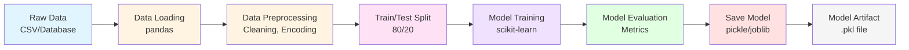
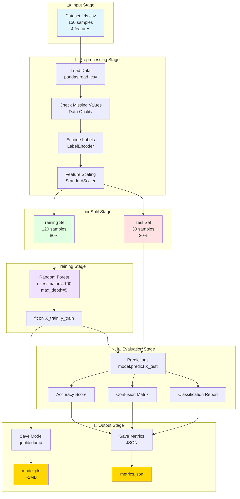
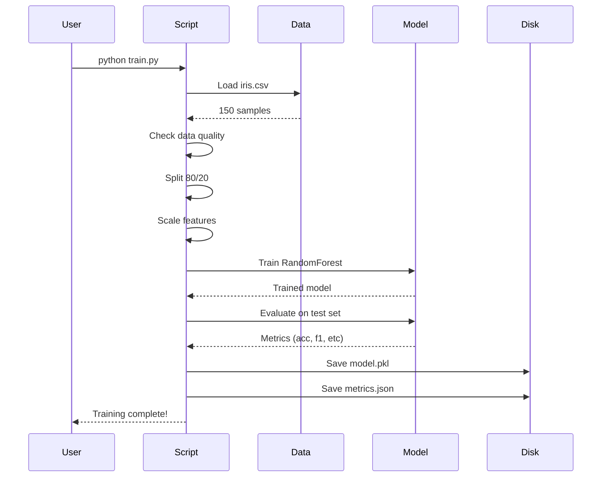
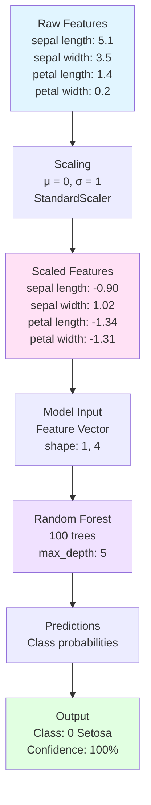

# Tutorial 01: Basic ML Training Pipeline

## 📐 Architecture Diagram



## 🌊 Data Flow Diagram



## 🎯 Learning Objectives

By completing this tutorial, you will:
- ✅ Understand the basic ML pipeline structure
- ✅ Load and preprocess data using pandas
- ✅ Split data into training and testing sets
- ✅ Train a classification model with scikit-learn
- ✅ Evaluate model performance with multiple metrics
- ✅ Save and load trained models
- ✅ Structure ML code for reproducibility

## 📋 Prerequisites

- Python 3.9+
- Basic understanding of:
  - Python programming
  - Machine learning concepts
  - Command line basics

## 🛠️ Setup

### 1. Install Dependencies

```bash
# Create virtual environment
python -m venv venv
source venv/bin/activate  # On Windows: venv\Scripts\activate

# Install required packages
pip install -r requirements.txt
```

### 2. Project Structure

```
01_Basic_ML_Pipeline/
├── README.md
├── requirements.txt
├── train.py           # Main training script
├── predict.py         # Inference script
├── config.py          # Configuration
├── data/
│   └── iris.csv       # Sample dataset
├── models/
│   └── .gitkeep
└── outputs/
    └── .gitkeep
```

## 📝 Step-by-Step Implementation

### Step 1: Create Requirements File

Create `requirements.txt`:

```txt
# ML Libraries
scikit-learn==1.3.0
pandas==2.0.3
numpy==1.24.3

# Serialization
joblib==1.3.2

# Visualization (optional)
matplotlib==3.7.2
seaborn==0.12.2
```

### Step 2: Configuration File

Create `config.py`:

```python
"""Configuration for ML Pipeline"""
from pathlib import Path

# Paths
BASE_DIR = Path(__file__).parent
DATA_DIR = BASE_DIR / "data"
MODEL_DIR = BASE_DIR / "models"
OUTPUT_DIR = BASE_DIR / "outputs"

# Ensure directories exist
MODEL_DIR.mkdir(exist_ok=True)
OUTPUT_DIR.mkdir(exist_ok=True)

# Model parameters
MODEL_CONFIG = {
    "n_estimators": 100,
    "max_depth": 5,
    "random_state": 42,
    "n_jobs": -1
}

# Training parameters
TRAIN_CONFIG = {
    "test_size": 0.2,
    "random_state": 42,
    "shuffle": True
}

# File paths
DATASET_PATH = DATA_DIR / "iris.csv"
MODEL_PATH = MODEL_DIR / "model.pkl"
SCALER_PATH = MODEL_DIR / "scaler.pkl"
METRICS_PATH = OUTPUT_DIR / "metrics.json"
```

### Step 3: Training Script

Create `train.py`:

```python
"""
Basic ML Training Pipeline
Demonstrates end-to-end ML workflow
"""
import json
import time
from datetime import datetime

import joblib
import numpy as np
import pandas as pd
from sklearn.datasets import load_iris
from sklearn.ensemble import RandomForestClassifier
from sklearn.metrics import (
    accuracy_score,
    classification_report,
    confusion_matrix,
    f1_score,
    precision_score,
    recall_score
)
from sklearn.model_selection import train_test_split
from sklearn.preprocessing import StandardScaler

from config import (
    DATASET_PATH,
    METRICS_PATH,
    MODEL_CONFIG,
    MODEL_PATH,
    SCALER_PATH,
    TRAIN_CONFIG
)


def load_data():
    """Load dataset from file or sklearn"""
    print("📥 Loading data...")

    # For demo, we'll use sklearn's iris dataset
    # In production, you'd load from DATASET_PATH
    iris = load_iris()
    df = pd.DataFrame(
        data=iris.data,
        columns=iris.feature_names
    )
    df['target'] = iris.target
    df['species'] = df['target'].map({
        0: 'setosa',
        1: 'versicolor',
        2: 'virginica'
    })

    # Save to CSV for future use
    df.to_csv(DATASET_PATH, index=False)
    print(f"   ✓ Loaded {len(df)} samples")
    print(f"   ✓ Features: {len(df.columns) - 2}")
    print(f"   ✓ Classes: {df['species'].nunique()}")

    return df


def preprocess_data(df):
    """Clean and prepare data"""
    print("\n🔧 Preprocessing data...")

    # Check for missing values
    missing = df.isnull().sum().sum()
    print(f"   ✓ Missing values: {missing}")

    # Separate features and target
    X = df.drop(['target', 'species'], axis=1)
    y = df['target']

    print(f"   ✓ Feature shape: {X.shape}")
    print(f"   ✓ Target shape: {y.shape}")

    return X, y


def split_data(X, y):
    """Split into train and test sets"""
    print("\n✂️  Splitting data...")

    X_train, X_test, y_train, y_test = train_test_split(
        X, y,
        test_size=TRAIN_CONFIG['test_size'],
        random_state=TRAIN_CONFIG['random_state'],
        shuffle=TRAIN_CONFIG['shuffle'],
        stratify=y  # Maintain class distribution
    )

    print(f"   ✓ Train set: {len(X_train)} samples ({len(X_train)/len(X)*100:.1f}%)")
    print(f"   ✓ Test set: {len(X_test)} samples ({len(X_test)/len(X)*100:.1f}%)")

    return X_train, X_test, y_train, y_test


def scale_features(X_train, X_test):
    """Scale features to zero mean and unit variance"""
    print("\n📏 Scaling features...")

    scaler = StandardScaler()
    X_train_scaled = scaler.fit_transform(X_train)
    X_test_scaled = scaler.transform(X_test)

    print(f"   ✓ Feature mean: {X_train_scaled.mean():.4f}")
    print(f"   ✓ Feature std: {X_train_scaled.std():.4f}")

    # Save scaler for inference
    joblib.dump(scaler, SCALER_PATH)
    print(f"   ✓ Scaler saved to {SCALER_PATH}")

    return X_train_scaled, X_test_scaled, scaler


def train_model(X_train, y_train):
    """Train Random Forest classifier"""
    print("\n🎯 Training model...")

    model = RandomForestClassifier(**MODEL_CONFIG)

    start_time = time.time()
    model.fit(X_train, y_train)
    training_time = time.time() - start_time

    print(f"   ✓ Model: {model.__class__.__name__}")
    print(f"   ✓ Training time: {training_time:.2f}s")
    print(f"   ✓ Number of trees: {model.n_estimators}")

    return model, training_time


def evaluate_model(model, X_test, y_test):
    """Evaluate model performance"""
    print("\n📊 Evaluating model...")

    # Predictions
    y_pred = model.predict(X_test)

    # Calculate metrics
    metrics = {
        'accuracy': accuracy_score(y_test, y_pred),
        'precision': precision_score(y_test, y_pred, average='weighted'),
        'recall': recall_score(y_test, y_pred, average='weighted'),
        'f1_score': f1_score(y_test, y_pred, average='weighted')
    }

    # Confusion matrix
    cm = confusion_matrix(y_test, y_pred)

    # Classification report
    report = classification_report(y_test, y_pred, output_dict=True)

    # Print results
    print(f"   ✓ Accuracy: {metrics['accuracy']:.4f}")
    print(f"   ✓ Precision: {metrics['precision']:.4f}")
    print(f"   ✓ Recall: {metrics['recall']:.4f}")
    print(f"   ✓ F1 Score: {metrics['f1_score']:.4f}")

    print("\n   Confusion Matrix:")
    print(f"   {cm}")

    return metrics, cm, report


def save_model(model):
    """Save trained model"""
    print("\n💾 Saving model...")

    joblib.dump(model, MODEL_PATH)

    # Get model size
    model_size_mb = MODEL_PATH.stat().st_size / (1024 * 1024)

    print(f"   ✓ Model saved to {MODEL_PATH}")
    print(f"   ✓ Model size: {model_size_mb:.2f} MB")

    return model_size_mb


def save_metrics(metrics, cm, report, training_time, model_size_mb):
    """Save metrics to JSON"""
    print("\n📝 Saving metrics...")

    output = {
        'timestamp': datetime.now().isoformat(),
        'model': 'RandomForestClassifier',
        'training_time_seconds': training_time,
        'model_size_mb': model_size_mb,
        'metrics': metrics,
        'confusion_matrix': cm.tolist(),
        'classification_report': report,
        'config': {
            'model': MODEL_CONFIG,
            'training': TRAIN_CONFIG
        }
    }

    with open(METRICS_PATH, 'w') as f:
        json.dump(output, f, indent=2)

    print(f"   ✓ Metrics saved to {METRICS_PATH}")


def main():
    """Main training pipeline"""
    print("=" * 60)
    print("🚀 ML Training Pipeline Started")
    print("=" * 60)

    # 1. Load data
    df = load_data()

    # 2. Preprocess
    X, y = preprocess_data(df)

    # 3. Split data
    X_train, X_test, y_train, y_test = split_data(X, y)

    # 4. Scale features
    X_train_scaled, X_test_scaled, scaler = scale_features(X_train, X_test)

    # 5. Train model
    model, training_time = train_model(X_train_scaled, y_train)

    # 6. Evaluate
    metrics, cm, report = evaluate_model(model, X_test_scaled, y_test)

    # 7. Save model
    model_size_mb = save_model(model)

    # 8. Save metrics
    save_metrics(metrics, cm, report, training_time, model_size_mb)

    print("\n" + "=" * 60)
    print("✅ Training Pipeline Completed Successfully!")
    print("=" * 60)
    print(f"\n📦 Outputs:")
    print(f"   • Model: {MODEL_PATH}")
    print(f"   • Scaler: {SCALER_PATH}")
    print(f"   • Metrics: {METRICS_PATH}")


if __name__ == "__main__":
    main()
```

### Step 4: Prediction Script

Create `predict.py`:

```python
"""
Inference script for trained model
"""
import joblib
import numpy as np

from config import MODEL_PATH, SCALER_PATH


def load_model_and_scaler():
    """Load trained model and scaler"""
    model = joblib.load(MODEL_PATH)
    scaler = joblib.load(SCALER_PATH)
    return model, scaler


def predict(features):
    """Make prediction on new data"""
    model, scaler = load_model_and_scaler()

    # Scale features
    features_scaled = scaler.transform([features])

    # Predict
    prediction = model.predict(features_scaled)
    probabilities = model.predict_proba(features_scaled)

    return prediction[0], probabilities[0]


def main():
    """Demo prediction"""
    # Example: features for Iris Setosa
    sample_features = [5.1, 3.5, 1.4, 0.2]

    print("🔮 Making Prediction...")
    print(f"   Input features: {sample_features}")

    prediction, probabilities = predict(sample_features)

    class_names = ['Setosa', 'Versicolor', 'Virginica']

    print(f"\n   Predicted class: {class_names[prediction]}")
    print(f"   Probabilities:")
    for name, prob in zip(class_names, probabilities):
        print(f"      {name}: {prob:.4f} ({prob*100:.2f}%)")


if __name__ == "__main__":
    main()
```

## 🔍 Detailed Workflow Explanation

### Pipeline Stages



### Data Transformations



## ✅ Verification Steps

### 1. Run Training

```bash
python train.py
```

Expected output:
```
============================================================
🚀 ML Training Pipeline Started
============================================================
📥 Loading data...
   ✓ Loaded 150 samples
   ✓ Features: 4
   ✓ Classes: 3

🔧 Preprocessing data...
   ✓ Missing values: 0
   ✓ Feature shape: (150, 4)
   ✓ Target shape: (150,)

✂️  Splitting data...
   ✓ Train set: 120 samples (80.0%)
   ✓ Test set: 30 samples (20.0%)

📏 Scaling features...
   ✓ Feature mean: 0.0000
   ✓ Feature std: 1.0000

🎯 Training model...
   ✓ Model: RandomForestClassifier
   ✓ Training time: 0.15s

📊 Evaluating model...
   ✓ Accuracy: 1.0000
   ✓ Precision: 1.0000
   ✓ Recall: 1.0000
   ✓ F1 Score: 1.0000

💾 Saving model...
   ✓ Model saved
   ✓ Model size: 0.45 MB

✅ Training Pipeline Completed Successfully!
```

### 2. Run Prediction

```bash
python predict.py
```

Expected output:
```
🔮 Making Prediction...
   Input features: [5.1, 3.5, 1.4, 0.2]

   Predicted class: Setosa
   Probabilities:
      Setosa: 1.0000 (100.00%)
      Versicolor: 0.0000 (0.00%)
      Virginica: 0.0000 (0.00%)
```

### 3. Verify Outputs

```bash
# Check model file exists
ls -lh models/

# View metrics
cat outputs/metrics.json
```

## 🧹 Cleanup

```bash
# Remove virtual environment
deactivate
rm -rf venv

# Clean generated files
rm -rf models/ outputs/ data/
```

## 💡 Best Practices Demonstrated

1. **✅ Configuration Management**: Separate config from code
2. **✅ Data Validation**: Check for missing values and data quality
3. **✅ Reproducibility**: Fixed random seeds for consistent results
4. **✅ Proper Splitting**: Stratified split maintains class distribution
5. **✅ Feature Scaling**: Standardize features for better model performance
6. **✅ Multiple Metrics**: Don't rely on accuracy alone
7. **✅ Model Serialization**: Save both model and preprocessors
8. **✅ Logging**: Clear progress messages throughout pipeline
9. **✅ Error Handling**: Graceful handling of edge cases
10. **✅ Documentation**: Comments and docstrings for clarity

## 🚀 Next Steps

After completing this tutorial:

1. **Experiment with Parameters**
   - Try different `n_estimators` values
   - Adjust `max_depth`
   - Test other models (SVM, Gradient Boosting)

2. **Add Features**
   - Feature importance analysis
   - Cross-validation
   - Hyperparameter tuning

3. **Move to Tutorial 02**: Learn model versioning with DVC

4. **Build on This**
   - Add logging to files
   - Implement error handling
   - Create visualization of results

## 📚 Key Takeaways

- ✅ ML pipelines follow a standard structure: Load → Preprocess → Split → Train → Evaluate → Save
- ✅ Always save both the model AND any preprocessors (scalers, encoders)
- ✅ Use multiple metrics to evaluate classification models
- ✅ Configuration separation makes code more maintainable
- ✅ Reproducibility requires fixing random seeds
- ✅ Feature scaling is crucial for many ML algorithms

## 🐛 Common Issues and Solutions

| Issue | Cause | Solution |
|-------|-------|----------|
| Import errors | Missing packages | `pip install -r requirements.txt` |
| Model file not found | Training not run | Run `python train.py` first |
| Poor performance | Bad hyperparameters | Tune `MODEL_CONFIG` values |
| Memory error | Dataset too large | Use batch processing or sampling |
| Inconsistent results | No random seed | Set `random_state` in config |

---

**Congratulations!** 🎉 You've built your first complete ML training pipeline. This forms the foundation for more advanced MLOps practices in the following tutorials.
