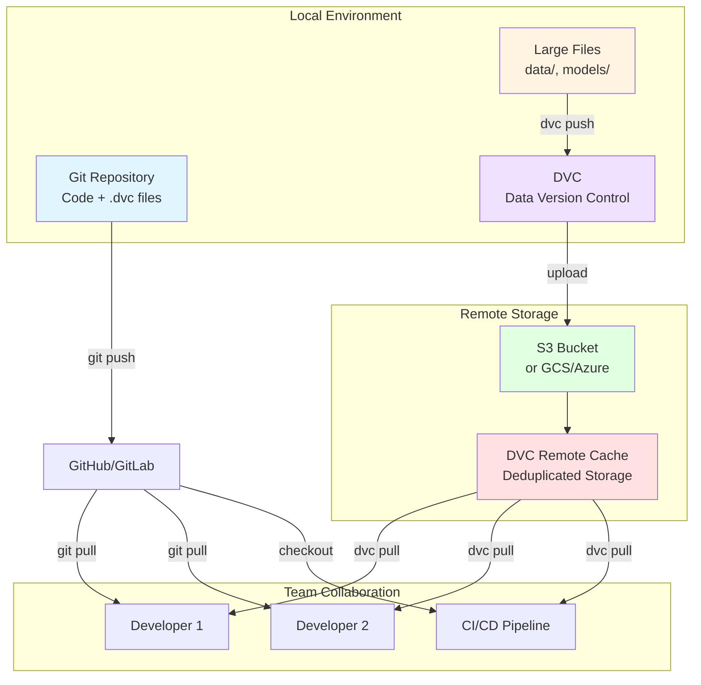
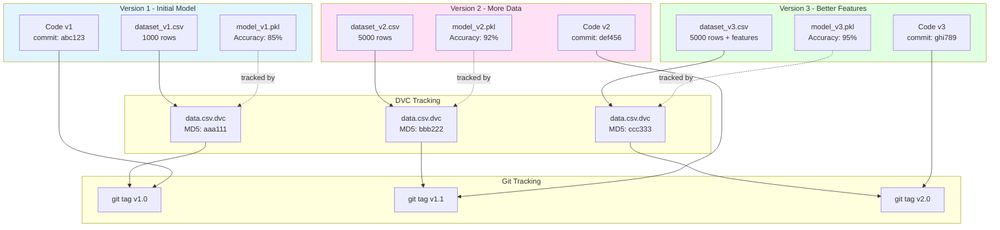
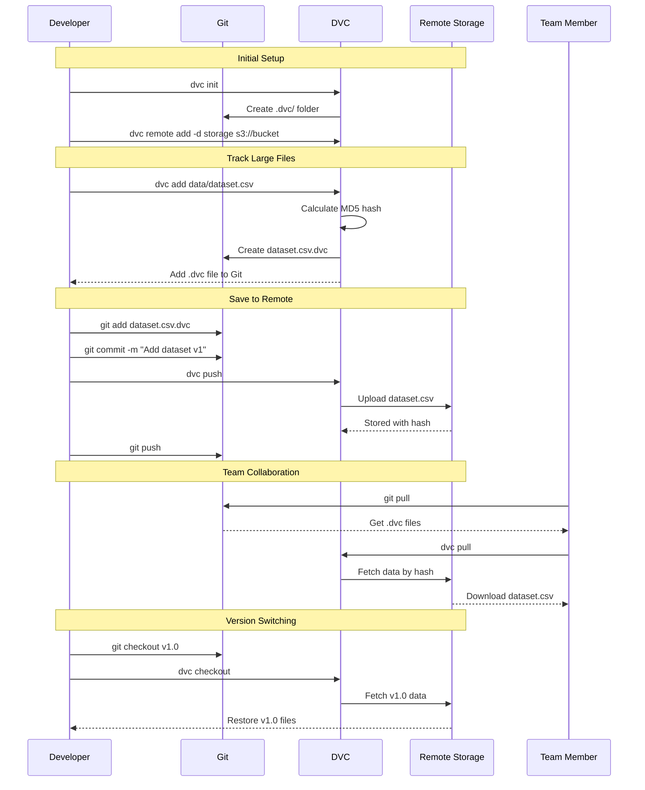
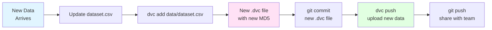
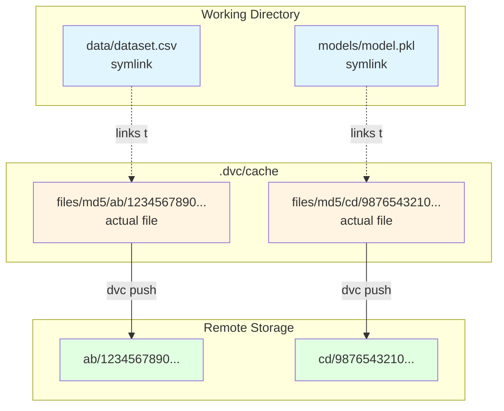

# Tutorial 02: Model Versioning with DVC

## 📐 Architecture Diagram



## 🌊 Data Flow with Versioning



## 🔄 DVC Workflow Diagram



## 🎯 Learning Objectives

- ✅ Understand version control for ML artifacts
- ✅ Set up DVC for data and model tracking
- ✅ Configure remote storage (local, S3, GCS)
- ✅ Track datasets, models, and metrics
- ✅ Switch between different versions
- ✅ Collaborate with teams using DVC
- ✅ Integrate DVC with CI/CD pipelines

## 📋 Prerequisites

- Completed Tutorial 01 (Basic ML Pipeline)
- Git installed and configured
- Python 3.9+
- (Optional) AWS/GCS account for remote storage

## 🛠️ Setup

### Install DVC

```bash
# Install DVC with S3 support
pip install 'dvc[s3]'

# Or with Google Cloud Storage
pip install 'dvc[gs]'

# Or with Azure
pip install 'dvc[azure]'

# Or all remotes
pip install 'dvc[all]'
```

## 📝 Step-by-Step Implementation

### Step 1: Initialize DVC

```bash
# Initialize Git repository (if not already)
git init

# Initialize DVC
dvc init

# Check what DVC created
ls -la .dvc/
```

**What This Does:**
- Creates `.dvc/` directory with config
- Adds `.dvc/config` for settings
- Creates `.dvc/.gitignore` to exclude cache
- Sets up DVC's internal structure

### Step 2: Configure Remote Storage

#### Option A: Local Remote (for testing)

```bash
# Create local remote storage
mkdir -p /tmp/dvc-storage

# Add remote
dvc remote add -d local /tmp/dvc-storage

# Verify configuration
dvc remote list
cat .dvc/config
```

#### Option B: S3 Remote (production)

```bash
# Add S3 remote
dvc remote add -d s3remote s3://my-bucket/dvc-storage

# Configure AWS credentials
dvc remote modify s3remote access_key_id YOUR_ACCESS_KEY
dvc remote modify s3remote secret_access_key YOUR_SECRET_KEY

# Or use AWS profile
dvc remote modify s3remote profile my-aws-profile
```

#### Option C: Google Cloud Storage

```bash
# Add GCS remote
dvc remote add -d gcsremote gs://my-bucket/dvc-storage

# Set credentials
dvc remote modify gcsremote credentialpath /path/to/credentials.json
```

### Step 3: Project Structure

```
02_Model_Versioning_DVC/
├── .dvc/
│   ├── config              # DVC configuration
│   └── .gitignore
├── .dvcignore              # Files to ignore
├── data/
│   ├── raw/
│   │   └── dataset.csv     # Large dataset
│   └── processed/
│       └── features.csv
├── models/
│   ├── model_v1.pkl
│   └── model_v2.pkl
├── metrics/
│   └── results.json
├── train.py
├── dvc.yaml                # DVC pipeline definition
└── README.md
```

### Step 4: Track Data with DVC

```bash
# Add dataset to DVC tracking
dvc add data/raw/dataset.csv

# This creates dataset.csv.dvc file
# The actual data is moved to .dvc/cache/
cat data/raw/dataset.csv.dvc
```

**dataset.csv.dvc** content:
```yaml
outs:
- md5: a1b2c3d4e5f6g7h8i9j0k1l2m3n4o5p6
  size: 1048576
  path: dataset.csv
```

### Step 5: Track Models

```bash
# Train a model first
python train.py

# Track the model
dvc add models/model_v1.pkl

# Track metrics
dvc add metrics/results.json
```

### Step 6: Commit to Git

```bash
# Add .dvc files to Git (NOT the actual data!)
git add data/raw/dataset.csv.dvc \
        models/model_v1.pkl.dvc \
        metrics/results.json.dvc \
        .gitignore

# Commit
git commit -m "Track dataset and model v1 with DVC"

# Add Git tag for this version
git tag -a v1.0 -m "Model version 1.0"
```

### Step 7: Push to Remote

```bash
# Push data to DVC remote
dvc push

# Push code to Git remote
git push origin main
git push origin v1.0
```

### Step 8: Create DVC Pipeline

Create `dvc.yaml`:

```yaml
stages:
  prepare:
    cmd: python prepare_data.py
    deps:
      - data/raw/dataset.csv
    outs:
      - data/processed/features.csv
    metrics:
      - metrics/data_stats.json:
          cache: false

  train:
    cmd: python train.py
    deps:
      - data/processed/features.csv
      - train.py
    params:
      - config.yaml:
          - model.n_estimators
          - model.max_depth
    outs:
      - models/model.pkl
    metrics:
      - metrics/train_metrics.json:
          cache: false
    plots:
      - plots/confusion_matrix.csv:
          template: confusion
          x: actual
          y: predicted

  evaluate:
    cmd: python evaluate.py
    deps:
      - models/model.pkl
      - data/processed/test.csv
    metrics:
      - metrics/eval_metrics.json:
          cache: false
```

### Step 9: Run DVC Pipeline

```bash
# Run entire pipeline
dvc repro

# DVC will:
# 1. Check which stages need to run
# 2. Execute only changed stages
# 3. Track all outputs
# 4. Cache results
```

## 🔍 Detailed Workflow Examples

### Example 1: Update Dataset and Retrain



```bash
# Update dataset
cp new_data.csv data/raw/dataset.csv

# DVC detects changes
dvc status

# Add updated dataset
dvc add data/raw/dataset.csv

# Retrain
dvc repro train

# Commit changes
git add data/raw/dataset.csv.dvc dvc.lock
git commit -m "Update dataset, retrain model v2"
git tag -a v2.0 -m "Model version 2.0"

# Push everything
dvc push
git push origin main --tags
```

### Example 2: Switch to Previous Version

```bash
# List available versions
git tag

# Checkout old version
git checkout v1.0

# Get old data and models
dvc checkout

# Verify you have v1.0 artifacts
ls -lh models/
cat metrics/results.json

# Return to latest
git checkout main
dvc checkout
```

### Example 3: Team Member Gets Project

```bash
# Clone repository
git clone https://github.com/team/ml-project.git
cd ml-project

# Pull data from DVC remote
dvc pull

# Now you have all code, data, and models!
python evaluate.py
```

## 💾 Storage Optimization

### DVC Cache Structure



**Benefits:**
- Deduplication: Same file stored once
- Fast switching: Just update symlinks
- Space efficient: Shared cache across projects

## ✅ Verification Steps

### 1. Check DVC Status

```bash
# Should show everything is up to date
dvc status
```

### 2. Verify Remote Storage

```bash
# List remote files
dvc list . --dvc-only

# Check what's in remote
dvc remote list
```

### 3. Test Version Switching

```bash
# Create and switch versions
git tag
git checkout v1.0
dvc checkout
ls -lh models/

git checkout v2.0
dvc checkout
ls -lh models/
```

### 4. Verify Pipeline

```bash
# Check pipeline status
dvc status

# Run pipeline
dvc repro

# View metrics
dvc metrics show

# Compare experiments
dvc metrics diff v1.0 v2.0
```

## 📊 Comparing Experiments

```bash
# Show current metrics
dvc metrics show

# Compare with previous version
dvc metrics diff HEAD~1

# Compare specific tags
dvc metrics diff v1.0 v2.0

# Show all experiments
dvc exp show
```

**Output Example:**
```
Path                    Metric    v1.0     v2.0     Change
metrics/train_metrics.json:
  accuracy              0.850    0.920    0.070
  f1_score              0.830    0.910    0.080
  precision             0.840    0.915    0.075
```

## 🧹 Cleanup

```bash
# Remove DVC cache
dvc cache dir
rm -rf .dvc/cache

# Remove remote data (careful!)
dvc remove data/raw/dataset.csv.dvc --outs

# Clean up old experiments
dvc gc --workspace
```

## 💡 Best Practices

### 1. Directory Structure
```
✅ DO: Separate data/models/metrics
❌ DON'T: Mix tracked and untracked files
```

### 2. .gitignore Configuration
```gitignore
# Data and models (tracked by DVC)
/data/raw/*
/data/processed/*
/models/*.pkl
/models/*.h5

# Keep .dvc files in Git
!**/*.dvc

# DVC cache
/.dvc/cache
```

### 3. .dvcignore Configuration
```
# Ignore temporary files
*.tmp
*.log
__pycache__/
.ipynb_checkpoints/
```

### 4. Meaningful Commits
```bash
# ✅ Good commit messages
git commit -m "Add dataset v2 with 10k new samples"
git commit -m "Train model v3 with updated hyperparameters"

# ❌ Bad commit messages
git commit -m "Update data"
git commit -m "Changes"
```

### 5. Tagging Strategy
```bash
# Semantic versioning for models
git tag -a v1.0.0 -m "Initial production model"
git tag -a v1.1.0 -m "Improved features, +2% accuracy"
git tag -a v2.0.0 -m "New model architecture"
```

## 🔐 Security Best Practices

### 1. Credentials Management

```bash
# DON'T store credentials in .dvc/config
# DO use environment variables
export AWS_ACCESS_KEY_ID=your_key
export AWS_SECRET_ACCESS_KEY=your_secret

# Or use AWS profiles
dvc remote modify s3remote profile production
```

### 2. Access Control

```bash
# Set remote permissions
dvc remote modify s3remote --local access_key_id KEY
dvc remote modify s3remote --local secret_access_key SECRET

# --local flag keeps credentials out of Git
```

## 🚀 Advanced Features

### 1. DVC Experiments

```bash
# Run experiment with different params
dvc exp run -n exp1 --set-param model.n_estimators=200

# Compare experiments
dvc exp show

# Apply best experiment
dvc exp apply exp1
```

### 2. Pipeline Visualization

```bash
# Show pipeline DAG
dvc dag

# Output:
#         +----------+
#         | prepare  |
#         +----------+
#              *
#              *
#              *
#          +-------+
#          | train |
#          +-------+
#              *
#              *
#              *
#        +-----------+
#        | evaluate  |
#        +-----------+
```

### 3. Remote Storage Providers Comparison

| Provider | Use Case | Cost | Setup Complexity |
|----------|----------|------|------------------|
| Local | Testing | Free | Easy |
| S3 | Production | $0.023/GB | Medium |
| GCS | Production | $0.020/GB | Medium |
| Azure Blob | Production | $0.018/GB | Medium |
| SSH Remote | Self-hosted | Variable | Easy |
| HTTP Remote | Read-only | Free | Easy |

## 📚 Key Takeaways

- ✅ DVC tracks data/models while Git tracks code
- ✅ `.dvc` files are small pointers stored in Git
- ✅ Actual data stored in `.dvc/cache` and remote storage
- ✅ DVC enables reproducible ML pipelines
- ✅ Easy collaboration through remote storage
- ✅ Version switching is fast (just symlinks)
- ✅ Built-in experiment tracking and comparison
- ✅ Works with any storage backend

## 🐛 Common Issues

| Issue | Cause | Solution |
|-------|-------|----------|
| `dvc push` fails | No remote configured | `dvc remote add -d storage <url>` |
| Files not updating | Forgot `dvc checkout` | Always run after `git checkout` |
| Cache too large | Old versions accumulate | `dvc gc --workspace` |
| Permission denied | Wrong credentials | Check `dvc remote modify` settings |
| Slow `dvc pull` | Large files | Use `dvc fetch` instead |

## 🔗 Integration with CI/CD

```yaml
# .github/workflows/train.yml
name: Train Model

on: [push]

jobs:
  train:
    runs-on: ubuntu-latest
    steps:
      - uses: actions/checkout@v2

      - name: Setup DVC
        uses: iterative/setup-dvc@v1

      - name: Pull data
        run: dvc pull
        env:
          AWS_ACCESS_KEY_ID: ${{ secrets.AWS_ACCESS_KEY_ID }}
          AWS_SECRET_ACCESS_KEY: ${{ secrets.AWS_SECRET_ACCESS_KEY }}

      - name: Run pipeline
        run: dvc repro

      - name: Push results
        run: dvc push
```

---

**Next Tutorial:** [03_Experiment_Tracking_MLflow](../03_Experiment_Tracking_MLflow/) - Learn to track experiments, parameters, and metrics with MLflow.
