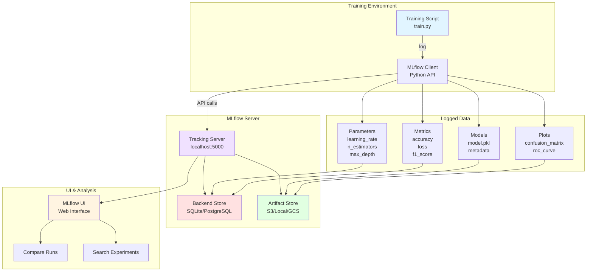
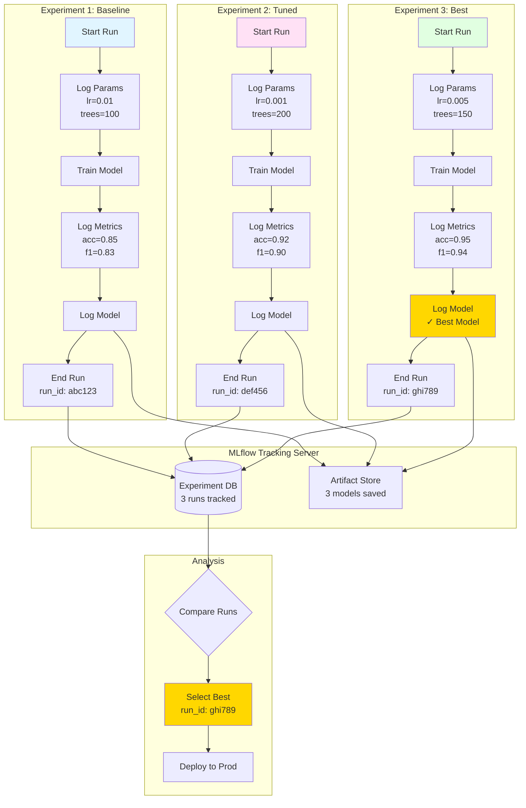
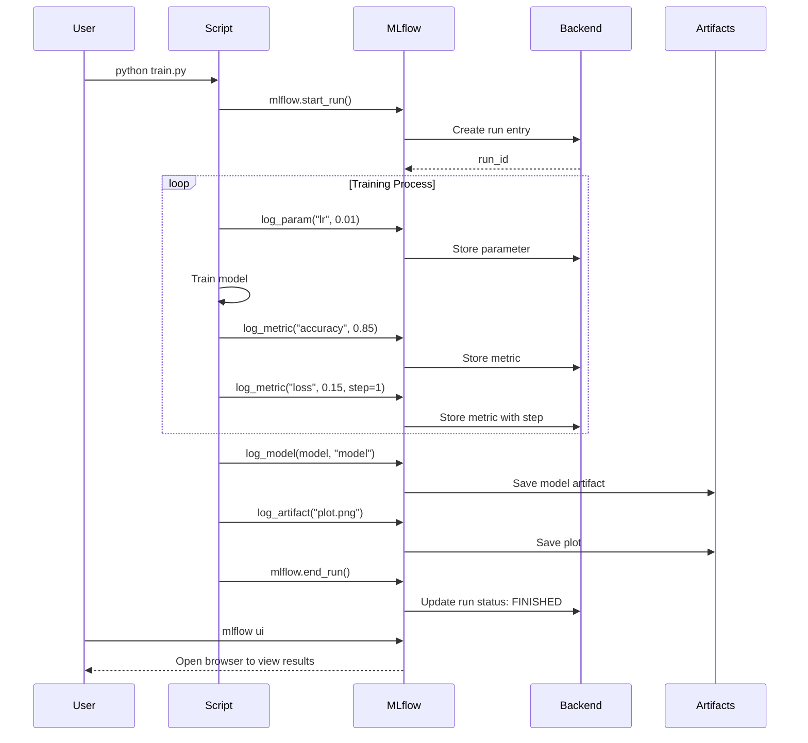
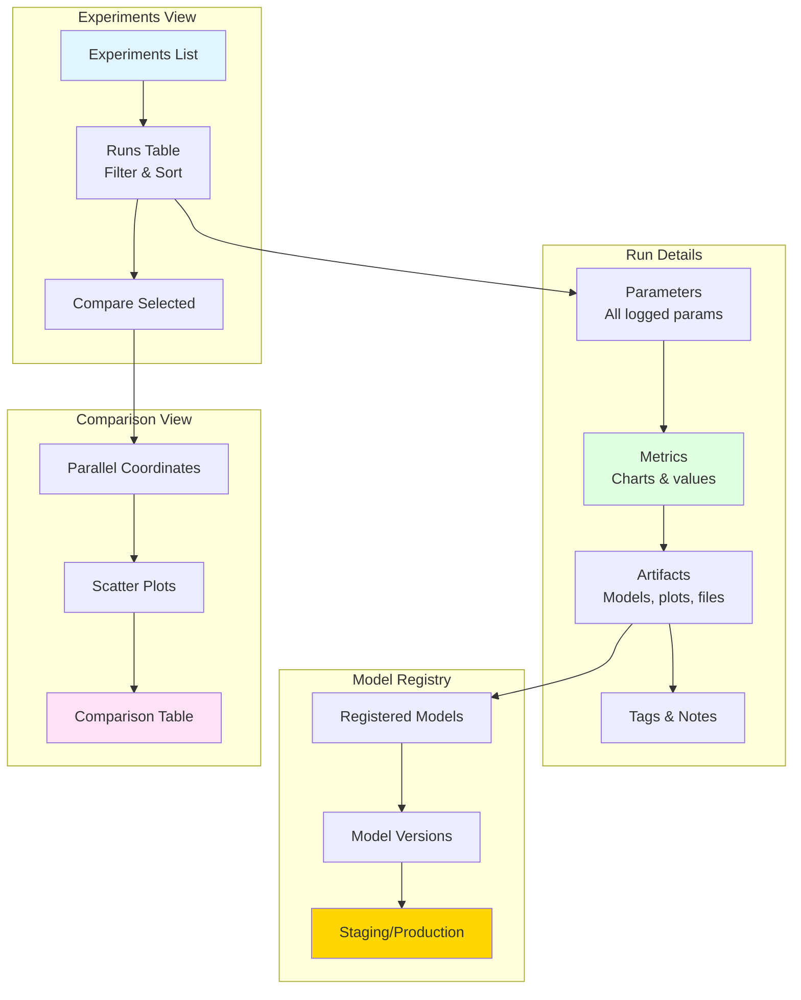

# Tutorial 03: Experiment Tracking with MLflow

## 📐 Architecture Diagram



## 🌊 Experiment Tracking Flow



## 🔄 MLflow Run Lifecycle



## 🎯 Learning Objectives

- ✅ Set up MLflow tracking server
- ✅ Log parameters, metrics, and artifacts
- ✅ Track multiple experiments
- ✅ Compare experiment results
- ✅ Register and version models
- ✅ Load models for inference
- ✅ Organize experiments with tags
- ✅ Integrate MLflow with existing pipelines

## 📋 Prerequisites

- Completed Tutorial 01 & 02
- Python 3.9+
- Basic ML knowledge

## 🛠️ Setup

### Install MLflow

```bash
pip install mlflow
pip install scikit-learn pandas matplotlib seaborn
```

## 📝 Step-by-Step Implementation

### Step 1: Start MLflow Tracking Server

```bash
# Start MLflow UI
mlflow ui --host 0.0.0.0 --port 5000

# Or with custom backend and artifact store
mlflow server \
  --backend-store-uri sqlite:///mlflow.db \
  --default-artifact-root ./mlruns \
  --host 0.0.0.0 \
  --port 5000
```

Open browser: `http://localhost:5000`

### Step 2: Basic Tracking Script

Create `train_with_mlflow.py`:

```python
"""
MLflow Experiment Tracking Example
"""
import mlflow
import mlflow.sklearn
from sklearn.datasets import load_iris
from sklearn.ensemble import RandomForestClassifier
from sklearn.model_selection import train_test_split
from sklearn.metrics import accuracy_score, f1_score, precision_score, recall_score
import matplotlib.pyplot as plt
from sklearn.metrics import confusion_matrix, ConfusionMatrixDisplay

# Set experiment name
mlflow.set_experiment("iris_classification")

# Set tracking URI (optional, defaults to ./mlruns)
mlflow.set_tracking_uri("http://localhost:5000")

def train_model(n_estimators=100, max_depth=5, learning_rate=0.01):
    """Train model with MLflow tracking"""

    # Start MLflow run
    with mlflow.start_run(run_name=f"rf_n{n_estimators}_d{max_depth}") as run:

        # Log parameters
        mlflow.log_param("n_estimators", n_estimators)
        mlflow.log_param("max_depth", max_depth)
        mlflow.log_param("learning_rate", learning_rate)
        mlflow.log_param("model_type", "RandomForest")

        # Load data
        iris = load_iris()
        X_train, X_test, y_train, y_test = train_test_split(
            iris.data, iris.target, test_size=0.2, random_state=42
        )

        # Log dataset info
        mlflow.log_param("train_samples", len(X_train))
        mlflow.log_param("test_samples", len(X_test))
        mlflow.log_param("n_features", X_train.shape[1])
        mlflow.log_param("n_classes", len(set(y_train)))

        # Train model
        model = RandomForestClassifier(
            n_estimators=n_estimators,
            max_depth=max_depth,
            random_state=42
        )
        model.fit(X_train, y_train)

        # Predictions
        y_pred = model.predict(X_test)

        # Calculate metrics
        accuracy = accuracy_score(y_test, y_pred)
        f1 = f1_score(y_test, y_pred, average='weighted')
        precision = precision_score(y_test, y_pred, average='weighted')
        recall = recall_score(y_test, y_pred, average='weighted')

        # Log metrics
        mlflow.log_metric("accuracy", accuracy)
        mlflow.log_metric("f1_score", f1)
        mlflow.log_metric("precision", precision)
        mlflow.log_metric("recall", recall)

        # Create and log confusion matrix plot
        cm = confusion_matrix(y_test, y_pred)
        disp = ConfusionMatrixDisplay(confusion_matrix=cm)
        disp.plot()
        plt.savefig("confusion_matrix.png")
        mlflow.log_artifact("confusion_matrix.png")
        plt.close()

        # Log model
        mlflow.sklearn.log_model(
            model,
            "model",
            registered_model_name="iris_classifier"
        )

        # Set tags
        mlflow.set_tag("team", "data-science")
        mlflow.set_tag("project", "iris-classification")
        mlflow.set_tag("model_family", "tree-based")

        print(f"Run ID: {run.info.run_id}")
        print(f"Accuracy: {accuracy:.4f}")
        print(f"MLflow UI: http://localhost:5000/#/experiments/{run.info.experiment_id}/runs/{run.info.run_id}")

        return run.info.run_id, accuracy

if __name__ == "__main__":
    # Run multiple experiments
    experiments = [
        {"n_estimators": 50, "max_depth": 3, "learning_rate": 0.01},
        {"n_estimators": 100, "max_depth": 5, "learning_rate": 0.01},
        {"n_estimators": 150, "max_depth": 7, "learning_rate": 0.005},
        {"n_estimators": 200, "max_depth": 10, "learning_rate": 0.001},
    ]

    results = []
    for params in experiments:
        run_id, accuracy = train_model(**params)
        results.append((run_id, accuracy, params))

    # Find best model
    best = max(results, key=lambda x: x[1])
    print(f"\n🏆 Best Model:")
    print(f"   Run ID: {best[0]}")
    print(f"   Accuracy: {best[1]:.4f}")
    print(f"   Params: {best[2]}")
```

### Step 3: Run Experiments

```bash
python train_with_mlflow.py
```

**Output:**
```
Run ID: abc123...
Accuracy: 0.9000
MLflow UI: http://localhost:5000/#/experiments/1/runs/abc123

Run ID: def456...
Accuracy: 0.9333
MLflow UI: http://localhost:5000/#/experiments/1/runs/def456

...

🏆 Best Model:
   Run ID: ghi789...
   Accuracy: 0.9667
   Params: {'n_estimators': 150, 'max_depth': 7, 'learning_rate': 0.005}
```

### Step 4: Advanced Tracking

Create `advanced_tracking.py`:

```python
"""
Advanced MLflow features
"""
import mlflow
import numpy as np
import time

# Log multiple metrics over epochs
with mlflow.start_run(run_name="training_progress"):

    # Simulate training over epochs
    for epoch in range(10):
        # Simulate decreasing loss
        train_loss = 1.0 / (epoch + 1) + np.random.rand() * 0.1
        val_loss = 1.2 / (epoch + 1) + np.random.rand() * 0.1

        # Simulate increasing accuracy
        train_acc = 0.5 + (epoch / 10) * 0.4 + np.random.rand() * 0.05
        val_acc = 0.5 + (epoch / 10) * 0.35 + np.random.rand() * 0.05

        # Log metrics with step
        mlflow.log_metric("train_loss", train_loss, step=epoch)
        mlflow.log_metric("val_loss", val_loss, step=epoch)
        mlflow.log_metric("train_accuracy", train_acc, step=epoch)
        mlflow.log_metric("val_accuracy", val_acc, step=epoch)

        time.sleep(0.1)  # Simulate training time

    # Log dictionary of params
    params = {
        "optimizer": "adam",
        "batch_size": 32,
        "epochs": 10,
        "lr_schedule": "cosine"
    }
    mlflow.log_params(params)

    # Log dictionary of metrics
    final_metrics = {
        "final_train_acc": train_acc,
        "final_val_acc": val_acc,
        "best_val_acc": 0.85
    }
    mlflow.log_metrics(final_metrics)

    # Log text content
    mlflow.log_text("Model training completed successfully", "status.txt")

    # Log dict as JSON
    mlflow.log_dict(params, "config.json")
```

### Step 5: Compare Runs via API

Create `compare_runs.py`:

```python
"""
Compare MLflow runs programmatically
"""
import mlflow
from mlflow.tracking import MlflowClient

client = MlflowClient()

# Get experiment
experiment = client.get_experiment_by_name("iris_classification")
experiment_id = experiment.experiment_id

# Search runs
runs = client.search_runs(
    experiment_ids=[experiment_id],
    filter_string="metrics.accuracy > 0.90",
    order_by=["metrics.accuracy DESC"],
    max_results=5
)

print(f"📊 Top 5 Runs (accuracy > 0.90):\n")
print(f"{'Run ID':<36} {'Accuracy':<10} {'F1':<10} {'n_estimators':<15} {'max_depth':<10}")
print("-" * 95)

for run in runs:
    run_id = run.info.run_id[:8]
    accuracy = run.data.metrics.get("accuracy", 0)
    f1 = run.data.metrics.get("f1_score", 0)
    n_est = run.data.params.get("n_estimators", "N/A")
    depth = run.data.params.get("max_depth", "N/A")

    print(f"{run_id:<36} {accuracy:<10.4f} {f1:<10.4f} {n_est:<15} {depth:<10}")

# Get best run
best_run = runs[0]
print(f"\n🏆 Best Run: {best_run.info.run_id}")
print(f"   Accuracy: {best_run.data.metrics['accuracy']:.4f}")
```

### Step 6: Load and Use Model

Create `load_model.py`:

```python
"""
Load model from MLflow
"""
import mlflow
import mlflow.sklearn
from sklearn.datasets import load_iris

# Method 1: Load by run ID
run_id = "your_run_id_here"
model = mlflow.sklearn.load_model(f"runs:/{run_id}/model")

# Method 2: Load latest version from registry
model = mlflow.pyfunc.load_model("models:/iris_classifier/latest")

# Method 3: Load specific version
model = mlflow.pyfunc.load_model("models:/iris_classifier/1")

# Make prediction
iris = load_iris()
sample = iris.data[0:1]
prediction = model.predict(sample)

print(f"Prediction: {prediction[0]}")
print(f"Actual: {iris.target[0]}")
```

## 📊 MLflow UI Features



## ✅ Verification

### 1. Check MLflow UI

Open `http://localhost:5000` and verify:
- ✅ Experiments are listed
- ✅ Runs show parameters and metrics
- ✅ Artifacts are accessible
- ✅ Models are logged

### 2. Query Runs via API

```python
from mlflow.tracking import MlflowClient

client = MlflowClient()
experiments = client.search_experiments()

for exp in experiments:
    print(f"Experiment: {exp.name}")
    print(f"  ID: {exp.experiment_id}")
    print(f"  Artifact Location: {exp.artifact_location}")
```

## 💡 Best Practices

### 1. Experiment Organization

```python
# ✅ Good: Descriptive experiment names
mlflow.set_experiment("customer_churn_prediction_v2")

# ❌ Bad: Generic names
mlflow.set_experiment("experiment1")
```

### 2. Meaningful Run Names

```python
# ✅ Good: Include key params
with mlflow.start_run(run_name=f"rf_n{n_estimators}_depth{max_depth}_lr{lr}"):
    pass

# ❌ Bad: No context
with mlflow.start_run():
    pass
```

### 3. Comprehensive Logging

```python
# ✅ Log everything relevant
mlflow.log_params(config)
mlflow.log_metrics(all_metrics)
mlflow.log_artifact("confusion_matrix.png")
mlflow.sklearn.log_model(model, "model")
mlflow.set_tags({"version": "2.0", "team": "ds"})

# ❌ Don't log just accuracy
mlflow.log_metric("accuracy", 0.85)
```

### 4. Use Context Managers

```python
# ✅ Automatic cleanup
with mlflow.start_run():
    # training code
    pass

# ❌ Manual management (error-prone)
mlflow.start_run()
# training code
mlflow.end_run()
```

## 🧹 Cleanup

```bash
# Stop MLflow server
# Press Ctrl+C in terminal

# Delete experiment
mlflow experiments delete --experiment-id 1

# Clean artifacts
rm -rf mlruns/
rm -rf mlflow.db
```

## 🚀 Next Steps

After mastering MLflow:

1. **Integrate with DVC** (Tutorial 02 + 03)
2. **Set up Model Registry** (Tutorial 04)
3. **Automate experiment tracking in CI/CD**
4. **Try MLflow Projects** for reproducibility
5. **Deploy models with MLflow Serving**

## 📚 Key Takeaways

- ✅ MLflow tracks experiments automatically
- ✅ Log params, metrics, models, and artifacts
- ✅ Compare runs visually or programmatically
- ✅ Model registry enables versioning
- ✅ Easy model loading for deployment
- ✅ Supports multiple ML frameworks
- ✅ Can use local or remote backend storage

---

**Next Tutorial:** [04_Model_Registry_Deployment](../04_Model_Registry_Deployment/) - Learn to register, version, and deploy models.
