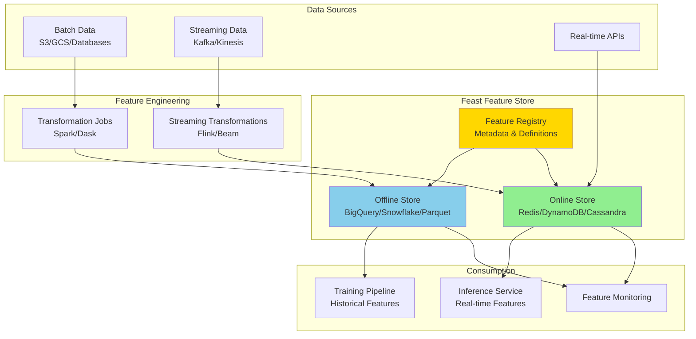
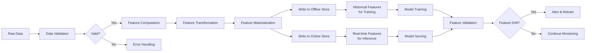
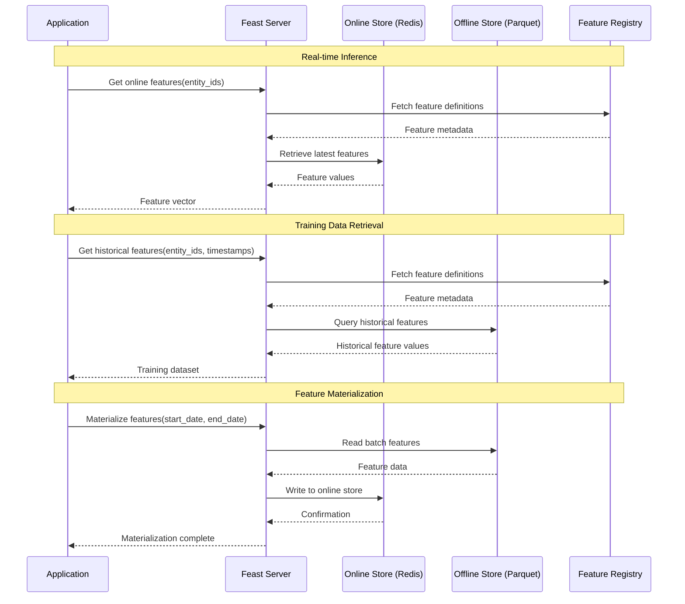

# Tutorial 06: Feature Store Implementation

## Learning Objectives

By completing this tutorial, you will:
- Understand feature store architecture and benefits
- Implement Feast feature store for online and offline features
- Create feature definitions and transformations
- Set up online feature serving with low latency
- Manage feature versioning and lineage
- Integrate feature store with training and inference pipelines

## Prerequisites

- Python 3.8+
- Docker and Docker Compose
- Basic understanding of data pipelines
- Familiarity with SQL and data warehousing
- Understanding of ML feature engineering

## Architecture Overview

### Feature Store Architecture



### Feature Pipeline Data Flow



### Feature Serving Workflow



## Implementation Guide

### Step 1: Install and Set Up Feast

```bash
# Install Feast
pip install feast[redis,postgres]

# Create feature repository
feast init feature_repo
cd feature_repo
```

### Step 2: Configure Feature Store

Create `feature_store.yaml`:

```yaml
project: ml_features
registry: data/registry.db
provider: local
online_store:
  type: redis
  connection_string: localhost:6379
offline_store:
  type: file

entity_key_serialization_version: 2
```

For production, use `feature_store_production.yaml`:

```yaml
project: ml_features
registry: s3://my-bucket/feast/registry.db
provider: aws
online_store:
  type: redis
  connection_string: prod-redis.example.com:6379
  ssl: true
offline_store:
  type: snowflake
  account: my_account
  user: feast_user
  password: ${SNOWFLAKE_PASSWORD}
  database: ML_FEATURES
  warehouse: FEAST_WH
  schema: PUBLIC
```

### Step 3: Define Feature Entities and Views

Create `features.py`:

```python
from datetime import timedelta
from feast import Entity, Feature, FeatureView, Field, FileSource, ValueType
from feast.types import Float32, Float64, Int64, String
from feast.data_source import RequestSource

# Define entities
user = Entity(
    name="user",
    description="User entity",
    join_keys=["user_id"]
)

item = Entity(
    name="item",
    description="Item/Product entity",
    join_keys=["item_id"]
)

# Define data sources
user_features_source = FileSource(
    name="user_features_source",
    path="data/user_features.parquet",
    timestamp_field="event_timestamp",
    created_timestamp_column="created_timestamp",
)

item_features_source = FileSource(
    name="item_features_source",
    path="data/item_features.parquet",
    timestamp_field="event_timestamp",
    created_timestamp_column="created_timestamp",
)

# Define feature views
user_features = FeatureView(
    name="user_features",
    entities=[user],
    ttl=timedelta(days=30),
    schema=[
        Field(name="age", dtype=Int64),
        Field(name="gender", dtype=String),
        Field(name="country", dtype=String),
        Field(name="total_purchases", dtype=Int64),
        Field(name="avg_purchase_amount", dtype=Float64),
        Field(name="days_since_last_purchase", dtype=Int64),
        Field(name="user_embedding_0", dtype=Float32),
        Field(name="user_embedding_1", dtype=Float32),
        Field(name="user_embedding_2", dtype=Float32),
    ],
    source=user_features_source,
    online=True,
    tags={"team": "ml-platform", "version": "v1"},
)

item_features = FeatureView(
    name="item_features",
    entities=[item],
    ttl=timedelta(days=30),
    schema=[
        Field(name="category", dtype=String),
        Field(name="price", dtype=Float64),
        Field(name="brand", dtype=String),
        Field(name="avg_rating", dtype=Float64),
        Field(name="num_reviews", dtype=Int64),
        Field(name="days_since_launch", dtype=Int64),
        Field(name="stock_quantity", dtype=Int64),
        Field(name="item_embedding_0", dtype=Float32),
        Field(name="item_embedding_1", dtype=Float32),
        Field(name="item_embedding_2", dtype=Float32),
    ],
    source=item_features_source,
    online=True,
    tags={"team": "ml-platform", "version": "v1"},
)

# Define request feature view (on-demand features)
user_request_source = RequestSource(
    name="user_request_source",
    schema=[
        Field(name="hour_of_day", dtype=Int64),
        Field(name="day_of_week", dtype=Int64),
    ],
)

from feast.on_demand_feature_view import on_demand_feature_view
import pandas as pd

@on_demand_feature_view(
    sources=[user_features, user_request_source],
    schema=[
        Field(name="is_weekend_shopper", dtype=Int64),
        Field(name="is_high_value_user", dtype=Int64),
    ],
)
def user_derived_features(features_df: pd.DataFrame) -> pd.DataFrame:
    """Compute on-demand features."""
    df = pd.DataFrame()

    # Weekend shopper if day_of_week is 5 or 6
    df["is_weekend_shopper"] = (
        features_df["day_of_week"].isin([5, 6])
    ).astype(int)

    # High value user if avg purchase > 100
    df["is_high_value_user"] = (
        features_df["avg_purchase_amount"] > 100
    ).astype(int)

    return df
```

### Step 4: Generate Sample Data

Create `generate_sample_data.py`:

```python
import pandas as pd
import numpy as np
from datetime import datetime, timedelta

def generate_user_features(num_users=1000):
    """Generate sample user features."""
    np.random.seed(42)

    base_time = datetime.now() - timedelta(days=30)

    users = []
    for i in range(num_users):
        user_data = {
            "user_id": f"user_{i}",
            "event_timestamp": base_time + timedelta(
                hours=np.random.randint(0, 720)
            ),
            "created_timestamp": datetime.now(),
            "age": np.random.randint(18, 80),
            "gender": np.random.choice(["M", "F", "Other"]),
            "country": np.random.choice(["US", "UK", "CA", "AU", "DE"]),
            "total_purchases": np.random.randint(0, 100),
            "avg_purchase_amount": np.random.uniform(10, 500),
            "days_since_last_purchase": np.random.randint(0, 365),
            "user_embedding_0": np.random.randn(),
            "user_embedding_1": np.random.randn(),
            "user_embedding_2": np.random.randn(),
        }
        users.append(user_data)

    df = pd.DataFrame(users)
    df.to_parquet("data/user_features.parquet")
    print(f"Generated {num_users} user features")
    return df

def generate_item_features(num_items=500):
    """Generate sample item features."""
    np.random.seed(43)

    base_time = datetime.now() - timedelta(days=30)

    items = []
    for i in range(num_items):
        item_data = {
            "item_id": f"item_{i}",
            "event_timestamp": base_time + timedelta(
                hours=np.random.randint(0, 720)
            ),
            "created_timestamp": datetime.now(),
            "category": np.random.choice([
                "Electronics", "Clothing", "Books", "Home", "Sports"
            ]),
            "price": np.random.uniform(10, 1000),
            "brand": np.random.choice([
                "Brand_A", "Brand_B", "Brand_C", "Brand_D"
            ]),
            "avg_rating": np.random.uniform(1, 5),
            "num_reviews": np.random.randint(0, 1000),
            "days_since_launch": np.random.randint(0, 1000),
            "stock_quantity": np.random.randint(0, 500),
            "item_embedding_0": np.random.randn(),
            "item_embedding_1": np.random.randn(),
            "item_embedding_2": np.random.randn(),
        }
        items.append(item_data)

    df = pd.DataFrame(items)
    df.to_parquet("data/item_features.parquet")
    print(f"Generated {num_items} item features")
    return df

if __name__ == "__main__":
    import os
    os.makedirs("data", exist_ok=True)

    user_df = generate_user_features()
    item_df = generate_item_features()

    print("\nUser Features Preview:")
    print(user_df.head())

    print("\nItem Features Preview:")
    print(item_df.head())
```

Run the data generation:

```bash
python generate_sample_data.py
```

### Step 5: Apply Feature Definitions

```bash
# Apply feature definitions to registry
feast apply

# Verify feature views
feast feature-views list

# Describe a feature view
feast feature-views describe user_features
```

### Step 6: Materialize Features to Online Store

Create `materialize_features.py`:

```python
from feast import FeatureStore
from datetime import datetime, timedelta

# Initialize feature store
store = FeatureStore(repo_path=".")

# Define time range for materialization
end_date = datetime.now()
start_date = end_date - timedelta(days=30)

# Materialize features to online store
print("Materializing features to online store...")
store.materialize(
    start_date=start_date,
    end_date=end_date
)

print("✓ Features materialized successfully")

# Verify online store
feature_vector = store.get_online_features(
    features=[
        "user_features:age",
        "user_features:total_purchases",
        "user_features:avg_purchase_amount",
    ],
    entity_rows=[
        {"user_id": "user_0"},
        {"user_id": "user_1"},
    ],
).to_dict()

print("\nSample online features:")
for key, values in feature_vector.items():
    print(f"{key}: {values}")
```

Run materialization:

```bash
python materialize_features.py
```

### Step 7: Retrieve Features for Training

Create `training_data_retrieval.py`:

```python
from feast import FeatureStore
import pandas as pd
from datetime import datetime, timedelta

store = FeatureStore(repo_path=".")

# Create entity dataframe (your training data with entity IDs and timestamps)
entity_df = pd.DataFrame({
    "user_id": [f"user_{i}" for i in range(100)],
    "item_id": [f"item_{i % 50}" for i in range(100)],
    "event_timestamp": [
        datetime.now() - timedelta(days=i % 30) for i in range(100)
    ],
    "label": [1 if i % 3 == 0 else 0 for i in range(100)],  # Target variable
})

# Retrieve historical features
print("Retrieving historical features for training...")
training_data = store.get_historical_features(
    entity_df=entity_df,
    features=[
        "user_features:age",
        "user_features:total_purchases",
        "user_features:avg_purchase_amount",
        "user_features:days_since_last_purchase",
        "item_features:price",
        "item_features:avg_rating",
        "item_features:num_reviews",
    ],
).to_df()

print(f"✓ Retrieved {len(training_data)} training samples")
print("\nTraining data preview:")
print(training_data.head())

# Save training data
training_data.to_parquet("training_data.parquet")
print("\n✓ Training data saved to training_data.parquet")

# Feature statistics
print("\nFeature statistics:")
print(training_data.describe())
```

### Step 8: Retrieve Features for Inference

Create `inference_features.py`:

```python
from feast import FeatureStore
import time

store = FeatureStore(repo_path=".")

def get_features_for_inference(user_id: str, item_id: str):
    """Retrieve real-time features for model inference."""
    start_time = time.time()

    # Get features from online store
    feature_vector = store.get_online_features(
        features=[
            "user_features:age",
            "user_features:total_purchases",
            "user_features:avg_purchase_amount",
            "user_features:user_embedding_0",
            "user_features:user_embedding_1",
            "user_features:user_embedding_2",
            "item_features:price",
            "item_features:avg_rating",
            "item_features:item_embedding_0",
            "item_features:item_embedding_1",
            "item_features:item_embedding_2",
        ],
        entity_rows=[
            {
                "user_id": user_id,
                "item_id": item_id,
            }
        ],
    ).to_dict()

    latency = (time.time() - start_time) * 1000  # Convert to ms

    return feature_vector, latency

# Example: Get features for inference
if __name__ == "__main__":
    print("Retrieving features for inference...\n")

    for i in range(5):
        user_id = f"user_{i}"
        item_id = f"item_{i}"

        features, latency = get_features_for_inference(user_id, item_id)

        print(f"User: {user_id}, Item: {item_id}")
        print(f"Latency: {latency:.2f}ms")
        print(f"Features: {features}\n")
```

### Step 9: On-Demand Feature Transformations

Create `on_demand_features_example.py`:

```python
from feast import FeatureStore
import pandas as pd
from datetime import datetime

store = FeatureStore(repo_path=".")

# Get features with on-demand transformations
feature_vector = store.get_online_features(
    features=[
        "user_features:avg_purchase_amount",
        "user_derived_features:is_weekend_shopper",
        "user_derived_features:is_high_value_user",
    ],
    entity_rows=[
        {
            "user_id": "user_0",
            "hour_of_day": 14,
            "day_of_week": 6,  # Saturday
        },
        {
            "user_id": "user_1",
            "hour_of_day": 9,
            "day_of_week": 2,  # Tuesday
        },
    ],
).to_dict()

print("On-demand features:")
for key, values in feature_vector.items():
    print(f"{key}: {values}")
```

### Step 10: Feature Store REST API

Create `feature_server.py`:

```python
from fastapi import FastAPI, HTTPException
from feast import FeatureStore
from pydantic import BaseModel
from typing import List, Dict, Any
import time

app = FastAPI(title="Feature Store API")

# Initialize Feast
store = FeatureStore(repo_path=".")

class FeatureRequest(BaseModel):
    """Request model for feature retrieval."""
    features: List[str]
    entities: List[Dict[str, Any]]

class FeatureResponse(BaseModel):
    """Response model for features."""
    features: Dict[str, List[Any]]
    latency_ms: float

@app.post("/get-online-features", response_model=FeatureResponse)
async def get_online_features(request: FeatureRequest):
    """
    Retrieve online features for given entities.

    Example request:
    {
        "features": ["user_features:age", "user_features:total_purchases"],
        "entities": [{"user_id": "user_0"}, {"user_id": "user_1"}]
    }
    """
    try:
        start_time = time.time()

        feature_vector = store.get_online_features(
            features=request.features,
            entity_rows=request.entities,
        ).to_dict()

        latency_ms = (time.time() - start_time) * 1000

        return FeatureResponse(
            features=feature_vector,
            latency_ms=latency_ms
        )
    except Exception as e:
        raise HTTPException(status_code=500, detail=str(e))

@app.get("/feature-views")
async def list_feature_views():
    """List all feature views."""
    feature_views = store.list_feature_views()
    return {
        "feature_views": [
            {
                "name": fv.name,
                "entities": fv.entity_names,
                "features": [f.name for f in fv.schema],
            }
            for fv in feature_views
        ]
    }

@app.get("/entities")
async def list_entities():
    """List all entities."""
    entities = store.list_entities()
    return {
        "entities": [
            {
                "name": e.name,
                "description": e.description,
                "join_keys": e.join_keys,
            }
            for e in entities
        ]
    }

@app.get("/health")
async def health_check():
    """Health check endpoint."""
    return {"status": "healthy", "timestamp": time.time()}

if __name__ == "__main__":
    import uvicorn
    uvicorn.run(app, host="0.0.0.0", port=8000)
```

Run the feature server:

```bash
python feature_server.py
```

## Verification Steps

### 1. Verify Feature Store Setup

```bash
# Check feast version
feast version

# Validate feature definitions
feast plan

# List all feature views
feast feature-views list
```

### 2. Test Online Feature Retrieval

```python
from feast import FeatureStore

store = FeatureStore(repo_path=".")

# Get features
features = store.get_online_features(
    features=["user_features:age", "user_features:total_purchases"],
    entity_rows=[{"user_id": "user_0"}],
).to_dict()

print(features)
```

### 3. Test Historical Feature Retrieval

```bash
python training_data_retrieval.py
```

Expected output:
```
✓ Retrieved 100 training samples

Training data preview:
   user_id   item_id  age  total_purchases  ...
```

### 4. Test Feature Server API

```bash
# Start the server
python feature_server.py &

# Test the API
curl -X POST "http://localhost:8000/get-online-features" \
  -H "Content-Type: application/json" \
  -d '{
    "features": ["user_features:age", "user_features:total_purchases"],
    "entities": [{"user_id": "user_0"}]
  }'
```

### 5. Measure Latency

```python
import time
from feast import FeatureStore

store = FeatureStore(repo_path=".")

# Warm up
for _ in range(10):
    store.get_online_features(
        features=["user_features:age"],
        entity_rows=[{"user_id": "user_0"}],
    )

# Measure latency
latencies = []
for _ in range(100):
    start = time.time()
    store.get_online_features(
        features=["user_features:age", "user_features:total_purchases"],
        entity_rows=[{"user_id": "user_0"}],
    )
    latencies.append((time.time() - start) * 1000)

print(f"P50 latency: {np.percentile(latencies, 50):.2f}ms")
print(f"P95 latency: {np.percentile(latencies, 95):.2f}ms")
print(f"P99 latency: {np.percentile(latencies, 99):.2f}ms")
```

## Best Practices

### 1. Feature Naming Convention

```python
# Use clear, descriptive names
# Pattern: <entity>_<aggregation>_<metric>_<timewindow>

GOOD_NAMES = [
    "user_total_purchases_7d",
    "user_avg_transaction_amount_30d",
    "item_num_views_24h",
    "user_days_since_last_login",
]

# Avoid
BAD_NAMES = [
    "feature_1",
    "x",
    "temp_var",
]
```

### 2. Feature Documentation

```python
from feast import FeatureView, Field
from feast.types import Float64, Int64

user_stats = FeatureView(
    name="user_purchase_stats",
    description="User purchase behavior statistics",
    entities=[user],
    schema=[
        Field(
            name="total_purchases_7d",
            dtype=Int64,
            description="Total number of purchases in last 7 days"
        ),
        Field(
            name="avg_purchase_amount_30d",
            dtype=Float64,
            description="Average purchase amount over last 30 days"
        ),
    ],
    source=user_source,
    tags={
        "owner": "ml-team",
        "pii": "false",
        "version": "v2",
        "criticality": "high",
    },
)
```

### 3. Feature Validation

```python
from great_expectations.core import ExpectationSuite
from great_expectations.dataset import PandasDataset

def validate_features(df: pd.DataFrame) -> bool:
    """Validate feature values."""
    dataset = PandasDataset(df)

    # Define expectations
    dataset.expect_column_values_to_be_between("age", min_value=0, max_value=120)
    dataset.expect_column_values_to_not_be_null("user_id")
    dataset.expect_column_values_to_be_in_set(
        "gender", ["M", "F", "Other"]
    )

    # Run validation
    results = dataset.get_expectation_suite()

    return results.success
```

### 4. Feature Monitoring

```python
from datetime import datetime
import logging

class FeatureMonitor:
    """Monitor feature quality and freshness."""

    def __init__(self, store: FeatureStore):
        self.store = store
        self.logger = logging.getLogger(__name__)

    def check_feature_freshness(self, feature_view_name: str, max_age_hours: int = 24):
        """Check if features are fresh."""
        # Implementation depends on your setup
        # Check timestamp of latest materialization
        pass

    def check_feature_coverage(self, feature_view_name: str, min_coverage: float = 0.95):
        """Check percentage of entities with features."""
        # Count entities with non-null features
        pass

    def check_feature_distribution(self, feature_name: str):
        """Monitor feature distribution for drift."""
        # Compare current distribution with baseline
        pass
```

### 5. Feature Versioning

```python
# Version 1
user_features_v1 = FeatureView(
    name="user_features_v1",
    entities=[user],
    schema=[
        Field(name="age", dtype=Int64),
        Field(name="total_purchases", dtype=Int64),
    ],
    source=user_source_v1,
    tags={"version": "v1", "deprecated": "false"},
)

# Version 2 - with additional features
user_features_v2 = FeatureView(
    name="user_features_v2",
    entities=[user],
    schema=[
        Field(name="age", dtype=Int64),
        Field(name="total_purchases", dtype=Int64),
        Field(name="avg_purchase_amount", dtype=Float64),  # New feature
        Field(name="preferred_category", dtype=String),     # New feature
    ],
    source=user_source_v2,
    tags={"version": "v2", "deprecated": "false"},
)

# Mark v1 as deprecated
# Update tags to indicate deprecation
```

### 6. Efficient Batch Retrieval

```python
def batch_get_features(entity_ids: List[str], batch_size: int = 1000):
    """Retrieve features in batches for efficiency."""
    features_list = []

    for i in range(0, len(entity_ids), batch_size):
        batch = entity_ids[i:i + batch_size]

        entity_rows = [{"user_id": uid} for uid in batch]

        batch_features = store.get_online_features(
            features=[
                "user_features:age",
                "user_features:total_purchases",
            ],
            entity_rows=entity_rows,
        ).to_df()

        features_list.append(batch_features)

    return pd.concat(features_list, ignore_index=True)
```

## Key Takeaways

1. **Centralized Feature Management**: Feature stores provide a single source of truth for features, eliminating duplication and ensuring consistency between training and serving.

2. **Online/Offline Consistency**: Feast ensures features used in training (offline) match those used in production (online), preventing training-serving skew.

3. **Low-Latency Serving**: Online stores (Redis, DynamoDB) provide sub-10ms latency for real-time feature retrieval during inference.

4. **Point-in-Time Correctness**: Historical feature retrieval respects temporal ordering, preventing data leakage in training data.

5. **Feature Reusability**: Teams can discover and reuse existing features, accelerating model development and promoting best practices.

6. **On-Demand Transformations**: Compute features in real-time during serving for features that can't be pre-computed.

7. **Materialization**: Regularly sync features from offline to online stores to keep serving features fresh.

8. **Feature Versioning**: Version control for features enables safe updates and rollback capabilities.

9. **Monitoring and Governance**: Track feature usage, quality, and drift to maintain feature health.

10. **Scalability**: Feature stores handle millions of entities and thousands of features with horizontal scaling.

## Additional Resources

- [Feast Documentation](https://docs.feast.dev/)
- [Feature Store for ML](https://www.featurestore.org/)
- [Building a Feature Store](https://www.tecton.ai/blog/what-is-a-feature-store/)
- [Feature Engineering Best Practices](https://developers.google.com/machine-learning/guides/rules-of-ml)

## Next Steps

- **Tutorial 07**: ML Model Monitoring
- **Tutorial 08**: Data Drift Detection
- **Tutorial 18**: Continuous Training Pipeline
