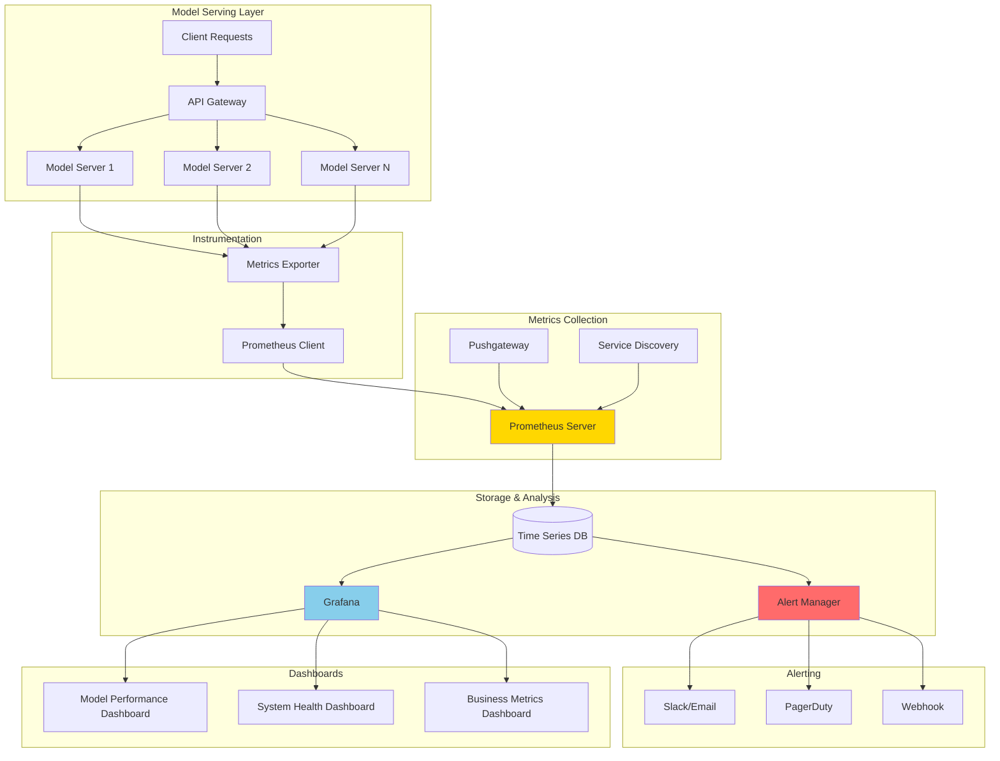
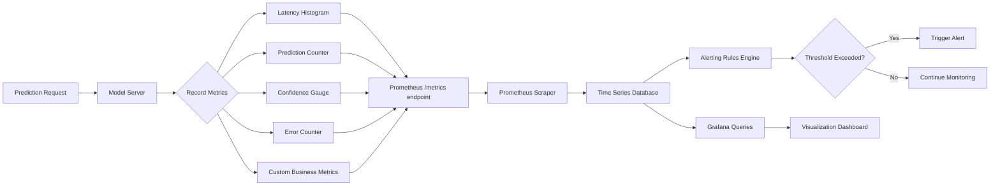
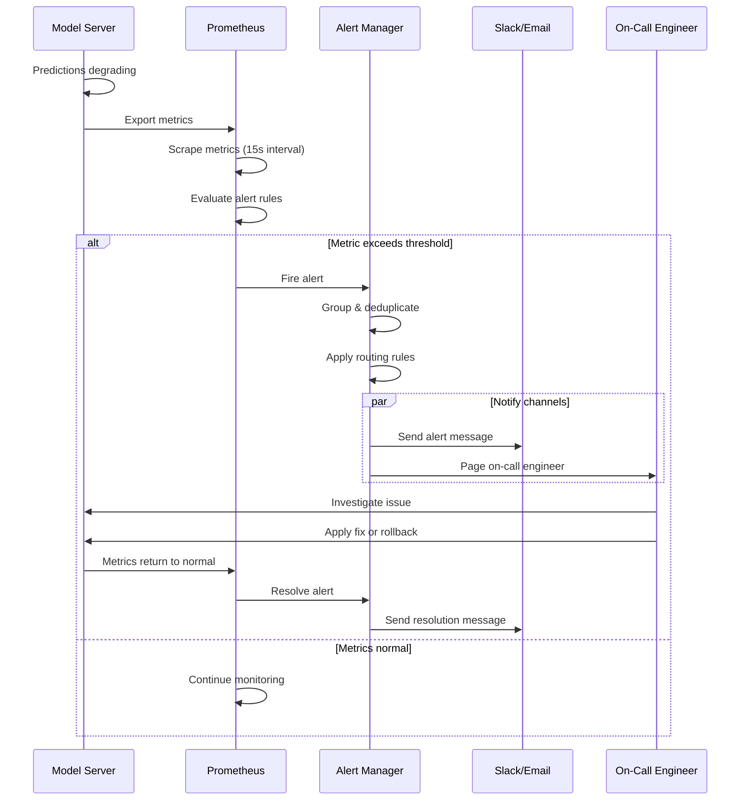

# Tutorial 07: ML Model Monitoring

## Learning Objectives

By completing this tutorial, you will:
- Understand key metrics for ML model monitoring
- Implement Prometheus for metrics collection
- Set up Grafana dashboards for visualization
- Create alerting rules for model degradation
- Monitor prediction latency, throughput, and quality
- Implement custom metrics for business KPIs

## Prerequisites

- Completion of Tutorial 04 (Model Registry and Deployment)
- Python 3.8+
- Docker and Docker Compose
- Basic understanding of time-series metrics
- Familiarity with Prometheus and Grafana

## Architecture Overview

### Monitoring System Architecture



### Metrics Collection Flow



### Alert Processing Workflow



## Implementation Guide

### Step 1: Set Up Infrastructure with Docker Compose

Create `docker-compose.yml`:

```yaml
version: '3.8'

services:
  model-server:
    build:
      context: .
      dockerfile: Dockerfile.model
    ports:
      - "8000:8000"
    environment:
      - MODEL_NAME=iris-classifier
      - PROMETHEUS_MULTIPROC_DIR=/tmp/prometheus
    volumes:
      - ./models:/models

  prometheus:
    image: prom/prometheus:latest
    ports:
      - "9090:9090"
    volumes:
      - ./prometheus.yml:/etc/prometheus/prometheus.yml
      - ./alert_rules.yml:/etc/prometheus/alert_rules.yml
      - prometheus_data:/prometheus
    command:
      - '--config.file=/etc/prometheus/prometheus.yml'
      - '--storage.tsdb.path=/prometheus'
      - '--web.console.libraries=/usr/share/prometheus/console_libraries'
      - '--web.console.templates=/usr/share/prometheus/consoles'

  alertmanager:
    image: prom/alertmanager:latest
    ports:
      - "9093:9093"
    volumes:
      - ./alertmanager.yml:/etc/alertmanager/alertmanager.yml
      - alertmanager_data:/alertmanager
    command:
      - '--config.file=/etc/alertmanager/alertmanager.yml'
      - '--storage.path=/alertmanager'

  grafana:
    image: grafana/grafana:latest
    ports:
      - "3000:3000"
    environment:
      - GF_SECURITY_ADMIN_PASSWORD=admin
      - GF_USERS_ALLOW_SIGN_UP=false
    volumes:
      - grafana_data:/var/lib/grafana
      - ./grafana/provisioning:/etc/grafana/provisioning
      - ./grafana/dashboards:/var/lib/grafana/dashboards
    depends_on:
      - prometheus

  pushgateway:
    image: prom/pushgateway:latest
    ports:
      - "9091:9091"

volumes:
  prometheus_data:
  alertmanager_data:
  grafana_data:
```

### Step 2: Configure Prometheus

Create `prometheus.yml`:

```yaml
global:
  scrape_interval: 15s
  evaluation_interval: 15s
  external_labels:
    cluster: 'ml-production'
    environment: 'prod'

# Alerting configuration
alerting:
  alertmanagers:
    - static_configs:
        - targets:
            - alertmanager:9093

# Load alert rules
rule_files:
  - 'alert_rules.yml'

# Scrape configurations
scrape_configs:
  # Model server metrics
  - job_name: 'model-server'
    static_configs:
      - targets: ['model-server:8000']
        labels:
          service: 'ml-model'
          model: 'iris-classifier'

  # Pushgateway for batch jobs
  - job_name: 'pushgateway'
    honor_labels: true
    static_configs:
      - targets: ['pushgateway:9091']

  # Prometheus self-monitoring
  - job_name: 'prometheus'
    static_configs:
      - targets: ['localhost:9090']
```

Create `alert_rules.yml`:

```yaml
groups:
  - name: model_performance
    interval: 30s
    rules:
      # High error rate
      - alert: HighPredictionErrorRate
        expr: |
          (
            sum(rate(prediction_errors_total[5m])) /
            sum(rate(predictions_total[5m]))
          ) > 0.05
        for: 2m
        labels:
          severity: critical
          team: ml-platform
        annotations:
          summary: "High prediction error rate detected"
          description: "Error rate is {{ $value | humanizePercentage }} (threshold: 5%)"

      # Low prediction confidence
      - alert: LowModelConfidence
        expr: |
          avg(prediction_confidence) < 0.7
        for: 5m
        labels:
          severity: warning
          team: ml-platform
        annotations:
          summary: "Low average model confidence"
          description: "Average confidence is {{ $value | humanize }} (threshold: 0.7)"

      # High latency
      - alert: HighPredictionLatency
        expr: |
          histogram_quantile(0.95,
            sum(rate(prediction_latency_seconds_bucket[5m])) by (le)
          ) > 0.5
        for: 3m
        labels:
          severity: warning
          team: ml-platform
        annotations:
          summary: "High prediction latency (P95)"
          description: "P95 latency is {{ $value | humanizeDuration }} (threshold: 500ms)"

      # Prediction distribution drift
      - alert: PredictionDistributionDrift
        expr: |
          abs(
            (
              sum(rate(predictions_total{class="0"}[1h])) /
              sum(rate(predictions_total[1h]))
            ) - 0.33
          ) > 0.15
        for: 10m
        labels:
          severity: warning
          team: ml-platform
        annotations:
          summary: "Prediction distribution has drifted"
          description: "Class distribution has changed significantly"

      # Low throughput
      - alert: LowPredictionThroughput
        expr: |
          sum(rate(predictions_total[5m])) < 1
        for: 5m
        labels:
          severity: info
          team: ml-platform
        annotations:
          summary: "Low prediction throughput"
          description: "Request rate is {{ $value | humanize }} req/s"

  - name: system_health
    interval: 30s
    rules:
      # High memory usage
      - alert: HighMemoryUsage
        expr: |
          (
            process_resident_memory_bytes /
            process_virtual_memory_max_bytes
          ) > 0.9
        for: 5m
        labels:
          severity: warning
          team: platform
        annotations:
          summary: "High memory usage"
          description: "Memory usage is {{ $value | humanizePercentage }}"

      # Model server down
      - alert: ModelServerDown
        expr: up{job="model-server"} == 0
        for: 1m
        labels:
          severity: critical
          team: platform
        annotations:
          summary: "Model server is down"
          description: "Model server has been down for more than 1 minute"
```

### Step 3: Implement Instrumented Model Server

Create `monitored_model_server.py`:

```python
from fastapi import FastAPI, HTTPException
from prometheus_client import Counter, Histogram, Gauge, generate_latest, REGISTRY
from prometheus_client import multiprocess, CollectorRegistry
import time
import numpy as np
from pydantic import BaseModel
from typing import List
import logging

# Initialize FastAPI
app = FastAPI(title="Monitored ML Model Server")

# Configure logging
logging.basicConfig(level=logging.INFO)
logger = logging.getLogger(__name__)

# Prometheus metrics
predictions_total = Counter(
    'predictions_total',
    'Total number of predictions',
    ['model_name', 'model_version', 'class']
)

prediction_latency = Histogram(
    'prediction_latency_seconds',
    'Prediction latency in seconds',
    ['model_name', 'model_version'],
    buckets=[.001, .005, .01, .025, .05, .075, .1, .25, .5, .75, 1.0, 2.5, 5.0]
)

prediction_confidence = Gauge(
    'prediction_confidence',
    'Model prediction confidence',
    ['model_name', 'model_version']
)

prediction_errors = Counter(
    'prediction_errors_total',
    'Total number of prediction errors',
    ['model_name', 'model_version', 'error_type']
)

model_info = Gauge(
    'model_info',
    'Model metadata',
    ['model_name', 'model_version', 'framework']
)

# Custom business metrics
high_value_predictions = Counter(
    'high_value_predictions_total',
    'Predictions for high-value items',
    ['model_name']
)

# Set model info
model_info.labels(
    model_name='iris-classifier',
    model_version='v1.0.0',
    framework='sklearn'
).set(1)

class PredictionRequest(BaseModel):
    features: List[float]

class PredictionResponse(BaseModel):
    prediction: int
    confidence: float
    model_version: str
    latency_ms: float

@app.post("/predict", response_model=PredictionResponse)
async def predict(request: PredictionRequest):
    """Make a prediction with full monitoring."""
    model_name = "iris-classifier"
    model_version = "v1.0.0"

    start_time = time.time()

    try:
        # Validate input
        if len(request.features) != 4:
            prediction_errors.labels(
                model_name=model_name,
                model_version=model_version,
                error_type='invalid_input'
            ).inc()
            raise HTTPException(status_code=400, detail="Expected 4 features")

        # Simulate model prediction
        # In practice, load your actual model
        prediction = np.random.randint(0, 3)
        confidence = np.random.uniform(0.7, 0.99)

        # Record metrics
        latency = time.time() - start_time

        prediction_latency.labels(
            model_name=model_name,
            model_version=model_version
        ).observe(latency)

        predictions_total.labels(
            model_name=model_name,
            model_version=model_version,
            class=str(prediction)
        ).inc()

        prediction_confidence.labels(
            model_name=model_name,
            model_version=model_version
        ).set(confidence)

        # Business metric example
        if request.features[0] > 6.0:  # Example business logic
            high_value_predictions.labels(model_name=model_name).inc()

        logger.info(f"Prediction: {prediction}, Confidence: {confidence:.3f}, Latency: {latency*1000:.2f}ms")

        return PredictionResponse(
            prediction=prediction,
            confidence=confidence,
            model_version=model_version,
            latency_ms=latency * 1000
        )

    except HTTPException:
        raise
    except Exception as e:
        prediction_errors.labels(
            model_name=model_name,
            model_version=model_version,
            error_type='internal_error'
        ).inc()
        logger.error(f"Prediction error: {e}")
        raise HTTPException(status_code=500, detail=str(e))

@app.get("/metrics")
async def metrics():
    """Prometheus metrics endpoint."""
    return generate_latest(REGISTRY)

@app.get("/health")
async def health():
    """Health check endpoint."""
    return {"status": "healthy", "model": "iris-classifier", "version": "v1.0.0"}

if __name__ == "__main__":
    import uvicorn
    uvicorn.run(app, host="0.0.0.0", port=8000)
```

### Step 4: Configure Alert Manager

Create `alertmanager.yml`:

```yaml
global:
  resolve_timeout: 5m
  slack_api_url: 'YOUR_SLACK_WEBHOOK_URL'

route:
  group_by: ['alertname', 'cluster', 'service']
  group_wait: 10s
  group_interval: 10s
  repeat_interval: 12h
  receiver: 'default'
  routes:
    # Critical alerts to PagerDuty
    - match:
        severity: critical
      receiver: 'pagerduty'
      continue: true

    # All alerts to Slack
    - match_re:
        severity: (warning|critical)
      receiver: 'slack'

receivers:
  - name: 'default'
    email_configs:
      - to: 'ml-team@company.com'
        from: 'alerts@company.com'
        smarthost: 'smtp.company.com:587'
        auth_username: 'alerts@company.com'
        auth_password: 'password'

  - name: 'slack'
    slack_configs:
      - channel: '#ml-alerts'
        title: '{{ .GroupLabels.alertname }}'
        text: '{{ range .Alerts }}{{ .Annotations.description }}{{ end }}'
        send_resolved: true

  - name: 'pagerduty'
    pagerduty_configs:
      - service_key: 'YOUR_PAGERDUTY_KEY'
        description: '{{ .GroupLabels.alertname }}'

inhibit_rules:
  - source_match:
      severity: 'critical'
    target_match:
      severity: 'warning'
    equal: ['alertname', 'cluster', 'service']
```

### Step 5: Create Grafana Dashboards

Create `grafana/provisioning/datasources/prometheus.yml`:

```yaml
apiVersion: 1

datasources:
  - name: Prometheus
    type: prometheus
    access: proxy
    url: http://prometheus:9090
    isDefault: true
    editable: false
```

Create `grafana/provisioning/dashboards/dashboard.yml`:

```yaml
apiVersion: 1

providers:
  - name: 'ML Model Monitoring'
    orgId: 1
    folder: ''
    type: file
    disableDeletion: false
    updateIntervalSeconds: 10
    allowUiUpdates: true
    options:
      path: /var/lib/grafana/dashboards
```

Create `grafana/dashboards/model_monitoring.json`:

```json
{
  "dashboard": {
    "title": "ML Model Monitoring",
    "tags": ["machine-learning", "monitoring"],
    "timezone": "browser",
    "panels": [
      {
        "id": 1,
        "title": "Prediction Rate",
        "type": "graph",
        "gridPos": {"h": 8, "w": 12, "x": 0, "y": 0},
        "targets": [
          {
            "expr": "sum(rate(predictions_total[5m]))",
            "legendFormat": "Predictions/sec"
          }
        ]
      },
      {
        "id": 2,
        "title": "Prediction Latency (P95)",
        "type": "graph",
        "gridPos": {"h": 8, "w": 12, "x": 12, "y": 0},
        "targets": [
          {
            "expr": "histogram_quantile(0.95, sum(rate(prediction_latency_seconds_bucket[5m])) by (le))",
            "legendFormat": "P95 Latency"
          },
          {
            "expr": "histogram_quantile(0.50, sum(rate(prediction_latency_seconds_bucket[5m])) by (le))",
            "legendFormat": "P50 Latency"
          }
        ]
      },
      {
        "id": 3,
        "title": "Error Rate",
        "type": "graph",
        "gridPos": {"h": 8, "w": 12, "x": 0, "y": 8},
        "targets": [
          {
            "expr": "sum(rate(prediction_errors_total[5m])) / sum(rate(predictions_total[5m]))",
            "legendFormat": "Error Rate"
          }
        ],
        "alert": {
          "conditions": [
            {
              "evaluator": {
                "params": [0.05],
                "type": "gt"
              },
              "operator": {
                "type": "and"
              },
              "query": {
                "params": ["A", "5m", "now"]
              },
              "reducer": {
                "params": [],
                "type": "avg"
              },
              "type": "query"
            }
          ]
        }
      },
      {
        "id": 4,
        "title": "Average Confidence",
        "type": "gauge",
        "gridPos": {"h": 8, "w": 12, "x": 12, "y": 8},
        "targets": [
          {
            "expr": "avg(prediction_confidence)",
            "legendFormat": "Confidence"
          }
        ],
        "options": {
          "showThresholdLabels": true,
          "showThresholdMarkers": true
        },
        "fieldConfig": {
          "defaults": {
            "min": 0,
            "max": 1,
            "thresholds": {
              "mode": "absolute",
              "steps": [
                {"value": 0, "color": "red"},
                {"value": 0.7, "color": "yellow"},
                {"value": 0.85, "color": "green"}
              ]
            }
          }
        }
      },
      {
        "id": 5,
        "title": "Prediction Distribution",
        "type": "piechart",
        "gridPos": {"h": 8, "w": 12, "x": 0, "y": 16},
        "targets": [
          {
            "expr": "sum by (class) (rate(predictions_total[5m]))",
            "legendFormat": "Class {{class}}"
          }
        ]
      },
      {
        "id": 6,
        "title": "Model Uptime",
        "type": "stat",
        "gridPos": {"h": 8, "w": 12, "x": 12, "y": 16},
        "targets": [
          {
            "expr": "up{job='model-server'}",
            "legendFormat": "Server Status"
          }
        ]
      }
    ],
    "refresh": "10s",
    "time": {
      "from": "now-1h",
      "to": "now"
    }
  }
}
```

### Step 6: Custom Metrics Collector

Create `custom_metrics.py`:

```python
from prometheus_client import Gauge, Counter, Summary
from typing import Dict, Any
import numpy as np

class ModelMetricsCollector:
    """Collect custom ML-specific metrics."""

    def __init__(self, model_name: str):
        self.model_name = model_name

        # Feature distribution metrics
        self.feature_min = Gauge(
            'feature_min',
            'Minimum feature value',
            ['model_name', 'feature_name']
        )

        self.feature_max = Gauge(
            'feature_max',
            'Maximum feature value',
            ['model_name', 'feature_name']
        )

        self.feature_mean = Gauge(
            'feature_mean',
            'Mean feature value',
            ['model_name', 'feature_name']
        )

        # Prediction metrics by confidence bucket
        self.predictions_by_confidence = Counter(
            'predictions_by_confidence_bucket',
            'Predictions grouped by confidence level',
            ['model_name', 'confidence_bucket']
        )

        # Business metrics
        self.revenue_impact = Counter(
            'predicted_revenue_impact',
            'Estimated revenue impact of predictions',
            ['model_name', 'prediction_class']
        )

    def record_features(self, features: np.ndarray, feature_names: list):
        """Record feature statistics."""
        for i, name in enumerate(feature_names):
            values = features[:, i]

            self.feature_min.labels(
                model_name=self.model_name,
                feature_name=name
            ).set(float(np.min(values)))

            self.feature_max.labels(
                model_name=self.model_name,
                feature_name=name
            ).set(float(np.max(values)))

            self.feature_mean.labels(
                model_name=self.model_name,
                feature_name=name
            ).set(float(np.mean(values)))

    def record_prediction(self, confidence: float, prediction: int, value: float = 0):
        """Record prediction with business context."""
        # Bucket confidence
        if confidence < 0.5:
            bucket = 'low'
        elif confidence < 0.8:
            bucket = 'medium'
        else:
            bucket = 'high'

        self.predictions_by_confidence.labels(
            model_name=self.model_name,
            confidence_bucket=bucket
        ).inc()

        # Business metric
        if value > 0:
            self.revenue_impact.labels(
                model_name=self.model_name,
                prediction_class=str(prediction)
            ).inc(value)

# Example usage
collector = ModelMetricsCollector("iris-classifier")

# Record batch of features
features = np.random.rand(100, 4)
collector.record_features(features, ["sepal_length", "sepal_width", "petal_length", "petal_width"])

# Record prediction
collector.record_prediction(confidence=0.92, prediction=1, value=150.0)
```

### Step 7: Monitoring Dashboard Helper

Create `monitoring_dashboard.py`:

```python
import requests
from datetime import datetime, timedelta
from typing import Dict, List
import pandas as pd

class PrometheusClient:
    """Client for querying Prometheus."""

    def __init__(self, prometheus_url: str = "http://localhost:9090"):
        self.base_url = prometheus_url
        self.api_url = f"{prometheus_url}/api/v1"

    def query(self, query: str) -> Dict:
        """Execute instant query."""
        response = requests.get(
            f"{self.api_url}/query",
            params={"query": query}
        )
        response.raise_for_status()
        return response.json()

    def query_range(self, query: str, start: datetime, end: datetime, step: str = "15s") -> Dict:
        """Execute range query."""
        response = requests.get(
            f"{self.api_url}/query_range",
            params={
                "query": query,
                "start": start.timestamp(),
                "end": end.timestamp(),
                "step": step
            }
        )
        response.raise_for_status()
        return response.json()

    def get_alerts(self) -> List[Dict]:
        """Get active alerts."""
        response = requests.get(f"{self.api_url}/alerts")
        response.raise_for_status()
        return response.json()["data"]["alerts"]

class ModelMonitoringDashboard:
    """Generate monitoring reports."""

    def __init__(self, prometheus_url: str = "http://localhost:9090"):
        self.client = PrometheusClient(prometheus_url)

    def get_prediction_stats(self, hours: int = 1) -> pd.DataFrame:
        """Get prediction statistics."""
        end = datetime.now()
        start = end - timedelta(hours=hours)

        # Query prediction rate
        result = self.client.query_range(
            query="sum(rate(predictions_total[5m]))",
            start=start,
            end=end,
            step="1m"
        )

        # Convert to DataFrame
        data = result["data"]["result"][0]["values"]
        df = pd.DataFrame(data, columns=["timestamp", "predictions_per_sec"])
        df["timestamp"] = pd.to_datetime(df["timestamp"], unit="s")
        df["predictions_per_sec"] = df["predictions_per_sec"].astype(float)

        return df

    def get_latency_percentiles(self) -> Dict[str, float]:
        """Get current latency percentiles."""
        percentiles = [50, 95, 99]
        results = {}

        for p in percentiles:
            query = f"""
                histogram_quantile({p/100},
                    sum(rate(prediction_latency_seconds_bucket[5m])) by (le)
                )
            """
            result = self.client.query(query)
            value = float(result["data"]["result"][0]["value"][1])
            results[f"p{p}"] = value * 1000  # Convert to ms

        return results

    def get_error_rate(self) -> float:
        """Get current error rate."""
        query = """
            sum(rate(prediction_errors_total[5m])) /
            sum(rate(predictions_total[5m]))
        """
        result = self.client.query(query)

        if result["data"]["result"]:
            return float(result["data"]["result"][0]["value"][1])
        return 0.0

    def get_confidence_distribution(self) -> Dict[str, int]:
        """Get distribution of predictions by confidence bucket."""
        query = """
            sum by (confidence_bucket) (
                rate(predictions_by_confidence_bucket[5m])
            )
        """
        result = self.client.query(query)

        distribution = {}
        for item in result["data"]["result"]:
            bucket = item["metric"]["confidence_bucket"]
            value = float(item["value"][1])
            distribution[bucket] = value

        return distribution

    def generate_health_report(self) -> Dict:
        """Generate comprehensive health report."""
        return {
            "timestamp": datetime.now().isoformat(),
            "latency_percentiles": self.get_latency_percentiles(),
            "error_rate": self.get_error_rate(),
            "confidence_distribution": self.get_confidence_distribution(),
            "alerts": len([a for a in self.client.get_alerts() if a["state"] == "firing"])
        }

# Example usage
if __name__ == "__main__":
    dashboard = ModelMonitoringDashboard()

    # Generate health report
    report = dashboard.generate_health_report()
    print("=== Model Health Report ===")
    print(f"Timestamp: {report['timestamp']}")
    print(f"\nLatency:")
    for percentile, value in report['latency_percentiles'].items():
        print(f"  {percentile}: {value:.2f}ms")
    print(f"\nError Rate: {report['error_rate']*100:.2f}%")
    print(f"\nActive Alerts: {report['alerts']}")

    # Get prediction stats
    stats = dashboard.get_prediction_stats(hours=1)
    print(f"\nPrediction Stats (last hour):")
    print(f"  Mean: {stats['predictions_per_sec'].mean():.2f} req/s")
    print(f"  Max: {stats['predictions_per_sec'].max():.2f} req/s")
```

## Verification Steps

### 1. Start All Services

```bash
docker-compose up -d
```

### 2. Generate Test Traffic

```python
import requests
import time
import random

# Generate predictions
for i in range(100):
    response = requests.post(
        "http://localhost:8000/predict",
        json={
            "features": [
                random.uniform(4.0, 8.0),
                random.uniform(2.0, 4.5),
                random.uniform(1.0, 7.0),
                random.uniform(0.1, 2.5)
            ]
        }
    )
    print(f"Prediction {i}: {response.json()}")
    time.sleep(0.1)
```

### 3. Check Prometheus Metrics

```bash
# Check if metrics are being collected
curl http://localhost:9090/api/v1/query?query=predictions_total

# Check current prediction rate
curl 'http://localhost:9090/api/v1/query?query=sum(rate(predictions_total[5m]))'
```

### 4. View Grafana Dashboard

1. Open http://localhost:3000 (admin/admin)
2. Navigate to "ML Model Monitoring" dashboard
3. Verify all panels are displaying data

### 5. Test Alerts

```python
# Generate high error rate to trigger alert
import requests

for i in range(100):
    try:
        # Send invalid request
        requests.post(
            "http://localhost:8000/predict",
            json={"features": [1, 2]}  # Wrong number of features
        )
    except:
        pass
```

Check Alert Manager: http://localhost:9093

## Best Practices

### 1. Define SLIs and SLOs

```python
# Service Level Indicators
SLI = {
    "availability": "up{job='model-server'}",
    "latency_p95": "histogram_quantile(0.95, sum(rate(prediction_latency_seconds_bucket[5m])) by (le))",
    "error_rate": "sum(rate(prediction_errors_total[5m])) / sum(rate(predictions_total[5m]))",
    "throughput": "sum(rate(predictions_total[5m]))"
}

# Service Level Objectives
SLO = {
    "availability": 0.999,      # 99.9% uptime
    "latency_p95_ms": 500,      # P95 < 500ms
    "error_rate": 0.01,         # < 1% errors
    "throughput_min": 10        # >= 10 req/s
}
```

### 2. Implement Graceful Degradation Monitoring

```python
from prometheus_client import Enum

model_status = Enum(
    'model_status',
    'Current model serving status',
    ['model_name'],
    states=['healthy', 'degraded', 'critical']
)

def check_model_health():
    """Check model health and set status."""
    error_rate = get_error_rate()
    latency_p95 = get_latency_p95()

    if error_rate > 0.10 or latency_p95 > 2000:
        model_status.labels(model_name='iris-classifier').state('critical')
    elif error_rate > 0.05 or latency_p95 > 1000:
        model_status.labels(model_name='iris-classifier').state('degraded')
    else:
        model_status.labels(model_name='iris-classifier').state('healthy')
```

### 3. Monitor Data Quality

```python
from prometheus_client import Counter

invalid_features = Counter(
    'invalid_features_total',
    'Features failing validation',
    ['model_name', 'validation_type']
)

def validate_features(features):
    """Validate input features."""
    if any(np.isnan(features)):
        invalid_features.labels(
            model_name='iris-classifier',
            validation_type='nan_values'
        ).inc()
        return False

    if any(features < 0):
        invalid_features.labels(
            model_name='iris-classifier',
            validation_type='negative_values'
        ).inc()
        return False

    return True
```

## Key Takeaways

1. **Comprehensive Metrics**: Monitor not just system metrics (latency, errors) but also ML-specific metrics (confidence, prediction distribution).

2. **Real-time Alerting**: Set up alerts for critical degradation patterns to enable rapid response.

3. **Historical Tracking**: Store metrics long-term to identify trends and patterns.

4. **Business Metrics**: Track business KPIs alongside technical metrics to understand real impact.

5. **Automated Dashboards**: Use Grafana for visualization and real-time monitoring.

6. **SLIs/SLOs**: Define clear service level objectives and track compliance.

7. **Multi-level Alerting**: Route alerts appropriately based on severity (info/warning/critical).

8. **Prediction Distribution**: Monitor class distribution to detect data drift.

9. **Feature Monitoring**: Track input feature distributions for quality issues.

10. **Integration**: Connect monitoring to incident response and retraining pipelines.

## Additional Resources

- [Prometheus Documentation](https://prometheus.io/docs/)
- [Grafana Dashboards](https://grafana.com/docs/)
- [ML Monitoring Best Practices](https://christophergs.com/machine%20learning/2020/03/14/how-to-monitor-machine-learning-models/)
- [Google SRE Book](https://sre.google/books/)

## Next Steps

- **Tutorial 08**: Data Drift Detection
- **Tutorial 09**: Automated Model Retraining
- **Tutorial 19**: ML Model Testing Framework
