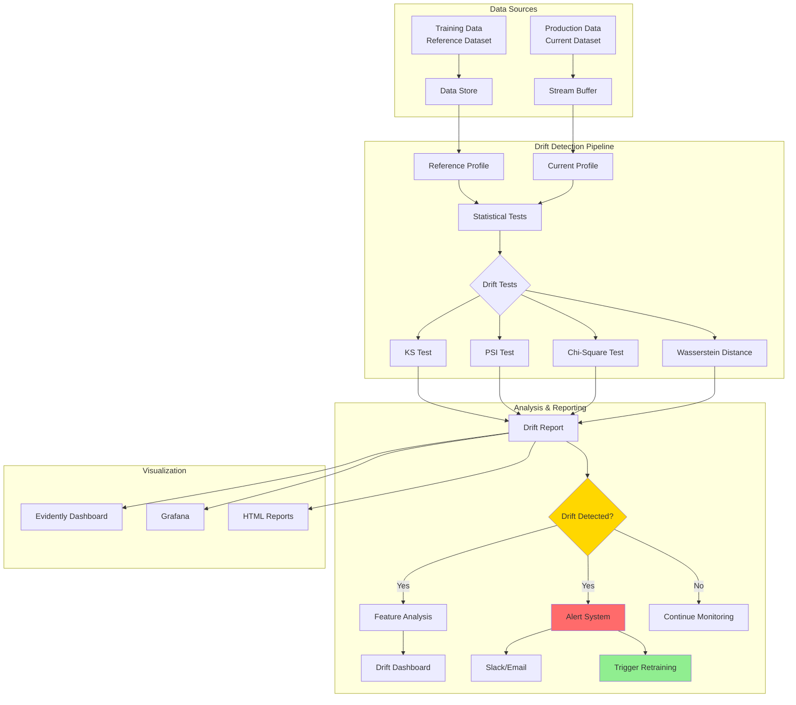
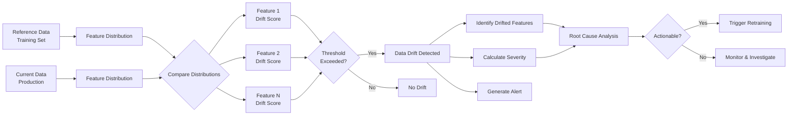
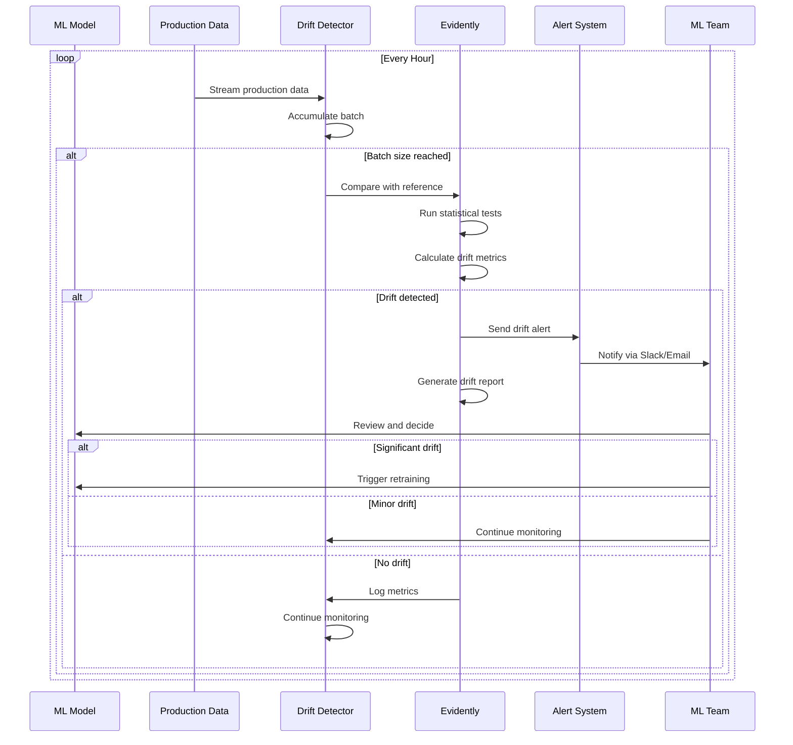

# Tutorial 08: Data Drift Detection

## Learning Objectives

By completing this tutorial, you will:
- Understand data drift, concept drift, and prediction drift
- Implement Evidently AI for drift detection
- Use statistical tests (KS, PSI, Chi-Square) for drift analysis
- Set up automated drift monitoring pipelines
- Create drift detection alerts and dashboards
- Integrate drift detection with model retraining workflows

## Prerequisites

- Completion of Tutorial 07 (Model Monitoring)
- Python 3.8+
- Understanding of statistical hypothesis testing
- Familiarity with pandas and data analysis
- Basic knowledge of ML model lifecycle

## Architecture Overview

### Drift Detection System Architecture



### Drift Comparison Workflow



### Monitoring Loop



## Implementation Guide

### Step 1: Install Required Packages

```bash
pip install evidently pandas scikit-learn scipy numpy matplotlib
```

### Step 2: Generate Reference and Production Data

Create `generate_drift_data.py`:

```python
import pandas as pd
import numpy as np
from datetime import datetime, timedelta
from sklearn.datasets import make_classification

def generate_reference_data(n_samples=10000):
    """Generate reference (training) dataset."""
    np.random.seed(42)

    # Generate base features
    X, y = make_classification(
        n_samples=n_samples,
        n_features=10,
        n_informative=8,
        n_redundant=2,
        random_state=42
    )

    # Create DataFrame
    feature_names = [f"feature_{i}" for i in range(10)]
    df = pd.DataFrame(X, columns=feature_names)
    df['target'] = y
    df['prediction'] = y  # Assume perfect predictions for reference

    # Add metadata
    df['timestamp'] = pd.date_range(
        start=datetime.now() - timedelta(days=90),
        periods=n_samples,
        freq='5min'
    )

    return df

def generate_production_data_no_drift(n_samples=1000):
    """Generate production data without drift."""
    np.random.seed(100)

    X, y = make_classification(
        n_samples=n_samples,
        n_features=10,
        n_informative=8,
        n_redundant=2,
        random_state=100
    )

    feature_names = [f"feature_{i}" for i in range(10)]
    df = pd.DataFrame(X, columns=feature_names)
    df['target'] = y

    # Simulate model predictions with some errors
    df['prediction'] = np.where(
        np.random.rand(n_samples) > 0.1,
        y,
        1 - y
    )

    df['timestamp'] = pd.date_range(
        start=datetime.now() - timedelta(days=7),
        periods=n_samples,
        freq='10min'
    )

    return df

def generate_production_data_with_drift(n_samples=1000, drift_severity='moderate'):
    """Generate production data with drift."""
    np.random.seed(200)

    X, y = make_classification(
        n_samples=n_samples,
        n_features=10,
        n_informative=8,
        n_redundant=2,
        random_state=200
    )

    # Apply drift to features
    if drift_severity == 'slight':
        shift = 0.3
        scale = 1.1
    elif drift_severity == 'moderate':
        shift = 0.8
        scale = 1.3
    else:  # severe
        shift = 1.5
        scale = 2.0

    # Drift some features
    X[:, 0] = X[:, 0] + shift  # Mean shift
    X[:, 1] = X[:, 1] * scale  # Variance change
    X[:, 2] = np.clip(X[:, 2], -1, 1)  # Range change

    feature_names = [f"feature_{i}" for i in range(10)]
    df = pd.DataFrame(X, columns=feature_names)
    df['target'] = y

    # Model predictions degrade with drift
    error_rate = 0.3 if drift_severity == 'severe' else 0.2
    df['prediction'] = np.where(
        np.random.rand(n_samples) > error_rate,
        y,
        1 - y
    )

    df['timestamp'] = pd.date_range(
        start=datetime.now() - timedelta(hours=24),
        periods=n_samples,
        freq='1min'
    )

    return df

if __name__ == "__main__":
    # Generate datasets
    reference_df = generate_reference_data()
    production_no_drift_df = generate_production_data_no_drift()
    production_drift_df = generate_production_data_with_drift(drift_severity='moderate')

    # Save to files
    reference_df.to_csv('data/reference_data.csv', index=False)
    production_no_drift_df.to_csv('data/production_no_drift.csv', index=False)
    production_drift_df.to_csv('data/production_with_drift.csv', index=False)

    print("✓ Reference data saved:", reference_df.shape)
    print("✓ Production data (no drift) saved:", production_no_drift_df.shape)
    print("✓ Production data (with drift) saved:", production_drift_df.shape)
```

### Step 3: Implement Drift Detection with Evidently

Create `drift_detector.py`:

```python
from evidently import ColumnMapping
from evidently.report import Report
from evidently.metric_preset import DataDriftPreset, TargetDriftPreset
from evidently.metrics import *
import pandas as pd
import json
from typing import Dict, Optional
from datetime import datetime

class DriftDetector:
    """Detect data and prediction drift using Evidently."""

    def __init__(self, reference_data: pd.DataFrame):
        self.reference_data = reference_data

        # Define column mapping
        self.column_mapping = ColumnMapping()
        self.column_mapping.target = 'target'
        self.column_mapping.prediction = 'prediction'
        self.column_mapping.datetime = 'timestamp'

        # Identify numerical and categorical features
        self.column_mapping.numerical_features = [
            col for col in reference_data.columns
            if col.startswith('feature_')
        ]

    def detect_data_drift(
        self,
        current_data: pd.DataFrame,
        drift_threshold: float = 0.5
    ) -> Report:
        """
        Detect data drift between reference and current data.

        Args:
            current_data: Current production data
            drift_threshold: Threshold for drift detection (0-1)

        Returns:
            Evidently Report object
        """
        # Create drift report
        report = Report(metrics=[
            DataDriftPreset(stattest_threshold=drift_threshold),
            TargetDriftPreset(),
            DatasetDriftMetric(),
            DatasetMissingValuesMetric(),
        ])

        # Run the report
        report.run(
            reference_data=self.reference_data,
            current_data=current_data,
            column_mapping=self.column_mapping
        )

        return report

    def get_drift_summary(self, report: Report) -> Dict:
        """Extract drift summary from report."""
        report_dict = report.as_dict()

        # Extract overall drift status
        dataset_drift = None
        drifted_features = []
        drift_scores = {}

        for metric in report_dict['metrics']:
            if metric['metric'] == 'DatasetDriftMetric':
                dataset_drift = metric['result']['dataset_drift']
                drift_scores = metric['result']['drift_by_columns']

                for feature, info in drift_scores.items():
                    if info.get('drift_detected', False):
                        drifted_features.append(feature)

        return {
            'timestamp': datetime.now().isoformat(),
            'dataset_drift_detected': dataset_drift,
            'number_of_drifted_features': len(drifted_features),
            'drifted_features': drifted_features,
            'drift_scores': drift_scores
        }

    def save_report(self, report: Report, filepath: str):
        """Save report as HTML."""
        report.save_html(filepath)
        print(f"✓ Report saved to {filepath}")

# Example usage
if __name__ == "__main__":
    import os
    os.makedirs('data', exist_ok=True)
    os.makedirs('reports', exist_ok=True)

    # Generate data
    from generate_drift_data import (
        generate_reference_data,
        generate_production_data_no_drift,
        generate_production_data_with_drift
    )

    reference_df = generate_reference_data()
    current_no_drift = generate_production_data_no_drift()
    current_with_drift = generate_production_data_with_drift()

    # Initialize detector
    detector = DriftDetector(reference_df)

    # Test with no drift
    print("\n=== Testing with No Drift ===")
    report_no_drift = detector.detect_data_drift(current_no_drift)
    summary_no_drift = detector.get_drift_summary(report_no_drift)
    print(f"Dataset drift: {summary_no_drift['dataset_drift_detected']}")
    print(f"Drifted features: {summary_no_drift['drifted_features']}")
    detector.save_report(report_no_drift, 'reports/drift_report_no_drift.html')

    # Test with drift
    print("\n=== Testing with Drift ===")
    report_with_drift = detector.detect_data_drift(current_with_drift)
    summary_with_drift = detector.get_drift_summary(report_with_drift)
    print(f"Dataset drift: {summary_with_drift['dataset_drift_detected']}")
    print(f"Drifted features: {summary_with_drift['drifted_features']}")
    detector.save_report(report_with_drift, 'reports/drift_report_with_drift.html')
```

### Step 4: Statistical Tests Implementation

Create `statistical_tests.py`:

```python
import numpy as np
from scipy import stats
from typing import Tuple, Dict
import pandas as pd

class StatisticalDriftTests:
    """Implement various statistical tests for drift detection."""

    @staticmethod
    def kolmogorov_smirnov_test(
        reference: np.ndarray,
        current: np.ndarray,
        alpha: float = 0.05
    ) -> Tuple[bool, float, float]:
        """
        Kolmogorov-Smirnov test for continuous features.

        Returns:
            (drift_detected, statistic, p_value)
        """
        statistic, p_value = stats.ks_2samp(reference, current)
        drift_detected = p_value < alpha

        return drift_detected, statistic, p_value

    @staticmethod
    def chi_square_test(
        reference: np.ndarray,
        current: np.ndarray,
        alpha: float = 0.05
    ) -> Tuple[bool, float, float]:
        """
        Chi-square test for categorical features.

        Returns:
            (drift_detected, statistic, p_value)
        """
        # Get value counts
        ref_counts = pd.Series(reference).value_counts().sort_index()
        cur_counts = pd.Series(current).value_counts().sort_index()

        # Align indices
        all_values = sorted(set(reference) | set(current))
        ref_freq = [ref_counts.get(v, 0) for v in all_values]
        cur_freq = [cur_counts.get(v, 0) for v in all_values]

        # Chi-square test
        statistic, p_value = stats.chisquare(cur_freq, ref_freq)
        drift_detected = p_value < alpha

        return drift_detected, statistic, p_value

    @staticmethod
    def population_stability_index(
        reference: np.ndarray,
        current: np.ndarray,
        bins: int = 10
    ) -> float:
        """
        Calculate Population Stability Index (PSI).

        PSI < 0.1: No significant change
        0.1 <= PSI < 0.2: Moderate change
        PSI >= 0.2: Significant change

        Returns:
            PSI value
        """
        # Create bins based on reference data
        bins_edges = np.histogram_bin_edges(reference, bins=bins)

        # Calculate distributions
        ref_hist, _ = np.histogram(reference, bins=bins_edges)
        cur_hist, _ = np.histogram(current, bins=bins_edges)

        # Normalize to get percentages
        ref_pct = ref_hist / len(reference)
        cur_pct = cur_hist / len(current)

        # Avoid log(0)
        ref_pct = np.where(ref_pct == 0, 0.0001, ref_pct)
        cur_pct = np.where(cur_pct == 0, 0.0001, cur_pct)

        # Calculate PSI
        psi = np.sum((cur_pct - ref_pct) * np.log(cur_pct / ref_pct))

        return psi

    @staticmethod
    def wasserstein_distance(
        reference: np.ndarray,
        current: np.ndarray
    ) -> float:
        """
        Calculate Wasserstein distance (Earth Mover's Distance).

        Measures the minimum "cost" of transforming one distribution
        into another.

        Returns:
            Wasserstein distance
        """
        return stats.wasserstein_distance(reference, current)

    @staticmethod
    def jensen_shannon_divergence(
        reference: np.ndarray,
        current: np.ndarray,
        bins: int = 10
    ) -> float:
        """
        Calculate Jensen-Shannon divergence.

        Symmetric measure of similarity between two distributions.
        Range: [0, 1] where 0 = identical, 1 = completely different

        Returns:
            JS divergence
        """
        # Create histograms
        bins_edges = np.histogram_bin_edges(reference, bins=bins)
        ref_hist, _ = np.histogram(reference, bins=bins_edges)
        cur_hist, _ = np.histogram(current, bins=bins_edges)

        # Normalize
        ref_dist = ref_hist / ref_hist.sum()
        cur_dist = cur_hist / cur_hist.sum()

        # Avoid log(0)
        ref_dist = np.where(ref_dist == 0, 1e-10, ref_dist)
        cur_dist = np.where(cur_dist == 0, 1e-10, cur_dist)

        # Calculate JS divergence
        m = 0.5 * (ref_dist + cur_dist)
        divergence = 0.5 * (
            stats.entropy(ref_dist, m) +
            stats.entropy(cur_dist, m)
        )

        return divergence

    def analyze_feature(
        self,
        reference: np.ndarray,
        current: np.ndarray,
        feature_name: str,
        is_categorical: bool = False
    ) -> Dict:
        """Comprehensive drift analysis for a single feature."""
        results = {
            'feature_name': feature_name,
            'is_categorical': is_categorical
        }

        if is_categorical:
            # Categorical tests
            drift, stat, p_value = self.chi_square_test(reference, current)
            results['chi_square'] = {
                'drift_detected': drift,
                'statistic': stat,
                'p_value': p_value
            }
        else:
            # Continuous tests
            drift, stat, p_value = self.kolmogorov_smirnov_test(reference, current)
            results['ks_test'] = {
                'drift_detected': drift,
                'statistic': stat,
                'p_value': p_value
            }

            results['psi'] = self.population_stability_index(reference, current)
            results['wasserstein'] = self.wasserstein_distance(reference, current)
            results['js_divergence'] = self.jensen_shannon_divergence(reference, current)

            # Distribution statistics
            results['reference_stats'] = {
                'mean': float(np.mean(reference)),
                'std': float(np.std(reference)),
                'min': float(np.min(reference)),
                'max': float(np.max(reference))
            }

            results['current_stats'] = {
                'mean': float(np.mean(current)),
                'std': float(np.std(current)),
                'min': float(np.min(current)),
                'max': float(np.max(current))
            }

        return results

# Example usage
if __name__ == "__main__":
    # Generate sample data
    np.random.seed(42)
    reference = np.random.normal(0, 1, 1000)
    current_no_drift = np.random.normal(0, 1, 1000)
    current_with_drift = np.random.normal(0.5, 1.2, 1000)

    tester = StatisticalDriftTests()

    print("=== No Drift ===")
    results_no_drift = tester.analyze_feature(
        reference, current_no_drift, "feature_1"
    )
    print(f"KS Test p-value: {results_no_drift['ks_test']['p_value']:.4f}")
    print(f"PSI: {results_no_drift['psi']:.4f}")
    print(f"Wasserstein: {results_no_drift['wasserstein']:.4f}")

    print("\n=== With Drift ===")
    results_with_drift = tester.analyze_feature(
        reference, current_with_drift, "feature_1"
    )
    print(f"KS Test p-value: {results_with_drift['ks_test']['p_value']:.4f}")
    print(f"PSI: {results_with_drift['psi']:.4f}")
    print(f"Wasserstein: {results_with_drift['wasserstein']:.4f}")
    print(f"Drift detected: {results_with_drift['ks_test']['drift_detected']}")
```

### Step 5: Automated Drift Monitoring

Create `drift_monitoring_service.py`:

```python
import pandas as pd
import schedule
import time
from datetime import datetime, timedelta
from typing import Optional
import json
import logging
from pathlib import Path

from drift_detector import DriftDetector
from statistical_tests import StatisticalDriftTests

logging.basicConfig(level=logging.INFO)
logger = logging.getLogger(__name__)

class DriftMonitoringService:
    """Automated drift monitoring service."""

    def __init__(
        self,
        reference_data_path: str,
        drift_threshold: float = 0.5,
        check_interval_hours: int = 6,
        alert_callback: Optional[callable] = None
    ):
        self.reference_data = pd.read_csv(reference_data_path)
        self.drift_threshold = drift_threshold
        self.check_interval_hours = check_interval_hours
        self.alert_callback = alert_callback

        self.detector = DriftDetector(self.reference_data)
        self.stat_tests = StatisticalDriftTests()

        # Drift history
        self.drift_history = []

        # Create output directories
        Path("reports").mkdir(exist_ok=True)
        Path("logs").mkdir(exist_ok=True)

    def fetch_production_data(self, hours: int = 24) -> pd.DataFrame:
        """
        Fetch recent production data.

        In practice, this would query your production database/data lake.
        For this example, we'll load from file.
        """
        # Simulate fetching data
        # In production: query database, S3, etc.
        data = pd.read_csv("data/production_with_drift.csv")

        # Filter to recent data
        data['timestamp'] = pd.to_datetime(data['timestamp'])
        cutoff = datetime.now() - timedelta(hours=hours)
        recent_data = data[data['timestamp'] >= cutoff]

        logger.info(f"Fetched {len(recent_data)} production samples")
        return recent_data

    def check_drift(self):
        """Run drift detection check."""
        logger.info("Starting drift detection check...")

        try:
            # Fetch production data
            current_data = self.fetch_production_data(
                hours=self.check_interval_hours
            )

            if len(current_data) < 100:
                logger.warning("Insufficient data for drift check")
                return

            # Run drift detection
            report = self.detector.detect_data_drift(
                current_data,
                drift_threshold=self.drift_threshold
            )

            # Get summary
            summary = self.detector.get_drift_summary(report)

            # Save report
            timestamp = datetime.now().strftime("%Y%m%d_%H%M%S")
            report_path = f"reports/drift_report_{timestamp}.html"
            self.detector.save_report(report, report_path)

            # Log results
            logger.info(f"Drift check complete:")
            logger.info(f"  Dataset drift: {summary['dataset_drift_detected']}")
            logger.info(f"  Drifted features: {summary['number_of_drifted_features']}")

            # Save to history
            self.drift_history.append(summary)
            self._save_drift_history()

            # Alert if drift detected
            if summary['dataset_drift_detected']:
                self._trigger_alert(summary, report_path)

        except Exception as e:
            logger.error(f"Error during drift check: {e}")

    def _trigger_alert(self, summary: dict, report_path: str):
        """Trigger drift alert."""
        logger.warning("⚠️  DATA DRIFT DETECTED!")
        logger.warning(f"  Drifted features: {summary['drifted_features']}")

        alert_data = {
            'alert_type': 'data_drift',
            'severity': 'high' if summary['number_of_drifted_features'] > 3 else 'medium',
            'timestamp': summary['timestamp'],
            'drifted_features': summary['drifted_features'],
            'report_path': report_path
        }

        # Custom alert callback
        if self.alert_callback:
            self.alert_callback(alert_data)

        # Save alert
        self._save_alert(alert_data)

    def _save_alert(self, alert_data: dict):
        """Save alert to file."""
        alert_file = f"logs/alert_{datetime.now().strftime('%Y%m%d_%H%M%S')}.json"
        with open(alert_file, 'w') as f:
            json.dump(alert_data, f, indent=2)

    def _save_drift_history(self):
        """Save drift history to file."""
        with open("logs/drift_history.json", 'w') as f:
            json.dump(self.drift_history, f, indent=2)

    def start(self):
        """Start the monitoring service."""
        logger.info(f"Starting drift monitoring service...")
        logger.info(f"Check interval: {self.check_interval_hours} hours")

        # Schedule drift checks
        schedule.every(self.check_interval_hours).hours.do(self.check_drift)

        # Run initial check
        self.check_drift()

        # Keep running
        while True:
            schedule.run_pending()
            time.sleep(60)  # Check every minute

def slack_alert(alert_data: dict):
    """Send alert to Slack (example)."""
    import requests

    webhook_url = "YOUR_SLACK_WEBHOOK_URL"

    message = {
        "text": f"🚨 Data Drift Alert - {alert_data['severity'].upper()}",
        "blocks": [
            {
                "type": "section",
                "text": {
                    "type": "mrkdwn",
                    "text": f"*Data Drift Detected*\n"
                            f"Severity: {alert_data['severity']}\n"
                            f"Time: {alert_data['timestamp']}\n"
                            f"Drifted Features: {', '.join(alert_data['drifted_features'])}"
                }
            },
            {
                "type": "section",
                "text": {
                    "type": "mrkdwn",
                    "text": f"Report: {alert_data['report_path']}"
                }
            }
        ]
    }

    # Uncomment to actually send
    # requests.post(webhook_url, json=message)
    logger.info("Slack alert would be sent here")

# Example usage
if __name__ == "__main__":
    service = DriftMonitoringService(
        reference_data_path="data/reference_data.csv",
        drift_threshold=0.5,
        check_interval_hours=6,
        alert_callback=slack_alert
    )

    # Run one-time check
    service.check_drift()

    # Start continuous monitoring (uncomment to run continuously)
    # service.start()
```

## Verification Steps

### 1. Generate Test Data

```bash
python generate_drift_data.py
```

### 2. Run Drift Detection

```bash
python drift_detector.py
```

Expected output:
```
=== Testing with No Drift ===
Dataset drift: False
Drifted features: []
✓ Report saved to reports/drift_report_no_drift.html

=== Testing with Drift ===
Dataset drift: True
Drifted features: ['feature_0', 'feature_1', 'feature_2']
✓ Report saved to reports/drift_report_with_drift.html
```

### 3. View HTML Reports

```bash
# Open in browser
open reports/drift_report_with_drift.html
```

### 4. Run Statistical Tests

```bash
python statistical_tests.py
```

### 5. Test Monitoring Service

```bash
python drift_monitoring_service.py
```

## Best Practices

### 1. Choose Appropriate Statistical Tests

```python
def select_drift_test(feature_type: str, sample_size: int):
    """Select appropriate test based on feature characteristics."""

    if feature_type == 'categorical':
        if sample_size < 100:
            return 'chi_square_with_correction'
        else:
            return 'chi_square'

    elif feature_type == 'continuous':
        if sample_size < 100:
            return 'anderson_darling'
        else:
            return 'kolmogorov_smirnov'

    return 'ks_test'
```

### 2. Set Feature-Specific Thresholds

```python
FEATURE_THRESHOLDS = {
    'feature_0': {'psi': 0.15, 'ks': 0.05},  # Strict
    'feature_1': {'psi': 0.25, 'ks': 0.10},  # Moderate
    'feature_2': {'psi': 0.30, 'ks': 0.15},  # Relaxed
}

def check_drift_with_custom_thresholds(feature_name, psi_value, ks_pvalue):
    thresholds = FEATURE_THRESHOLDS.get(feature_name, {'psi': 0.2, 'ks': 0.05})

    psi_drift = psi_value > thresholds['psi']
    ks_drift = ks_pvalue < thresholds['ks']

    return psi_drift or ks_drift
```

### 3. Implement Drift Severity Levels

```python
def calculate_drift_severity(drift_summary: dict) -> str:
    """Determine drift severity level."""
    num_drifted = drift_summary['number_of_drifted_features']
    total_features = len(drift_summary['drift_scores'])

    drift_percentage = num_drifted / total_features

    if drift_percentage >= 0.5:
        return 'critical'
    elif drift_percentage >= 0.3:
        return 'high'
    elif drift_percentage >= 0.1:
        return 'medium'
    else:
        return 'low'
```

## Key Takeaways

1. **Multiple Types of Drift**: Monitor data drift (input features), concept drift (relationship between features and target), and prediction drift (model output distribution).

2. **Statistical Rigor**: Use appropriate statistical tests (KS, Chi-Square, PSI) based on feature types and sample sizes.

3. **Automated Monitoring**: Implement continuous monitoring pipelines that run regularly and automatically detect drift.

4. **Actionable Alerts**: Set up alerts that trigger retraining or investigation when significant drift is detected.

5. **Historical Tracking**: Maintain drift history to identify trends and patterns over time.

6. **Feature-Level Analysis**: Identify which specific features are drifting to guide data collection and feature engineering.

7. **Threshold Tuning**: Set appropriate thresholds based on business requirements and model sensitivity.

8. **Integration**: Connect drift detection to model retraining workflows for automated ML ops.

9. **Visualization**: Use dashboards and reports to make drift insights accessible to stakeholders.

10. **Root Cause Analysis**: When drift is detected, investigate the underlying data collection or business process changes.

## Additional Resources

- [Evidently AI Documentation](https://docs.evidentlyai.com/)
- [Understanding Data Drift](https://towardsdatascience.com/understanding-dataset-shift-f2a5a262a766)
- [PSI Implementation Guide](https://mwburke.github.io/data%20science/2018/04/29/population-stability-index.html)
- [Concept Drift in ML](https://machinelearningmastery.com/gentle-introduction-concept-drift-machine-learning/)

## Next Steps

- **Tutorial 09**: Automated Model Retraining
- **Tutorial 18**: Continuous Training Pipeline
- **Tutorial 19**: ML Model Testing Framework
