# Tutorial 10: LLM Fine-tuning Pipeline

## 📐 Architecture Diagram


## 🌊 Fine-tuning Data Flow

```mermaid
flowchart TB
    subgraph "Dataset Preparation"
        D1[Instruction:<br/>"Summarize this"]
        D2[Context:<br/>"Long document..."]
        D3[Response:<br/>"Summary: ..."]

        D1 --> TEMPLATE[Apply Prompt Template]
        D2 --> TEMPLATE
        D3 --> TEMPLATE

        TEMPLATE --> FORMATTED["<s>[INST] Summarize this:\nLong document...[/INST]\nSummary: ...</s>"]
    end

    subgraph "Tokenization"
        FORMATTED --> TOK[Tokenizer]
        TOK --> IDS[Input IDs<br/>[1, 518, 25580, ...]]
        TOK --> MASK[Attention Mask<br/>[1, 1, 1, ...]]
        TOK --> LABELS[Labels<br/>[−100, −100, ..., 29]]
    end

    subgraph "Batching"
        IDS --> BATCH[Batch Size: 4]
        MASK --> BATCH
        LABELS --> BATCH

        BATCH --> PAD[Padding to Max Length<br/>2048 tokens]
    end

    subgraph "Model Forward Pass"
        PAD --> LORA[Base Model + LoRA<br/>Only adapters trainable]
        LORA --> LOGITS[Logits<br/>Shape: batch, seq_len, vocab]
        LOGITS --> LOSS[Cross-Entropy Loss<br/>Ignore padding tokens]
    end

    subgraph "Backward Pass"
        LOSS --> BACKWARD[Backpropagation<br/>Only LoRA params]
        BACKWARD --> GRADS[Gradients<br/>~0.1% of parameters]
        GRADS --> UPDATE[Adam Update<br/>lr=2e-4]
        UPDATE --> LORA
    end

    style FORMATTED fill:#e1f5ff
    style BATCH fill:#ffe1f5
    style LORA fill:#f0e1ff
    style UPDATE fill:#e1ffe1
```

## 🔄 Training Loop Visualization


## 🎯 Learning Objectives

- ✅ Understand LLM fine-tuning concepts
- ✅ Set up efficient fine-tuning with LoRA/QLoRA
- ✅ Prepare instruction-tuning datasets
- ✅ Configure training hyperparameters
- ✅ Monitor training with W&B
- ✅ Evaluate fine-tuned models
- ✅ Merge and deploy adapters
- ✅ Optimize memory usage

## 📋 Prerequisites

- GPU with 16GB+ VRAM (or use Google Colab)
- Python 3.9+
- HuggingFace account
- Weights & Biases account (optional)

## 🛠️ Setup

```bash
pip install transformers datasets peft accelerate bitsandbytes
pip install wandb tensorboard
pip install torch torchvision torchaudio  # GPU version
```

## 📝 Complete Implementation

### Step 1: Dataset Preparation

Create `prepare_dataset.py`:

```python
"""
Prepare instruction-tuning dataset
"""
from datasets import Dataset
import json

# Example: Custom instruction dataset
data = [
    {
        "instruction": "Summarize the following text",
        "input": "Machine learning is a subset of artificial intelligence that focuses on developing algorithms...",
        "output": "Machine learning enables computers to learn from data without explicit programming."
    },
    {
        "instruction": "Classify the sentiment",
        "input": "This product is amazing! I love it so much.",
        "output": "Positive"
    },
    # Add more examples...
]

def format_instruction(sample):
    """Format as instruction-following prompt"""

    if sample["input"]:
        prompt = f"""Below is an instruction that describes a task, paired with an input that provides further context. Write a response that appropriately completes the request.

### Instruction:
{sample["instruction"]}

### Input:
{sample["input"]}

### Response:
{sample["output"]}"""
    else:
        prompt = f"""Below is an instruction that describes a task. Write a response that appropriately completes the request.

### Instruction:
{sample["instruction"]}

### Response:
{sample["output"]}"""

    return {"text": prompt}

# Create dataset
dataset = Dataset.from_list(data)
dataset = dataset.map(format_instruction)

# Split
dataset = dataset.train_test_split(test_size=0.1, seed=42)

# Save
dataset.save_to_disk("./instruction_dataset")

print(f"✅ Dataset prepared:")
print(f"   Train samples: {len(dataset['train'])}")
print(f"   Test samples: {len(dataset['test'])}")
print(f"\nExample:")
print(dataset['train'][0]['text'][:200])
```

### Step 2: Fine-tuning Script with LoRA

Create `finetune_lora.py`:

```python
"""
Fine-tune LLM with LoRA
"""
import torch
from transformers import (
    AutoModelForCausalLM,
    AutoTokenizer,
    TrainingArguments,
    Trainer,
    DataCollatorForLanguageModeling
)
from peft import (
    LoraConfig,
    get_peft_model,
    prepare_model_for_kbit_training
)
from datasets import load_from_disk
import wandb

# Configuration
MODEL_NAME = "meta-llama/Llama-2-7b-hf"  # Or mistralai/Mistral-7B-v0.1
OUTPUT_DIR = "./llama2-finetuned"
DATASET_PATH = "./instruction_dataset"

# Initialize W&B
wandb.init(project="llm-finetuning", name="llama2-lora")

# Load tokenizer
print("📥 Loading tokenizer...")
tokenizer = AutoTokenizer.from_pretrained(MODEL_NAME)
tokenizer.pad_token = tokenizer.eos_token
tokenizer.padding_side = "right"

# Load model with 4-bit quantization
print("📥 Loading model...")
model = AutoModelForCausalLM.from_pretrained(
    MODEL_NAME,
    load_in_4bit=True,
    torch_dtype=torch.float16,
    device_map="auto",
    trust_remote_code=True
)

# Prepare model for LoRA
model = prepare_model_for_kbit_training(model)

# LoRA configuration
lora_config = LoraConfig(
    r=16,                   # LoRA rank
    lora_alpha=32,          # LoRA alpha
    target_modules=[        # Which layers to apply LoRA
        "q_proj",
        "k_proj",
        "v_proj",
        "o_proj",
    ],
    lora_dropout=0.05,
    bias="none",
    task_type="CAUSAL_LM"
)

# Apply LoRA
model = get_peft_model(model, lora_config)

# Print trainable parameters
def print_trainable_parameters(model):
    trainable_params = 0
    all_param = 0

    for _, param in model.named_parameters():
        all_param += param.numel()
        if param.requires_grad:
            trainable_params += param.numel()

    print(
        f"trainable params: {trainable_params:,} || "
        f"all params: {all_param:,} || "
        f"trainable%: {100 * trainable_params / all_param:.2f}%"
    )

print_trainable_parameters(model)

# Load dataset
print("📥 Loading dataset...")
dataset = load_from_disk(DATASET_PATH)

def tokenize_function(examples):
    """Tokenize examples"""
    result = tokenizer(
        examples["text"],
        truncation=True,
        max_length=512,
        padding="max_length"
    )
    result["labels"] = result["input_ids"].copy()
    return result

# Tokenize dataset
tokenized_dataset = dataset.map(
    tokenize_function,
    batched=True,
    remove_columns=dataset["train"].column_names
)

# Data collator
data_collator = DataCollatorForLanguageModeling(
    tokenizer=tokenizer,
    mlm=False
)

# Training arguments
training_args = TrainingArguments(
    output_dir=OUTPUT_DIR,
    num_train_epochs=3,
    per_device_train_batch_size=4,
    per_device_eval_batch_size=4,
    gradient_accumulation_steps=4,  # Effective batch size: 16
    learning_rate=2e-4,
    weight_decay=0.01,
    logging_steps=10,
    evaluation_strategy="steps",
    eval_steps=50,
    save_strategy="steps",
    save_steps=100,
    save_total_limit=3,
    load_best_model_at_end=True,
    metric_for_best_model="eval_loss",
    report_to="wandb",
    warmup_steps=100,
    lr_scheduler_type="cosine",
    optim="paged_adamw_8bit",  # Memory-efficient optimizer
    fp16=True,  # Mixed precision
    gradient_checkpointing=True,  # Save memory
)

# Trainer
trainer = Trainer(
    model=model,
    args=training_args,
    train_dataset=tokenized_dataset["train"],
    eval_dataset=tokenized_dataset["test"],
    data_collator=data_collator,
)

# Train
print("🚀 Starting training...")
trainer.train()

# Save model
print("💾 Saving model...")
model.save_pretrained(OUTPUT_DIR)
tokenizer.save_pretrained(OUTPUT_DIR)

print(f"✅ Training complete! Model saved to {OUTPUT_DIR}")
```

### Step 3: Inference with Fine-tuned Model

Create `inference.py`:

```python
"""
Inference with fine-tuned model
"""
import torch
from transformers import AutoModelForCausalLM, AutoTokenizer
from peft import PeftModel

MODEL_NAME = "meta-llama/Llama-2-7b-hf"
ADAPTER_PATH = "./llama2-finetuned"

# Load base model
print("📥 Loading base model...")
base_model = AutoModelForCausalLM.from_pretrained(
    MODEL_NAME,
    torch_dtype=torch.float16,
    device_map="auto"
)

# Load LoRA adapters
print("📥 Loading LoRA adapters...")
model = PeftModel.from_pretrained(base_model, ADAPTER_PATH)

# Merge adapters (optional, for faster inference)
model = model.merge_and_unload()

# Load tokenizer
tokenizer = AutoTokenizer.from_pretrained(ADAPTER_PATH)

def generate_response(instruction: str, input_text: str = ""):
    """Generate response to instruction"""

    if input_text:
        prompt = f"""Below is an instruction that describes a task, paired with an input that provides further context.

### Instruction:
{instruction}

### Input:
{input_text}

### Response:
"""
    else:
        prompt = f"""Below is an instruction that describes a task.

### Instruction:
{instruction}

### Response:
"""

    inputs = tokenizer(prompt, return_tensors="pt").to("cuda")

    with torch.no_grad():
        outputs = model.generate(
            **inputs,
            max_new_tokens=256,
            temperature=0.7,
            top_p=0.9,
            do_sample=True,
            pad_token_id=tokenizer.eos_token_id
        )

    response = tokenizer.decode(outputs[0], skip_special_tokens=True)

    # Extract only the response part
    response = response.split("### Response:")[-1].strip()

    return response

# Test
if __name__ == "__main__":
    examples = [
        {
            "instruction": "Summarize the following text",
            "input": "Artificial intelligence is transforming industries..."
        },
        {
            "instruction": "Write a haiku about coding",
            "input": ""
        }
    ]

    for example in examples:
        print(f"\n{'='*60}")
        print(f"Instruction: {example['instruction']}")
        if example['input']:
            print(f"Input: {example['input']}")

        response = generate_response(
            example['instruction'],
            example['input']
        )

        print(f"\nResponse:\n{response}")
```

### Step 4: Evaluation Script

Create `evaluate_model.py`:

```python
"""
Evaluate fine-tuned model
"""
from datasets import load_metric
import torch
from transformers import AutoTokenizer
from peft import PeftModel
from tqdm import tqdm

# Load metrics
bleu = load_metric("bleu")
rouge = load_metric("rouge")

def evaluate_on_testset(model, tokenizer, test_dataset):
    """Evaluate model on test set"""

    predictions = []
    references = []

    model.eval()

    for example in tqdm(test_dataset):
        # Generate prediction
        inputs = tokenizer(
            example["instruction"],
            return_tensors="pt"
        ).to("cuda")

        with torch.no_grad():
            outputs = model.generate(
                **inputs,
                max_new_tokens=128,
                temperature=0.7,
                top_p=0.9
            )

        pred = tokenizer.decode(outputs[0], skip_special_tokens=True)
        ref = example["output"]

        predictions.append(pred)
        references.append([ref])  # BLEU expects list of references

    # Calculate metrics
    bleu_score = bleu.compute(
        predictions=predictions,
        references=references
    )

    rouge_score = rouge.compute(
        predictions=predictions,
        references=references
    )

    results = {
        "bleu": bleu_score["bleu"],
        "rouge1": rouge_score["rouge1"].mid.fmeasure,
        "rouge2": rouge_score["rouge2"].mid.fmeasure,
        "rougeL": rouge_score["rougeL"].mid.fmeasure,
    }

    return results

# Usage
if __name__ == "__main__":
    # Load model and test
    # results = evaluate_on_testset(model, tokenizer, test_dataset)
    # print(results)
    pass
```

## 📊 Memory Optimization Comparison

```mermaid
graph LR
    subgraph "Full Fine-tuning"
        F1[Model: 7B params<br/>28GB]
        F2[Optimizer States<br/>56GB]
        F3[Gradients<br/>28GB]
        F4[Total: ~112GB ❌]
    end

    subgraph "LoRA"
        L1[Model: 7B params<br/>28GB frozen]
        L2[LoRA Adapters<br/>0.05GB trainable]
        L3[Optimizer States<br/>0.1GB]
        L4[Total: ~28GB ✅]
    end

    subgraph "QLoRA 4-bit"
        Q1[Model: 7B params<br/>7GB quantized]
        Q2[LoRA Adapters<br/>0.05GB trainable]
        Q3[Optimizer States<br/>0.1GB]
        Q4[Total: ~7GB ✅✅]
    end

    F1 --> F4
    F2 --> F4
    F3 --> F4

    L1 --> L4
    L2 --> L4
    L3 --> L4

    Q1 --> Q4
    Q2 --> Q4
    Q3 --> Q4

    style F4 fill:#ffe1e1
    style L4 fill:#fffbe1
    style Q4 fill:#e1ffe1
```



## ✅ Verification

### 1. Check Training Progress

```bash
# View W&B dashboard
wandb login
# Open W&B dashboard in browser

# Or use TensorBoard
tensorboard --logdir ./llama2-finetuned/runs
```

### 2. Test Inference

```bash
python inference.py
```

### 3. Validate Model Size

```python
import os

adapter_size = os.path.getsize("llama2-finetuned/adapter_model.bin")
print(f"Adapter size: {adapter_size / 1024 / 1024:.2f} MB")
# Should be ~50-100MB for LoRA
```

## 💡 Best Practices

### 1. LoRA Hyperparameters

```python
# ✅ Start with these values
r = 16  # Higher = more capacity, more memory
lora_alpha = 32  # Usually 2x r
lora_dropout = 0.05

# Experiment:
# - Simple tasks: r=8
# - Complex tasks: r=32 or higher
```

### 2. Learning Rate

```python
# ✅ LoRA typically needs higher LR than full fine-tuning
learning_rate = 2e-4  # Start here

# Full fine-tuning:
learning_rate = 2e-5  # 10x smaller
```

### 3. Data Quality

```python
# ✅ Good: Diverse, high-quality examples
# ❌ Bad: Repetitive or low-quality data

# Minimum dataset size:
# - Few-shot adaptation: 100-500 examples
# - Full fine-tuning: 10K+ examples
```

## 🧹 Cleanup

```bash
rm -rf ./llama2-finetuned
rm -rf ./instruction_dataset
wandb offline  # Stop W&B syncing
```

## 📚 Key Takeaways

- ✅ LoRA enables efficient fine-tuning with <1% trainable params
- ✅ QLoRA adds 4-bit quantization for even lower memory
- ✅ Instruction formatting is crucial for good results
- ✅ Monitor training closely with W&B/TensorBoard
- ✅ Merge adapters for deployment (optional)
- ✅ Start with small learning rates and adjust
- ✅ Quality > quantity for training data

---

**Next Tutorial:** [11_Prompt_Management](../11_Prompt_Management/) - Version and manage LLM prompts systematically.
