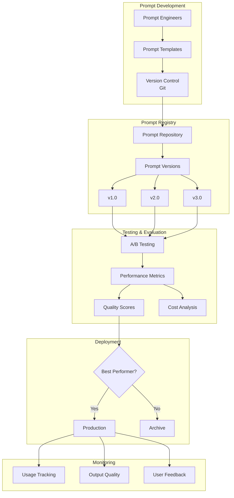

# Tutorial 11: LLM Prompt Management

## Learning Objectives

- Implement prompt versioning and template management systems
- Create A/B testing frameworks for prompts
- Build prompt optimization pipelines
- Track prompt performance metrics
- Manage prompt libraries and repositories
- Implement prompt access control and governance

## Prerequisites

- Python 3.8+, OpenAI API key or local LLM setup
- Understanding of LLM prompting techniques
- Basic knowledge of version control systems

## Architecture Overview

### Prompt Management System



## Implementation

Create `prompt_manager.py`:

```python
from typing import Dict, List, Optional
from dataclasses import dataclass
from datetime import datetime
import json
import hashlib

@dataclass
class PromptTemplate:
    id: str
    name: str
    template: str
    version: str
    variables: List[str]
    metadata: Dict
    created_at: datetime

class PromptManager:
    def __init__(self, storage_path: str = "prompts.json"):
        self.storage_path = storage_path
        self.prompts = self._load_prompts()

    def create_prompt(self, name: str, template: str,
                     variables: List[str], metadata: Dict = None) -> PromptTemplate:
        """Create new prompt template."""
        prompt_id = hashlib.md5(f"{name}{datetime.now()}".encode()).hexdigest()[:8]

        prompt = PromptTemplate(
            id=prompt_id,
            name=name,
            template=template,
            version="1.0",
            variables=variables,
            metadata=metadata or {},
            created_at=datetime.now()
        )

        self.prompts[prompt_id] = prompt
        self._save_prompts()
        return prompt

    def render_prompt(self, prompt_id: str, **kwargs) -> str:
        """Render prompt with variables."""
        prompt = self.prompts.get(prompt_id)
        if not prompt:
            raise ValueError(f"Prompt {prompt_id} not found")

        return prompt.template.format(**kwargs)

    def _load_prompts(self) -> Dict:
        try:
            with open(self.storage_path, 'r') as f:
                data = json.load(f)
                return {k: PromptTemplate(**v) for k, v in data.items()}
        except FileNotFoundError:
            return {}

    def _save_prompts(self):
        with open(self.storage_path, 'w') as f:
            json.dump({k: v.__dict__ for k, v in self.prompts.items()},
                     f, indent=2, default=str)

# Usage
manager = PromptManager()
prompt = manager.create_prompt(
    name="customer_support",
    template="You are a helpful assistant. User question: {question}\nAnswer:",
    variables=["question"],
    metadata={"category": "support", "author": "team"}
)
```

## Verification Steps

```python
# Test prompt rendering
rendered = manager.render_prompt(prompt.id, question="How do I reset my password?")
print(rendered)
```

## Best Practices

1. **Version Control**: Track all prompt changes in Git
2. **Testing**: A/B test prompts before production
3. **Monitoring**: Track prompt performance metrics
4. **Documentation**: Document prompt purpose and usage
5. **Access Control**: Implement role-based access

## Key Takeaways

- Centralized prompt management improves consistency
- Version control enables safe experimentation
- A/B testing identifies best-performing prompts
- Metrics tracking guides optimization
- Governance prevents unauthorized modifications

## Next Steps

- Tutorial 13: LLM Evaluation Framework
- Tutorial 21: LLM Observability System
