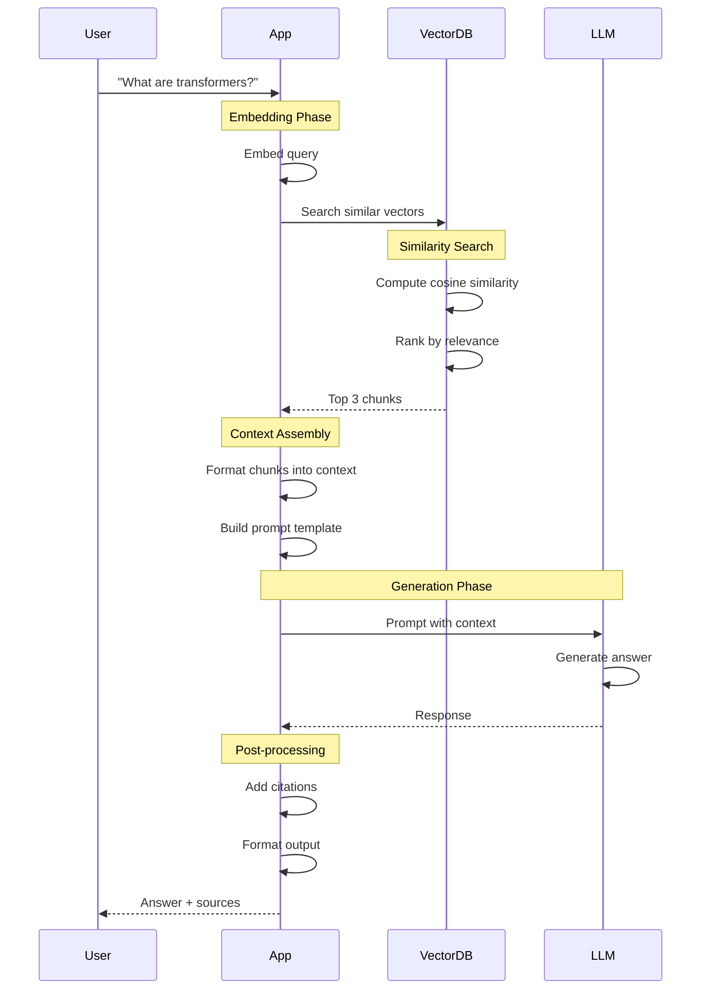

# Tutorial 12: RAG Pipeline Implementation

## 📐 Architecture Diagram

```mermaid
graph TB
    subgraph "Document Ingestion"
        DOCS[Documents<br/>PDF, TXT, MD]
        LOADER[Document Loaders<br/>PyPDF, UnstructuredIO]
        SPLITTER[Text Splitter<br/>Chunks: 512 tokens]
    end

    subgraph "Embedding Pipeline"
        EMBED_MODEL[Embedding Model<br/>OpenAI/HuggingFace]
        VECTORS[Vector Embeddings<br/>1536 dimensions]
    end

    subgraph "Vector Storage"
        VDB[(Vector Database<br/>Pinecone/Weaviate/Chroma)]
        INDEX[Vector Index<br/>HNSW/IVF]
    end

    subgraph "Query Processing"
        QUERY[User Query<br/>"What is RAG?"]
        QUERY_EMBED[Query Embedding<br/>Same model as docs]
        SEARCH[Similarity Search<br/>Top-K results]
    end

    subgraph "LLM Generation"
        CONTEXT[Retrieved Context<br/>Top 3 chunks]
        PROMPT[Prompt Template<br/>Context + Query]
        LLM[LLM<br/>GPT-4/Claude]
        RESPONSE[Generated Answer<br/>with citations]
    end

    DOCS --> LOADER
    LOADER --> SPLITTER
    SPLITTER --> EMBED_MODEL
    EMBED_MODEL --> VECTORS
    VECTORS --> VDB
    VDB --> INDEX

    QUERY --> QUERY_EMBED
    QUERY_EMBED --> SEARCH
    INDEX --> SEARCH
    SEARCH --> CONTEXT
    CONTEXT --> PROMPT
    PROMPT --> LLM
    LLM --> RESPONSE

    style DOCS fill:#e1f5ff
    style VECTORS fill:#ffe1f5
    style VDB fill:#e1ffe1
    style LLM fill:#f0e1ff
    style RESPONSE fill:#ffd700
```

## 🌊 RAG Data Flow

```mermaid
flowchart LR
    subgraph "Offline: Indexing Phase"
        D1[document1.pdf<br/>150 pages] --> S1[Split into<br/>300 chunks]
        D2[document2.md<br/>50 pages] --> S2[Split into<br/>100 chunks]
        D3[document3.txt<br/>20 pages] --> S3[Split into<br/>40 chunks]

        S1 --> E[Embedding Model<br/>text-embedding-ada-002]
        S2 --> E
        S3 --> E

        E --> V1[Vector 1<br/>[0.1, -0.3, ..., 0.5]]
        E --> V2[Vector 2<br/>[0.2, 0.1, ..., -0.2]]
        E --> V3[Vector N<br/>[...]]

        V1 --> VDB[(Chroma DB<br/>440 vectors stored)]
        V2 --> VDB
        V3 --> VDB
    end

    subgraph "Online: Query Phase"
        Q[Query:<br/>"Explain transformers"] --> QE[Embed Query<br/>same model]
        QE --> QV[Query Vector<br/>[0.15, -0.25, ...]]

        QV --> VS[Vector Search<br/>cosine similarity]
        VDB --> VS

        VS --> R1[Chunk 1<br/>similarity: 0.92]
        VS --> R2[Chunk 2<br/>similarity: 0.88]
        VS --> R3[Chunk 3<br/>similarity: 0.85]

        R1 --> CTX[Combined Context<br/>~1500 tokens]
        R2 --> CTX
        R3 --> CTX

        CTX --> P[Prompt:<br/>Context + Question]
        P --> GPT[GPT-4]
        GPT --> A[Answer:<br/>with sources]
    end

    style D1 fill:#e1f5ff
    style E fill:#ffe1f5
    style VDB fill:#e1ffe1
    style GPT fill:#f0e1ff
    style A fill:#ffd700
```

## 🔄 RAG Query Sequence



## 🎯 Learning Objectives

- ✅ Understand RAG architecture
- ✅ Implement document ingestion pipeline
- ✅ Set up vector database (Chroma)
- ✅ Create embedding pipeline
- ✅ Build similarity search
- ✅ Integrate with LLM
- ✅ Add citation/source tracking
- ✅ Optimize retrieval quality

## 📋 Prerequisites

- Python 3.9+
- OpenAI API key (or use local models)
- Basic understanding of embeddings
- Completed Tutorial 14 (Vector DB) recommended

## 🛠️ Setup

### Install Dependencies

```bash
pip install langchain chromadb openai tiktoken pypdf
pip install sentence-transformers  # For local embeddings
```

## 📝 Complete Implementation

### Step 1: Document Ingestion

Create `ingest_documents.py`:

```python
"""
Document ingestion and vectorization
"""
from langchain.document_loaders import (
    PyPDFLoader,
    TextLoader,
    DirectoryLoader
)
from langchain.text_splitter import RecursiveCharacterTextSplitter
from langchain.embeddings import OpenAIEmbeddings
from langchain.vectorstores import Chroma
import os

# Configuration
DOCS_DIR = "./documents"
CHROMA_DIR = "./chroma_db"
CHUNK_SIZE = 500
CHUNK_OVERLAP = 50

def load_documents():
    """Load documents from directory"""
    print("📚 Loading documents...")

    loaders = [
        DirectoryLoader(DOCS_DIR, glob="**/*.pdf", loader_cls=PyPDFLoader),
        DirectoryLoader(DOCS_DIR, glob="**/*.txt", loader_cls=TextLoader),
    ]

    documents = []
    for loader in loaders:
        documents.extend(loader.load())

    print(f"   ✓ Loaded {len(documents)} documents")
    return documents

def split_documents(documents):
    """Split documents into chunks"""
    print("\n✂️  Splitting documents...")

    text_splitter = RecursiveCharacterTextSplitter(
        chunk_size=CHUNK_SIZE,
        chunk_overlap=CHUNK_OVERLAP,
        length_function=len,
        separators=["\n\n", "\n", " ", ""]
    )

    chunks = text_splitter.split_documents(documents)
    print(f"   ✓ Created {len(chunks)} chunks")

    return chunks

def create_vectorstore(chunks):
    """Create vector database"""
    print("\n🔢 Creating embeddings and vector store...")

    embeddings = OpenAIEmbeddings(
        model="text-embedding-ada-002"
    )

    vectorstore = Chroma.from_documents(
        documents=chunks,
        embedding=embeddings,
        persist_directory=CHROMA_DIR
    )

    vectorstore.persist()
    print(f"   ✓ Vector store created at {CHROMA_DIR}")

    return vectorstore

def main():
    """Main ingestion pipeline"""
    # 1. Load documents
    documents = load_documents()

    # 2. Split into chunks
    chunks = split_documents(documents)

    # 3. Create vector store
    vectorstore = create_vectorstore(chunks)

    # 4. Test retrieval
    print("\n🔍 Testing retrieval...")
    query = "What is machine learning?"
    results = vectorstore.similarity_search(query, k=3)

    print(f"\n   Query: '{query}'")
    for i, doc in enumerate(results, 1):
        print(f"\n   Result {i}:")
        print(f"   {doc.page_content[:200]}...")
        print(f"   Source: {doc.metadata.get('source', 'Unknown')}")

if __name__ == "__main__":
    main()
```

### Step 2: RAG Query Engine

Create `rag_query.py`:

```python
"""
RAG query engine
"""
from langchain.embeddings import OpenAIEmbeddings
from langchain.vectorstores import Chroma
from langchain.chat_models import ChatOpenAI
from langchain.chains import RetrievalQA
from langchain.prompts import PromptTemplate
import os

CHROMA_DIR = "./chroma_db"

# Custom prompt template
PROMPT_TEMPLATE = """You are a helpful AI assistant. Use the following pieces of context to answer the question at the end.
If you don't know the answer, just say that you don't know, don't try to make up an answer.
Always cite the sources you used by mentioning the document name.

Context:
{context}

Question: {question}

Answer with sources:"""

def setup_rag_chain():
    """Initialize RAG chain"""

    # Load embeddings
    embeddings = OpenAIEmbeddings(
        model="text-embedding-ada-002"
    )

    # Load vector store
    vectorstore = Chroma(
        persist_directory=CHROMA_DIR,
        embedding_function=embeddings
    )

    # Create retriever
    retriever = vectorstore.as_retriever(
        search_type="similarity",
        search_kwargs={"k": 3}  # Top 3 results
    )

    # Initialize LLM
    llm = ChatOpenAI(
        model="gpt-4",
        temperature=0.0  # Deterministic for factual answers
    )

    # Create prompt
    prompt = PromptTemplate(
        template=PROMPT_TEMPLATE,
        input_variables=["context", "question"]
    )

    # Create QA chain
    qa_chain = RetrievalQA.from_chain_type(
        llm=llm,
        chain_type="stuff",  # Stuff all context into prompt
        retriever=retriever,
        return_source_documents=True,
        chain_type_kwargs={"prompt": prompt}
    )

    return qa_chain

def query(question: str, qa_chain):
    """Query the RAG system"""

    print(f"\n🤔 Question: {question}\n")

    # Get answer
    result = qa_chain({"query": question})

    answer = result["result"]
    sources = result["source_documents"]

    print(f"💡 Answer:\n{answer}\n")

    print("📚 Sources:")
    for i, doc in enumerate(sources, 1):
        source = doc.metadata.get("source", "Unknown")
        page = doc.metadata.get("page", "N/A")
        print(f"   {i}. {source} (Page {page})")
        print(f"      Preview: {doc.page_content[:150]}...\n")

    return result

def main():
    """Interactive RAG demo"""

    # Setup RAG chain
    print("🔧 Setting up RAG system...")
    qa_chain = setup_rag_chain()
    print("✅ RAG system ready!\n")

    # Example queries
    questions = [
        "What is the transformer architecture?",
        "Explain attention mechanism",
        "What are the benefits of pre-training?",
    ]

    for question in questions:
        query(question, qa_chain)
        print("-" * 80)

    # Interactive mode
    print("\n💬 Interactive mode (type 'quit' to exit):\n")
    while True:
        user_question = input("Ask a question: ")
        if user_question.lower() in ['quit', 'exit', 'q']:
            break

        query(user_question, qa_chain)

if __name__ == "__main__":
    main()
```

### Step 3: Advanced RAG with Reranking

Create `advanced_rag.py`:

```python
"""
Advanced RAG with reranking and metadata filtering
"""
from langchain.embeddings import OpenAIEmbeddings
from langchain.vectorstores import Chroma
from langchain.chat_models import ChatOpenAI
from langchain.retrievers import ContextualCompressionRetriever
from langchain.retrievers.document_compressors import LLMChainExtractor
from typing import List, Dict

class AdvancedRAG:
    """Advanced RAG with multiple retrieval strategies"""

    def __init__(self, chroma_dir: str = "./chroma_db"):
        self.embeddings = OpenAIEmbeddings()
        self.vectorstore = Chroma(
            persist_directory=chroma_dir,
            embedding_function=self.embeddings
        )
        self.llm = ChatOpenAI(model="gpt-4", temperature=0)

    def hybrid_search(self, query: str, k: int = 5) -> List[Dict]:
        """Combine similarity search with keyword search"""

        # Similarity search
        similar_docs = self.vectorstore.similarity_search_with_score(
            query, k=k
        )

        # MMR (Maximum Marginal Relevance) for diversity
        mmr_docs = self.vectorstore.max_marginal_relevance_search(
            query, k=k, fetch_k=k*2
        )

        # Combine and deduplicate
        all_docs = {}
        for doc, score in similar_docs:
            all_docs[doc.page_content] = {
                'doc': doc,
                'similarity_score': score,
                'method': 'similarity'
            }

        for doc in mmr_docs:
            if doc.page_content not in all_docs:
                all_docs[doc.page_content] = {
                    'doc': doc,
                    'similarity_score': None,
                    'method': 'mmr'
                }

        return list(all_docs.values())

    def rerank_results(self, query: str, documents: List, top_k: int = 3):
        """Rerank results using LLM"""

        compressor = LLMChainExtractor.from_llm(self.llm)

        retriever = self.vectorstore.as_retriever(
            search_kwargs={"k": len(documents)}
        )

        compression_retriever = ContextualCompressionRetriever(
            base_compressor=compressor,
            base_retriever=retriever
        )

        compressed_docs = compression_retriever.get_relevant_documents(query)

        return compressed_docs[:top_k]

    def filter_by_metadata(self, query: str, filters: Dict, k: int = 3):
        """Search with metadata filtering"""

        # Example: filter by source or date
        # filters = {"source": "specific_doc.pdf"}

        results = self.vectorstore.similarity_search(
            query,
            k=k,
            filter=filters
        )

        return results

    def answer_with_confidence(self, query: str):
        """Generate answer with confidence score"""

        # Get documents
        docs_with_scores = self.vectorstore.similarity_search_with_score(
            query, k=3
        )

        # Calculate confidence based on similarity scores
        avg_score = sum(score for _, score in docs_with_scores) / len(docs_with_scores)
        confidence = 1 / (1 + avg_score)  # Convert distance to confidence

        # Prepare context
        context = "\n\n".join([
            f"[Source {i+1}]: {doc.page_content}"
            for i, (doc, _) in enumerate(docs_with_scores)
        ])

        # Generate answer
        prompt = f"""Based on the following context, answer the question.
Also provide a confidence level (low/medium/high) based on how well the context supports your answer.

Context:
{context}

Question: {query}

Answer format:
Answer: [your answer]
Confidence: [low/medium/high]
Reasoning: [why you have this confidence level]
"""

        response = self.llm.predict(prompt)

        return {
            'answer': response,
            'retrieval_confidence': confidence,
            'sources': docs_with_scores
        }

# Example usage
if __name__ == "__main__":
    rag = AdvancedRAG()

    # Hybrid search
    print("🔍 Hybrid Search:")
    results = rag.hybrid_search("What is attention?", k=5)
    for r in results[:3]:
        print(f"   Method: {r['method']}")
        print(f"   Content: {r['doc'].page_content[:100]}...\n")

    # With confidence
    print("\n💯 Answer with Confidence:")
    result = rag.answer_with_confidence("Explain transformers")
    print(result['answer'])
    print(f"\nRetrieval Confidence: {result['retrieval_confidence']:.2f}")
```

### Step 4: RAG Evaluation

Create `evaluate_rag.py`:

```python
"""
Evaluate RAG system performance
"""
from typing import List, Dict
import json

class RAGEvaluator:
    """Evaluate RAG retrieval and generation quality"""

    def __init__(self, rag_chain):
        self.rag_chain = rag_chain

    def evaluate_retrieval(self, test_cases: List[Dict]) -> Dict:
        """Evaluate retrieval quality"""

        metrics = {
            'precision_at_k': [],
            'recall_at_k': [],
            'mrr': []  # Mean Reciprocal Rank
        }

        for case in test_cases:
            query = case['query']
            relevant_docs = set(case['relevant_doc_ids'])

            # Get retrieved docs
            results = self.rag_chain.retriever.get_relevant_documents(query)
            retrieved_ids = {doc.metadata.get('id') for doc in results}

            # Calculate metrics
            relevant_retrieved = relevant_docs & retrieved_ids

            # Precision@K
            precision = len(relevant_retrieved) / len(retrieved_ids) if retrieved_ids else 0
            metrics['precision_at_k'].append(precision)

            # Recall@K
            recall = len(relevant_retrieved) / len(relevant_docs) if relevant_docs else 0
            metrics['recall_at_k'].append(recall)

            # MRR
            for i, doc in enumerate(results, 1):
                if doc.metadata.get('id') in relevant_docs:
                    metrics['mrr'].append(1 / i)
                    break
            else:
                metrics['mrr'].append(0)

        # Average metrics
        avg_metrics = {
            k: sum(v) / len(v) if v else 0
            for k, v in metrics.items()
        }

        return avg_metrics

    def evaluate_generation(self, test_cases: List[Dict]) -> Dict:
        """Evaluate generation quality"""

        # You would typically use:
        # - BLEU, ROUGE for text overlap
        # - BERTScore for semantic similarity
        # - Human evaluation

        results = []

        for case in test_cases:
            query = case['query']
            expected_answer = case['expected_answer']

            # Get RAG answer
            result = self.rag_chain({"query": query})
            generated = result['result']

            # Simple overlap metric (in production, use proper metrics)
            overlap = len(set(generated.split()) & set(expected_answer.split()))
            score = overlap / len(set(expected_answer.split()))

            results.append({
                'query': query,
                'generated': generated,
                'expected': expected_answer,
                'overlap_score': score
            })

        avg_score = sum(r['overlap_score'] for r in results) / len(results)

        return {
            'average_overlap_score': avg_score,
            'individual_results': results
        }

# Example test cases
test_cases = [
    {
        'query': 'What is attention in transformers?',
        'relevant_doc_ids': ['doc1_chunk5', 'doc3_chunk12'],
        'expected_answer': 'Attention is a mechanism that allows...'
    },
    # Add more test cases
]
```

## ✅ Verification

### 1. Test Document Ingestion

```bash
# Add some documents to ./documents/
python ingest_documents.py
```

**Expected Output:**
```
📚 Loading documents...
   ✓ Loaded 5 documents

✂️  Splitting documents...
   ✓ Created 127 chunks

🔢 Creating embeddings and vector store...
   ✓ Vector store created at ./chroma_db
```

### 2. Test RAG Queries

```bash
python rag_query.py
```

### 3. Verify Retrieval Quality

```python
# Check if relevant docs are retrieved
results = vectorstore.similarity_search("query", k=3)
for doc in results:
    print(f"Score: {doc.metadata}")
```

## 💡 Best Practices

### 1. Chunk Size Optimization

```python
# ✅ Experiment with chunk sizes
chunk_sizes = [256, 512, 1024]
overlaps = [0, 50, 100]

# Test different combinations
for size in chunk_sizes:
    for overlap in overlaps:
        # Evaluate retrieval quality
        pass
```

### 2. Prompt Engineering

```python
# ✅ Good prompt: Clear instructions
PROMPT = """Use the context to answer. Cite sources.
If unsure, say "I don't know."

Context: {context}
Question: {question}
Answer:"""

# ❌ Bad: Vague instructions
PROMPT = "Answer: {question}"
```

### 3. Metadata Enrichment

```python
# ✅ Add useful metadata
metadata = {
    "source": "doc.pdf",
    "page": 5,
    "section": "Introduction",
    "date": "2024-01-15",
    "author": "John Doe"
}
```

## 🧹 Cleanup

```bash
rm -rf chroma_db/
rm -rf documents/
```

## 📚 Key Takeaways

- ✅ RAG combines retrieval with generation
- ✅ Vector databases enable semantic search
- ✅ Chunk size affects retrieval quality
- ✅ Reranking improves relevance
- ✅ Always include source citations
- ✅ Evaluate both retrieval and generation
- ✅ Metadata filtering enables precise search

---

**Next Tutorial:** [13_LLM_Evaluation](../13_LLM_Evaluation/) - Learn to systematically evaluate LLM outputs.
