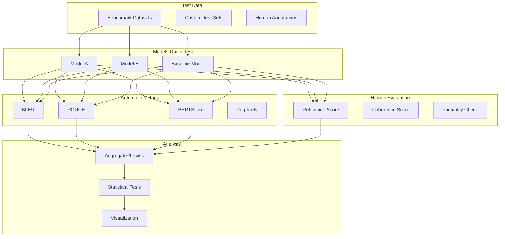

# Tutorial 13: LLM Evaluation Framework

## Learning Objectives

- Implement BLEU, ROUGE, and BERTScore metrics
- Create human evaluation pipelines
- Build automated evaluation systems
- Compare models using benchmark datasets
- Track evaluation results over time
- Integrate evaluation into CI/CD

## Prerequisites

- Python 3.8+, Transformers library
- Understanding of NLP metrics
- Knowledge of LLM capabilities and limitations

## Architecture Overview

### Evaluation Pipeline



## Implementation

Create `llm_evaluator.py`:

```python
from typing import List, Dict
import numpy as np
from nltk.translate.bleu_score import sentence_bleu, SmoothingFunction
from rouge_score import rouge_scorer
from bert_score import score as bert_score

class LLMEvaluator:
    def __init__(self):
        self.rouge_scorer = rouge_scorer.RougeScorer(
            ['rouge1', 'rouge2', 'rougeL'],
            use_stemmer=True
        )

    def evaluate_bleu(self, references: List[str],
                     hypotheses: List[str]) -> float:
        """Calculate BLEU score."""
        scores = []
        smooth = SmoothingFunction()

        for ref, hyp in zip(references, hypotheses):
            ref_tokens = [ref.split()]
            hyp_tokens = hyp.split()
            score = sentence_bleu(ref_tokens, hyp_tokens,
                                smoothing_function=smooth.method1)
            scores.append(score)

        return np.mean(scores)

    def evaluate_rouge(self, references: List[str],
                      hypotheses: List[str]) -> Dict:
        """Calculate ROUGE scores."""
        rouge_scores = {'rouge1': [], 'rouge2': [], 'rougeL': []}

        for ref, hyp in zip(references, hypotheses):
            scores = self.rouge_scorer.score(ref, hyp)
            for key in rouge_scores:
                rouge_scores[key].append(scores[key].fmeasure)

        return {k: np.mean(v) for k, v in rouge_scores.items()}

    def evaluate_bertscore(self, references: List[str],
                          hypotheses: List[str]) -> Dict:
        """Calculate BERTScore."""
        P, R, F1 = bert_score(hypotheses, references,
                             lang='en', verbose=False)

        return {
            'precision': P.mean().item(),
            'recall': R.mean().item(),
            'f1': F1.mean().item()
        }

    def comprehensive_eval(self, references: List[str],
                          hypotheses: List[str]) -> Dict:
        """Run all evaluation metrics."""
        return {
            'bleu': self.evaluate_bleu(references, hypotheses),
            'rouge': self.evaluate_rouge(references, hypotheses),
            'bertscore': self.evaluate_bertscore(references, hypotheses)
        }

# Usage
evaluator = LLMEvaluator()

references = ["The cat sat on the mat", "Hello world"]
hypotheses = ["A cat was sitting on the mat", "Hello there world"]

results = evaluator.comprehensive_eval(references, hypotheses)
print(json.dumps(results, indent=2))
```

Create `human_evaluation.py`:

```python
from typing import List, Dict
from dataclasses import dataclass
import pandas as pd

@dataclass
class EvaluationCriteria:
    relevance: int  # 1-5
    coherence: int  # 1-5
    factuality: int  # 1-5
    fluency: int  # 1-5

class HumanEvaluationPlatform:
    def __init__(self):
        self.evaluations = []

    def create_evaluation_task(self, prompt: str,
                               responses: Dict[str, str]) -> str:
        """Create evaluation task for human annotators."""
        task = {
            'id': f"eval_{len(self.evaluations)}",
            'prompt': prompt,
            'responses': responses,
            'status': 'pending'
        }
        self.evaluations.append(task)
        return task['id']

    def submit_evaluation(self, task_id: str, model_id: str,
                         criteria: EvaluationCriteria):
        """Submit human evaluation."""
        for task in self.evaluations:
            if task['id'] == task_id:
                if 'ratings' not in task:
                    task['ratings'] = {}
                task['ratings'][model_id] = criteria.__dict__
                break

    def aggregate_results(self) -> pd.DataFrame:
        """Aggregate human evaluation results."""
        results = []
        for task in self.evaluations:
            if 'ratings' in task:
                for model_id, ratings in task['ratings'].items():
                    results.append({
                        'task_id': task['id'],
                        'model_id': model_id,
                        **ratings
                    })
        return pd.DataFrame(results)

# Usage
platform = HumanEvaluationPlatform()
task_id = platform.create_evaluation_task(
    prompt="Explain quantum computing",
    responses={
        'gpt-4': "Quantum computing uses quantum mechanics...",
        'claude': "Quantum computers leverage quantum states..."
    }
)

platform.submit_evaluation(task_id, 'gpt-4',
    EvaluationCriteria(relevance=5, coherence=5, factuality=5, fluency=5))
```

## Verification Steps

```bash
# Install dependencies
pip install nltk rouge-score bert-score transformers

# Run evaluation
python llm_evaluator.py
```

## Best Practices

1. **Multiple Metrics**: Use both automatic and human evaluation
2. **Statistical Significance**: Test significance of differences
3. **Diverse Test Sets**: Cover various use cases
4. **Continuous Evaluation**: Integrate into CI/CD
5. **Human-in-Loop**: Combine automated and human judgment

## Key Takeaways

- No single metric captures all aspects of quality
- Combine automatic metrics with human evaluation
- Benchmark against established datasets
- Track metrics over time to detect degradation
- Use statistical tests for model comparison

## Next Steps

- Tutorial 21: LLM Observability
- Tutorial 11: Prompt Management
