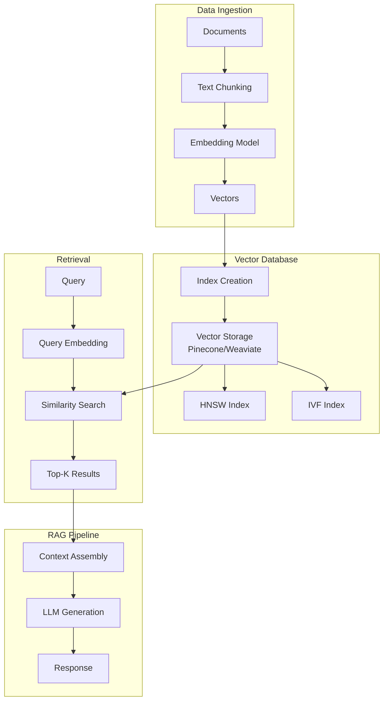

# Tutorial 14: Vector Database Integration

## Learning Objectives

- Set up vector databases (Pinecone, Weaviate, Milvus, Chroma)
- Implement vector indexing and similarity search
- Optimize retrieval performance
- Build RAG pipelines with vector databases
- Manage embeddings lifecycle
- Monitor vector database performance

## Prerequisites

- Python 3.8+
- Understanding of embeddings and vector similarity
- Docker for local vector DBs

## Architecture Overview



## Implementation

Create `vector_db_setup.py`:

```python
from typing import List, Dict
import chromadb
from chromadb.config import Settings
from sentence_transformers import SentenceTransformer
import numpy as np

class VectorDatabase:
    def __init__(self, collection_name: str = "documents"):
        self.client = chromadb.Client(Settings(
            chroma_db_impl="duckdb+parquet",
            persist_directory="./chroma_db"
        ))

        self.collection = self.client.get_or_create_collection(
            name=collection_name,
            metadata={"hnsw:space": "cosine"}
        )

        self.embedding_model = SentenceTransformer('all-MiniLM-L6-v2')

    def add_documents(self, documents: List[str],
                     metadatas: List[Dict] = None,
                     ids: List[str] = None):
        """Add documents to vector database."""
        embeddings = self.embedding_model.encode(documents).tolist()

        if ids is None:
            ids = [f"doc_{i}" for i in range(len(documents))]

        self.collection.add(
            embeddings=embeddings,
            documents=documents,
            metadatas=metadatas,
            ids=ids
        )

    def search(self, query: str, k: int = 5) -> Dict:
        """Search for similar documents."""
        query_embedding = self.embedding_model.encode([query]).tolist()

        results = self.collection.query(
            query_embeddings=query_embedding,
            n_results=k
        )

        return results

    def delete_collection(self):
        """Delete the collection."""
        self.client.delete_collection(self.collection.name)

# Pinecone Example
class PineconeVectorDB:
    def __init__(self, api_key: str, environment: str):
        import pinecone

        pinecone.init(api_key=api_key, environment=environment)

        self.index_name = "documents"
        if self.index_name not in pinecone.list_indexes():
            pinecone.create_index(
                self.index_name,
                dimension=384,
                metric="cosine"
            )

        self.index = pinecone.Index(self.index_name)
        self.embedding_model = SentenceTransformer('all-MiniLM-L6-v2')

    def upsert(self, documents: List[str], ids: List[str] = None):
        """Insert or update vectors."""
        embeddings = self.embedding_model.encode(documents)

        if ids is None:
            ids = [f"doc_{i}" for i in range(len(documents))]

        vectors = [(id, emb.tolist(), {"text": doc})
                   for id, emb, doc in zip(ids, embeddings, documents)]

        self.index.upsert(vectors=vectors)

    def query(self, text: str, top_k: int = 5):
        """Query similar vectors."""
        query_embedding = self.embedding_model.encode([text])[0].tolist()

        results = self.index.query(
            vector=query_embedding,
            top_k=top_k,
            include_metadata=True
        )

        return results

# Usage
db = VectorDatabase()

# Add documents
docs = [
    "Machine learning is a subset of AI",
    "Deep learning uses neural networks",
    "Natural language processing handles text"
]

db.add_documents(docs, metadatas=[{"category": "ml"} for _ in docs])

# Search
results = db.search("What is machine learning?", k=2)
print(results)
```

Create `rag_pipeline.py`:

```python
from typing import List
import openai

class RAGPipeline:
    def __init__(self, vector_db: VectorDatabase, api_key: str):
        self.vector_db = vector_db
        openai.api_key = api_key

    def retrieve(self, query: str, k: int = 3) -> List[str]:
        """Retrieve relevant documents."""
        results = self.vector_db.search(query, k=k)
        return results['documents'][0]

    def generate(self, query: str, context: List[str]) -> str:
        """Generate response using retrieved context."""
        context_text = "\n".join(context)

        prompt = f"""Use the following context to answer the question.

Context:
{context_text}

Question: {query}

Answer:"""

        response = openai.ChatCompletion.create(
            model="gpt-3.5-turbo",
            messages=[
                {"role": "system", "content": "You are a helpful assistant."},
                {"role": "user", "content": prompt}
            ],
            temperature=0.7
        )

        return response.choices[0].message.content

    def query(self, question: str) -> Dict:
        """End-to-end RAG query."""
        # Retrieve
        context = self.retrieve(question)

        # Generate
        answer = self.generate(question, context)

        return {
            'question': question,
            'answer': answer,
            'context': context
        }

# Usage
rag = RAGPipeline(db, "your-api-key")
result = rag.query("What is machine learning?")
print(f"Answer: {result['answer']}")
```

## Verification Steps

```bash
# Install dependencies
pip install chromadb sentence-transformers pinecone-client

# Run vector DB setup
python vector_db_setup.py

# Test RAG pipeline
python rag_pipeline.py
```

## Best Practices

1. **Choose Right Index**: HNSW for accuracy, IVF for speed
2. **Chunking Strategy**: Optimal chunk size balances context and precision
3. **Embedding Quality**: Use domain-specific models when available
4. **Metadata Filtering**: Enable hybrid search with metadata
5. **Monitoring**: Track query latency and recall metrics

## Key Takeaways

- Vector databases enable semantic search at scale
- Choose database based on scale and performance needs
- Embedding quality directly impacts retrieval quality
- Hybrid search (vector + metadata) improves precision
- Monitor and optimize index configuration

## Next Steps

- Tutorial 15: LLM Cost Optimization
- Tutorial 17: LLM Response Caching
