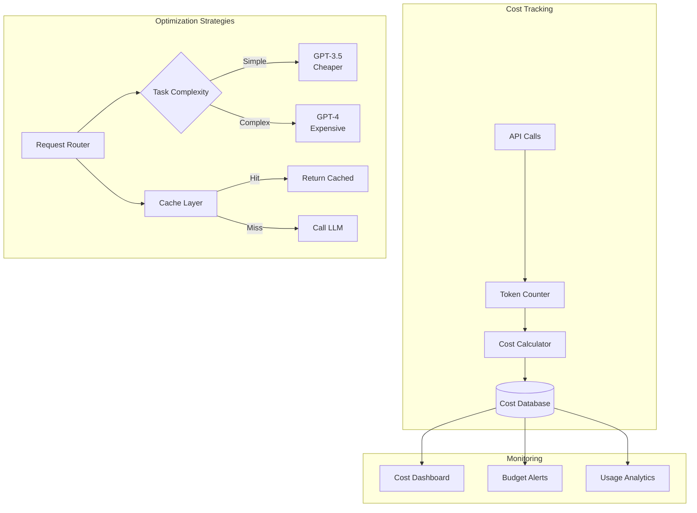

# Tutorial 15: LLM Cost Optimization

## Learning Objectives

- Track and analyze LLM API costs
- Implement token usage optimization strategies
- Set up caching for repeated queries
- Choose cost-effective models for tasks
- Implement batching and rate limiting
- Monitor and alert on cost anomalies

## Prerequisites

- Python 3.8+, OpenAI API key
- Understanding of LLM pricing models
- Redis for caching

## Architecture Overview



## Implementation

Create `cost_tracker.py`:

```python
from typing import Dict, Optional
from datetime import datetime
import json
from dataclasses import dataclass, asdict

@dataclass
class LLMCost:
    model: str
    prompt_tokens: int
    completion_tokens: int
    total_tokens: int
    cost_usd: float
    timestamp: datetime
    request_id: str

class CostTracker:
    # Pricing as of 2024 (USD per 1K tokens)
    PRICING = {
        'gpt-4': {'prompt': 0.03, 'completion': 0.06},
        'gpt-4-32k': {'prompt': 0.06, 'completion': 0.12},
        'gpt-3.5-turbo': {'prompt': 0.0015, 'completion': 0.002},
        'gpt-3.5-turbo-16k': {'prompt': 0.003, 'completion': 0.004},
    }

    def __init__(self, storage_file: str = "costs.jsonl"):
        self.storage_file = storage_file

    def calculate_cost(self, model: str, prompt_tokens: int,
                      completion_tokens: int) -> float:
        """Calculate cost for API call."""
        if model not in self.PRICING:
            raise ValueError(f"Unknown model: {model}")

        pricing = self.PRICING[model]
        prompt_cost = (prompt_tokens / 1000) * pricing['prompt']
        completion_cost = (completion_tokens / 1000) * pricing['completion']

        return prompt_cost + completion_cost

    def log_cost(self, model: str, prompt_tokens: int,
                completion_tokens: int, request_id: str):
        """Log API call cost."""
        cost = self.calculate_cost(model, prompt_tokens, completion_tokens)

        cost_record = LLMCost(
            model=model,
            prompt_tokens=prompt_tokens,
            completion_tokens=completion_tokens,
            total_tokens=prompt_tokens + completion_tokens,
            cost_usd=cost,
            timestamp=datetime.now(),
            request_id=request_id
        )

        # Append to file
        with open(self.storage_file, 'a') as f:
            f.write(json.dumps(asdict(cost_record), default=str) + '\n')

        return cost_record

    def get_daily_cost(self, date: datetime = None) -> float:
        """Get total cost for a day."""
        if date is None:
            date = datetime.now()

        total_cost = 0.0
        target_date = date.date()

        try:
            with open(self.storage_file, 'r') as f:
                for line in f:
                    record = json.loads(line)
                    record_date = datetime.fromisoformat(
                        record['timestamp']
                    ).date()
                    if record_date == target_date:
                        total_cost += record['cost_usd']
        except FileNotFoundError:
            pass

        return total_cost

    def get_cost_by_model(self) -> Dict[str, float]:
        """Get cost breakdown by model."""
        costs = {}

        try:
            with open(self.storage_file, 'r') as f:
                for line in f:
                    record = json.loads(line)
                    model = record['model']
                    costs[model] = costs.get(model, 0) + record['cost_usd']
        except FileNotFoundError:
            pass

        return costs

# Usage
tracker = CostTracker()

# Log a request
cost = tracker.log_cost(
    model='gpt-3.5-turbo',
    prompt_tokens=100,
    completion_tokens=50,
    request_id='req_123'
)

print(f"Cost: ${cost.cost_usd:.6f}")
print(f"Daily cost: ${tracker.get_daily_cost():.2f}")
print(f"Cost by model: {tracker.get_cost_by_model()}")
```

Create `optimized_llm_client.py`:

```python
import openai
from typing import Optional, Dict
import hashlib
import redis
import json

class OptimizedLLMClient:
    def __init__(self, api_key: str, redis_url: str = "redis://localhost:6379"):
        openai.api_key = api_key
        self.cache = redis.from_url(redis_url, decode_responses=True)
        self.cost_tracker = CostTracker()

    def _generate_cache_key(self, messages: list, model: str) -> str:
        """Generate cache key for request."""
        content = json.dumps({'messages': messages, 'model': model}, sort_keys=True)
        return hashlib.md5(content.encode()).hexdigest()

    def _get_cached_response(self, cache_key: str) -> Optional[Dict]:
        """Get cached response if exists."""
        cached = self.cache.get(cache_key)
        if cached:
            return json.loads(cached)
        return None

    def _cache_response(self, cache_key: str, response: Dict, ttl: int = 3600):
        """Cache response."""
        self.cache.setex(cache_key, ttl, json.dumps(response))

    def chat_completion(self, messages: list, model: str = "gpt-3.5-turbo",
                       use_cache: bool = True, **kwargs) -> Dict:
        """Optimized chat completion with caching and cost tracking."""

        # Check cache
        if use_cache:
            cache_key = self._generate_cache_key(messages, model)
            cached_response = self._get_cached_response(cache_key)

            if cached_response:
                print("✓ Cache hit - $0.00")
                return cached_response

        # Call API
        response = openai.ChatCompletion.create(
            model=model,
            messages=messages,
            **kwargs
        )

        # Track cost
        usage = response['usage']
        cost = self.cost_tracker.log_cost(
            model=model,
            prompt_tokens=usage['prompt_tokens'],
            completion_tokens=usage['completion_tokens'],
            request_id=response['id']
        )

        print(f"API call cost: ${cost.cost_usd:.6f}")

        # Cache response
        if use_cache:
            self._cache_response(cache_key, dict(response))

        return response

    def choose_model(self, task_complexity: str) -> str:
        """Choose cost-effective model based on task."""
        if task_complexity == 'simple':
            return 'gpt-3.5-turbo'
        elif task_complexity == 'moderate':
            return 'gpt-3.5-turbo-16k'
        else:  # complex
            return 'gpt-4'

# Usage
client = OptimizedLLMClient("your-api-key")

messages = [{"role": "user", "content": "What is 2+2?"}]

# First call - API call
response1 = client.chat_completion(messages)

# Second call - cached
response2 = client.chat_completion(messages)

# Use appropriate model for task
model = client.choose_model('simple')
response3 = client.chat_completion(messages, model=model)
```

Create `budget_monitor.py`:

```python
from typing import Optional
import smtplib
from email.mime.text import MIMEText

class BudgetMonitor:
    def __init__(self, cost_tracker: CostTracker, daily_budget: float = 100.0):
        self.cost_tracker = cost_tracker
        self.daily_budget = daily_budget

    def check_budget(self) -> Dict:
        """Check if budget is exceeded."""
        current_cost = self.cost_tracker.get_daily_cost()
        usage_percent = (current_cost / self.daily_budget) * 100

        status = {
            'current_cost': current_cost,
            'daily_budget': self.daily_budget,
            'usage_percent': usage_percent,
            'exceeded': current_cost > self.daily_budget
        }

        # Alert thresholds
        if usage_percent >= 100:
            self._send_alert('critical', status)
        elif usage_percent >= 80:
            self._send_alert('warning', status)

        return status

    def _send_alert(self, level: str, status: Dict):
        """Send budget alert."""
        message = f"""
        Budget Alert - {level.upper()}

        Current Cost: ${status['current_cost']:.2f}
        Daily Budget: ${status['daily_budget']:.2f}
        Usage: {status['usage_percent']:.1f}%
        """

        print(message)
        # In production: send email/Slack notification

# Usage
monitor = BudgetMonitor(tracker, daily_budget=10.0)
status = monitor.check_budget()
print(status)
```

## Verification Steps

```bash
# Install dependencies
pip install openai redis

# Start Redis
docker run -d -p 6379:6379 redis

# Run cost tracking
python cost_tracker.py

# Test optimized client
python optimized_llm_client.py
```

## Best Practices

1. **Caching**: Cache identical or similar queries
2. **Model Selection**: Use cheaper models for simple tasks
3. **Prompt Optimization**: Reduce token count in prompts
4. **Batching**: Batch multiple requests when possible
5. **Monitoring**: Set budget alerts and track usage

## Key Takeaways

- Token usage is the primary cost driver
- Caching can reduce costs by 50-90%
- Choosing the right model balances cost and quality
- Prompt engineering reduces token consumption
- Monitoring prevents budget overruns

## Next Steps

- Tutorial 16: Multi-Model LLM Router
- Tutorial 17: LLM Response Caching
