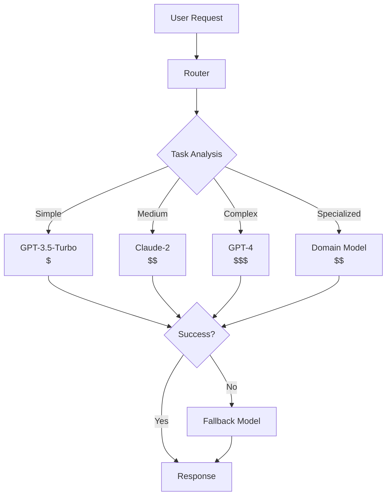

# Tutorial 16: Multi-Model LLM Router

## Learning Objectives

- Implement LiteLLM for unified API across providers
- Build intelligent routing based on task complexity
- Create fallback strategies for reliability
- Optimize cost and performance with model selection
- Track routing decisions and outcomes

## Prerequisites

- Python 3.8+
- API keys for multiple LLM providers
- Understanding of LLM capabilities

## Architecture Overview



## Implementation

Create `model_router.py`:

```python
from litellm import completion
from typing import Dict, Optional, List
import re

class ModelRouter:
    def __init__(self):
        self.models = {
            'simple': 'gpt-3.5-turbo',
            'medium': 'claude-2',
            'complex': 'gpt-4',
            'code': 'gpt-4',
        }

        self.fallback_chain = [
            'gpt-4',
            'claude-2',
            'gpt-3.5-turbo'
        ]

    def analyze_complexity(self, prompt: str) -> str:
        """Determine task complexity."""
        # Simple heuristics
        word_count = len(prompt.split())
        has_code = bool(re.search(r'```|code|function|class', prompt, re.I))

        if has_code:
            return 'code'
        elif word_count < 50:
            return 'simple'
        elif word_count < 200:
            return 'medium'
        else:
            return 'complex'

    def route_request(self, messages: List[Dict],
                     complexity: Optional[str] = None) -> Dict:
        """Route request to appropriate model."""
        if complexity is None:
            # Auto-detect complexity from last message
            last_msg = messages[-1]['content']
            complexity = self.analyze_complexity(last_msg)

        model = self.models.get(complexity, 'gpt-3.5-turbo')

        print(f"Routing to {model} (complexity: {complexity})")

        try:
            response = completion(
                model=model,
                messages=messages
            )
            return {
                'success': True,
                'model_used': model,
                'response': response
            }
        except Exception as e:
            print(f"Error with {model}: {e}")
            return self._fallback(messages, exclude=[model])

    def _fallback(self, messages: List[Dict],
                  exclude: List[str] = None) -> Dict:
        """Try fallback models."""
        exclude = exclude or []

        for model in self.fallback_chain:
            if model in exclude:
                continue

            try:
                print(f"Trying fallback model: {model}")
                response = completion(model=model, messages=messages)
                return {
                    'success': True,
                    'model_used': model,
                    'response': response,
                    'is_fallback': True
                }
            except Exception as e:
                print(f"Fallback {model} failed: {e}")
                continue

        return {
            'success': False,
            'error': 'All models failed'
        }

# Usage
router = ModelRouter()

messages = [
    {"role": "user", "content": "Write a Python function to sort a list"}
]

result = router.route_request(messages)
print(f"Model used: {result['model_used']}")
```

Create `advanced_router.py`:

```python
from typing import Dict, List
import time

class AdvancedRouter:
    def __init__(self):
        self.model_performance = {}  # Track performance
        self.cost_limits = {}
        self.rate_limits = {}

    def route_with_constraints(self, messages: List[Dict],
                               max_cost: float = None,
                               max_latency: float = None) -> Dict:
        """Route with cost and latency constraints."""

        candidates = self._filter_by_constraints(max_cost, max_latency)

        if not candidates:
            raise ValueError("No models meet constraints")

        # Choose best model from candidates
        model = self._choose_best(candidates)

        start_time = time.time()
        response = completion(model=model, messages=messages)
        latency = time.time() - start_time

        # Update performance tracking
        self._update_performance(model, latency)

        return {
            'model': model,
            'response': response,
            'latency': latency
        }

    def _filter_by_constraints(self, max_cost, max_latency):
        """Filter models by constraints."""
        # Implementation depends on your requirements
        return ['gpt-3.5-turbo', 'claude-2']

    def _choose_best(self, candidates):
        """Choose best model from candidates."""
        # Could use ML model to predict best option
        return candidates[0]

    def _update_performance(self, model, latency):
        """Track model performance."""
        if model not in self.model_performance:
            self.model_performance[model] = []
        self.model_performance[model].append(latency)
```

## Verification Steps

```bash
# Install LiteLLM
pip install litellm

# Set API keys
export OPENAI_API_KEY=your_key
export ANTHROPIC_API_KEY=your_key

# Test router
python model_router.py
```

## Best Practices

1. **Intelligent Routing**: Analyze task before selecting model
2. **Fallback Strategy**: Always have backup models
3. **Cost Optimization**: Route simple tasks to cheaper models
4. **Performance Tracking**: Monitor latency and success rates
5. **Rate Limiting**: Implement per-model rate limits

## Key Takeaways

- Routing optimizes both cost and performance
- Fallback chains ensure reliability
- Task analysis enables intelligent model selection
- Unified API simplifies multi-provider integration
- Performance tracking guides optimization

## Next Steps

- Tutorial 15: LLM Cost Optimization
- Tutorial 17: LLM Response Caching
