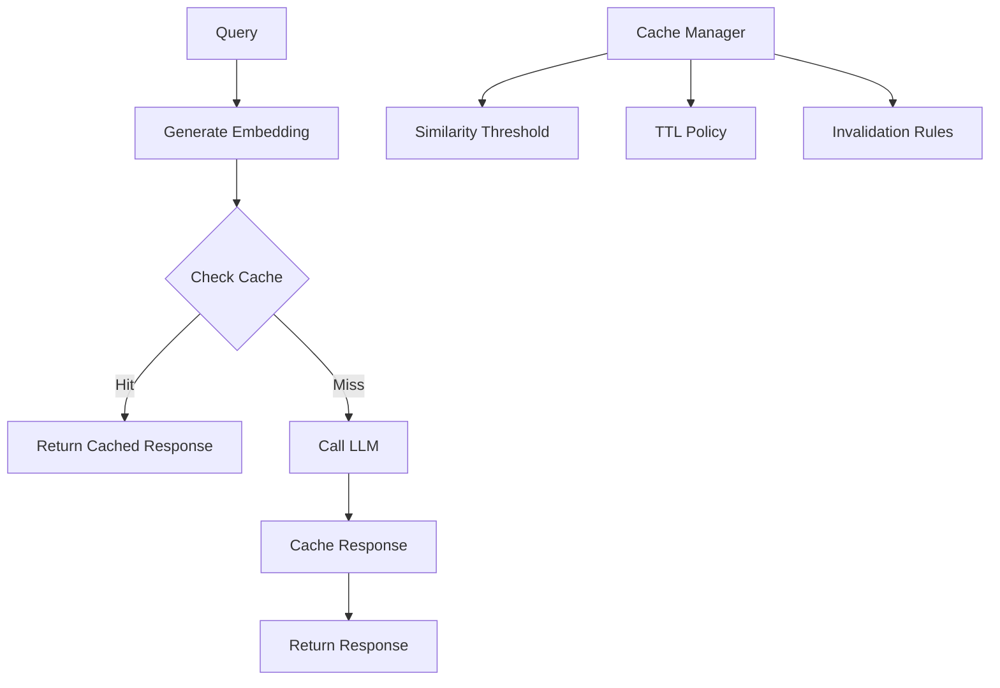

# Tutorial 17: LLM Response Caching

## Learning Objectives

- Implement semantic caching for similar queries
- Set up Redis-based cache infrastructure
- Optimize cache hit rates
- Implement cache invalidation strategies
- Track cache performance metrics

## Prerequisites

- Python 3.8+
- Redis
- Understanding of embedding similarity

## Architecture Overview



## Implementation

Create `semantic_cache.py`:

```python
import redis
import numpy as np
from sentence_transformers import SentenceTransformer
import json
from typing import Optional, Dict
import hashlib

class SemanticCache:
    def __init__(self, redis_url: str = "redis://localhost:6379",
                 similarity_threshold: float = 0.95):
        self.redis = redis.from_url(redis_url, decode_responses=False)
        self.encoder = SentenceTransformer('all-MiniLM-L6-v2')
        self.similarity_threshold = similarity_threshold

    def _embed(self, text: str) -> np.ndarray:
        """Generate embedding for text."""
        return self.encoder.encode(text)

    def _compute_similarity(self, emb1: np.ndarray,
                           emb2: np.ndarray) -> float:
        """Compute cosine similarity."""
        return np.dot(emb1, emb2) / (
            np.linalg.norm(emb1) * np.linalg.norm(emb2)
        )

    def get(self, query: str) -> Optional[Dict]:
        """Get cached response if similar query exists."""
        query_emb = self._embed(query)

        # Get all cached queries
        for key in self.redis.scan_iter("cache:*"):
            cached_data = self.redis.get(key)
            if not cached_data:
                continue

            data = json.loads(cached_data.decode())
            cached_emb = np.array(data['embedding'])

            similarity = self._compute_similarity(query_emb, cached_emb)

            if similarity >= self.similarity_threshold:
                print(f"✓ Cache hit (similarity: {similarity:.3f})")
                return data['response']

        print("✗ Cache miss")
        return None

    def set(self, query: str, response: Dict, ttl: int = 3600):
        """Cache query-response pair."""
        query_emb = self._embed(query)

        cache_key = f"cache:{hashlib.md5(query.encode()).hexdigest()}"

        data = {
            'query': query,
            'embedding': query_emb.tolist(),
            'response': response
        }

        self.redis.setex(
            cache_key,
            ttl,
            json.dumps(data)
        )

        print("✓ Response cached")

    def clear(self):
        """Clear all cached responses."""
        for key in self.redis.scan_iter("cache:*"):
            self.redis.delete(key)

# Usage
cache = SemanticCache()

# First query
query1 = "What is machine learning?"
response1 = {"answer": "ML is a subset of AI..."}
cache.set(query1, response1)

# Similar query - should hit cache
query2 = "Can you explain machine learning?"
cached = cache.get(query2)
if cached:
    print(f"Cached response: {cached}")
```

Create `cached_llm_client.py`:

```python
import openai
from semantic_cache import SemanticCache
from cost_tracker import CostTracker

class CachedLLMClient:
    def __init__(self, api_key: str):
        openai.api_key = api_key
        self.cache = SemanticCache()
        self.cost_tracker = CostTracker()
        self.cache_hits = 0
        self.cache_misses = 0

    def chat_completion(self, messages: list,
                       model: str = "gpt-3.5-turbo",
                       use_cache: bool = True) -> Dict:
        """LLM call with semantic caching."""
        query = messages[-1]['content']  # Last message

        # Check cache
        if use_cache:
            cached_response = self.cache.get(query)

            if cached_response:
                self.cache_hits += 1
                print(f"Cache stats: {self.cache_hits} hits, "
                      f"{self.cache_misses} misses "
                      f"({self.hit_rate:.1f}% hit rate)")
                return cached_response

        # Cache miss - call API
        self.cache_misses += 1

        response = openai.ChatCompletion.create(
            model=model,
            messages=messages
        )

        # Track cost
        usage = response['usage']
        cost = self.cost_tracker.log_cost(
            model=model,
            prompt_tokens=usage['prompt_tokens'],
            completion_tokens=usage['completion_tokens'],
            request_id=response['id']
        )

        print(f"API cost: ${cost.cost_usd:.6f}")

        # Cache response
        if use_cache:
            self.cache.set(query, dict(response))

        return response

    @property
    def hit_rate(self) -> float:
        """Calculate cache hit rate."""
        total = self.cache_hits + self.cache_misses
        return (self.cache_hits / total * 100) if total > 0 else 0

# Usage
client = CachedLLMClient("your-api-key")

# First call
response1 = client.chat_completion([
    {"role": "user", "content": "Explain neural networks"}
])

# Similar call - should use cache
response2 = client.chat_completion([
    {"role": "user", "content": "What are neural networks?"}
])
```

## Verification Steps

```bash
# Start Redis
docker run -d -p 6379:6379 redis

# Install dependencies
pip install redis sentence-transformers

# Test semantic cache
python semantic_cache.py

# Test cached client
python cached_llm_client.py
```

## Best Practices

1. **Similarity Threshold**: Tune based on use case (0.90-0.98)
2. **TTL Strategy**: Set appropriate expiration times
3. **Cache Warming**: Pre-populate common queries
4. **Monitoring**: Track hit rates and adjust strategy
5. **Invalidation**: Clear cache when model updates

## Key Takeaways

- Semantic caching captures similar queries, not just exact matches
- Can reduce LLM costs by 50-80% for repetitive queries
- Embedding quality affects cache effectiveness
- Similarity threshold balances precision and recall
- Cache monitoring guides optimization

## Next Steps

- Tutorial 15: LLM Cost Optimization
- Tutorial 21: LLM Observability
