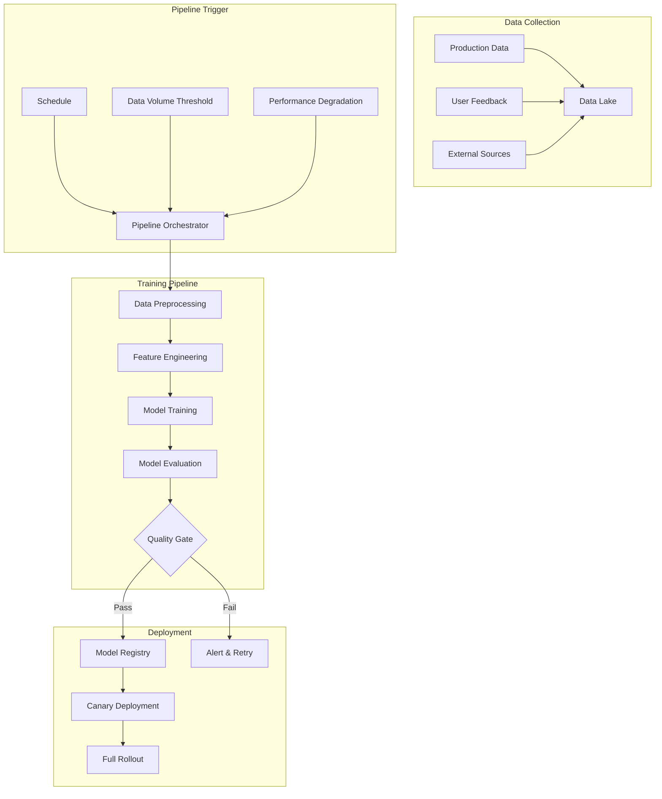

# Tutorial 18: Continuous Training Pipeline

## Learning Objectives

- Build automated data collection pipelines
- Implement continuous model retraining workflows
- Use Kubeflow Pipelines for orchestration
- Set up trigger-based retraining
- Monitor training pipeline health

## Prerequisites

- Completion of Tutorial 09
- Kubernetes knowledge
- Understanding of ML pipeline orchestration

## Architecture Overview



## Implementation

Create `continuous_training_pipeline.py` (Kubeflow):

```python
from kfp import dsl, compiler
from kfp.components import create_component_from_func

@create_component_from_func
def collect_data() -> str:
    """Collect training data from production."""
    import pandas as pd
    from datetime import datetime, timedelta

    # Simulate data collection
    # In production: query from data warehouse

    data_path = f"/data/training_{datetime.now().strftime('%Y%m%d')}.csv"
    # Collect and save data
    print(f"Data collected: {data_path}")
    return data_path

@create_component_from_func
def validate_data(data_path: str) -> bool:
    """Validate data quality."""
    import pandas as pd

    # Load and validate
    # Check for missing values, distribution, etc.
    print(f"Validating: {data_path}")
    return True

@create_component_from_func
def train_model(data_path: str) -> str:
    """Train model on new data."""
    from sklearn.ensemble import RandomForestClassifier
    import mlflow
    import joblib

    # Training logic
    model_path = "/models/model_latest.pkl"
    print(f"Model trained: {model_path}")
    return model_path

@create_component_from_func
def evaluate_model(model_path: str, baseline_accuracy: float) -> bool:
    """Evaluate if new model is better."""
    # Compare with baseline
    new_accuracy = 0.95  # Simulated
    return new_accuracy > baseline_accuracy

@dsl.pipeline(
    name='Continuous Training Pipeline',
    description='Automated model retraining'
)
def continuous_training_pipeline(baseline_accuracy: float = 0.90):
    """Define continuous training pipeline."""

    collect_task = collect_data()

    validate_task = validate_data(
        data_path=collect_task.output
    )

    with dsl.Condition(validate_task.output == True):
        train_task = train_model(
            data_path=collect_task.output
        )

        eval_task = evaluate_model(
            model_path=train_task.output,
            baseline_accuracy=baseline_accuracy
        )

# Compile pipeline
compiler.Compiler().compile(
    continuous_training_pipeline,
    'continuous_training_pipeline.yaml'
)
```

## Verification Steps

```bash
# Install Kubeflow Pipelines SDK
pip install kfp

# Compile pipeline
python continuous_training_pipeline.py

# Deploy to Kubeflow
kfp pipeline upload --pipeline-name continuous-training \
    continuous_training_pipeline.yaml
```

## Best Practices

1. **Data Quality Gates**: Validate before training
2. **Incremental Learning**: Use when appropriate
3. **Pipeline Versioning**: Track pipeline changes
4. **Resource Management**: Optimize compute usage
5. **Monitoring**: Track pipeline health and performance

## Key Takeaways

- Continuous training keeps models fresh automatically
- Orchestration tools manage complex dependencies
- Quality gates prevent bad models from deploying
- Monitoring ensures pipeline reliability
- Integration with production data is critical

## Next Steps

- Tutorial 09: Automated Model Retraining
- Tutorial 22: End-to-End MLOps Platform
