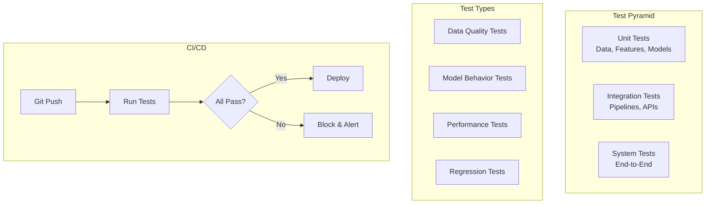

# Tutorial 19: ML Model Testing Framework

## Learning Objectives

- Implement unit tests for ML models
- Create integration tests for ML pipelines
- Use Great Expectations for data validation
- Build model validation frameworks
- Set up CI/CD for ML testing

## Prerequisites

- Python 3.8+, pytest
- Understanding of software testing
- Familiarity with ML model development

## Architecture Overview



## Implementation

Create `test_data_quality.py`:

```python
import pytest
import pandas as pd
import great_expectations as ge
from great_expectations.dataset import PandasDataset

class TestDataQuality:
    @pytest.fixture
    def sample_data(self):
        return pd.DataFrame({
            'age': [25, 30, 35, 40],
            'income': [50000, 60000, 70000, 80000],
            'label': [0, 1, 0, 1]
        })

    def test_no_missing_values(self, sample_data):
        """Test that dataset has no missing values."""
        assert sample_data.isnull().sum().sum() == 0

    def test_age_range(self, sample_data):
        """Test age is within valid range."""
        assert sample_data['age'].min() >= 18
        assert sample_data['age'].max() <= 100

    def test_label_distribution(self, sample_data):
        """Test label distribution is balanced."""
        dist = sample_data['label'].value_counts(normalize=True)
        assert all(dist >= 0.3)  # No class < 30%

    def test_with_great_expectations(self, sample_data):
        """Use Great Expectations for validation."""
        df_ge = PandasDataset(sample_data)

        # Define expectations
        df_ge.expect_column_values_to_not_be_null('age')
        df_ge.expect_column_values_to_be_between('age', 18, 100)
        df_ge.expect_column_values_to_be_in_set('label', [0, 1])

        # Validate
        results = df_ge.validate()
        assert results.success
```

Create `test_model.py`:

```python
import pytest
import numpy as np
from sklearn.ensemble import RandomForestClassifier
from sklearn.datasets import make_classification

class TestModel:
    @pytest.fixture
    def trained_model(self):
        X, y = make_classification(n_samples=1000, n_features=20,
                                   random_state=42)
        model = RandomForestClassifier(random_state=42)
        model.fit(X, y)
        return model, X, y

    def test_model_predicts(self, trained_model):
        """Test that model can make predictions."""
        model, X, y = trained_model
        predictions = model.predict(X[:10])
        assert len(predictions) == 10
        assert all(p in [0, 1] for p in predictions)

    def test_model_accuracy(self, trained_model):
        """Test minimum accuracy threshold."""
        model, X, y = trained_model
        accuracy = model.score(X, y)
        assert accuracy >= 0.95, f"Accuracy {accuracy} below threshold"

    def test_prediction_confidence(self, trained_model):
        """Test prediction confidence scores."""
        model, X, y = trained_model
        probas = model.predict_proba(X[:10])

        # All probabilities should sum to 1
        assert np.allclose(probas.sum(axis=1), 1.0)

        # Check confidence levels
        max_probas = probas.max(axis=1)
        assert (max_probas >= 0.5).all(), "Low confidence predictions"

    def test_feature_importance(self, trained_model):
        """Test that model uses features."""
        model, X, y = trained_model
        importance = model.feature_importances_

        # At least some features should be important
        assert importance.sum() > 0
        assert (importance >= 0).all()

    def test_invariance(self, trained_model):
        """Test model invariance to irrelevant features."""
        model, X, y = trained_model

        # Add noise feature
        X_noise = np.column_stack([X, np.random.randn(len(X))])

        # Retrain with noise
        model_noise = RandomForestClassifier(random_state=42)
        model_noise.fit(X_noise, y)

        # Predictions should be similar
        pred_original = model.predict(X[:100])
        pred_noise = model_noise.predict(X_noise[:100])

        agreement = (pred_original == pred_noise).mean()
        assert agreement >= 0.95, "Model not robust to noise features"

    def test_determinism(self, trained_model):
        """Test model predictions are deterministic."""
        model, X, y = trained_model

        pred1 = model.predict(X[:10])
        pred2 = model.predict(X[:10])

        assert np.array_equal(pred1, pred2), "Predictions not deterministic"
```

Create `test_pipeline.py`:

```python
import pytest
from sklearn.pipeline import Pipeline
from sklearn.preprocessing import StandardScaler
from sklearn.ensemble import RandomForestClassifier
from sklearn.datasets import make_classification

class TestMLPipeline:
    @pytest.fixture
    def pipeline(self):
        return Pipeline([
            ('scaler', StandardScaler()),
            ('classifier', RandomForestClassifier(random_state=42))
        ])

    @pytest.fixture
    def data(self):
        return make_classification(n_samples=1000, n_features=20,
                                   random_state=42)

    def test_pipeline_fit(self, pipeline, data):
        """Test pipeline can fit."""
        X, y = data
        pipeline.fit(X, y)
        assert hasattr(pipeline, 'classes_')

    def test_pipeline_predict(self, pipeline, data):
        """Test pipeline can predict."""
        X, y = data
        pipeline.fit(X, y)
        predictions = pipeline.predict(X[:10])
        assert len(predictions) == 10

    def test_pipeline_transform(self, pipeline, data):
        """Test scaling step works."""
        X, y = data
        pipeline.fit(X, y)

        # Get scaled features
        scaled = pipeline.named_steps['scaler'].transform(X)

        # Check scaling
        assert np.abs(scaled.mean()) < 0.1  # Mean near 0
        assert np.abs(scaled.std() - 1.0) < 0.1  # Std near 1

    def test_pipeline_serialization(self, pipeline, data):
        """Test pipeline can be saved and loaded."""
        import joblib
        import tempfile

        X, y = data
        pipeline.fit(X, y)

        # Save
        with tempfile.NamedTemporaryFile(delete=False) as f:
            joblib.dump(pipeline, f.name)

            # Load
            loaded = joblib.load(f.name)

            # Compare predictions
            assert np.array_equal(
                pipeline.predict(X[:10]),
                loaded.predict(X[:10])
            )
```

Create `conftest.py` (pytest configuration):

```python
import pytest

def pytest_configure(config):
    """Configure pytest."""
    config.addinivalue_line(
        "markers", "slow: marks tests as slow"
    )
    config.addinivalue_line(
        "markers", "integration: marks tests as integration tests"
    )

@pytest.fixture(scope="session")
def test_config():
    """Global test configuration."""
    return {
        'accuracy_threshold': 0.95,
        'max_latency_ms': 100,
        'min_samples': 1000
    }
```

## Verification Steps

```bash
# Install dependencies
pip install pytest great-expectations scikit-learn

# Run all tests
pytest

# Run with coverage
pytest --cov=.

# Run specific test file
pytest test_model.py

# Run only fast tests
pytest -m "not slow"
```

## Best Practices

1. **Test Pyramid**: More unit tests, fewer integration tests
2. **Data Testing**: Validate data before model testing
3. **Model Invariants**: Test expected model behaviors
4. **CI Integration**: Run tests on every commit
5. **Test Coverage**: Aim for >80% coverage

## Key Takeaways

- ML models need different testing strategies than software
- Data quality tests prevent garbage-in-garbage-out
- Model behavior tests catch unexpected issues
- Automated testing enables confident deployment
- Integration with CI/CD is essential

## Next Steps

- Tutorial 07: Model Monitoring
- Tutorial 22: End-to-End MLOps Platform
