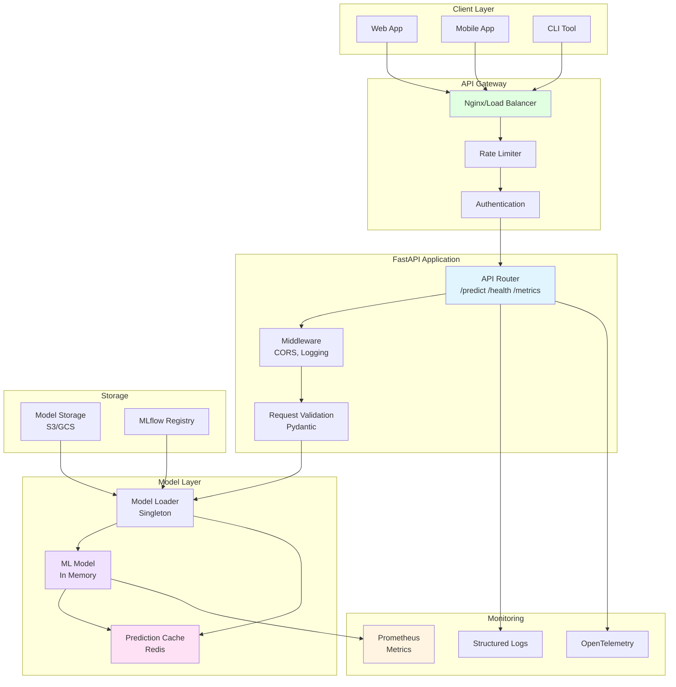
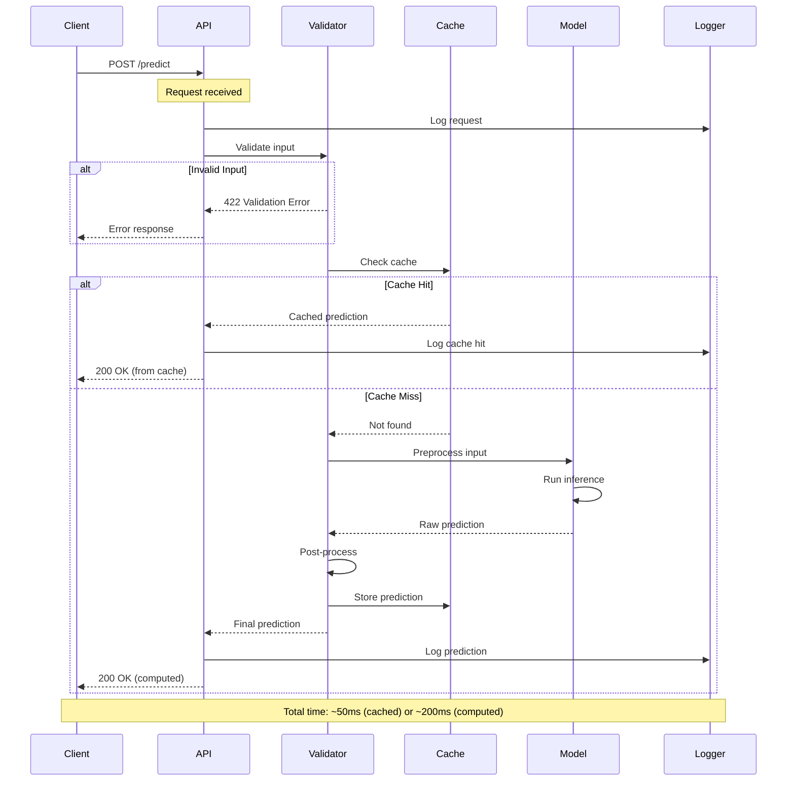
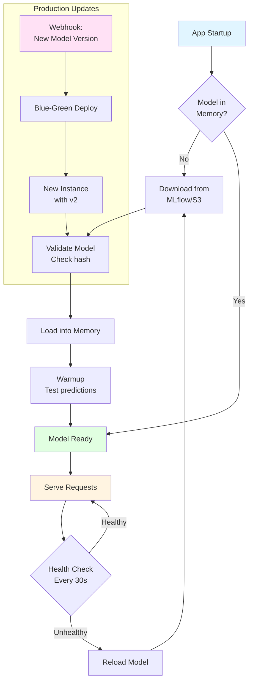

# Tutorial 20: Model Serving with FastAPI

## 📐 Architecture Diagram



## 🌊 Request Flow Diagram



## 🔄 Model Loading Strategy



## 🎯 Learning Objectives

- ✅ Build production-ready ML API with FastAPI
- ✅ Implement request validation with Pydantic
- ✅ Add authentication and rate limiting
- ✅ Optimize inference performance
- ✅ Implement caching strategies
- ✅ Add health checks and monitoring
- ✅ Containerize with Docker
- ✅ Deploy with proper logging and metrics

## 📋 Prerequisites

- Python 3.9+
- Docker (optional)
- Trained ML model
- Basic FastAPI knowledge

## 🛠️ Setup

```bash
pip install fastapi uvicorn pydantic python-multipart
pip install scikit-learn joblib redis prometheus-client
```

## 📝 Complete Implementation

### Step 1: Project Structure

```
20_Model_Serving_FastAPI/
├── app/
│   ├── __init__.py
│   ├── main.py              # FastAPI app
│   ├── models.py            # Pydantic models
│   ├── ml/
│   │   ├── __init__.py
│   │   ├── model.py         # Model loader
│   │   ├── predict.py       # Prediction logic
│   │   └── preprocessing.py # Data preprocessing
│   ├── api/
│   │   ├── __init__.py
│   │   ├── routes.py        # API endpoints
│   │   └── dependencies.py  # Dependencies
│   └── core/
│       ├── __init__.py
│       ├── config.py        # Configuration
│       └── logging.py       # Logging setup
├── models/
│   └── model.pkl            # Trained model
├── tests/
│   └── test_api.py
├── Dockerfile
├── docker-compose.yml
├── requirements.txt
└── README.md
```

### Step 2: Configuration

Create `app/core/config.py`:

```python
"""Application configuration"""
from pydantic_settings import BaseSettings
from functools import lru_cache

class Settings(BaseSettings):
    """Application settings"""

    # App
    app_name: str = "ML Model API"
    app_version: str = "1.0.0"
    debug: bool = False

    # API
    api_prefix: str = "/api/v1"
    allowed_hosts: list = ["*"]

    # Model
    model_path: str = "./models/model.pkl"
    model_name: str = "iris_classifier"
    model_version: str = "1.0.0"

    # Cache
    redis_url: str = "redis://localhost:6379"
    cache_ttl: int = 3600  # 1 hour

    # Rate limiting
    rate_limit_requests: int = 100
    rate_limit_period: int = 60  # per minute

    # Monitoring
    enable_metrics: bool = True
    log_level: str = "INFO"

    class Config:
        env_file = ".env"

@lru_cache()
def get_settings() -> Settings:
    """Get cached settings"""
    return Settings()
```

### Step 3: Pydantic Models

Create `app/models.py`:

```python
"""Request and response models"""
from pydantic import BaseModel, Field, validator
from typing import List, Optional
from datetime import datetime

class PredictionRequest(BaseModel):
    """Prediction request schema"""

    features: List[float] = Field(
        ...,
        min_items=4,
        max_items=4,
        description="Input features (4 values for Iris dataset)"
    )

    model_version: Optional[str] = Field(
        None,
        description="Specific model version to use"
    )

    @validator('features')
    def validate_features(cls, v):
        """Validate feature values"""
        for val in v:
            if val < 0:
                raise ValueError("Features must be non-negative")
            if val > 100:  # Reasonable upper bound
                raise ValueError("Feature values seem unrealistic")
        return v

    class Config:
        json_schema_extra = {
            "example": {
                "features": [5.1, 3.5, 1.4, 0.2],
                "model_version": "1.0.0"
            }
        }

class PredictionResponse(BaseModel):
    """Prediction response schema"""

    prediction: int = Field(..., description="Predicted class")
    probability: List[float] = Field(..., description="Class probabilities")
    class_name: str = Field(..., description="Predicted class name")
    model_version: str = Field(..., description="Model version used")
    prediction_id: str = Field(..., description="Unique prediction ID")
    timestamp: datetime = Field(default_factory=datetime.utcnow)
    inference_time_ms: float = Field(..., description="Inference time in milliseconds")

    class Config:
        json_schema_extra = {
            "example": {
                "prediction": 0,
                "probability": [0.98, 0.01, 0.01],
                "class_name": "setosa",
                "model_version": "1.0.0",
                "prediction_id": "abc123",
                "timestamp": "2024-01-15T10:30:00",
                "inference_time_ms": 12.5
            }
        }

class HealthResponse(BaseModel):
    """Health check response"""

    status: str
    model_loaded: bool
    model_version: str
    uptime_seconds: float
    timestamp: datetime = Field(default_factory=datetime.utcnow)

class BatchPredictionRequest(BaseModel):
    """Batch prediction request"""

    instances: List[List[float]] = Field(
        ...,
        min_items=1,
        max_items=100,  # Limit batch size
        description="List of feature vectors"
    )

class BatchPredictionResponse(BaseModel):
    """Batch prediction response"""

    predictions: List[PredictionResponse]
    batch_size: int
    total_time_ms: float
```

### Step 4: Model Loader

Create `app/ml/model.py`:

```python
"""Model loading and management"""
import joblib
import time
from pathlib import Path
from typing import Optional
import numpy as np
from app.core.config import get_settings

class ModelLoader:
    """Singleton model loader"""

    _instance: Optional['ModelLoader'] = None
    _model = None
    _scaler = None
    _loaded_at = None

    def __new__(cls):
        if cls._instance is None:
            cls._instance = super().__new__(cls)
        return cls._instance

    def load_model(self, model_path: Optional[str] = None):
        """Load model into memory"""

        if model_path is None:
            settings = get_settings()
            model_path = settings.model_path

        print(f"📦 Loading model from {model_path}")
        start = time.time()

        self._model = joblib.load(model_path)

        # Try to load scaler if exists
        scaler_path = Path(model_path).parent / "scaler.pkl"
        if scaler_path.exists():
            self._scaler = joblib.load(scaler_path)

        self._loaded_at = time.time()
        load_time = self._loaded_at - start

        print(f"✅ Model loaded in {load_time:.2f}s")

        # Warmup
        self._warmup()

    def _warmup(self):
        """Warmup model with dummy predictions"""
        print("🔥 Warming up model...")

        dummy_input = np.array([[5.1, 3.5, 1.4, 0.2]])

        for _ in range(10):
            self._model.predict(dummy_input)

        print("✅ Warmup complete")

    def get_model(self):
        """Get loaded model"""
        if self._model is None:
            raise RuntimeError("Model not loaded. Call load_model() first.")
        return self._model

    def get_scaler(self):
        """Get loaded scaler"""
        return self._scaler

    def get_load_time(self):
        """Get model load timestamp"""
        return self._loaded_at

    def is_loaded(self) -> bool:
        """Check if model is loaded"""
        return self._model is not None

# Global instance
model_loader = ModelLoader()
```

### Step 5: Prediction Logic

Create `app/ml/predict.py`:

```python
"""Prediction logic"""
import time
import uuid
import numpy as np
from typing import List
from app.ml.model import model_loader
from app.models import PredictionResponse

# Class names for Iris dataset
CLASS_NAMES = {
    0: "setosa",
    1: "versicolor",
    2: "virginica"
}

def predict(features: List[float], model_version: str = "1.0.0") -> PredictionResponse:
    """Make prediction"""

    start = time.time()

    # Get model
    model = model_loader.get_model()
    scaler = model_loader.get_scaler()

    # Prepare input
    X = np.array([features])

    # Scale if scaler exists
    if scaler is not None:
        X = scaler.transform(X)

    # Predict
    prediction = model.predict(X)[0]
    probabilities = model.predict_proba(X)[0].tolist()

    # Calculate inference time
    inference_time = (time.time() - start) * 1000  # Convert to ms

    # Create response
    response = PredictionResponse(
        prediction=int(prediction),
        probability=probabilities,
        class_name=CLASS_NAMES[prediction],
        model_version=model_version,
        prediction_id=str(uuid.uuid4()),
        inference_time_ms=round(inference_time, 2)
    )

    return response

def predict_batch(instances: List[List[float]], model_version: str = "1.0.0") -> List[PredictionResponse]:
    """Batch prediction"""

    results = []

    for features in instances:
        result = predict(features, model_version)
        results.append(result)

    return results
```

### Step 6: API Routes

Create `app/api/routes.py`:

```python
"""API routes"""
from fastapi import APIRouter, HTTPException, Depends
from app.models import (
    PredictionRequest,
    PredictionResponse,
    BatchPredictionRequest,
    BatchPredictionResponse,
    HealthResponse
)
from app.ml.predict import predict, predict_batch
from app.ml.model import model_loader
from app.core.config import get_settings
import time

router = APIRouter()

# Startup time
startup_time = time.time()

@router.get("/health", response_model=HealthResponse)
async def health_check():
    """Health check endpoint"""

    uptime = time.time() - startup_time
    settings = get_settings()

    return HealthResponse(
        status="healthy" if model_loader.is_loaded() else "unhealthy",
        model_loaded=model_loader.is_loaded(),
        model_version=settings.model_version,
        uptime_seconds=round(uptime, 2)
    )

@router.post("/predict", response_model=PredictionResponse)
async def predict_endpoint(request: PredictionRequest):
    """Single prediction endpoint"""

    try:
        settings = get_settings()
        model_version = request.model_version or settings.model_version

        result = predict(request.features, model_version)

        return result

    except Exception as e:
        raise HTTPException(status_code=500, detail=str(e))

@router.post("/predict/batch", response_model=BatchPredictionResponse)
async def batch_predict_endpoint(request: BatchPredictionRequest):
    """Batch prediction endpoint"""

    try:
        start = time.time()
        settings = get_settings()

        results = predict_batch(request.instances, settings.model_version)

        total_time = (time.time() - start) * 1000  # Convert to ms

        return BatchPredictionResponse(
            predictions=results,
            batch_size=len(results),
            total_time_ms=round(total_time, 2)
        )

    except Exception as e:
        raise HTTPException(status_code=500, detail=str(e))

@router.get("/model/info")
async def model_info():
    """Get model information"""

    if not model_loader.is_loaded():
        raise HTTPException(status_code=503, detail="Model not loaded")

    settings = get_settings()
    model = model_loader.get_model()

    return {
        "model_name": settings.model_name,
        "model_version": settings.model_version,
        "model_type": type(model).__name__,
        "loaded_at": model_loader.get_load_time(),
        "parameters": model.get_params()
    }
```

### Step 7: Main Application

Create `app/main.py`:

```python
"""FastAPI application"""
from fastapi import FastAPI
from fastapi.middleware.cors import CORSMiddleware
from app.core.config import get_settings
from app.api.routes import router
from app.ml.model import model_loader
import uvicorn

# Get settings
settings = get_settings()

# Create FastAPI app
app = FastAPI(
    title=settings.app_name,
    version=settings.app_version,
    description="Production ML Model Serving API"
)

# CORS middleware
app.add_middleware(
    CORSMiddleware,
    allow_origins=settings.allowed_hosts,
    allow_credentials=True,
    allow_methods=["*"],
    allow_headers=["*"],
)

# Include routes
app.include_router(router, prefix=settings.api_prefix, tags=["predictions"])

@app.on_event("startup")
async def startup_event():
    """Load model on startup"""
    print("🚀 Starting ML API...")
    model_loader.load_model()
    print("✅ API ready to serve requests!")

@app.on_event("shutdown")
async def shutdown_event():
    """Cleanup on shutdown"""
    print("👋 Shutting down ML API...")

@app.get("/")
async def root():
    """Root endpoint"""
    return {
        "message": "ML Model API",
        "version": settings.app_version,
        "docs": "/docs"
    }

if __name__ == "__main__":
    uvicorn.run(
        "app.main:app",
        host="0.0.0.0",
        port=8000,
        reload=settings.debug
    )
```

### Step 8: Dockerfile

Create `Dockerfile`:

```dockerfile
FROM python:3.11-slim

# Set working directory
WORKDIR /app

# Install dependencies
COPY requirements.txt .
RUN pip install --no-cache-dir -r requirements.txt

# Copy application
COPY ./app ./app
COPY ./models ./models

# Expose port
EXPOSE 8000

# Run application
CMD ["uvicorn", "app.main:app", "--host", "0.0.0.0", "--port", "8000"]
```

### Step 9: Docker Compose

Create `docker-compose.yml`:

```yaml
version: '3.8'

services:
  api:
    build: .
    ports:
      - "8000:8000"
    environment:
      - DEBUG=false
      - REDIS_URL=redis://redis:6379
    depends_on:
      - redis
    volumes:
      - ./models:/app/models
    healthcheck:
      test: ["CMD", "curl", "-f", "http://localhost:8000/api/v1/health"]
      interval: 30s
      timeout: 10s
      retries: 3

  redis:
    image: redis:7-alpine
    ports:
      - "6379:6379"
    volumes:
      - redis_data:/data

volumes:
  redis_data:
```

## ✅ Verification

### 1. Run Locally

```bash
# Start API
uvicorn app.main:app --reload

# Or with Docker
docker-compose up
```

### 2. Test Endpoints

```bash
# Health check
curl http://localhost:8000/api/v1/health

# Single prediction
curl -X POST http://localhost:8000/api/v1/predict \
  -H "Content-Type: application/json" \
  -d '{"features": [5.1, 3.5, 1.4, 0.2]}'

# Batch prediction
curl -X POST http://localhost:8000/api/v1/predict/batch \
  -H "Content-Type: application/json" \
  -d '{
    "instances": [
      [5.1, 3.5, 1.4, 0.2],
      [6.7, 3.1, 4.7, 1.5]
    ]
  }'
```

### 3. Interactive Docs

Open browser: `http://localhost:8000/docs`

## 💡 Best Practices

### 1. Model Versioning
```python
# ✅ Support multiple model versions
models = {
    "v1.0": load_model("model_v1.pkl"),
    "v2.0": load_model("model_v2.pkl")
}
```

### 2. Input Validation
```python
# ✅ Strict validation
class Request(BaseModel):
    features: List[float] = Field(..., min_items=4, max_items=4)

# ❌ No validation
features: List[float]
```

### 3. Error Handling
```python
# ✅ Specific error messages
try:
    prediction = model.predict(X)
except ValueError as e:
    raise HTTPException(400, detail=f"Invalid input: {e}")
```

## 📚 Key Takeaways

- ✅ FastAPI provides automatic API documentation
- ✅ Pydantic ensures type safety and validation
- ✅ Singleton pattern for model loading
- ✅ Health checks are essential for production
- ✅ Docker enables consistent deployments
- ✅ Async endpoints improve concurrency

---

**Next Tutorial:** [21_LLM_Observability](../21_LLM_Observability/) - Monitor and observe LLM systems.
