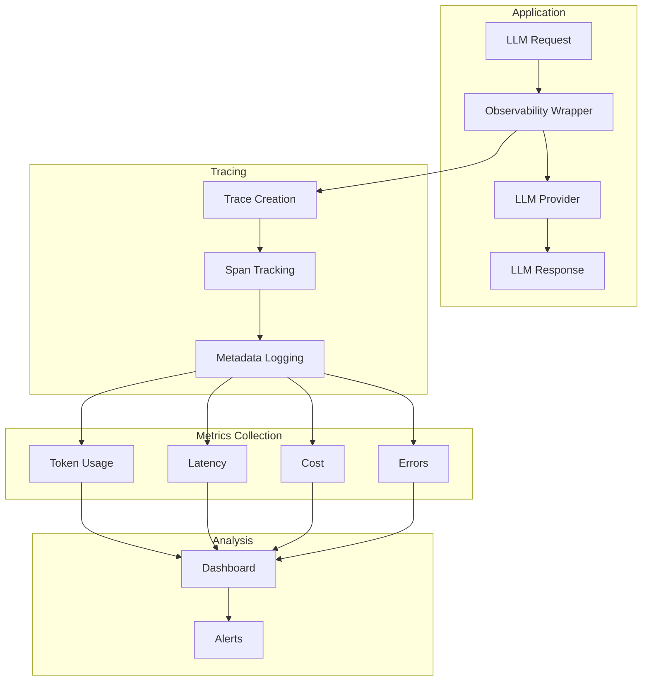

# Tutorial 21: LLM Observability System

## Learning Objectives

- Implement LangSmith or Helicone for LLM tracing
- Track token usage and costs in real-time
- Monitor latency and error rates
- Analyze prompt-response quality
- Build observability dashboards

## Prerequisites

- Python 3.8+
- LangChain knowledge
- API keys for LangSmith/Helicone

## Architecture Overview



## Implementation

Create `langsmith_observability.py`:

```python
from langsmith import Client
from langchain.chat_models import ChatOpenAI
from langchain.callbacks.tracers import LangChainTracer
import os

class LLMObservability:
    def __init__(self, project_name: str = "llm-observability"):
        # Initialize LangSmith
        os.environ["LANGCHAIN_TRACING_V2"] = "true"
        os.environ["LANGCHAIN_PROJECT"] = project_name

        self.client = Client()
        self.tracer = LangChainTracer(project_name=project_name)

    def traced_llm_call(self, prompt: str, model: str = "gpt-3.5-turbo"):
        """Make LLM call with full tracing."""
        llm = ChatOpenAI(
            model=model,
            callbacks=[self.tracer]
        )

        response = llm.predict(prompt)
        return response

    def get_traces(self, limit: int = 10):
        """Retrieve recent traces."""
        runs = self.client.list_runs(
            project_name=os.environ["LANGCHAIN_PROJECT"],
            limit=limit
        )
        return list(runs)

    def get_trace_details(self, run_id: str):
        """Get detailed trace information."""
        run = self.client.read_run(run_id)
        return {
            'id': run.id,
            'name': run.name,
            'inputs': run.inputs,
            'outputs': run.outputs,
            'latency_ms': run.end_time - run.start_time
                          if run.end_time else None,
            'tokens': run.extra.get('usage', {}),
            'cost': self._calculate_cost(run)
        }

    def _calculate_cost(self, run) -> float:
        """Calculate cost from run metadata."""
        # Implementation depends on pricing structure
        return 0.0

# Usage
obs = LLMObservability()

# Make traced call
response = obs.traced_llm_call("Explain quantum computing")

# View traces
traces = obs.get_traces(limit=5)
for trace in traces:
    details = obs.get_trace_details(trace.id)
    print(f"Trace: {details}")
```

Create `helicone_integration.py`:

```python
import openai
from helicone import Helicone
from typing import Dict
import time

class HeliconeObservability:
    def __init__(self, helicone_api_key: str, openai_api_key: str):
        self.helicone = Helicone(api_key=helicone_api_key)

        # Configure OpenAI to use Helicone proxy
        openai.api_base = "https://oai.hconeai.com/v1"
        openai.api_key = openai_api_key

        # Set Helicone headers
        self.default_headers = {
            "Helicone-Auth": f"Bearer {helicone_api_key}"
        }

    def tracked_completion(self, prompt: str, model: str = "gpt-3.5-turbo",
                          metadata: Dict = None) -> Dict:
        """Make completion with Helicone tracking."""
        headers = self.default_headers.copy()

        if metadata:
            # Add custom metadata
            for key, value in metadata.items():
                headers[f"Helicone-Property-{key}"] = str(value)

        start_time = time.time()

        response = openai.ChatCompletion.create(
            model=model,
            messages=[{"role": "user", "content": prompt}],
            headers=headers
        )

        latency = time.time() - start_time

        return {
            'response': response,
            'latency': latency,
            'metadata': metadata
        }

    def get_analytics(self):
        """Get analytics from Helicone API."""
        # Query Helicone API for analytics
        # Implementation depends on Helicone SDK
        pass

# Usage
helicone = HeliconeObservability(
    helicone_api_key="your-key",
    openai_api_key="your-key"
)

result = helicone.tracked_completion(
    "Explain machine learning",
    metadata={
        'user_id': 'user_123',
        'session_id': 'session_456',
        'environment': 'production'
    }
)
```

Create `custom_observability.py`:

```python
from typing import Dict, List
from dataclasses import dataclass, asdict
from datetime import datetime
import json
import time

@dataclass
class LLMTrace:
    trace_id: str
    timestamp: datetime
    model: str
    prompt: str
    response: str
    latency_ms: float
    prompt_tokens: int
    completion_tokens: int
    total_tokens: int
    cost_usd: float
    metadata: Dict

class CustomObservability:
    def __init__(self, storage_file: str = "llm_traces.jsonl"):
        self.storage_file = storage_file
        self.traces = []

    def trace_llm_call(self, func):
        """Decorator for tracing LLM calls."""
        def wrapper(*args, **kwargs):
            start_time = time.time()

            # Execute LLM call
            response = func(*args, **kwargs)

            latency_ms = (time.time() - start_time) * 1000

            # Extract trace data
            trace = LLMTrace(
                trace_id=f"trace_{int(time.time()*1000)}",
                timestamp=datetime.now(),
                model=kwargs.get('model', 'unknown'),
                prompt=str(args[0]) if args else "",
                response=str(response),
                latency_ms=latency_ms,
                prompt_tokens=response.get('usage', {}).get('prompt_tokens', 0),
                completion_tokens=response.get('usage', {}).get('completion_tokens', 0),
                total_tokens=response.get('usage', {}).get('total_tokens', 0),
                cost_usd=self._calculate_cost(response),
                metadata=kwargs.get('metadata', {})
            )

            # Log trace
            self.log_trace(trace)

            return response

        return wrapper

    def log_trace(self, trace: LLMTrace):
        """Log trace to storage."""
        self.traces.append(trace)

        with open(self.storage_file, 'a') as f:
            f.write(json.dumps(asdict(trace), default=str) + '\n')

    def get_metrics(self, time_window_hours: int = 24) -> Dict:
        """Calculate metrics for time window."""
        from datetime import timedelta

        cutoff = datetime.now() - timedelta(hours=time_window_hours)

        recent_traces = [
            t for t in self.traces
            if t.timestamp >= cutoff
        ]

        if not recent_traces:
            return {}

        return {
            'total_calls': len(recent_traces),
            'total_cost': sum(t.cost_usd for t in recent_traces),
            'avg_latency_ms': sum(t.latency_ms for t in recent_traces) / len(recent_traces),
            'total_tokens': sum(t.total_tokens for t in recent_traces),
            'error_rate': 0.0  # Would track errors
        }

    def _calculate_cost(self, response) -> float:
        """Calculate cost from response."""
        # Implementation depends on pricing
        return 0.0

# Usage
obs = CustomObservability()

@obs.trace_llm_call
def my_llm_function(prompt, model="gpt-3.5-turbo"):
    import openai
    return openai.ChatCompletion.create(
        model=model,
        messages=[{"role": "user", "content": prompt}]
    )

# Make calls
result = my_llm_function("Hello, world!")

# Get metrics
metrics = obs.get_metrics(time_window_hours=1)
print(metrics)
```

## Verification Steps

```bash
# Install dependencies
pip install langsmith langchain helicone

# Set environment variables
export LANGCHAIN_API_KEY=your_key
export LANGCHAIN_TRACING_V2=true

# Run observability examples
python langsmith_observability.py

# View traces in LangSmith dashboard
# Visit: https://smith.langchain.com
```

## Best Practices

1. **Comprehensive Tracing**: Capture all LLM interactions
2. **Cost Tracking**: Monitor spend in real-time
3. **Error Logging**: Track failures and retries
4. **Performance Metrics**: Monitor latency percentiles
5. **User Context**: Tag traces with user/session info

## Key Takeaways

- Observability is critical for production LLM applications
- Distributed tracing reveals system behavior
- Cost and latency monitoring prevent surprises
- Error tracking enables quick debugging
- Integration with monitoring tools provides visibility

## Next Steps

- Tutorial 15: LLM Cost Optimization
- Tutorial 22: End-to-End MLOps Platform
