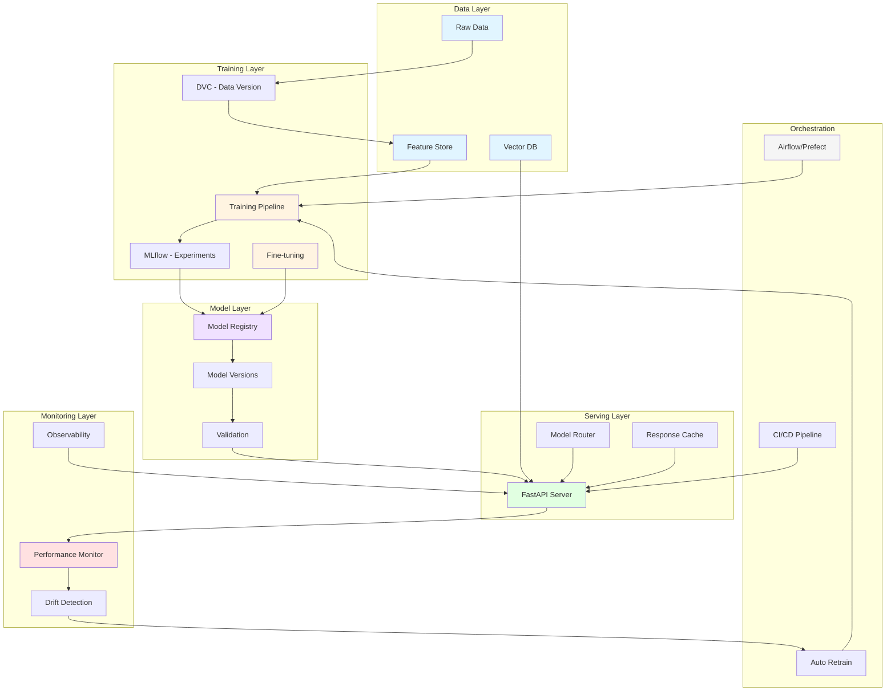

# 5.11 MLOps & LLMOps - Machine Learning Operations at Scale

## Overview

This section provides **22 comprehensive, hands-on tutorials** covering MLOps (Machine Learning Operations) and LLMOps (Large Language Model Operations). Each tutorial includes detailed architecture diagrams, data flow visualizations, and practical implementations.

## Philosophy

- 🎯 **Visual First**: Each tutorial starts with architecture diagrams for easy understanding
- 🔄 **End-to-End Workflows**: Complete pipelines from data to deployment
- 📊 **Production-Ready**: Real-world patterns used in production systems
- 🧪 **Hands-On**: Runnable code with detailed explanations
- 📈 **Incremental Learning**: Build from simple to complex systems

## Tutorial Structure

Each tutorial contains:
- 📐 **Architecture Diagrams**: Mermaid diagrams showing system architecture
- 🌊 **Data Flow Diagrams**: Visualize how data moves through the system
- 📋 **Prerequisites**: What you need before starting
- 🎯 **Learning Objectives**: What you'll master
- 💻 **Complete Code**: Production-ready implementations
- ✅ **Verification Steps**: Ensure everything works
- 🧹 **Cleanup Instructions**: Remove resources when done
- 💡 **Best Practices**: Industry-standard patterns

## Tutorials Overview

### Foundation (Tutorials 01-05)
1. **[01_Basic_ML_Pipeline](./01_Basic_ML_Pipeline/)** - Simple end-to-end ML training pipeline
2. **[02_Model_Versioning_DVC](./02_Model_Versioning_DVC/)** - Track models and datasets with DVC
3. **[03_Experiment_Tracking_MLflow](./03_Experiment_Tracking_MLflow/)** - MLflow for experiment management
4. **[04_Model_Registry_Deployment](./04_Model_Registry_Deployment/)** - Centralized model registry
5. **[05_AB_Testing_Models](./05_AB_Testing_Models/)** - A/B test different model versions

### Advanced MLOps (Tutorials 06-09)
6. **[06_Feature_Store](./06_Feature_Store/)** - Centralized feature management with Feast
7. **[07_Model_Monitoring](./07_Model_Monitoring/)** - Monitor model performance in production
8. **[08_Data_Drift_Detection](./08_Data_Drift_Detection/)** - Detect and alert on data drift
9. **[09_Auto_Model_Retraining](./09_Auto_Model_Retraining/)** - Automated retraining pipelines

### LLMOps Fundamentals (Tutorials 10-14)
10. **[10_LLM_Finetuning_Pipeline](./10_LLM_Finetuning_Pipeline/)** - Fine-tune LLMs efficiently
11. **[11_Prompt_Management](./11_Prompt_Management/)** - Version and manage prompts
12. **[12_RAG_Pipeline](./12_RAG_Pipeline/)** - Retrieval Augmented Generation system
13. **[13_LLM_Evaluation](./13_LLM_Evaluation/)** - Evaluate LLM outputs systematically
14. **[14_Vector_Database](./14_Vector_Database/)** - Integrate vector databases (Pinecone, Weaviate)

### LLMOps Advanced (Tutorials 15-18)
15. **[15_LLM_Cost_Optimization](./15_LLM_Cost_Optimization/)** - Reduce LLM inference costs
16. **[16_Multi_Model_Router](./16_Multi_Model_Router/)** - Route requests to optimal models
17. **[17_LLM_Caching](./17_LLM_Caching/)** - Implement semantic caching
18. **[18_Continuous_Training](./18_Continuous_Training/)** - Continuous learning pipelines

### Production Systems (Tutorials 19-22)
19. **[19_ML_Testing_Framework](./19_ML_Testing_Framework/)** - Test ML models and data
20. **[20_Model_Serving_FastAPI](./20_Model_Serving_FastAPI/)** - Serve models with FastAPI
21. **[21_LLM_Observability](./21_LLM_Observability/)** - Full observability for LLM systems
22. **[22_End_to_End_MLOps](./22_End_to_End_MLOps/)** - Complete MLOps platform integration

## Prerequisites

### General Requirements
- Python 3.9+
- Docker & Docker Compose
- Git
- 8GB+ RAM
- Basic understanding of ML concepts

### Tools You'll Use
- **ML Frameworks**: scikit-learn, PyTorch, TensorFlow
- **MLOps Tools**: MLflow, DVC, Feast, Weights & Biases
- **LLM Tools**: LangChain, LlamaIndex, OpenAI API, Hugging Face
- **Monitoring**: Prometheus, Grafana, Evidently
- **Serving**: FastAPI, BentoML, Ray Serve
- **Databases**: PostgreSQL, Redis, Milvus, Pinecone, Weaviate
- **Orchestration**: Airflow, Prefect, Kubeflow

## Learning Path

### Beginner Path (Start Here)
```
01 → 02 → 03 → 04 → 20 → 07
```
Learn basic ML pipeline, versioning, tracking, and serving.

### MLOps Engineer Path
```
01 → 02 → 03 → 04 → 06 → 07 → 08 → 09 → 18 → 19 → 22
```
Complete MLOps lifecycle from training to production.

### LLMOps Engineer Path
```
10 → 11 → 12 → 13 → 14 → 15 → 16 → 17 → 21
```
Specialize in Large Language Model operations.

### Full Stack ML Engineer Path
```
Complete all tutorials in order (01 → 22)
```
Master both traditional MLOps and LLMOps.

## Quick Start

### 1. Basic ML Pipeline (5 minutes)
```bash
cd 01_Basic_ML_Pipeline
cat README.md
python train.py
```

### 2. LLM RAG System (10 minutes)
```bash
cd 12_RAG_Pipeline
docker-compose up -d
python rag_app.py
```

### 3. Complete MLOps Platform (30 minutes)
```bash
cd 22_End_to_End_MLOps
./setup.sh
```

## Architecture Overview

Here's how all components fit together in a production ML system:



## Key Concepts Covered

### MLOps Fundamentals
- ✅ Model versioning and lineage tracking
- ✅ Experiment tracking and comparison
- ✅ Feature engineering and storage
- ✅ Model validation and testing
- ✅ Deployment strategies (blue/green, canary, A/B)
- ✅ Performance monitoring
- ✅ Data drift and model drift detection
- ✅ Automated retraining pipelines

### LLMOps Specifics
- ✅ Prompt engineering and versioning
- ✅ Fine-tuning workflows
- ✅ RAG (Retrieval Augmented Generation)
- ✅ Vector embeddings and similarity search
- ✅ LLM evaluation metrics
- ✅ Cost optimization strategies
- ✅ Token usage monitoring
- ✅ Response caching and optimization
- ✅ Multi-model orchestration

### Production Concerns
- ✅ Scalability and performance
- ✅ Security and access control
- ✅ Cost management
- ✅ Compliance and governance
- ✅ Disaster recovery
- ✅ A/B testing and experimentation
- ✅ CI/CD for ML systems
- ✅ Infrastructure as Code for ML

## Best Practices Highlighted

1. **Version Everything**: Code, data, models, and prompts
2. **Automate Testing**: Unit tests, integration tests, and model tests
3. **Monitor Continuously**: Performance, drift, costs, and errors
4. **Document Thoroughly**: Model cards, data sheets, and runbooks
5. **Fail Gracefully**: Circuit breakers, fallbacks, and error handling
6. **Optimize Costs**: Caching, batching, and model selection
7. **Ensure Reproducibility**: Fixed seeds, pinned dependencies, containers
8. **Secure Endpoints**: Authentication, rate limiting, input validation

## Tools Comparison

### Experiment Tracking
| Tool | Best For | Complexity | Cost |
|------|----------|------------|------|
| MLflow | General ML | Low | Free |
| Weights & Biases | Deep Learning | Medium | Freemium |
| Neptune.ai | Enterprise | Medium | Paid |
| TensorBoard | TensorFlow | Low | Free |

### Model Serving
| Tool | Best For | Scalability | Learning Curve |
|------|----------|-------------|----------------|
| FastAPI | Simple REST APIs | Medium | Low |
| BentoML | Production ML | High | Medium |
| Ray Serve | Distributed | Very High | High |
| TensorFlow Serving | TF Models | High | Medium |

### Vector Databases
| Tool | Best For | Performance | Managed Option |
|------|----------|-------------|----------------|
| Pinecone | Cloud-first | High | Yes |
| Weaviate | Self-hosted | High | Yes |
| Milvus | Scale | Very High | Yes |
| Qdrant | Simple setup | High | Yes |

## Common Workflows

### Traditional ML Workflow
```
Data Collection → Feature Engineering → Model Training →
Evaluation → Registration → Deployment → Monitoring → Retraining
```

### LLM Fine-tuning Workflow
```
Dataset Preparation → Prompt Engineering → Fine-tuning →
Evaluation → Deployment → Usage Monitoring → Iteration
```

### RAG Workflow
```
Document Ingestion → Embedding → Vector Storage →
Query → Retrieval → Context Injection → LLM Generation → Response
```

## Progress Tracking

Track your learning progress:

- [ ] Foundation Tutorials (01-05)
- [ ] Advanced MLOps (06-09)
- [ ] LLMOps Fundamentals (10-14)
- [ ] LLMOps Advanced (15-18)
- [ ] Production Systems (19-22)
- [ ] Built a custom project combining 3+ tutorials
- [ ] Deployed a model to production
- [ ] Set up complete monitoring stack
- [ ] Implemented automated retraining

## Additional Resources

### Documentation
- [MLflow Documentation](https://mlflow.org/docs/latest/index.html)
- [DVC Documentation](https://dvc.org/doc)
- [LangChain Documentation](https://python.langchain.com/)
- [Feast Documentation](https://docs.feast.dev/)

### Community
- [MLOps Community Slack](https://mlops.community/)
- [r/MachineLearning](https://www.reddit.com/r/MachineLearning/)
- [Papers with Code](https://paperswithcode.com/)

### Books
- "Designing Machine Learning Systems" by Chip Huyen
- "Machine Learning Engineering" by Andriy Burkov
- "Building Machine Learning Powered Applications" by Emmanuel Ameisen

## Tips for Success

1. **Start Small**: Begin with tutorial 01, even if you're experienced
2. **Type Code**: Don't copy-paste; muscle memory matters
3. **Experiment**: Modify parameters, try different approaches
4. **Break Things**: Best way to learn is to fix what you broke
5. **Document**: Keep notes on what works and what doesn't
6. **Build Projects**: Apply learnings to real problems
7. **Join Community**: Share progress, ask questions
8. **Stay Updated**: MLOps evolves rapidly; keep learning

## Troubleshooting

### Common Issues

**Docker Compose Fails**
```bash
# Check Docker is running
docker ps
# Increase memory allocation in Docker settings
```

**Python Dependencies**
```bash
# Use virtual environment
python -m venv venv
source venv/bin/activate  # On Windows: venv\Scripts\activate
pip install -r requirements.txt
```

**Port Already in Use**
```bash
# Find and kill process
lsof -ti:8000 | xargs kill -9
```

**Out of Memory**
```bash
# Reduce batch size, use smaller models, or add swap space
```

---

**Ready to start?** Pick a tutorial and dive in! Remember: the goal is to build practical, production-ready skills through hands-on practice.
