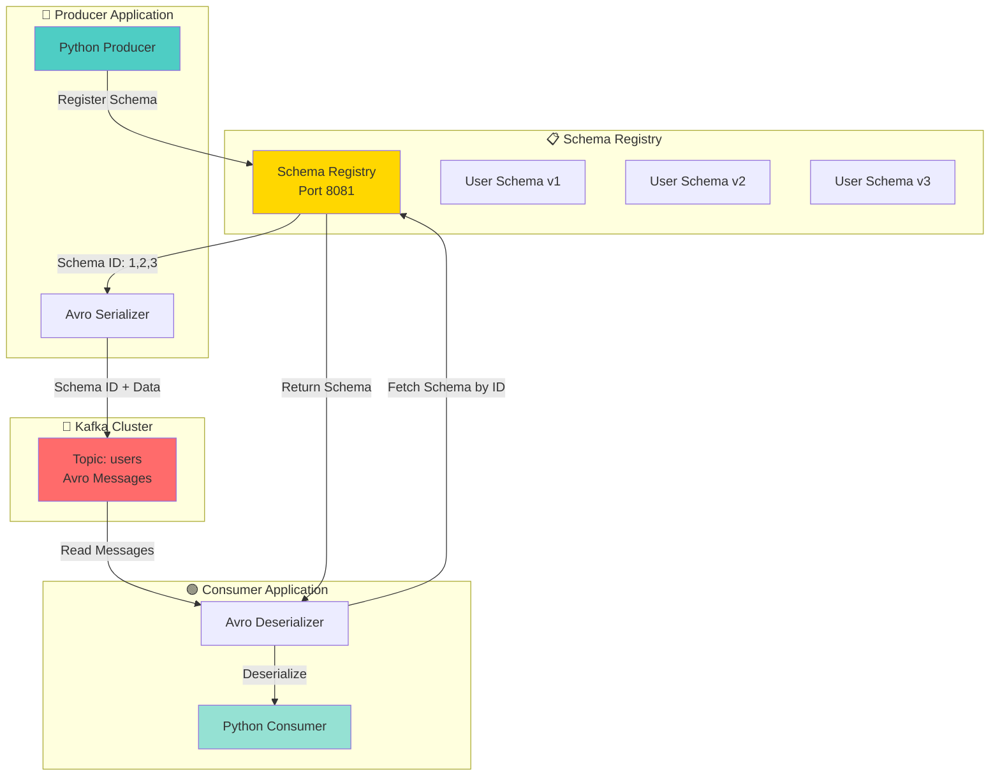
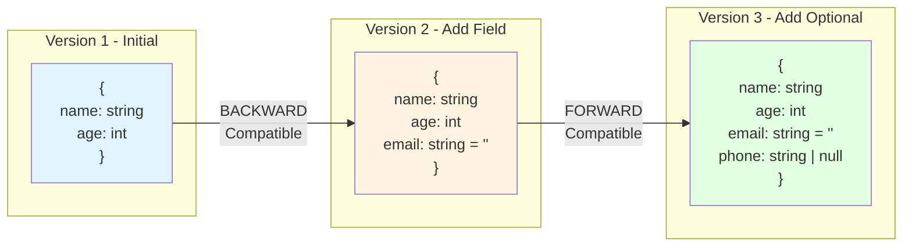

# Tutorial 05: Kafka Schema Registry with Avro

## 📐 Architecture Diagram



## 🌊 Schema Evolution Flow



## 🎯 Learning Objectives

By completing this tutorial, you will:
- ✅ Set up Confluent Schema Registry with Docker
- ✅ Define Avro schemas for message serialization
- ✅ Implement schema evolution strategies
- ✅ Understand compatibility types (BACKWARD, FORWARD, FULL)
- ✅ Build producers with Avro serialization
- ✅ Build consumers with Avro deserialization
- ✅ Handle schema versioning in production
- ✅ Test schema compatibility scenarios

## 📋 Prerequisites

- Docker and Docker Compose installed
- Python 3.8+ with pip
- Basic understanding of Kafka concepts
- Familiarity with data serialization

## 🚀 Part 1: Docker Compose Setup

### docker-compose.yml

```yaml
version: '3.8'

services:
  zookeeper:
    image: confluentinc/cp-zookeeper:7.5.0
    hostname: zookeeper
    container_name: zookeeper
    ports:
      - "2181:2181"
    environment:
      ZOOKEEPER_CLIENT_PORT: 2181
      ZOOKEEPER_TICK_TIME: 2000
    networks:
      - kafka-network

  kafka:
    image: confluentinc/cp-kafka:7.5.0
    hostname: kafka
    container_name: kafka
    depends_on:
      - zookeeper
    ports:
      - "9092:9092"
      - "9101:9101"
    environment:
      KAFKA_BROKER_ID: 1
      KAFKA_ZOOKEEPER_CONNECT: 'zookeeper:2181'
      KAFKA_LISTENER_SECURITY_PROTOCOL_MAP: PLAINTEXT:PLAINTEXT,PLAINTEXT_HOST:PLAINTEXT
      KAFKA_ADVERTISED_LISTENERS: PLAINTEXT://kafka:29092,PLAINTEXT_HOST://localhost:9092
      KAFKA_OFFSETS_TOPIC_REPLICATION_FACTOR: 1
      KAFKA_TRANSACTION_STATE_LOG_MIN_ISR: 1
      KAFKA_TRANSACTION_STATE_LOG_REPLICATION_FACTOR: 1
      KAFKA_GROUP_INITIAL_REBALANCE_DELAY_MS: 0
      KAFKA_JMX_PORT: 9101
      KAFKA_JMX_HOSTNAME: localhost
    networks:
      - kafka-network

  schema-registry:
    image: confluentinc/cp-schema-registry:7.5.0
    hostname: schema-registry
    container_name: schema-registry
    depends_on:
      - kafka
    ports:
      - "8081:8081"
    environment:
      SCHEMA_REGISTRY_HOST_NAME: schema-registry
      SCHEMA_REGISTRY_KAFKASTORE_BOOTSTRAP_SERVERS: 'kafka:29092'
      SCHEMA_REGISTRY_LISTENERS: http://0.0.0.0:8081
      # Compatibility settings
      SCHEMA_REGISTRY_SCHEMA_COMPATIBILITY_LEVEL: BACKWARD
    networks:
      - kafka-network

  schema-registry-ui:
    image: landoop/schema-registry-ui:latest
    hostname: schema-registry-ui
    container_name: schema-registry-ui
    depends_on:
      - schema-registry
    ports:
      - "8000:8000"
    environment:
      SCHEMAREGISTRY_URL: http://schema-registry:8081
      PROXY: "true"
    networks:
      - kafka-network

networks:
  kafka-network:
    driver: bridge
```

### Start the Stack

```bash
# Start all services
docker-compose up -d

# Check service health
docker-compose ps

# View Schema Registry logs
docker-compose logs -f schema-registry

# Test Schema Registry API
curl http://localhost:8081/subjects

# Access Schema Registry UI
# Open browser: http://localhost:8000
```

## 📝 Part 2: Avro Schema Definitions

### schemas/user_v1.avsc

```json
{
  "type": "record",
  "name": "User",
  "namespace": "com.example.kafka",
  "doc": "User information schema version 1",
  "fields": [
    {
      "name": "id",
      "type": "int",
      "doc": "User unique identifier"
    },
    {
      "name": "name",
      "type": "string",
      "doc": "User full name"
    },
    {
      "name": "age",
      "type": "int",
      "doc": "User age in years"
    },
    {
      "name": "created_at",
      "type": "long",
      "logicalType": "timestamp-millis",
      "doc": "Creation timestamp in milliseconds"
    }
  ]
}
```

### schemas/user_v2.avsc (Backward Compatible)

```json
{
  "type": "record",
  "name": "User",
  "namespace": "com.example.kafka",
  "doc": "User information schema version 2 - Added email with default",
  "fields": [
    {
      "name": "id",
      "type": "int",
      "doc": "User unique identifier"
    },
    {
      "name": "name",
      "type": "string",
      "doc": "User full name"
    },
    {
      "name": "age",
      "type": "int",
      "doc": "User age in years"
    },
    {
      "name": "email",
      "type": "string",
      "default": "",
      "doc": "User email address - added in v2"
    },
    {
      "name": "created_at",
      "type": "long",
      "logicalType": "timestamp-millis",
      "doc": "Creation timestamp in milliseconds"
    }
  ]
}
```

### schemas/user_v3.avsc (Full Compatible)

```json
{
  "type": "record",
  "name": "User",
  "namespace": "com.example.kafka",
  "doc": "User information schema version 3 - Added optional phone",
  "fields": [
    {
      "name": "id",
      "type": "int",
      "doc": "User unique identifier"
    },
    {
      "name": "name",
      "type": "string",
      "doc": "User full name"
    },
    {
      "name": "age",
      "type": "int",
      "doc": "User age in years"
    },
    {
      "name": "email",
      "type": "string",
      "default": "",
      "doc": "User email address"
    },
    {
      "name": "phone",
      "type": ["null", "string"],
      "default": null,
      "doc": "User phone number - optional, added in v3"
    },
    {
      "name": "created_at",
      "type": "long",
      "logicalType": "timestamp-millis",
      "doc": "Creation timestamp in milliseconds"
    }
  ]
}
```

## 🔧 Part 3: Python Dependencies

### requirements.txt

```txt
confluent-kafka[avro]==2.3.0
fastavro==1.9.0
requests==2.31.0
```

### Installation

```bash
pip install -r requirements.txt
```

## 🔵 Part 4: Avro Producer

### producer_avro.py

```python
#!/usr/bin/env python3
"""
Kafka Avro Producer with Schema Registry
Demonstrates schema registration and evolution
"""

import json
import time
from datetime import datetime
from confluent_kafka import SerializingProducer
from confluent_kafka.schema_registry import SchemaRegistryClient
from confluent_kafka.schema_registry.avro import AvroSerializer
from confluent_kafka.serialization import StringSerializer


class AvroProducerExample:
    """Kafka producer with Avro serialization"""

    def __init__(self, bootstrap_servers, schema_registry_url):
        """Initialize producer with Schema Registry"""
        self.bootstrap_servers = bootstrap_servers
        self.schema_registry_url = schema_registry_url

        # Initialize Schema Registry client
        self.schema_registry_client = SchemaRegistryClient({
            'url': schema_registry_url
        })

        # Load Avro schema
        self.value_schema = self._load_schema('schemas/user_v1.avsc')

        # Create Avro serializer
        self.avro_serializer = AvroSerializer(
            self.schema_registry_client,
            self.value_schema,
            self._user_to_dict
        )

        # Configure producer
        producer_config = {
            'bootstrap.servers': bootstrap_servers,
            'key.serializer': StringSerializer('utf_8'),
            'value.serializer': self.avro_serializer,
        }

        self.producer = SerializingProducer(producer_config)

    def _load_schema(self, schema_path):
        """Load Avro schema from file"""
        with open(schema_path, 'r') as f:
            return f.read()

    def _user_to_dict(self, user, ctx):
        """Convert user object to dictionary for serialization"""
        return {
            'id': user['id'],
            'name': user['name'],
            'age': user['age'],
            'created_at': int(user['created_at'])
        }

    def delivery_report(self, err, msg):
        """Callback for message delivery reports"""
        if err:
            print(f'❌ Message delivery failed: {err}')
        else:
            print(f'✅ Message delivered to {msg.topic()} [{msg.partition()}] '
                  f'at offset {msg.offset()}')

    def produce_user(self, topic, user_data):
        """Produce a user message"""
        try:
            self.producer.produce(
                topic=topic,
                key=str(user_data['id']),
                value=user_data,
                on_delivery=self.delivery_report
            )
            self.producer.poll(0)
        except Exception as e:
            print(f'❌ Failed to produce message: {e}')

    def close(self):
        """Flush and close producer"""
        print('\n📤 Flushing remaining messages...')
        self.producer.flush()


def main():
    """Main producer execution"""
    print('🚀 Starting Avro Producer with Schema Registry\n')

    # Configuration
    BOOTSTRAP_SERVERS = 'localhost:9092'
    SCHEMA_REGISTRY_URL = 'http://localhost:8081'
    TOPIC = 'users-avro'

    # Create producer
    producer = AvroProducerExample(BOOTSTRAP_SERVERS, SCHEMA_REGISTRY_URL)

    # Sample user data
    users = [
        {'id': 1, 'name': 'Alice Johnson', 'age': 30,
         'created_at': int(datetime.now().timestamp() * 1000)},
        {'id': 2, 'name': 'Bob Smith', 'age': 25,
         'created_at': int(datetime.now().timestamp() * 1000)},
        {'id': 3, 'name': 'Charlie Brown', 'age': 35,
         'created_at': int(datetime.now().timestamp() * 1000)},
        {'id': 4, 'name': 'Diana Prince', 'age': 28,
         'created_at': int(datetime.now().timestamp() * 1000)},
        {'id': 5, 'name': 'Eve Davis', 'age': 32,
         'created_at': int(datetime.now().timestamp() * 1000)},
    ]

    # Produce messages
    print(f'📤 Producing {len(users)} user messages to topic: {TOPIC}\n')

    for user in users:
        producer.produce_user(TOPIC, user)
        time.sleep(0.5)

    # Close producer
    producer.close()
    print('\n✨ Producer finished successfully!')


if __name__ == '__main__':
    main()
```

## 🟢 Part 5: Avro Consumer

### consumer_avro.py

```python
#!/usr/bin/env python3
"""
Kafka Avro Consumer with Schema Registry
Demonstrates automatic schema resolution and deserialization
"""

from confluent_kafka import DeserializingConsumer
from confluent_kafka.schema_registry import SchemaRegistryClient
from confluent_kafka.schema_registry.avro import AvroDeserializer
from confluent_kafka.serialization import StringDeserializer


class AvroConsumerExample:
    """Kafka consumer with Avro deserialization"""

    def __init__(self, bootstrap_servers, schema_registry_url, group_id):
        """Initialize consumer with Schema Registry"""
        self.bootstrap_servers = bootstrap_servers
        self.schema_registry_url = schema_registry_url
        self.group_id = group_id

        # Initialize Schema Registry client
        self.schema_registry_client = SchemaRegistryClient({
            'url': schema_registry_url
        })

        # Create Avro deserializer
        # Note: No schema needed - automatically fetched from registry
        self.avro_deserializer = AvroDeserializer(
            self.schema_registry_client
        )

        # Configure consumer
        consumer_config = {
            'bootstrap.servers': bootstrap_servers,
            'group.id': group_id,
            'key.deserializer': StringDeserializer('utf_8'),
            'value.deserializer': self.avro_deserializer,
            'auto.offset.reset': 'earliest',
            'enable.auto.commit': True,
        }

        self.consumer = DeserializingConsumer(consumer_config)

    def consume_messages(self, topic, num_messages=None):
        """Consume messages from topic"""
        self.consumer.subscribe([topic])

        print(f'📥 Subscribed to topic: {topic}')
        print(f'👥 Consumer group: {self.group_id}\n')

        message_count = 0

        try:
            while True:
                msg = self.consumer.poll(1.0)

                if msg is None:
                    continue

                if msg.error():
                    print(f'❌ Consumer error: {msg.error()}')
                    continue

                # Process message
                key = msg.key()
                value = msg.value()

                message_count += 1

                print(f'📨 Message {message_count}:')
                print(f'   Key: {key}')
                print(f'   Value: {value}')
                print(f'   Topic: {msg.topic()}')
                print(f'   Partition: {msg.partition()}')
                print(f'   Offset: {msg.offset()}')
                print()

                # Stop after consuming specified number of messages
                if num_messages and message_count >= num_messages:
                    break

        except KeyboardInterrupt:
            print('\n⚠️  Interrupted by user')
        finally:
            self.close()

    def close(self):
        """Close consumer"""
        print('\n🔌 Closing consumer...')
        self.consumer.close()


def main():
    """Main consumer execution"""
    print('🚀 Starting Avro Consumer with Schema Registry\n')

    # Configuration
    BOOTSTRAP_SERVERS = 'localhost:9092'
    SCHEMA_REGISTRY_URL = 'http://localhost:8081'
    GROUP_ID = 'avro-consumer-group'
    TOPIC = 'users-avro'

    # Create consumer
    consumer = AvroConsumerExample(
        BOOTSTRAP_SERVERS,
        SCHEMA_REGISTRY_URL,
        GROUP_ID
    )

    # Consume messages
    consumer.consume_messages(TOPIC)


if __name__ == '__main__':
    main()
```

## 🔄 Part 6: Schema Evolution Testing

### test_schema_evolution.py

```python
#!/usr/bin/env python3
"""
Test schema evolution and compatibility
"""

import json
import requests
from datetime import datetime
from confluent_kafka import SerializingProducer
from confluent_kafka.schema_registry import SchemaRegistryClient
from confluent_kafka.schema_registry.avro import AvroSerializer
from confluent_kafka.serialization import StringSerializer


class SchemaEvolutionTester:
    """Test different schema evolution scenarios"""

    def __init__(self, schema_registry_url):
        """Initialize Schema Registry client"""
        self.schema_registry_url = schema_registry_url
        self.sr_client = SchemaRegistryClient({'url': schema_registry_url})
        self.base_url = schema_registry_url

    def register_schema(self, subject, schema_path):
        """Register a new schema version"""
        print(f'\n📝 Registering schema: {schema_path}')

        with open(schema_path, 'r') as f:
            schema_str = f.read()

        url = f'{self.base_url}/subjects/{subject}/versions'
        headers = {'Content-Type': 'application/vnd.schemaregistry.v1+json'}
        data = {'schema': json.dumps(json.loads(schema_str))}

        response = requests.post(url, headers=headers, json=data)

        if response.status_code == 200:
            schema_id = response.json()['id']
            print(f'✅ Schema registered with ID: {schema_id}')
            return schema_id
        else:
            print(f'❌ Failed to register schema: {response.text}')
            return None

    def check_compatibility(self, subject, schema_path):
        """Check if schema is compatible"""
        print(f'\n🔍 Checking compatibility for: {schema_path}')

        with open(schema_path, 'r') as f:
            schema_str = f.read()

        url = f'{self.base_url}/compatibility/subjects/{subject}/versions/latest'
        headers = {'Content-Type': 'application/vnd.schemaregistry.v1+json'}
        data = {'schema': json.dumps(json.loads(schema_str))}

        response = requests.post(url, headers=headers, json=data)

        if response.status_code == 200:
            is_compatible = response.json()['is_compatible']
            if is_compatible:
                print(f'✅ Schema is compatible')
            else:
                print(f'❌ Schema is NOT compatible')
            return is_compatible
        else:
            print(f'❌ Failed to check compatibility: {response.text}')
            return False

    def get_all_versions(self, subject):
        """Get all schema versions"""
        url = f'{self.base_url}/subjects/{subject}/versions'
        response = requests.get(url)

        if response.status_code == 200:
            versions = response.json()
            print(f'\n📚 Schema versions for {subject}: {versions}')
            return versions
        return []

    def set_compatibility_mode(self, subject, mode):
        """Set compatibility mode for subject"""
        print(f'\n⚙️  Setting compatibility mode to: {mode}')

        url = f'{self.base_url}/config/{subject}'
        headers = {'Content-Type': 'application/vnd.schemaregistry.v1+json'}
        data = {'compatibility': mode}

        response = requests.put(url, headers=headers, json=data)

        if response.status_code == 200:
            print(f'✅ Compatibility mode set to: {mode}')
            return True
        else:
            print(f'❌ Failed to set compatibility mode: {response.text}')
            return False


def main():
    """Test schema evolution scenarios"""
    print('🧪 Schema Evolution Testing\n')
    print('=' * 60)

    SCHEMA_REGISTRY_URL = 'http://localhost:8081'
    SUBJECT = 'users-avro-value'

    tester = SchemaEvolutionTester(SCHEMA_REGISTRY_URL)

    # Test 1: Register initial schema (v1)
    print('\n📌 TEST 1: Register initial schema (v1)')
    print('-' * 60)
    tester.register_schema(SUBJECT, 'schemas/user_v1.avsc')

    # Test 2: Check backward compatibility (v2)
    print('\n📌 TEST 2: Check backward compatibility (v2 - add field with default)')
    print('-' * 60)
    tester.set_compatibility_mode(SUBJECT, 'BACKWARD')
    is_compatible = tester.check_compatibility(SUBJECT, 'schemas/user_v2.avsc')

    if is_compatible:
        tester.register_schema(SUBJECT, 'schemas/user_v2.avsc')

    # Test 3: Check forward compatibility (v3)
    print('\n📌 TEST 3: Check forward compatibility (v3 - add optional field)')
    print('-' * 60)
    tester.set_compatibility_mode(SUBJECT, 'FORWARD')
    is_compatible = tester.check_compatibility(SUBJECT, 'schemas/user_v3.avsc')

    if is_compatible:
        tester.register_schema(SUBJECT, 'schemas/user_v3.avsc')

    # Test 4: Full compatibility mode
    print('\n📌 TEST 4: Set FULL compatibility mode')
    print('-' * 60)
    tester.set_compatibility_mode(SUBJECT, 'FULL')

    # Show all versions
    print('\n📌 TEST 5: List all schema versions')
    print('-' * 60)
    tester.get_all_versions(SUBJECT)

    print('\n' + '=' * 60)
    print('✨ Schema evolution testing complete!')


if __name__ == '__main__':
    main()
```

## 📊 Part 7: Schema Registry Management

### Useful Commands

```bash
# List all subjects
curl http://localhost:8081/subjects

# Get schema versions for subject
curl http://localhost:8081/subjects/users-avro-value/versions

# Get specific schema version
curl http://localhost:8081/subjects/users-avro-value/versions/1

# Get latest schema
curl http://localhost:8081/subjects/users-avro-value/versions/latest

# Check compatibility
curl -X POST -H "Content-Type: application/vnd.schemaregistry.v1+json" \
  --data '{"schema": "{\"type\":\"record\",\"name\":\"User\",\"fields\":[{\"name\":\"id\",\"type\":\"int\"}]}"}' \
  http://localhost:8081/compatibility/subjects/users-avro-value/versions/latest

# Get global compatibility level
curl http://localhost:8081/config

# Set subject compatibility level
curl -X PUT -H "Content-Type: application/vnd.schemaregistry.v1+json" \
  --data '{"compatibility": "BACKWARD"}' \
  http://localhost:8081/config/users-avro-value

# Delete subject (soft delete)
curl -X DELETE http://localhost:8081/subjects/users-avro-value

# Delete subject permanently (hard delete)
curl -X DELETE http://localhost:8081/subjects/users-avro-value?permanent=true
```

## 🎓 Schema Compatibility Types

### 1. BACKWARD (Default)
- New schema can read data written with old schema
- Consumers with new schema can process old data
- Safe to add fields with defaults
- **Use case**: Consumer upgrades first

### 2. FORWARD
- Old schema can read data written with new schema
- Consumers with old schema can process new data
- Safe to delete fields
- **Use case**: Producer upgrades first

### 3. FULL
- Both BACKWARD and FORWARD compatible
- Schemas can read both old and new data
- Most restrictive but safest
- **Use case**: Flexible upgrade order

### 4. NONE
- No compatibility checks
- Any schema change allowed
- **Use case**: Development/testing

## 🧪 Testing Steps

### Step 1: Start Infrastructure

```bash
docker-compose up -d
sleep 30  # Wait for services to be ready
```

### Step 2: Create Schema Directory

```bash
mkdir -p schemas
# Copy the user_v1.avsc, user_v2.avsc, user_v3.avsc files
```

### Step 3: Run Schema Evolution Tests

```bash
python test_schema_evolution.py
```

### Step 4: Run Producer

```bash
python producer_avro.py
```

### Step 5: Run Consumer

```bash
python consumer_avro.py
```

### Step 6: Check Schema Registry UI

```
Open: http://localhost:8000
Verify schemas are registered and visible
```

## 🎯 Best Practices

1. **Schema Design**
   - Always use namespaces for schemas
   - Add documentation to fields
   - Use logical types (timestamp-millis, decimal)
   - Design for evolution from day one

2. **Compatibility Strategy**
   - Start with BACKWARD compatibility
   - Use FULL for critical applications
   - Never use NONE in production

3. **Schema Evolution**
   - Always add fields with defaults
   - Never remove required fields
   - Use union types for optional fields: ["null", "string"]

4. **Performance**
   - Schema Registry caches schemas
   - Producers cache schema IDs
   - Consumers cache schemas by ID

5. **Versioning**
   - Use semantic versioning in documentation
   - Tag major schema changes
   - Maintain compatibility for at least N versions

## 🔍 Troubleshooting

### Issue: Schema not found
```bash
# Check if Schema Registry is running
curl http://localhost:8081/subjects

# Check if schema is registered
curl http://localhost:8081/subjects/users-avro-value/versions
```

### Issue: Incompatible schema
```bash
# Check compatibility mode
curl http://localhost:8081/config/users-avro-value

# Test compatibility before registration
python test_schema_evolution.py
```

### Issue: Deserialization error
- Ensure consumer has access to Schema Registry
- Check network connectivity
- Verify schema ID in message header

## 🎓 Key Takeaways

- Schema Registry centralizes schema management
- Avro provides efficient binary serialization
- Schema evolution enables safe upgrades
- Compatibility checks prevent breaking changes
- Automatic schema resolution simplifies consumer code
- Schema IDs reduce message overhead (4 bytes vs full schema)

## 📚 Additional Resources

- [Confluent Schema Registry Docs](https://docs.confluent.io/platform/current/schema-registry/index.html)
- [Avro Specification](https://avro.apache.org/docs/current/spec.html)
- [Schema Evolution Best Practices](https://docs.confluent.io/platform/current/schema-registry/avro.html)
- [Compatibility Types Guide](https://docs.confluent.io/platform/current/schema-registry/avro.html#compatibility-types)
