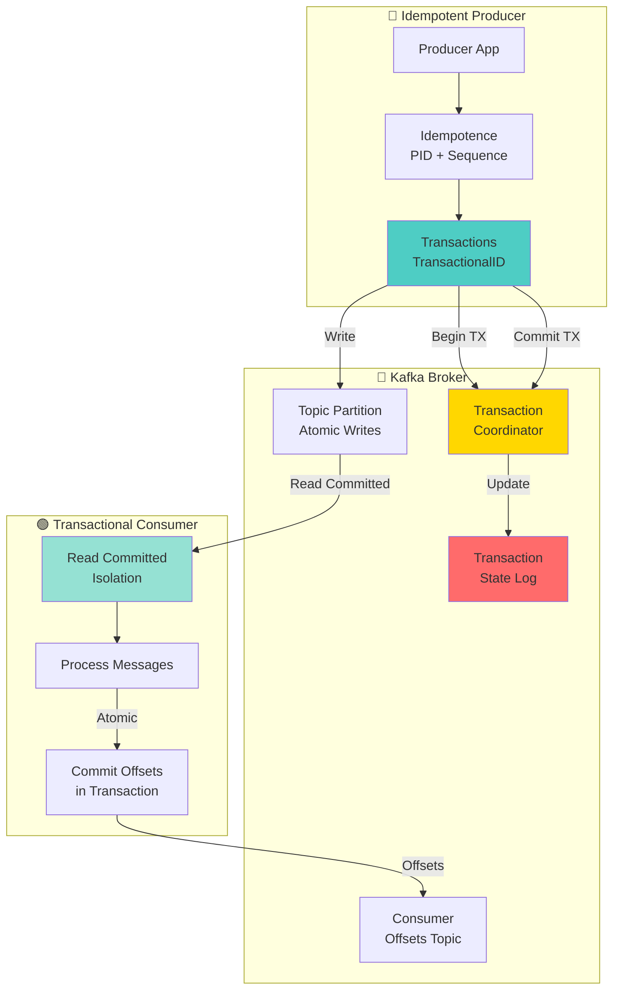
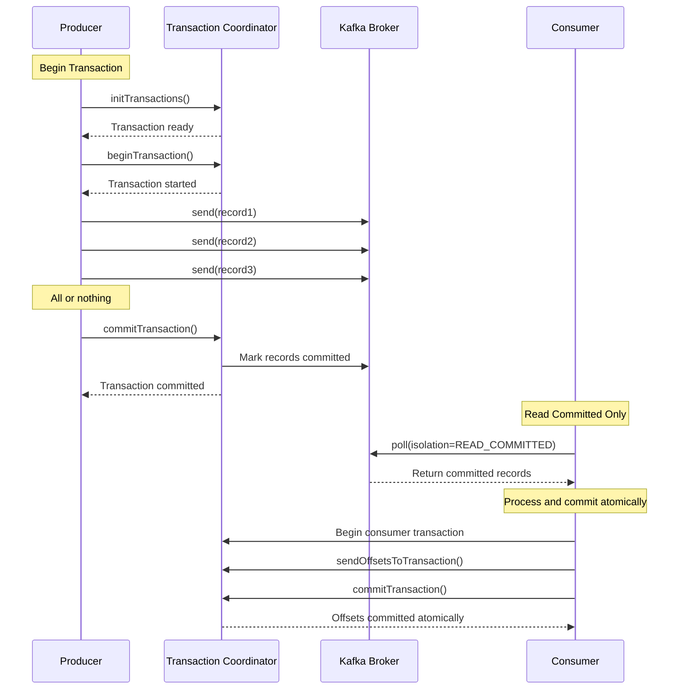

# Tutorial 06: Exactly-Once Semantics in Kafka

## 📐 Architecture Diagram



## 🌊 Exactly-Once Processing Flow



## 🎯 Learning Objectives

By completing this tutorial, you will:
- ✅ Understand exactly-once semantics guarantees
- ✅ Configure idempotent producers
- ✅ Implement transactional producers
- ✅ Build transactional consumers
- ✅ Handle atomicity across produce-consume cycles
- ✅ Test failure scenarios and recovery
- ✅ Understand performance trade-offs
- ✅ Implement end-to-end exactly-once processing

## 📋 Prerequisites

- Docker and Docker Compose installed
- Python 3.8+ or Java 11+
- Basic understanding of Kafka concepts
- Familiarity with transactions

## 🚀 Part 1: Docker Compose Setup

### docker-compose.yml

```yaml
version: '3.8'

services:
  zookeeper:
    image: confluentinc/cp-zookeeper:7.5.0
    hostname: zookeeper
    container_name: zookeeper
    ports:
      - "2181:2181"
    environment:
      ZOOKEEPER_CLIENT_PORT: 2181
      ZOOKEEPER_TICK_TIME: 2000
    networks:
      - kafka-network

  kafka-1:
    image: confluentinc/cp-kafka:7.5.0
    hostname: kafka-1
    container_name: kafka-1
    depends_on:
      - zookeeper
    ports:
      - "9092:9092"
    environment:
      KAFKA_BROKER_ID: 1
      KAFKA_ZOOKEEPER_CONNECT: 'zookeeper:2181'
      KAFKA_LISTENER_SECURITY_PROTOCOL_MAP: PLAINTEXT:PLAINTEXT,PLAINTEXT_HOST:PLAINTEXT
      KAFKA_ADVERTISED_LISTENERS: PLAINTEXT://kafka-1:29092,PLAINTEXT_HOST://localhost:9092
      KAFKA_OFFSETS_TOPIC_REPLICATION_FACTOR: 3
      KAFKA_TRANSACTION_STATE_LOG_REPLICATION_FACTOR: 3
      KAFKA_TRANSACTION_STATE_LOG_MIN_ISR: 2
      KAFKA_GROUP_INITIAL_REBALANCE_DELAY_MS: 0
      # Enable idempotence by default
      KAFKA_ENABLE_IDEMPOTENCE: 'true'
      # Transaction settings
      KAFKA_TRANSACTIONAL_ID_EXPIRATION_MS: 86400000
      KAFKA_MAX_TRANSACTION_TIMEOUT_MS: 900000
    networks:
      - kafka-network

  kafka-2:
    image: confluentinc/cp-kafka:7.5.0
    hostname: kafka-2
    container_name: kafka-2
    depends_on:
      - zookeeper
    ports:
      - "9093:9093"
    environment:
      KAFKA_BROKER_ID: 2
      KAFKA_ZOOKEEPER_CONNECT: 'zookeeper:2181'
      KAFKA_LISTENER_SECURITY_PROTOCOL_MAP: PLAINTEXT:PLAINTEXT,PLAINTEXT_HOST:PLAINTEXT
      KAFKA_ADVERTISED_LISTENERS: PLAINTEXT://kafka-2:29093,PLAINTEXT_HOST://localhost:9093
      KAFKA_OFFSETS_TOPIC_REPLICATION_FACTOR: 3
      KAFKA_TRANSACTION_STATE_LOG_REPLICATION_FACTOR: 3
      KAFKA_TRANSACTION_STATE_LOG_MIN_ISR: 2
      KAFKA_GROUP_INITIAL_REBALANCE_DELAY_MS: 0
      KAFKA_ENABLE_IDEMPOTENCE: 'true'
      KAFKA_TRANSACTIONAL_ID_EXPIRATION_MS: 86400000
      KAFKA_MAX_TRANSACTION_TIMEOUT_MS: 900000
    networks:
      - kafka-network

  kafka-3:
    image: confluentinc/cp-kafka:7.5.0
    hostname: kafka-3
    container_name: kafka-3
    depends_on:
      - zookeeper
    ports:
      - "9094:9094"
    environment:
      KAFKA_BROKER_ID: 3
      KAFKA_ZOOKEEPER_CONNECT: 'zookeeper:2181'
      KAFKA_LISTENER_SECURITY_PROTOCOL_MAP: PLAINTEXT:PLAINTEXT,PLAINTEXT_HOST:PLAINTEXT
      KAFKA_ADVERTISED_LISTENERS: PLAINTEXT://kafka-3:29094,PLAINTEXT_HOST://localhost:9094
      KAFKA_OFFSETS_TOPIC_REPLICATION_FACTOR: 3
      KAFKA_TRANSACTION_STATE_LOG_REPLICATION_FACTOR: 3
      KAFKA_TRANSACTION_STATE_LOG_MIN_ISR: 2
      KAFKA_GROUP_INITIAL_REBALANCE_DELAY_MS: 0
      KAFKA_ENABLE_IDEMPOTENCE: 'true'
      KAFKA_TRANSACTIONAL_ID_EXPIRATION_MS: 86400000
      KAFKA_MAX_TRANSACTION_TIMEOUT_MS: 900000
    networks:
      - kafka-network

networks:
  kafka-network:
    driver: bridge
```

### Start the Stack

```bash
# Start all services
docker-compose up -d

# Wait for cluster to be ready
sleep 30

# Create topics with appropriate configuration
docker exec kafka-1 kafka-topics --create \
  --bootstrap-server kafka-1:29092 \
  --topic transactions-input \
  --partitions 3 \
  --replication-factor 3 \
  --config min.insync.replicas=2

docker exec kafka-1 kafka-topics --create \
  --bootstrap-server kafka-1:29092 \
  --topic transactions-output \
  --partitions 3 \
  --replication-factor 3 \
  --config min.insync.replicas=2

# Verify topics
docker exec kafka-1 kafka-topics --list \
  --bootstrap-server kafka-1:29092
```

## 📝 Part 2: Python Dependencies

### requirements.txt

```txt
confluent-kafka==2.3.0
```

### Installation

```bash
pip install -r requirements.txt
```

## 🔵 Part 3: Idempotent Producer

### idempotent_producer.py

```python
#!/usr/bin/env python3
"""
Idempotent Producer - Ensures no duplicates even with retries
Producer automatically deduplicates based on PID and sequence number
"""

from confluent_kafka import Producer, KafkaError
import time


class IdempotentProducer:
    """Producer with idempotence enabled"""

    def __init__(self, bootstrap_servers):
        """Initialize idempotent producer"""
        config = {
            'bootstrap.servers': bootstrap_servers,
            # Idempotence configuration
            'enable.idempotence': True,  # Key setting!
            # These are automatically set when idempotence=True:
            # 'acks': 'all',
            # 'max.in.flight.requests.per.connection': 5,
            # 'retries': INT_MAX,

            # Additional reliability settings
            'compression.type': 'snappy',
            'linger.ms': 10,
        }

        self.producer = Producer(config)
        print('✅ Idempotent producer initialized')
        print(f'   Config: enable.idempotence=True')

    def delivery_callback(self, err, msg):
        """Callback for delivery reports"""
        if err:
            print(f'❌ Delivery failed: {err}')
        else:
            print(f'✅ Message delivered: topic={msg.topic()} '
                  f'partition={msg.partition()} offset={msg.offset()}')

    def produce_with_retry_simulation(self, topic, key, value, num_sends=3):
        """
        Simulate network issues causing retries
        Even if we send the same message multiple times,
        idempotence ensures only one copy is stored
        """
        print(f'\n📤 Producing message (simulating {num_sends} sends):')
        print(f'   Key: {key}, Value: {value}')

        for i in range(num_sends):
            try:
                self.producer.produce(
                    topic=topic,
                    key=key,
                    value=value,
                    callback=self.delivery_callback
                )
                print(f'   Send attempt {i + 1}/{num_sends}')
                self.producer.poll(0)
            except BufferError:
                print(f'   Buffer full, waiting...')
                self.producer.poll(1)

        self.producer.flush()

    def produce_batch(self, topic, messages):
        """Produce batch of messages"""
        print(f'\n📤 Producing batch of {len(messages)} messages')

        for i, (key, value) in enumerate(messages):
            self.producer.produce(
                topic=topic,
                key=str(key),
                value=str(value),
                callback=self.delivery_callback
            )
            if i % 10 == 0:
                self.producer.poll(0)

        print('⏳ Flushing messages...')
        self.producer.flush()

    def close(self):
        """Close producer"""
        remaining = self.producer.flush(10)
        if remaining > 0:
            print(f'⚠️  {remaining} messages still in queue')
        print('🔌 Producer closed')


def main():
    """Test idempotent producer"""
    print('🚀 Idempotent Producer Example\n')
    print('=' * 70)

    BOOTSTRAP_SERVERS = 'localhost:9092'
    TOPIC = 'transactions-input'

    producer = IdempotentProducer(BOOTSTRAP_SERVERS)

    # Test 1: Simulate duplicate sends (only one should be stored)
    print('\n📌 TEST 1: Idempotence - No duplicates despite multiple sends')
    print('-' * 70)
    producer.produce_with_retry_simulation(
        TOPIC,
        key='user-1',
        value='payment-100',
        num_sends=3  # Send 3 times, but only 1 should be stored
    )

    time.sleep(2)

    # Test 2: Batch production
    print('\n📌 TEST 2: Batch production with idempotence')
    print('-' * 70)
    messages = [(f'user-{i}', f'payment-{i * 100}') for i in range(10)]
    producer.produce_batch(TOPIC, messages)

    # Close producer
    print('\n' + '=' * 70)
    producer.close()
    print('\n✨ Idempotent producer test complete!')


if __name__ == '__main__':
    main()
```

## 🔄 Part 4: Transactional Producer

### transactional_producer.py

```python
#!/usr/bin/env python3
"""
Transactional Producer - Atomic writes across multiple partitions/topics
All messages in a transaction are committed together or not at all
"""

from confluent_kafka import Producer, KafkaException
import time
import sys


class TransactionalProducer:
    """Producer with transaction support"""

    def __init__(self, bootstrap_servers, transactional_id):
        """Initialize transactional producer"""
        config = {
            'bootstrap.servers': bootstrap_servers,
            # Transaction configuration
            'transactional.id': transactional_id,  # Unique per producer instance
            # Idempotence is automatically enabled with transactions
            'enable.idempotence': True,

            # Reliability settings
            'acks': 'all',
            'max.in.flight.requests.per.connection': 5,
            'compression.type': 'snappy',
        }

        self.producer = Producer(config)

        # Initialize transactions (must be called once)
        print(f'🔧 Initializing transactions for: {transactional_id}')
        self.producer.init_transactions()
        print('✅ Transactional producer ready')

    def produce_transactional_batch(self, messages_by_topic):
        """
        Produce messages to multiple topics atomically
        messages_by_topic: dict of {topic: [(key, value), ...]}
        """
        try:
            # Begin transaction
            print('\n🔷 BEGIN TRANSACTION')
            self.producer.begin_transaction()

            # Produce all messages
            total_messages = 0
            for topic, messages in messages_by_topic.items():
                print(f'   📤 Producing to {topic}: {len(messages)} messages')
                for key, value in messages:
                    self.producer.produce(
                        topic=topic,
                        key=str(key),
                        value=str(value)
                    )
                    total_messages += 1
                    self.producer.poll(0)

            # Commit transaction (all or nothing)
            print(f'   ⏳ Committing {total_messages} messages...')
            self.producer.commit_transaction()
            print('   ✅ TRANSACTION COMMITTED\n')

            return True

        except KafkaException as e:
            # Abort transaction on error
            print(f'   ❌ Transaction failed: {e}')
            print('   🔄 ABORTING TRANSACTION\n')
            self.producer.abort_transaction()
            return False

    def produce_with_failure_simulation(self, topic, messages, fail_after=None):
        """
        Simulate transaction failure
        fail_after: fail after N messages (None = no failure)
        """
        try:
            print('\n🔷 BEGIN TRANSACTION (with failure simulation)')
            self.producer.begin_transaction()

            for i, (key, value) in enumerate(messages):
                if fail_after and i >= fail_after:
                    print(f'   💥 Simulating failure after {i} messages')
                    raise Exception('Simulated failure')

                self.producer.produce(
                    topic=topic,
                    key=str(key),
                    value=str(value)
                )
                print(f'   📤 Message {i + 1}: key={key}, value={value}')
                self.producer.poll(0)

            print('   ⏳ Committing transaction...')
            self.producer.commit_transaction()
            print('   ✅ TRANSACTION COMMITTED\n')
            return True

        except Exception as e:
            print(f'   ❌ Error: {e}')
            print('   🔄 ABORTING TRANSACTION')
            print('   ⚠️  All messages in transaction are rolled back\n')
            self.producer.abort_transaction()
            return False

    def close(self):
        """Close producer"""
        print('🔌 Closing producer...')
        self.producer.flush()


def main():
    """Test transactional producer"""
    print('🚀 Transactional Producer Example\n')
    print('=' * 70)

    BOOTSTRAP_SERVERS = 'localhost:9092'
    TRANSACTIONAL_ID = 'my-transactional-producer-1'

    producer = TransactionalProducer(BOOTSTRAP_SERVERS, TRANSACTIONAL_ID)

    # Test 1: Successful transaction
    print('\n📌 TEST 1: Successful atomic transaction across topics')
    print('-' * 70)
    messages_by_topic = {
        'transactions-input': [
            ('order-1', 'purchase:100'),
            ('order-2', 'purchase:200'),
        ],
        'transactions-output': [
            ('order-1', 'confirmed:100'),
            ('order-2', 'confirmed:200'),
        ]
    }
    producer.produce_transactional_batch(messages_by_topic)

    time.sleep(2)

    # Test 2: Failed transaction (all messages rolled back)
    print('\n📌 TEST 2: Failed transaction - all messages rolled back')
    print('-' * 70)
    messages = [
        ('order-3', 'purchase:300'),
        ('order-4', 'purchase:400'),
        ('order-5', 'purchase:500'),
    ]
    producer.produce_with_failure_simulation(
        'transactions-input',
        messages,
        fail_after=2  # Fail after 2 messages
    )

    time.sleep(2)

    # Test 3: Another successful transaction
    print('\n📌 TEST 3: Successful transaction after previous failure')
    print('-' * 70)
    messages = [
        ('order-6', 'purchase:600'),
        ('order-7', 'purchase:700'),
    ]
    producer.produce_with_failure_simulation(
        'transactions-input',
        messages,
        fail_after=None  # No failure
    )

    # Close producer
    print('\n' + '=' * 70)
    producer.close()
    print('✨ Transactional producer test complete!')


if __name__ == '__main__':
    main()
```

## 🟢 Part 5: Transactional Consumer

### transactional_consumer.py

```python
#!/usr/bin/env python3
"""
Transactional Consumer - Read committed messages only
Implements exactly-once processing with atomic offset commits
"""

from confluent_kafka import Consumer, Producer, KafkaException
import sys


class TransactionalConsumer:
    """Consumer with read-committed isolation"""

    def __init__(self, bootstrap_servers, group_id, transactional_id):
        """Initialize transactional consumer"""
        consumer_config = {
            'bootstrap.servers': bootstrap_servers,
            'group.id': group_id,
            'auto.offset.reset': 'earliest',
            'enable.auto.commit': False,  # Manual commit within transaction
            # Read only committed messages
            'isolation.level': 'read_committed',  # Key setting!
        }

        self.consumer = Consumer(consumer_config)

        # Producer for output (transactional)
        producer_config = {
            'bootstrap.servers': bootstrap_servers,
            'transactional.id': transactional_id,
            'enable.idempotence': True,
        }

        self.producer = Producer(producer_config)
        self.producer.init_transactions()

        print('✅ Transactional consumer initialized')
        print(f'   Isolation level: read_committed')
        print(f'   Group ID: {group_id}')
        print(f'   Transactional ID: {transactional_id}')

    def process_messages(self, input_topic, output_topic, num_messages=None):
        """
        Process messages with exactly-once semantics
        Read from input_topic, process, write to output_topic atomically
        """
        self.consumer.subscribe([input_topic])
        print(f'\n📥 Consuming from: {input_topic}')
        print(f'📤 Producing to: {output_topic}')
        print('🔷 Using exactly-once processing\n')

        processed_count = 0

        try:
            while True:
                msg = self.consumer.poll(1.0)

                if msg is None:
                    continue

                if msg.error():
                    print(f'❌ Consumer error: {msg.error()}')
                    continue

                # Begin transaction for processing
                self.producer.begin_transaction()

                try:
                    # Process message
                    key = msg.key().decode('utf-8') if msg.key() else None
                    value = msg.value().decode('utf-8')

                    processed_count += 1
                    print(f'📨 Message {processed_count}:')
                    print(f'   Input: key={key}, value={value}')

                    # Transform message (example: add prefix)
                    output_key = key
                    output_value = f'processed:{value}'

                    # Produce to output topic
                    self.producer.produce(
                        topic=output_topic,
                        key=output_key,
                        value=output_value
                    )

                    print(f'   Output: key={output_key}, value={output_value}')

                    # Commit offsets to transaction
                    self.producer.send_offsets_to_transaction(
                        self.consumer.position(self.consumer.assignment()),
                        self.consumer.consumer_group_metadata()
                    )

                    # Commit transaction (atomic: message + offset)
                    self.producer.commit_transaction()
                    print(f'   ✅ Transaction committed\n')

                except Exception as e:
                    print(f'   ❌ Processing failed: {e}')
                    print(f'   🔄 Aborting transaction\n')
                    self.producer.abort_transaction()
                    continue

                # Stop after processing specified number of messages
                if num_messages and processed_count >= num_messages:
                    break

        except KeyboardInterrupt:
            print('\n⚠️  Interrupted by user')
        finally:
            self.close()

    def close(self):
        """Close consumer and producer"""
        print('\n🔌 Closing consumer and producer...')
        self.consumer.close()


def main():
    """Test transactional consumer"""
    print('🚀 Transactional Consumer Example\n')
    print('=' * 70)

    BOOTSTRAP_SERVERS = 'localhost:9092'
    GROUP_ID = 'transactional-consumer-group'
    TRANSACTIONAL_ID = 'my-transactional-consumer-1'
    INPUT_TOPIC = 'transactions-input'
    OUTPUT_TOPIC = 'transactions-output'

    consumer = TransactionalConsumer(
        BOOTSTRAP_SERVERS,
        GROUP_ID,
        TRANSACTIONAL_ID
    )

    # Process messages with exactly-once semantics
    consumer.process_messages(INPUT_TOPIC, OUTPUT_TOPIC)


if __name__ == '__main__':
    main()
```

## 🧪 Part 6: Testing Scenarios

### test_exactly_once.py

```python
#!/usr/bin/env python3
"""
Test exactly-once semantics with various scenarios
"""

import subprocess
import time
import sys


class ExactlyOnceTester:
    """Test exactly-once guarantees"""

    def __init__(self):
        """Initialize tester"""
        self.bootstrap_servers = 'localhost:9092'

    def run_test(self, test_name, test_func):
        """Run a test scenario"""
        print(f'\n{"=" * 70}')
        print(f'📌 {test_name}')
        print(f'{"=" * 70}\n')
        test_func()
        print(f'\n✅ Test completed: {test_name}')

    def test_1_idempotent_no_duplicates(self):
        """Test that idempotent producer prevents duplicates"""
        print('🧪 Testing idempotent producer (no duplicates on retry)')
        print('Expected: Same message sent 3 times = 1 stored message\n')

        # Run idempotent producer
        subprocess.run(['python', 'idempotent_producer.py'])

        time.sleep(2)

        # Verify: Check message count
        print('\n🔍 Verification: Counting messages in topic')
        # In real scenario, would query topic and verify count

    def test_2_transactional_atomicity(self):
        """Test transactional producer atomicity"""
        print('🧪 Testing transactional producer (atomic commits)')
        print('Expected: All messages committed together or none at all\n')

        # Run transactional producer
        subprocess.run(['python', 'transactional_producer.py'])

    def test_3_read_committed(self):
        """Test consumer reads only committed messages"""
        print('🧪 Testing read committed isolation')
        print('Expected: Consumer sees only committed transactions\n')

        # Start consumer in background
        print('Starting consumer...')
        # In real scenario, would start consumer and verify it only
        # sees committed messages, not aborted ones

    def test_4_exactly_once_processing(self):
        """Test end-to-end exactly-once processing"""
        print('🧪 Testing exactly-once processing (consume-process-produce)')
        print('Expected: Each input message processed exactly once\n')

        # Run transactional consumer
        # In real scenario, would produce messages, consume them,
        # and verify each was processed exactly once


def main():
    """Run all tests"""
    print('🚀 Exactly-Once Semantics Testing Suite\n')

    tester = ExactlyOnceTester()

    tester.run_test(
        'TEST 1: Idempotent Producer - No Duplicates',
        tester.test_1_idempotent_no_duplicates
    )

    time.sleep(2)

    tester.run_test(
        'TEST 2: Transactional Producer - Atomic Commits',
        tester.test_2_transactional_atomicity
    )

    print('\n' + '=' * 70)
    print('✨ All tests completed!')


if __name__ == '__main__':
    main()
```

## 📊 Part 7: Monitoring and Verification

### Verify Message Delivery

```bash
# Terminal 1: Run idempotent producer
python idempotent_producer.py

# Terminal 2: Consume and verify no duplicates
docker exec kafka-1 kafka-console-consumer \
  --bootstrap-server kafka-1:29092 \
  --topic transactions-input \
  --from-beginning \
  --property print.key=true \
  --property print.partition=true \
  --property print.offset=true

# Terminal 3: Run transactional producer
python transactional_producer.py

# Terminal 4: Run transactional consumer (read committed only)
python transactional_consumer.py

# Verify output topic
docker exec kafka-1 kafka-console-consumer \
  --bootstrap-server kafka-1:29092 \
  --topic transactions-output \
  --from-beginning \
  --isolation-level read_committed \
  --property print.key=true
```

## 🎯 Key Concepts

### 1. Idempotent Producer
- Assigns Producer ID (PID) and sequence number to each message
- Broker deduplicates based on PID + sequence
- Retries don't create duplicates
- No performance overhead

### 2. Transactional Producer
- Groups multiple sends into atomic unit
- All messages committed or none
- Works across partitions and topics
- Uses transaction coordinator

### 3. Read Committed Isolation
- Consumers see only committed transactions
- Aborted transactions are filtered out
- Slight latency increase (waits for commit)

### 4. Exactly-Once Processing
- Combines transactional producer + consumer
- Atomic: read + process + produce + commit offset
- Guarantees each message processed exactly once

## 🎓 Configuration Reference

### Idempotent Producer Settings

```python
config = {
    'enable.idempotence': True,  # Main switch
    # Automatically set when idempotence=True:
    # 'acks': 'all',
    # 'max.in.flight.requests.per.connection': 5,
    # 'retries': 2147483647,
}
```

### Transactional Producer Settings

```python
config = {
    'transactional.id': 'unique-id',  # Required for transactions
    'enable.idempotence': True,       # Auto-enabled
    'acks': 'all',                    # Required
    'max.in.flight.requests.per.connection': 5,
    'transaction.timeout.ms': 60000,   # Default: 60s
}
```

### Transactional Consumer Settings

```python
config = {
    'isolation.level': 'read_committed',  # Read only committed
    'enable.auto.commit': False,          # Manual commit
    'group.id': 'consumer-group',
}
```

## 🚨 Best Practices

1. **Idempotence**
   - Always enable for production
   - Zero performance impact
   - Prevents accidental duplicates

2. **Transactions**
   - Use unique transactional.id per producer instance
   - Set appropriate transaction.timeout.ms
   - Handle abort scenarios properly

3. **Read Committed**
   - Always use with transactional producers
   - Understand latency implications
   - Monitor consumer lag

4. **Error Handling**
   - Always abort transaction on failure
   - Implement proper retry logic
   - Log transaction boundaries

5. **Performance**
   - Transactions add latency (~100-200ms)
   - Batch messages when possible
   - Monitor transaction coordinator load

## 🔍 Troubleshooting

### Issue: ProducerFenced Error
```
Cause: Another producer with same transactional.id
Solution: Ensure unique transactional.id per instance
```

### Issue: Transaction Timeout
```
Cause: Processing takes longer than transaction.timeout.ms
Solution: Increase timeout or process faster
```

### Issue: High Latency
```
Cause: Waiting for transaction commits
Solution: Batch more messages per transaction
```

## 📈 Performance Comparison

| Delivery Semantics | Throughput | Latency | Guarantees |
|--------------------|------------|---------|------------|
| At-most-once | Highest | Lowest | May lose data |
| At-least-once | High | Low | May duplicate |
| Exactly-once (idempotent) | High | Low | No duplicates |
| Exactly-once (transactional) | Medium | Medium | No duplicates + atomicity |

## 🎓 Key Takeaways

- Idempotent producers prevent duplicates with no overhead
- Transactions provide atomicity across operations
- Read committed ensures consumers see consistent data
- Exactly-once processing combines producer + consumer transactions
- Proper configuration is critical for guarantees
- Monitor transaction coordinator performance

## 📚 Additional Resources

- [Kafka Exactly-Once Semantics](https://www.confluent.io/blog/exactly-once-semantics-are-possible-heres-how-apache-kafka-does-it/)
- [Transactions in Kafka](https://kafka.apache.org/documentation/#semantics)
- [KIP-98: Exactly Once Delivery](https://cwiki.apache.org/confluence/display/KAFKA/KIP-98+-+Exactly+Once+Delivery+and+Transactional+Messaging)
