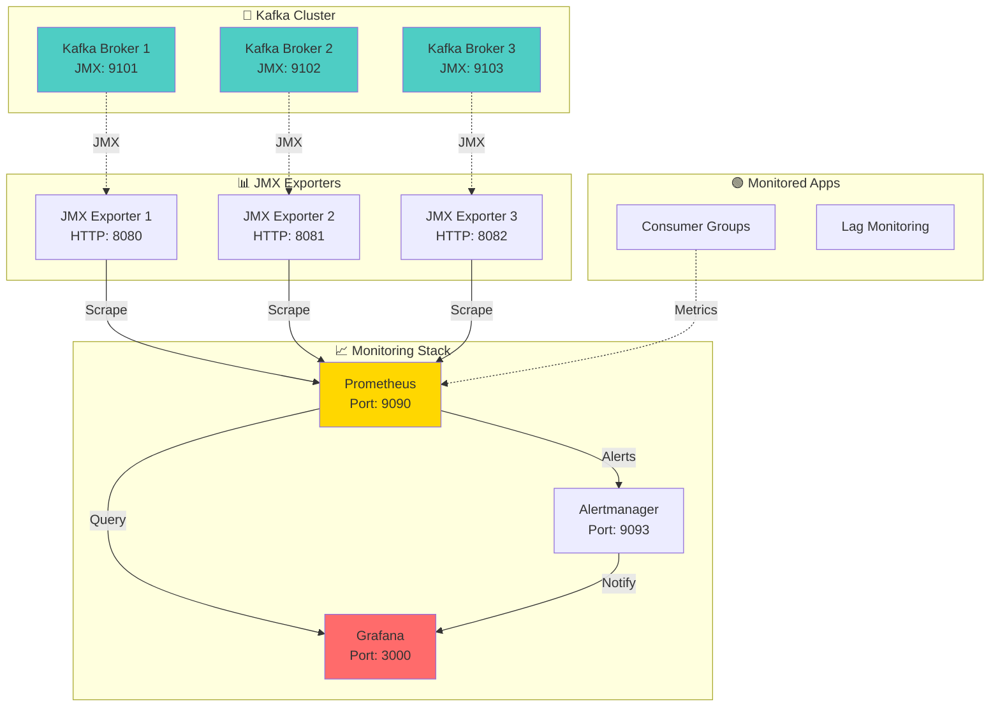
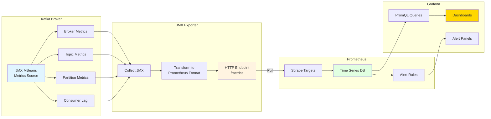

# Tutorial 07: Kafka Monitoring with JMX and Prometheus

## 📐 Architecture Diagram



## 🌊 Metrics Flow Diagram



## 🎯 Learning Objectives

By completing this tutorial, you will:
- ✅ Expose Kafka JMX metrics via HTTP
- ✅ Configure Prometheus JMX Exporter
- ✅ Set up Prometheus for metrics collection
- ✅ Build Grafana dashboards for Kafka
- ✅ Monitor critical Kafka metrics (lag, throughput, errors)
- ✅ Configure alerting rules
- ✅ Implement production-grade monitoring stack
- ✅ Understand key performance indicators

## 📋 Prerequisites

- Docker and Docker Compose installed
- Basic understanding of Kafka
- Familiarity with metrics and monitoring concepts
- Web browser for accessing dashboards

## 🚀 Part 1: Docker Compose with Monitoring Stack

### docker-compose.yml

```yaml
version: '3.8'

services:
  zookeeper:
    image: confluentinc/cp-zookeeper:7.5.0
    hostname: zookeeper
    container_name: zookeeper
    ports:
      - "2181:2181"
    environment:
      ZOOKEEPER_CLIENT_PORT: 2181
      ZOOKEEPER_TICK_TIME: 2000
    networks:
      - monitoring-network

  kafka-1:
    image: confluentinc/cp-kafka:7.5.0
    hostname: kafka-1
    container_name: kafka-1
    depends_on:
      - zookeeper
    ports:
      - "9092:9092"
      - "9101:9101"
    environment:
      KAFKA_BROKER_ID: 1
      KAFKA_ZOOKEEPER_CONNECT: 'zookeeper:2181'
      KAFKA_LISTENER_SECURITY_PROTOCOL_MAP: PLAINTEXT:PLAINTEXT,PLAINTEXT_HOST:PLAINTEXT
      KAFKA_ADVERTISED_LISTENERS: PLAINTEXT://kafka-1:29092,PLAINTEXT_HOST://localhost:9092
      KAFKA_OFFSETS_TOPIC_REPLICATION_FACTOR: 3
      KAFKA_TRANSACTION_STATE_LOG_REPLICATION_FACTOR: 3
      KAFKA_TRANSACTION_STATE_LOG_MIN_ISR: 2
      KAFKA_GROUP_INITIAL_REBALANCE_DELAY_MS: 0
      # JMX Configuration
      KAFKA_JMX_PORT: 9101
      KAFKA_JMX_HOSTNAME: kafka-1
      KAFKA_JMX_OPTS: "-Dcom.sun.management.jmxremote
                       -Dcom.sun.management.jmxremote.authenticate=false
                       -Dcom.sun.management.jmxremote.ssl=false
                       -Djava.rmi.server.hostname=kafka-1
                       -Dcom.sun.management.jmxremote.rmi.port=9101"
    networks:
      - monitoring-network

  kafka-2:
    image: confluentinc/cp-kafka:7.5.0
    hostname: kafka-2
    container_name: kafka-2
    depends_on:
      - zookeeper
    ports:
      - "9093:9093"
      - "9102:9102"
    environment:
      KAFKA_BROKER_ID: 2
      KAFKA_ZOOKEEPER_CONNECT: 'zookeeper:2181'
      KAFKA_LISTENER_SECURITY_PROTOCOL_MAP: PLAINTEXT:PLAINTEXT,PLAINTEXT_HOST:PLAINTEXT
      KAFKA_ADVERTISED_LISTENERS: PLAINTEXT://kafka-2:29093,PLAINTEXT_HOST://localhost:9093
      KAFKA_OFFSETS_TOPIC_REPLICATION_FACTOR: 3
      KAFKA_TRANSACTION_STATE_LOG_REPLICATION_FACTOR: 3
      KAFKA_TRANSACTION_STATE_LOG_MIN_ISR: 2
      KAFKA_GROUP_INITIAL_REBALANCE_DELAY_MS: 0
      KAFKA_JMX_PORT: 9102
      KAFKA_JMX_HOSTNAME: kafka-2
      KAFKA_JMX_OPTS: "-Dcom.sun.management.jmxremote
                       -Dcom.sun.management.jmxremote.authenticate=false
                       -Dcom.sun.management.jmxremote.ssl=false
                       -Djava.rmi.server.hostname=kafka-2
                       -Dcom.sun.management.jmxremote.rmi.port=9102"
    networks:
      - monitoring-network

  kafka-3:
    image: confluentinc/cp-kafka:7.5.0
    hostname: kafka-3
    container_name: kafka-3
    depends_on:
      - zookeeper
    ports:
      - "9094:9094"
      - "9103:9103"
    environment:
      KAFKA_BROKER_ID: 3
      KAFKA_ZOOKEEPER_CONNECT: 'zookeeper:2181'
      KAFKA_LISTENER_SECURITY_PROTOCOL_MAP: PLAINTEXT:PLAINTEXT,PLAINTEXT_HOST:PLAINTEXT
      KAFKA_ADVERTISED_LISTENERS: PLAINTEXT://kafka-3:29094,PLAINTEXT_HOST://localhost:9094
      KAFKA_OFFSETS_TOPIC_REPLICATION_FACTOR: 3
      KAFKA_TRANSACTION_STATE_LOG_REPLICATION_FACTOR: 3
      KAFKA_TRANSACTION_STATE_LOG_MIN_ISR: 2
      KAFKA_GROUP_INITIAL_REBALANCE_DELAY_MS: 0
      KAFKA_JMX_PORT: 9103
      KAFKA_JMX_HOSTNAME: kafka-3
      KAFKA_JMX_OPTS: "-Dcom.sun.management.jmxremote
                       -Dcom.sun.management.jmxremote.authenticate=false
                       -Dcom.sun.management.jmxremote.ssl=false
                       -Djava.rmi.server.hostname=kafka-3
                       -Dcom.sun.management.jmxremote.rmi.port=9103"
    networks:
      - monitoring-network

  kafka-exporter:
    image: danielqsj/kafka-exporter:latest
    hostname: kafka-exporter
    container_name: kafka-exporter
    ports:
      - "9308:9308"
    command:
      - '--kafka.server=kafka-1:29092'
      - '--kafka.server=kafka-2:29093'
      - '--kafka.server=kafka-3:29094'
    depends_on:
      - kafka-1
      - kafka-2
      - kafka-3
    networks:
      - monitoring-network

  jmx-exporter:
    image: bitnami/jmx-exporter:latest
    hostname: jmx-exporter
    container_name: jmx-exporter
    ports:
      - "5556:5556"
    environment:
      - SERVICE_PORT=5556
    volumes:
      - ./jmx-exporter-config.yml:/etc/jmx-exporter/config.yml
    command:
      - "5556"
      - "/etc/jmx-exporter/config.yml"
    networks:
      - monitoring-network

  prometheus:
    image: prom/prometheus:latest
    hostname: prometheus
    container_name: prometheus
    ports:
      - "9090:9090"
    volumes:
      - ./prometheus.yml:/etc/prometheus/prometheus.yml
      - ./alert-rules.yml:/etc/prometheus/alert-rules.yml
      - prometheus-data:/prometheus
    command:
      - '--config.file=/etc/prometheus/prometheus.yml'
      - '--storage.tsdb.path=/prometheus'
      - '--web.console.libraries=/usr/share/prometheus/console_libraries'
      - '--web.console.templates=/usr/share/prometheus/consoles'
      - '--web.enable-lifecycle'
    networks:
      - monitoring-network

  alertmanager:
    image: prom/alertmanager:latest
    hostname: alertmanager
    container_name: alertmanager
    ports:
      - "9093:9093"
    volumes:
      - ./alertmanager.yml:/etc/alertmanager/alertmanager.yml
      - alertmanager-data:/alertmanager
    command:
      - '--config.file=/etc/alertmanager/alertmanager.yml'
      - '--storage.path=/alertmanager'
    networks:
      - monitoring-network

  grafana:
    image: grafana/grafana:latest
    hostname: grafana
    container_name: grafana
    ports:
      - "3000:3000"
    environment:
      - GF_SECURITY_ADMIN_USER=admin
      - GF_SECURITY_ADMIN_PASSWORD=admin
      - GF_USERS_ALLOW_SIGN_UP=false
    volumes:
      - grafana-data:/var/lib/grafana
      - ./grafana-datasources.yml:/etc/grafana/provisioning/datasources/datasources.yml
      - ./grafana-dashboards.yml:/etc/grafana/provisioning/dashboards/dashboards.yml
      - ./dashboards:/var/lib/grafana/dashboards
    networks:
      - monitoring-network

networks:
  monitoring-network:
    driver: bridge

volumes:
  prometheus-data:
  alertmanager-data:
  grafana-data:
```

## ⚙️ Part 2: JMX Exporter Configuration

### jmx-exporter-config.yml

```yaml
---
# JMX Exporter configuration for Kafka
# Converts JMX metrics to Prometheus format

# Global settings
lowercaseOutputName: true
lowercaseOutputLabelNames: true

# Whitelist patterns (what metrics to expose)
whitelistObjectNames:
  # Kafka broker metrics
  - "kafka.server:type=BrokerTopicMetrics,name=*"
  - "kafka.server:type=ReplicaManager,name=*"
  - "kafka.server:type=ReplicaFetcherManager,name=*,clientId=*"
  - "kafka.server:type=KafkaRequestHandlerPool,name=*"
  - "kafka.server:type=socket-server-metrics,*"

  # Network metrics
  - "kafka.network:type=RequestMetrics,name=*,request=*"
  - "kafka.network:type=Processor,name=*,networkProcessor=*"

  # Log metrics
  - "kafka.log:type=Log,name=*,topic=*,partition=*"
  - "kafka.log:type=LogFlushStats,name=*"

  # Controller metrics
  - "kafka.controller:type=KafkaController,name=*"
  - "kafka.controller:type=ControllerStats,name=*"

  # Consumer group metrics
  - "kafka.server:type=group-coordinator-metrics,*"

  # JVM metrics
  - "java.lang:type=Memory"
  - "java.lang:type=GarbageCollector,name=*"
  - "java.lang:type=Threading"
  - "java.lang:type=Runtime"

# Rules for transforming metrics
rules:
  # Broker topic metrics
  - pattern: kafka.server<type=BrokerTopicMetrics, name=(.+)><>Count
    name: kafka_server_brokertopicmetrics_$1_total
    type: COUNTER

  - pattern: kafka.server<type=BrokerTopicMetrics, name=(.+)><>OneMinuteRate
    name: kafka_server_brokertopicmetrics_$1_rate
    type: GAUGE

  # Replica manager metrics
  - pattern: kafka.server<type=ReplicaManager, name=(.+)><>Value
    name: kafka_server_replicamanager_$1
    type: GAUGE

  # Request metrics
  - pattern: kafka.network<type=RequestMetrics, name=(.+), request=(.+)><>Count
    name: kafka_network_requestmetrics_$1_total
    labels:
      request: "$2"
    type: COUNTER

  - pattern: kafka.network<type=RequestMetrics, name=(.+), request=(.+)><>(\d+)thPercentile
    name: kafka_network_requestmetrics_$1_percentile
    labels:
      request: "$2"
      percentile: "$3"
    type: GAUGE

  # Log metrics
  - pattern: kafka.log<type=Log, name=(.+), topic=(.+), partition=(.+)><>Value
    name: kafka_log_$1
    labels:
      topic: "$2"
      partition: "$3"
    type: GAUGE

  # Controller metrics
  - pattern: kafka.controller<type=KafkaController, name=(.+)><>Value
    name: kafka_controller_$1
    type: GAUGE

  # JVM Memory
  - pattern: java.lang<type=Memory><HeapMemoryUsage>(\w+)
    name: jvm_memory_heap_$1
    type: GAUGE

  - pattern: java.lang<type=Memory><NonHeapMemoryUsage>(\w+)
    name: jvm_memory_nonheap_$1
    type: GAUGE

  # Garbage Collection
  - pattern: java.lang<type=GarbageCollector, name=(.+)><>CollectionCount
    name: jvm_gc_collection_count_total
    labels:
      gc: "$1"
    type: COUNTER

  - pattern: java.lang<type=GarbageCollector, name=(.+)><>CollectionTime
    name: jvm_gc_collection_time_ms_total
    labels:
      gc: "$1"
    type: COUNTER
```

## 📊 Part 3: Prometheus Configuration

### prometheus.yml

```yaml
global:
  scrape_interval: 15s
  evaluation_interval: 15s
  external_labels:
    cluster: 'kafka-cluster'
    environment: 'development'

# Alertmanager configuration
alerting:
  alertmanagers:
    - static_configs:
        - targets:
            - 'alertmanager:9093'

# Load alert rules
rule_files:
  - '/etc/prometheus/alert-rules.yml'

# Scrape configurations
scrape_configs:
  # Prometheus itself
  - job_name: 'prometheus'
    static_configs:
      - targets: ['localhost:9090']

  # Kafka Exporter (consumer lag, topic metrics)
  - job_name: 'kafka-exporter'
    static_configs:
      - targets: ['kafka-exporter:9308']
        labels:
          cluster: 'kafka-cluster'

  # Kafka Broker 1 JMX
  - job_name: 'kafka-broker-1'
    static_configs:
      - targets: ['kafka-1:9101']
        labels:
          broker_id: '1'
          broker: 'kafka-1'

  # Kafka Broker 2 JMX
  - job_name: 'kafka-broker-2'
    static_configs:
      - targets: ['kafka-2:9102']
        labels:
          broker_id: '2'
          broker: 'kafka-2'

  # Kafka Broker 3 JMX
  - job_name: 'kafka-broker-3'
    static_configs:
      - targets: ['kafka-3:9103']
        labels:
          broker_id: '3'
          broker: 'kafka-3'

  # JMX Exporter
  - job_name: 'jmx-exporter'
    static_configs:
      - targets: ['jmx-exporter:5556']
```

### alert-rules.yml

```yaml
groups:
  - name: kafka_alerts
    interval: 30s
    rules:
      # Consumer lag alert
      - alert: KafkaConsumerLagHigh
        expr: kafka_consumergroup_lag > 1000
        for: 5m
        labels:
          severity: warning
          component: kafka
        annotations:
          summary: "High consumer lag detected"
          description: "Consumer group {{ $labels.consumergroup }} has lag of {{ $value }} on topic {{ $labels.topic }}"

      # Critical consumer lag
      - alert: KafkaConsumerLagCritical
        expr: kafka_consumergroup_lag > 10000
        for: 2m
        labels:
          severity: critical
          component: kafka
        annotations:
          summary: "Critical consumer lag detected"
          description: "Consumer group {{ $labels.consumergroup }} has critical lag of {{ $value }} on topic {{ $labels.topic }}"

      # Broker down
      - alert: KafkaBrokerDown
        expr: up{job=~"kafka-broker-.*"} == 0
        for: 1m
        labels:
          severity: critical
          component: kafka
        annotations:
          summary: "Kafka broker is down"
          description: "Kafka broker {{ $labels.broker }} (ID: {{ $labels.broker_id }}) is down"

      # Under-replicated partitions
      - alert: KafkaUnderReplicatedPartitions
        expr: kafka_server_replicamanager_underreplicatedpartitions > 0
        for: 5m
        labels:
          severity: warning
          component: kafka
        annotations:
          summary: "Under-replicated partitions detected"
          description: "Broker {{ $labels.broker }} has {{ $value }} under-replicated partitions"

      # Offline partitions
      - alert: KafkaOfflinePartitions
        expr: kafka_controller_kafkacontroller_offlinepartitionscount > 0
        for: 1m
        labels:
          severity: critical
          component: kafka
        annotations:
          summary: "Offline partitions detected"
          description: "{{ $value }} partitions are offline in the cluster"

      # ISR shrink rate
      - alert: KafkaISRShrinkRateHigh
        expr: rate(kafka_server_replicamanager_isrshrinks_total[5m]) > 0
        for: 5m
        labels:
          severity: warning
          component: kafka
        annotations:
          summary: "High ISR shrink rate"
          description: "ISR is shrinking at {{ $value }} per second on broker {{ $labels.broker }}"

      # Request queue size
      - alert: KafkaRequestQueueHigh
        expr: kafka_network_requestchannel_requestqueuesize > 100
        for: 5m
        labels:
          severity: warning
          component: kafka
        annotations:
          summary: "High request queue size"
          description: "Request queue size is {{ $value }} on broker {{ $labels.broker }}"

      # JVM memory usage
      - alert: KafkaHighMemoryUsage
        expr: (jvm_memory_heap_used / jvm_memory_heap_max) > 0.9
        for: 5m
        labels:
          severity: warning
          component: kafka
        annotations:
          summary: "High JVM memory usage"
          description: "JVM heap usage is {{ $value | humanizePercentage }} on broker {{ $labels.broker }}"

      # Disk usage (if available)
      - alert: KafkaHighDiskUsage
        expr: kafka_log_log_size > 1000000000  # 1GB
        for: 10m
        labels:
          severity: info
          component: kafka
        annotations:
          summary: "High disk usage"
          description: "Topic {{ $labels.topic }} partition {{ $labels.partition }} is using {{ $value | humanize }}B"
```

## 🎨 Part 4: Alertmanager Configuration

### alertmanager.yml

```yaml
global:
  resolve_timeout: 5m
  smtp_smarthost: 'localhost:25'
  smtp_from: 'alertmanager@kafka-cluster.local'

# Templates for notifications
templates:
  - '/etc/alertmanager/templates/*.tmpl'

# Route configuration
route:
  group_by: ['alertname', 'cluster', 'service']
  group_wait: 10s
  group_interval: 10s
  repeat_interval: 12h
  receiver: 'default'
  routes:
    - match:
        severity: critical
      receiver: 'critical-alerts'
      continue: true

    - match:
        severity: warning
      receiver: 'warning-alerts'

    - match:
        severity: info
      receiver: 'info-alerts'

# Receivers (notification channels)
receivers:
  - name: 'default'
    webhook_configs:
      - url: 'http://localhost:5001/alerts'
        send_resolved: true

  - name: 'critical-alerts'
    # Example: Slack webhook
    # slack_configs:
    #   - api_url: 'YOUR_SLACK_WEBHOOK_URL'
    #     channel: '#kafka-alerts-critical'
    #     title: 'CRITICAL: {{ .GroupLabels.alertname }}'
    #     text: '{{ range .Alerts }}{{ .Annotations.description }}{{ end }}'

    # Example: Email
    # email_configs:
    #   - to: 'oncall@example.com'
    #     subject: 'CRITICAL: Kafka Alert'

    webhook_configs:
      - url: 'http://localhost:5001/critical'
        send_resolved: true

  - name: 'warning-alerts'
    webhook_configs:
      - url: 'http://localhost:5001/warning'
        send_resolved: true

  - name: 'info-alerts'
    webhook_configs:
      - url: 'http://localhost:5001/info'
        send_resolved: true

# Inhibition rules (suppress alerts)
inhibit_rules:
  - source_match:
      severity: 'critical'
    target_match:
      severity: 'warning'
    equal: ['alertname', 'broker']
```

## 📊 Part 5: Grafana Configuration

### grafana-datasources.yml

```yaml
apiVersion: 1

datasources:
  - name: Prometheus
    type: prometheus
    access: proxy
    url: http://prometheus:9090
    isDefault: true
    editable: true
    jsonData:
      timeInterval: "15s"
```

### grafana-dashboards.yml

```yaml
apiVersion: 1

providers:
  - name: 'Kafka Dashboards'
    orgId: 1
    folder: 'Kafka'
    type: file
    disableDeletion: false
    updateIntervalSeconds: 10
    allowUiUpdates: true
    options:
      path: /var/lib/grafana/dashboards
```

### dashboards/kafka-overview.json

```json
{
  "annotations": {
    "list": [
      {
        "builtIn": 1,
        "datasource": "-- Grafana --",
        "enable": true,
        "hide": true,
        "iconColor": "rgba(0, 211, 255, 1)",
        "name": "Annotations & Alerts",
        "type": "dashboard"
      }
    ]
  },
  "editable": true,
  "gnetId": null,
  "graphTooltip": 0,
  "id": null,
  "links": [],
  "panels": [
    {
      "datasource": "Prometheus",
      "fieldConfig": {
        "defaults": {
          "color": {
            "mode": "palette-classic"
          },
          "custom": {
            "axisLabel": "",
            "axisPlacement": "auto",
            "barAlignment": 0,
            "drawStyle": "line",
            "fillOpacity": 10,
            "gradientMode": "none",
            "hideFrom": {
              "tooltip": false,
              "viz": false,
              "legend": false
            },
            "lineInterpolation": "linear",
            "lineWidth": 1,
            "pointSize": 5,
            "scaleDistribution": {
              "type": "linear"
            },
            "showPoints": "never",
            "spanNulls": true
          },
          "mappings": [],
          "thresholds": {
            "mode": "absolute",
            "steps": [
              {
                "color": "green",
                "value": null
              }
            ]
          },
          "unit": "short"
        }
      },
      "gridPos": {
        "h": 8,
        "w": 12,
        "x": 0,
        "y": 0
      },
      "id": 1,
      "options": {
        "legend": {
          "calcs": ["mean", "lastNotNull"],
          "displayMode": "table",
          "placement": "bottom"
        },
        "tooltip": {
          "mode": "single"
        }
      },
      "pluginVersion": "8.0.0",
      "targets": [
        {
          "expr": "rate(kafka_server_brokertopicmetrics_messagesin_total[5m])",
          "legendFormat": "Broker {{broker_id}} - Messages In",
          "refId": "A"
        }
      ],
      "title": "Messages In Rate",
      "type": "timeseries"
    },
    {
      "datasource": "Prometheus",
      "fieldConfig": {
        "defaults": {
          "color": {
            "mode": "thresholds"
          },
          "mappings": [],
          "thresholds": {
            "mode": "absolute",
            "steps": [
              {
                "color": "green",
                "value": null
              },
              {
                "color": "yellow",
                "value": 1000
              },
              {
                "color": "red",
                "value": 10000
              }
            ]
          },
          "unit": "short"
        }
      },
      "gridPos": {
        "h": 8,
        "w": 12,
        "x": 12,
        "y": 0
      },
      "id": 2,
      "options": {
        "orientation": "auto",
        "reduceOptions": {
          "values": false,
          "calcs": ["lastNotNull"],
          "fields": ""
        },
        "showThresholdLabels": false,
        "showThresholdMarkers": true
      },
      "pluginVersion": "8.0.0",
      "targets": [
        {
          "expr": "kafka_consumergroup_lag",
          "legendFormat": "{{consumergroup}} - {{topic}}",
          "refId": "A"
        }
      ],
      "title": "Consumer Lag",
      "type": "gauge"
    },
    {
      "datasource": "Prometheus",
      "fieldConfig": {
        "defaults": {
          "color": {
            "mode": "palette-classic"
          },
          "custom": {
            "axisLabel": "",
            "axisPlacement": "auto",
            "barAlignment": 0,
            "drawStyle": "line",
            "fillOpacity": 10,
            "gradientMode": "none",
            "hideFrom": {
              "tooltip": false,
              "viz": false,
              "legend": false
            },
            "lineInterpolation": "linear",
            "lineWidth": 1,
            "pointSize": 5,
            "scaleDistribution": {
              "type": "linear"
            },
            "showPoints": "never",
            "spanNulls": true
          },
          "mappings": [],
          "thresholds": {
            "mode": "absolute",
            "steps": [
              {
                "color": "green",
                "value": null
              }
            ]
          },
          "unit": "bytes"
        }
      },
      "gridPos": {
        "h": 8,
        "w": 12,
        "x": 0,
        "y": 8
      },
      "id": 3,
      "options": {
        "legend": {
          "calcs": ["mean", "lastNotNull"],
          "displayMode": "table",
          "placement": "bottom"
        },
        "tooltip": {
          "mode": "single"
        }
      },
      "pluginVersion": "8.0.0",
      "targets": [
        {
          "expr": "rate(kafka_server_brokertopicmetrics_bytesin_total[5m])",
          "legendFormat": "Broker {{broker_id}} - Bytes In",
          "refId": "A"
        },
        {
          "expr": "rate(kafka_server_brokertopicmetrics_bytesout_total[5m])",
          "legendFormat": "Broker {{broker_id}} - Bytes Out",
          "refId": "B"
        }
      ],
      "title": "Throughput (Bytes/sec)",
      "type": "timeseries"
    },
    {
      "datasource": "Prometheus",
      "fieldConfig": {
        "defaults": {
          "color": {
            "mode": "thresholds"
          },
          "mappings": [
            {
              "options": {
                "0": {
                  "text": "OK"
                }
              },
              "type": "value"
            },
            {
              "options": {
                "from": 1,
                "result": {
                  "text": "ALERT"
                },
                "to": 999999
              },
              "type": "range"
            }
          ],
          "thresholds": {
            "mode": "absolute",
            "steps": [
              {
                "color": "green",
                "value": null
              },
              {
                "color": "red",
                "value": 1
              }
            ]
          },
          "unit": "short"
        }
      },
      "gridPos": {
        "h": 8,
        "w": 12,
        "x": 12,
        "y": 8
      },
      "id": 4,
      "options": {
        "orientation": "auto",
        "reduceOptions": {
          "values": false,
          "calcs": ["lastNotNull"],
          "fields": ""
        },
        "showThresholdLabels": false,
        "showThresholdMarkers": true,
        "text": {}
      },
      "pluginVersion": "8.0.0",
      "targets": [
        {
          "expr": "kafka_server_replicamanager_underreplicatedpartitions",
          "legendFormat": "Broker {{broker_id}}",
          "refId": "A"
        }
      ],
      "title": "Under-Replicated Partitions",
      "type": "gauge"
    }
  ],
  "refresh": "10s",
  "schemaVersion": 27,
  "style": "dark",
  "tags": ["kafka", "monitoring"],
  "templating": {
    "list": []
  },
  "time": {
    "from": "now-1h",
    "to": "now"
  },
  "timepicker": {},
  "timezone": "",
  "title": "Kafka Overview",
  "uid": "kafka-overview",
  "version": 0
}
```

## 🔍 Part 6: Key Metrics to Monitor

### Broker Metrics

```promql
# Messages in per second (rate)
rate(kafka_server_brokertopicmetrics_messagesin_total[5m])

# Bytes in per second
rate(kafka_server_brokertopicmetrics_bytesin_total[5m])

# Bytes out per second
rate(kafka_server_brokertopicmetrics_bytesout_total[5m])

# Failed produce requests
rate(kafka_server_brokertopicmetrics_failedproducerequests_total[5m])

# Failed fetch requests
rate(kafka_server_brokertopicmetrics_failedfetchrequests_total[5m])

# Under-replicated partitions
kafka_server_replicamanager_underreplicatedpartitions

# Offline partitions
kafka_controller_kafkacontroller_offlinepartitionscount

# Active controller count (should be 1)
kafka_controller_kafkacontroller_activecontrollercount

# Leader election rate
rate(kafka_controller_controllerstats_leaderelectionrateandtimems_count[5m])

# Unclean leader elections (should be 0)
rate(kafka_controller_controllerstats_uncleanleaderelectionspersec_count[5m])
```

### Request Metrics

```promql
# Request queue size
kafka_network_requestchannel_requestqueuesize

# Response queue size
kafka_network_requestchannel_responsequeuesize

# Produce request latency (p99)
kafka_network_requestmetrics_totaltimems_percentile{request="Produce",percentile="99"}

# Fetch request latency (p99)
kafka_network_requestmetrics_totaltimems_percentile{request="Fetch",percentile="99"}

# Request rate
rate(kafka_network_requestmetrics_requests_total[5m])
```

### Consumer Lag Metrics

```promql
# Consumer lag by group and topic
kafka_consumergroup_lag

# Consumer lag sum (total lag for a group)
sum by (consumergroup) (kafka_consumergroup_lag)

# Max lag per consumer group
max by (consumergroup) (kafka_consumergroup_lag)

# Number of consumer group members
kafka_consumergroup_members
```

### JVM Metrics

```promql
# Heap memory usage percentage
(jvm_memory_heap_used / jvm_memory_heap_max) * 100

# GC time percentage
rate(jvm_gc_collection_time_ms_total[5m]) / 10

# GC count rate
rate(jvm_gc_collection_count_total[5m])

# Thread count
jvm_threads_current
```

## 🧪 Part 7: Testing and Verification

### Start the Monitoring Stack

```bash
# Create necessary directories
mkdir -p dashboards

# Start all services
docker-compose up -d

# Wait for services to be ready
sleep 60

# Check service status
docker-compose ps

# Verify Prometheus targets
curl http://localhost:9090/api/v1/targets | jq '.data.activeTargets[] | {job: .labels.job, health: .health}'

# Access UIs
echo "Prometheus: http://localhost:9090"
echo "Grafana: http://localhost:3000 (admin/admin)"
echo "Alertmanager: http://localhost:9093"
```

### Generate Test Traffic

```bash
# Create test topic
docker exec kafka-1 kafka-topics --create \
  --bootstrap-server kafka-1:29092 \
  --topic monitoring-test \
  --partitions 3 \
  --replication-factor 3

# Produce test messages
docker exec kafka-1 kafka-producer-perf-test \
  --topic monitoring-test \
  --num-records 10000 \
  --record-size 1024 \
  --throughput 100 \
  --producer-props bootstrap.servers=kafka-1:29092

# Consumer test messages (create lag)
docker exec kafka-1 kafka-consumer-perf-test \
  --bootstrap-server kafka-1:29092 \
  --topic monitoring-test \
  --messages 5000 \
  --group monitoring-test-group
```

### Verify Metrics in Prometheus

```bash
# Query messages in rate
curl -G http://localhost:9090/api/v1/query \
  --data-urlencode 'query=rate(kafka_server_brokertopicmetrics_messagesin_total[5m])'

# Query consumer lag
curl -G http://localhost:9090/api/v1/query \
  --data-urlencode 'query=kafka_consumergroup_lag'

# Query under-replicated partitions
curl -G http://localhost:9090/api/v1/query \
  --data-urlencode 'query=kafka_server_replicamanager_underreplicatedpartitions'
```

## 📊 Part 8: Grafana Dashboard Setup

### Access Grafana

1. Open browser: `http://localhost:3000`
2. Login: `admin` / `admin`
3. Navigate to Dashboards → Browse → Kafka folder
4. Open "Kafka Overview" dashboard

### Create Custom Dashboard

```
1. Click "+" → Dashboard → Add new panel
2. Select Prometheus data source
3. Enter PromQL query
4. Configure visualization
5. Set thresholds and alerts
6. Save dashboard
```

### Important Panels to Add

1. **Broker Health**
   - Query: `up{job=~"kafka-broker-.*"}`
   - Visualization: Stat
   - Threshold: 0 (red), 1 (green)

2. **Total Throughput**
   - Query: `sum(rate(kafka_server_brokertopicmetrics_bytesin_total[5m]))`
   - Visualization: Graph
   - Unit: bytes/sec

3. **Consumer Lag by Topic**
   - Query: `sum by (topic) (kafka_consumergroup_lag)`
   - Visualization: Bar gauge
   - Threshold: 1000 (yellow), 10000 (red)

4. **Request Latency (P99)**
   - Query: `kafka_network_requestmetrics_totaltimems_percentile{percentile="99"}`
   - Visualization: Graph
   - Unit: milliseconds

## 🎓 Best Practices

### Monitoring Strategy

1. **Golden Signals**
   - Latency: Request processing time
   - Traffic: Messages/bytes per second
   - Errors: Failed requests
   - Saturation: Resource utilization

2. **Critical Metrics**
   - Consumer lag (most important!)
   - Under-replicated partitions
   - Offline partitions
   - Active controller count

3. **Performance Metrics**
   - Throughput (messages/sec, bytes/sec)
   - Request latency (p50, p95, p99)
   - Network utilization
   - Disk I/O

4. **Resource Metrics**
   - JVM heap usage
   - GC pause time
   - CPU utilization
   - Disk space

### Alert Configuration

1. **Critical Alerts** (immediate action)
   - Broker down
   - Offline partitions
   - Consumer lag > 10000

2. **Warning Alerts** (investigate soon)
   - Under-replicated partitions
   - High consumer lag (> 1000)
   - High request latency

3. **Info Alerts** (awareness)
   - ISR shrink events
   - High disk usage
   - Memory pressure

### Dashboard Organization

1. **Overview Dashboard**
   - Cluster health
   - Total throughput
   - Critical alerts

2. **Broker Dashboard**
   - Per-broker metrics
   - Resource utilization
   - Request metrics

3. **Topic Dashboard**
   - Per-topic throughput
   - Partition distribution
   - Size metrics

4. **Consumer Dashboard**
   - Consumer lag
   - Group membership
   - Offset commits

## 🔍 Troubleshooting

### Issue: No metrics in Prometheus

```bash
# Check Prometheus targets
curl http://localhost:9090/api/v1/targets

# Check Kafka JMX port
docker exec kafka-1 netstat -tuln | grep 9101

# Check JMX exporter logs
docker logs jmx-exporter

# Manually query JMX
curl http://kafka-1:9101/metrics
```

### Issue: Grafana not showing data

```bash
# Verify datasource connection
# In Grafana: Configuration → Data Sources → Prometheus → Test

# Check Prometheus is scraping
curl http://localhost:9090/api/v1/targets

# Verify PromQL query in Prometheus UI first
```

### Issue: Alerts not firing

```bash
# Check alert rules
curl http://localhost:9090/api/v1/rules

# Check Alertmanager
curl http://localhost:9093/api/v1/alerts

# View Alertmanager logs
docker logs alertmanager
```

## 🎯 Key Takeaways

- JMX exposes Kafka's internal metrics
- Prometheus scrapes and stores time-series data
- Grafana visualizes metrics with dashboards
- Consumer lag is the most critical metric
- Proper alerting prevents production issues
- Monitor the golden signals: latency, traffic, errors, saturation
- Dashboard organization improves observability

## 📚 Additional Resources

- [Kafka Monitoring Documentation](https://kafka.apache.org/documentation/#monitoring)
- [Prometheus JMX Exporter](https://github.com/prometheus/jmx_exporter)
- [Grafana Kafka Dashboards](https://grafana.com/grafana/dashboards/?search=kafka)
- [Confluent Metrics](https://docs.confluent.io/platform/current/kafka/monitoring.html)
