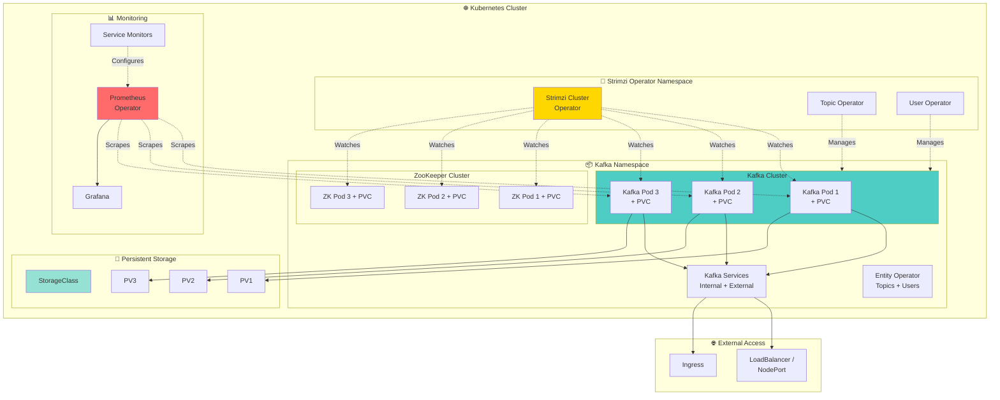
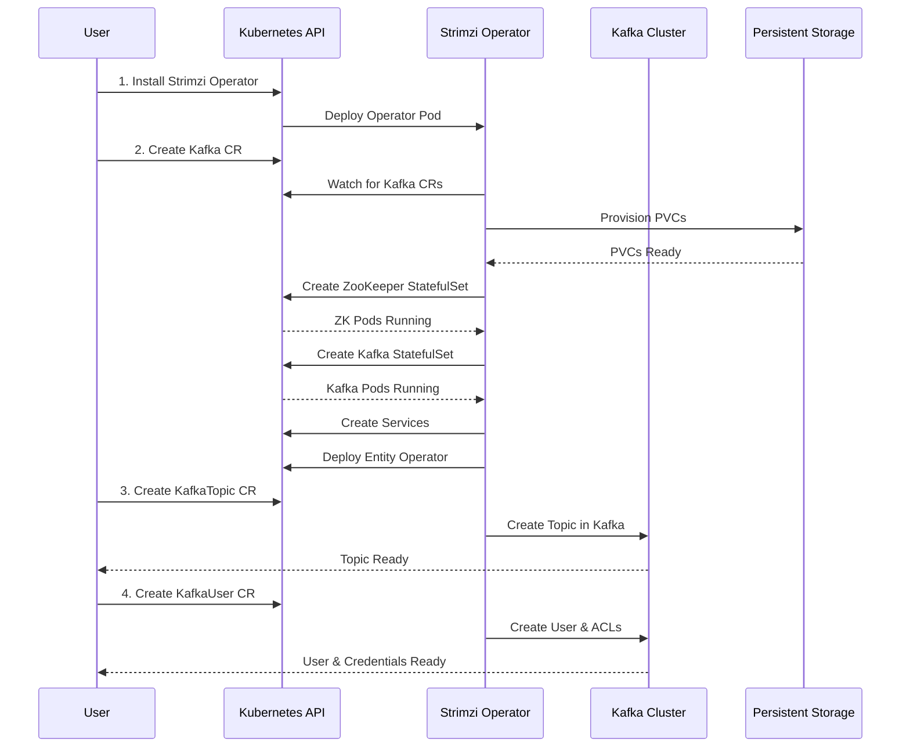

# Tutorial 08: Kafka on Kubernetes with Strimzi

## 📐 Architecture Diagram



## 🌊 Deployment Flow



## 🎯 Learning Objectives

By completing this tutorial, you will:
- ✅ Install and configure Strimzi Kafka Operator
- ✅ Deploy production-grade Kafka cluster on Kubernetes
- ✅ Manage topics and users via Custom Resources
- ✅ Configure persistent storage with StatefulSets
- ✅ Set up external access (LoadBalancer/NodePort/Ingress)
- ✅ Implement monitoring with Prometheus Operator
- ✅ Apply production best practices
- ✅ Handle cluster scaling and upgrades

## 📋 Prerequisites

- Kubernetes cluster (1.21+)
  - Minikube, Kind, GKE, EKS, or AKS
  - kubectl configured
- Helm 3 (optional, for easier installation)
- Basic Kubernetes knowledge
- Understanding of Kafka concepts

## 🚀 Part 1: Cluster Setup

### Create Kubernetes Cluster (Minikube Example)

```bash
# Start minikube with sufficient resources
minikube start \
  --cpus=4 \
  --memory=8192 \
  --disk-size=20g \
  --driver=docker

# Enable required addons
minikube addons enable storage-provisioner
minikube addons enable metrics-server

# Verify cluster
kubectl cluster-info
kubectl get nodes
```

### Alternative: Kind Cluster

```yaml
# kind-config.yaml
kind: Cluster
apiVersion: kind.x-k8s.io/v1alpha4
nodes:
  - role: control-plane
  - role: worker
  - role: worker
  - role: worker
```

```bash
# Create cluster
kind create cluster --config kind-config.yaml --name kafka-cluster

# Verify
kubectl cluster-info --context kind-kafka-cluster
```

## 🔧 Part 2: Install Strimzi Operator

### Method 1: Using kubectl

```bash
# Create namespace for Strimzi operator
kubectl create namespace kafka

# Install Strimzi operator
kubectl create -f 'https://strimzi.io/install/latest?namespace=kafka' -n kafka

# Verify operator is running
kubectl get pods -n kafka -w

# Expected output:
# NAME                                        READY   STATUS    RESTARTS   AGE
# strimzi-cluster-operator-7d96cbff57-xxxxx   1/1     Running   0          30s

# Check operator logs
kubectl logs -n kafka -l name=strimzi-cluster-operator -f
```

### Method 2: Using Helm

```bash
# Add Strimzi Helm repository
helm repo add strimzi https://strimzi.io/charts/
helm repo update

# Install Strimzi operator
helm install strimzi-kafka-operator strimzi/strimzi-kafka-operator \
  --namespace kafka \
  --create-namespace \
  --set watchNamespaces={kafka}

# Verify installation
helm list -n kafka
kubectl get pods -n kafka
```

### Verify CRDs are Installed

```bash
# Check Strimzi Custom Resource Definitions
kubectl get crd | grep strimzi

# Expected CRDs:
# kafkas.kafka.strimzi.io
# kafkatopics.kafka.strimzi.io
# kafkausers.kafka.strimzi.io
# kafkaconnects.kafka.strimzi.io
# kafkamirrormakers.kafka.strimzi.io
# kafkabridges.kafka.strimzi.io
# kafkaconnectors.kafka.strimzi.io
# kafkamirrormaker2s.kafka.strimzi.io
# kafkarebalances.kafka.strimzi.io
```

## ☸️ Part 3: Deploy Kafka Cluster

### kafka-cluster.yaml

```yaml
apiVersion: kafka.strimzi.io/v1beta2
kind: Kafka
metadata:
  name: my-kafka-cluster
  namespace: kafka
spec:
  # Kafka configuration
  kafka:
    version: 3.6.0
    replicas: 3

    # Listeners configuration
    listeners:
      - name: plain
        port: 9092
        type: internal
        tls: false

      - name: tls
        port: 9093
        type: internal
        tls: true
        authentication:
          type: tls

      - name: external
        port: 9094
        type: nodeport
        tls: false
        configuration:
          bootstrap:
            nodePort: 32100
          brokers:
            - broker: 0
              nodePort: 32000
            - broker: 1
              nodePort: 32001
            - broker: 2
              nodePort: 32002

    # Kafka broker configuration
    config:
      offsets.topic.replication.factor: 3
      transaction.state.log.replication.factor: 3
      transaction.state.log.min.isr: 2
      default.replication.factor: 3
      min.insync.replicas: 2
      inter.broker.protocol.version: "3.6"
      log.retention.hours: 168
      log.segment.bytes: 1073741824
      log.retention.check.interval.ms: 300000
      num.network.threads: 3
      num.io.threads: 8
      socket.send.buffer.bytes: 102400
      socket.receive.buffer.bytes: 102400
      socket.request.max.bytes: 104857600

    # Storage configuration
    storage:
      type: jbod
      volumes:
        - id: 0
          type: persistent-claim
          size: 10Gi
          deleteClaim: false
          class: standard  # Use your StorageClass

    # Resource requests and limits
    resources:
      requests:
        memory: 2Gi
        cpu: 1000m
      limits:
        memory: 4Gi
        cpu: 2000m

    # JVM options
    jvmOptions:
      -Xms: 1024m
      -Xmx: 2048m

    # Metrics configuration
    metricsConfig:
      type: jmxPrometheusExporter
      valueFrom:
        configMapKeyRef:
          name: kafka-metrics
          key: kafka-metrics-config.yml

  # ZooKeeper configuration
  zookeeper:
    replicas: 3

    storage:
      type: persistent-claim
      size: 5Gi
      deleteClaim: false
      class: standard

    resources:
      requests:
        memory: 1Gi
        cpu: 500m
      limits:
        memory: 2Gi
        cpu: 1000m

    jvmOptions:
      -Xms: 512m
      -Xmx: 1024m

    metricsConfig:
      type: jmxPrometheusExporter
      valueFrom:
        configMapKeyRef:
          name: kafka-metrics
          key: zookeeper-metrics-config.yml

  # Entity Operator configuration
  entityOperator:
    topicOperator:
      resources:
        requests:
          memory: 256Mi
          cpu: 200m
        limits:
          memory: 512Mi
          cpu: 500m

    userOperator:
      resources:
        requests:
          memory: 256Mi
          cpu: 200m
        limits:
          memory: 512Mi
          cpu: 500m

  # Kafka Exporter for consumer lag monitoring
  kafkaExporter:
    topicRegex: ".*"
    groupRegex: ".*"
    resources:
      requests:
        memory: 128Mi
        cpu: 100m
      limits:
        memory: 256Mi
        cpu: 200m
```

### Create Metrics ConfigMaps

```bash
# Download Strimzi metrics examples
wget https://raw.githubusercontent.com/strimzi/strimzi-kafka-operator/main/examples/metrics/kafka-metrics.yaml

# Create ConfigMaps
kubectl create configmap kafka-metrics \
  --from-file=kafka-metrics-config.yml=kafka-metrics.yaml \
  --from-file=zookeeper-metrics-config.yml=kafka-metrics.yaml \
  -n kafka
```

### Deploy Kafka Cluster

```bash
# Apply Kafka cluster configuration
kubectl apply -f kafka-cluster.yaml -n kafka

# Watch cluster deployment
kubectl get kafka -n kafka -w

# Check pods
kubectl get pods -n kafka -w

# Expected pods:
# my-kafka-cluster-zookeeper-0
# my-kafka-cluster-zookeeper-1
# my-kafka-cluster-zookeeper-2
# my-kafka-cluster-kafka-0
# my-kafka-cluster-kafka-1
# my-kafka-cluster-kafka-2
# my-kafka-cluster-entity-operator-xxxxx

# Check cluster status
kubectl get kafka my-kafka-cluster -n kafka -o yaml

# Wait for cluster to be ready
kubectl wait kafka/my-kafka-cluster \
  --for=condition=Ready \
  --timeout=300s \
  -n kafka
```

## 📝 Part 4: Topic Management

### kafka-topic.yaml

```yaml
apiVersion: kafka.strimzi.io/v1beta2
kind: KafkaTopic
metadata:
  name: my-topic
  namespace: kafka
  labels:
    strimzi.io/cluster: my-kafka-cluster
spec:
  partitions: 3
  replicas: 3
  config:
    retention.ms: 604800000  # 7 days
    segment.bytes: 1073741824  # 1GB
    compression.type: producer
    max.message.bytes: 1048588
    min.insync.replicas: 2
```

```bash
# Create topic
kubectl apply -f kafka-topic.yaml -n kafka

# List topics
kubectl get kafkatopics -n kafka

# Describe topic
kubectl describe kafkatopic my-topic -n kafka

# Check topic in Kafka
kubectl exec my-kafka-cluster-kafka-0 -n kafka -c kafka -- \
  bin/kafka-topics.sh --bootstrap-server localhost:9092 --list
```

### Multiple Topics Configuration

```yaml
# kafka-topics-batch.yaml
apiVersion: kafka.strimzi.io/v1beta2
kind: KafkaTopic
metadata:
  name: events-topic
  namespace: kafka
  labels:
    strimzi.io/cluster: my-kafka-cluster
spec:
  partitions: 6
  replicas: 3
  config:
    retention.ms: 86400000  # 1 day
    segment.bytes: 536870912  # 512MB
---
apiVersion: kafka.strimzi.io/v1beta2
kind: KafkaTopic
metadata:
  name: logs-topic
  namespace: kafka
  labels:
    strimzi.io/cluster: my-kafka-cluster
spec:
  partitions: 12
  replicas: 3
  config:
    retention.ms: 259200000  # 3 days
    cleanup.policy: delete
---
apiVersion: kafka.strimzi.io/v1beta2
kind: KafkaTopic
metadata:
  name: metrics-topic
  namespace: kafka
  labels:
    strimzi.io/cluster: my-kafka-cluster
spec:
  partitions: 3
  replicas: 3
  config:
    retention.ms: 3600000  # 1 hour
    cleanup.policy: compact
```

## 👤 Part 5: User Management with ACLs

### kafka-user.yaml

```yaml
apiVersion: kafka.strimzi.io/v1beta2
kind: KafkaUser
metadata:
  name: my-app-user
  namespace: kafka
  labels:
    strimzi.io/cluster: my-kafka-cluster
spec:
  # Authentication
  authentication:
    type: tls

  # Authorization (ACLs)
  authorization:
    type: simple
    acls:
      # Producer ACLs
      - resource:
          type: topic
          name: my-topic
          patternType: literal
        operations:
          - Write
          - Create
          - Describe
        host: "*"

      # Consumer ACLs
      - resource:
          type: topic
          name: my-topic
          patternType: literal
        operations:
          - Read
          - Describe
        host: "*"

      - resource:
          type: group
          name: my-app-consumer-group
          patternType: literal
        operations:
          - Read
        host: "*"

      # Wildcard topic access (all topics starting with 'events-')
      - resource:
          type: topic
          name: events-
          patternType: prefix
        operations:
          - Read
          - Write
          - Describe
        host: "*"
```

```bash
# Create user
kubectl apply -f kafka-user.yaml -n kafka

# List users
kubectl get kafkausers -n kafka

# Get user credentials (TLS certificate)
kubectl get secret my-app-user -n kafka -o yaml

# Extract certificate and key
kubectl get secret my-app-user -n kafka -o jsonpath='{.data.user\.crt}' | base64 -d > user.crt
kubectl get secret my-app-user -n kafka -o jsonpath='{.data.user\.key}' | base64 -d > user.key
kubectl get secret my-app-user -n kafka -o jsonpath='{.data.ca\.crt}' | base64 -d > ca.crt
```

### SCRAM-SHA User (Alternative Authentication)

```yaml
apiVersion: kafka.strimzi.io/v1beta2
kind: KafkaUser
metadata:
  name: my-scram-user
  namespace: kafka
  labels:
    strimzi.io/cluster: my-kafka-cluster
spec:
  authentication:
    type: scram-sha-512

  authorization:
    type: simple
    acls:
      - resource:
          type: topic
          name: "*"
          patternType: literal
        operations:
          - All
        host: "*"
```

```bash
# Create SCRAM user
kubectl apply -f kafka-user-scram.yaml -n kafka

# Get password
kubectl get secret my-scram-user -n kafka -o jsonpath='{.data.password}' | base64 -d
```

## 🌐 Part 6: External Access Configuration

### NodePort Access

```yaml
# Already configured in kafka-cluster.yaml
listeners:
  - name: external
    port: 9094
    type: nodeport
    tls: false
    configuration:
      bootstrap:
        nodePort: 32100
      brokers:
        - broker: 0
          nodePort: 32000
        - broker: 1
          nodePort: 32001
        - broker: 2
          nodePort: 32002
```

```bash
# Get NodePort access details
kubectl get svc -n kafka | grep nodeport

# Get Minikube IP
minikube ip

# Test connection
kafka-console-producer.sh \
  --bootstrap-server $(minikube ip):32100 \
  --topic my-topic
```

### LoadBalancer Access (Cloud Providers)

```yaml
# kafka-cluster-lb.yaml (partial)
spec:
  kafka:
    listeners:
      - name: external
        port: 9094
        type: loadbalancer
        tls: false
        configuration:
          finalizers:
            - service.kubernetes.io/load-balancer-cleanup
```

```bash
# Get LoadBalancer external IP
kubectl get svc my-kafka-cluster-kafka-external-bootstrap -n kafka

# Connect using external IP
# EXTERNAL-IP from the service will be the bootstrap server
```

### Ingress Access

```yaml
# kafka-cluster-ingress.yaml (partial)
spec:
  kafka:
    listeners:
      - name: external
        port: 9094
        type: ingress
        tls: true
        authentication:
          type: tls
        configuration:
          bootstrap:
            host: kafka-bootstrap.example.com
          brokers:
            - broker: 0
              host: kafka-0.example.com
            - broker: 1
              host: kafka-1.example.com
            - broker: 2
              host: kafka-2.example.com
```

## 📊 Part 7: Monitoring with Prometheus Operator

### Install Prometheus Operator

```bash
# Add Prometheus Operator Helm repo
helm repo add prometheus-community https://prometheus-community.github.io/helm-charts
helm repo update

# Install Prometheus Operator
helm install prometheus prometheus-community/kube-prometheus-stack \
  --namespace monitoring \
  --create-namespace \
  --set prometheus.prometheusSpec.serviceMonitorSelectorNilUsesHelmValues=false \
  --set grafana.adminPassword=admin

# Verify installation
kubectl get pods -n monitoring
```

### Create PodMonitor for Kafka

```yaml
# kafka-pod-monitor.yaml
apiVersion: monitoring.coreos.com/v1
kind: PodMonitor
metadata:
  name: kafka-resources-metrics
  namespace: kafka
  labels:
    app: strimzi
spec:
  selector:
    matchExpressions:
      - key: "strimzi.io/kind"
        operator: In
        values:
          - Kafka
          - KafkaConnect

  namespaceSelector:
    matchNames:
      - kafka

  podMetricsEndpoints:
    - path: /metrics
      port: tcp-prometheus
      relabelings:
        - separator: ;
          regex: __meta_kubernetes_pod_label_(.+)
          replacement: $1
          action: labelmap
        - sourceLabels: [__meta_kubernetes_namespace]
          separator: ;
          regex: (.*)
          targetLabel: namespace
          replacement: $1
          action: replace
        - sourceLabels: [__meta_kubernetes_pod_name]
          separator: ;
          regex: (.*)
          targetLabel: kubernetes_pod_name
          replacement: $1
          action: replace
        - sourceLabels: [__meta_kubernetes_pod_node_name]
          separator: ;
          regex: (.*)
          targetLabel: node_name
          replacement: $1
          action: replace
        - sourceLabels: [__meta_kubernetes_pod_host_ip]
          separator: ;
          regex: (.*)
          targetLabel: node_ip
          replacement: $1
          action: replace
```

```bash
# Apply PodMonitor
kubectl apply -f kafka-pod-monitor.yaml -n kafka

# Verify PodMonitor
kubectl get podmonitor -n kafka

# Check Prometheus targets
kubectl port-forward -n monitoring svc/prometheus-kube-prometheus-prometheus 9090:9090

# Open browser: http://localhost:9090/targets
```

### Access Grafana

```bash
# Port-forward Grafana
kubectl port-forward -n monitoring svc/prometheus-grafana 3000:80

# Open browser: http://localhost:3000
# Username: admin
# Password: admin (or what you set during installation)

# Import Strimzi dashboards
# Dashboard ID: 11962 (Strimzi Kafka)
# Dashboard ID: 12483 (Strimzi Kafka Exporter)
```

## 🧪 Part 8: Testing the Deployment

### Test Producer

```bash
# Create test pod
kubectl run kafka-producer -ti \
  --image=quay.io/strimzi/kafka:latest-kafka-3.6.0 \
  --rm=true \
  --restart=Never \
  --namespace=kafka -- bash

# Inside the pod
bin/kafka-console-producer.sh \
  --bootstrap-server my-kafka-cluster-kafka-bootstrap:9092 \
  --topic my-topic

# Type messages and press Enter
```

### Test Consumer

```bash
# Create test pod
kubectl run kafka-consumer -ti \
  --image=quay.io/strimzi/kafka:latest-kafka-3.6.0 \
  --rm=true \
  --restart=Never \
  --namespace=kafka -- bash

# Inside the pod
bin/kafka-console-consumer.sh \
  --bootstrap-server my-kafka-cluster-kafka-bootstrap:9092 \
  --topic my-topic \
  --from-beginning
```

### Performance Test

```bash
# Producer performance test
kubectl run kafka-perf-producer -ti \
  --image=quay.io/strimzi/kafka:latest-kafka-3.6.0 \
  --rm=true \
  --restart=Never \
  --namespace=kafka -- \
  bin/kafka-producer-perf-test.sh \
  --topic my-topic \
  --num-records 100000 \
  --record-size 1024 \
  --throughput 10000 \
  --producer-props bootstrap.servers=my-kafka-cluster-kafka-bootstrap:9092

# Consumer performance test
kubectl run kafka-perf-consumer -ti \
  --image=quay.io/strimzi/kafka:latest-kafka-3.6.0 \
  --rm=true \
  --restart=Never \
  --namespace=kafka -- \
  bin/kafka-consumer-perf-test.sh \
  --bootstrap-server my-kafka-cluster-kafka-bootstrap:9092 \
  --topic my-topic \
  --messages 100000 \
  --threads 1
```

## 🔄 Part 9: Cluster Operations

### Scale Kafka Cluster

```bash
# Scale to 5 brokers
kubectl patch kafka my-kafka-cluster -n kafka --type merge -p '{"spec":{"kafka":{"replicas":5}}}'

# Watch scaling
kubectl get pods -n kafka -w

# Verify new brokers
kubectl exec my-kafka-cluster-kafka-0 -n kafka -c kafka -- \
  bin/kafka-broker-api-versions.sh --bootstrap-server localhost:9092
```

### Upgrade Kafka Version

```bash
# Edit Kafka CR
kubectl edit kafka my-kafka-cluster -n kafka

# Update kafka.version to new version
# Strimzi will perform rolling update automatically

# Watch upgrade
kubectl get pods -n kafka -w
kubectl logs -n kafka -l strimzi.io/name=my-kafka-cluster-kafka -f
```

### Rolling Restart

```bash
# Annotate Kafka resource to trigger rolling update
kubectl annotate kafka my-kafka-cluster -n kafka \
  strimzi.io/manual-rolling-update=true

# Watch rolling restart
kubectl get pods -n kafka -w
```

### Backup and Recovery

```bash
# Backup topic configurations
kubectl get kafkatopics -n kafka -o yaml > kafka-topics-backup.yaml

# Backup user configurations
kubectl get kafkausers -n kafka -o yaml > kafka-users-backup.yaml

# Backup Kafka cluster configuration
kubectl get kafka my-kafka-cluster -n kafka -o yaml > kafka-cluster-backup.yaml

# For data backup, use Kafka's MirrorMaker 2 or external tools
```

## 🎯 Production Best Practices

### 1. Resource Management

```yaml
# Kafka broker resources
resources:
  requests:
    memory: 4Gi
    cpu: 2000m
  limits:
    memory: 8Gi
    cpu: 4000m

# JVM tuning
jvmOptions:
  -Xms: 2048m
  -Xmx: 4096m
  -XX:+UseG1GC
  -XX:MaxGCPauseMillis: 20
  -XX:InitiatingHeapOccupancyPercent: 35
```

### 2. Storage Configuration

```yaml
storage:
  type: jbod
  volumes:
    - id: 0
      type: persistent-claim
      size: 100Gi
      deleteClaim: false
      class: fast-ssd  # Use SSD storage class
```

### 3. High Availability

```yaml
# Minimum 3 brokers
replicas: 3

# Pod anti-affinity (spread brokers across nodes)
template:
  pod:
    affinity:
      podAntiAffinity:
        requiredDuringSchedulingIgnoredDuringExecution:
          - labelSelector:
              matchExpressions:
                - key: strimzi.io/name
                  operator: In
                  values:
                    - my-kafka-cluster-kafka
            topologyKey: kubernetes.io/hostname
```

### 4. Security Hardening

```yaml
# Enable TLS
listeners:
  - name: tls
    port: 9093
    type: internal
    tls: true
    authentication:
      type: tls

# Enable RBAC
authorization:
  type: simple
  superUsers:
    - CN=admin
```

### 5. Monitoring and Alerting

- Monitor consumer lag
- Track under-replicated partitions
- Watch JVM heap usage
- Alert on broker failures
- Monitor disk usage

### 6. Backup Strategy

- Regular topic configuration backups
- User and ACL backups
- Use MirrorMaker 2 for data replication
- Document disaster recovery procedures

## 🔍 Troubleshooting

### Check Operator Logs

```bash
kubectl logs -n kafka -l name=strimzi-cluster-operator -f
```

### Check Kafka Broker Logs

```bash
kubectl logs -n kafka my-kafka-cluster-kafka-0 -c kafka -f
```

### Debug Topic Issues

```bash
kubectl describe kafkatopic my-topic -n kafka
kubectl logs -n kafka -l strimzi.io/name=my-kafka-cluster-entity-operator -c topic-operator
```

### Check Cluster Status

```bash
kubectl get kafka my-kafka-cluster -n kafka -o jsonpath='{.status.conditions}'
```

### Common Issues

1. **PVC not binding**: Check StorageClass exists and can provision
2. **Operator not creating resources**: Check operator logs and RBAC permissions
3. **Topics not syncing**: Check Entity Operator logs
4. **External access not working**: Verify firewall rules and NodePort/LoadBalancer configuration

## 🎓 Key Takeaways

- Strimzi simplifies Kafka deployment on Kubernetes
- Custom Resources provide declarative configuration
- Operators handle cluster lifecycle automatically
- Persistent storage ensures data durability
- External access requires proper network configuration
- Monitoring integration is essential for production
- Resource limits prevent cluster instability
- RBAC and TLS provide security

## 📚 Additional Resources

- [Strimzi Documentation](https://strimzi.io/documentation/)
- [Strimzi GitHub Repository](https://github.com/strimzi/strimzi-kafka-operator)
- [Kafka on Kubernetes Best Practices](https://strimzi.io/blog/)
- [Strimzi Examples](https://github.com/strimzi/strimzi-kafka-operator/tree/main/examples)
- [Kubernetes StatefulSets](https://kubernetes.io/docs/concepts/workloads/controllers/statefulset/)
- [Prometheus Operator](https://github.com/prometheus-operator/prometheus-operator)
